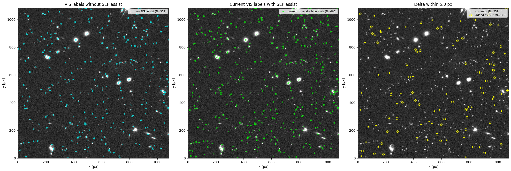
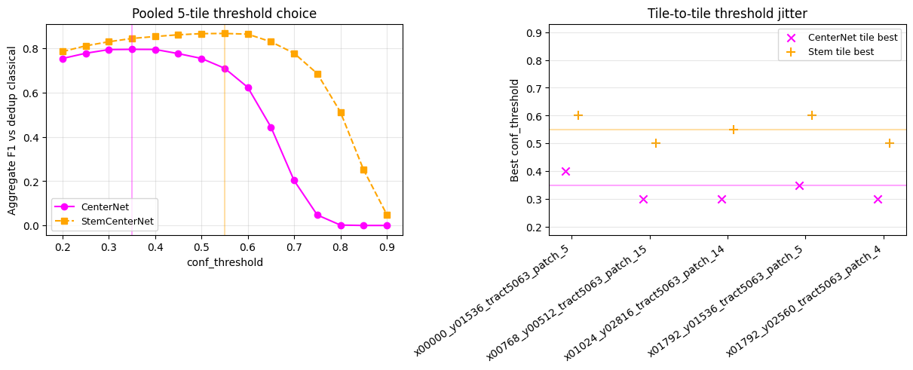
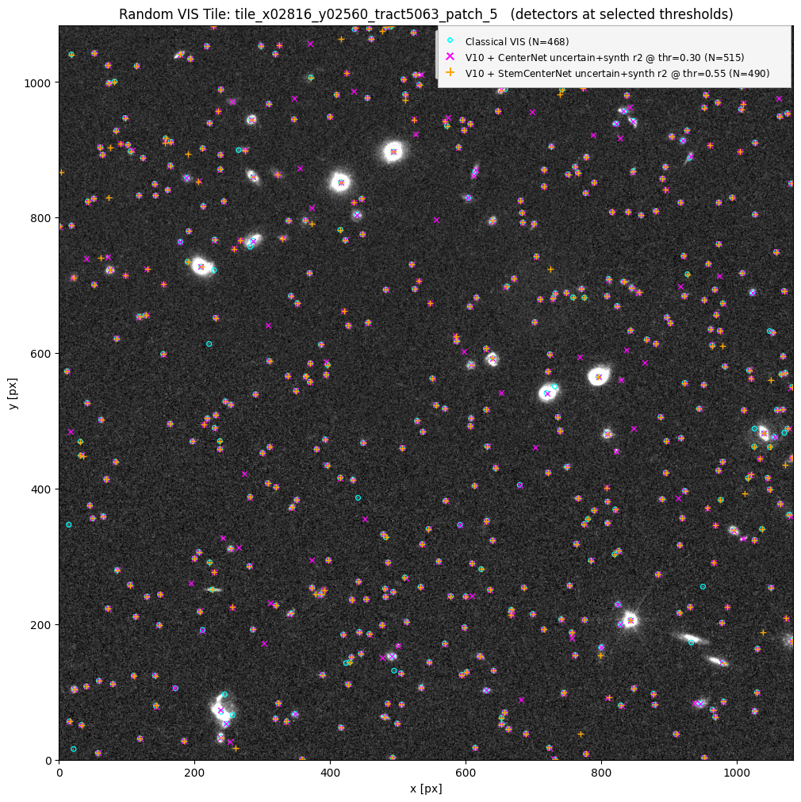
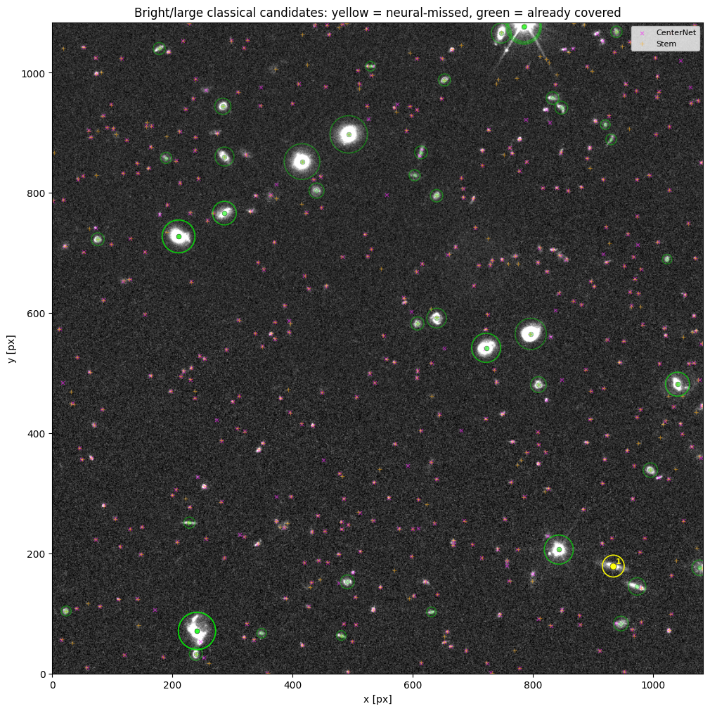
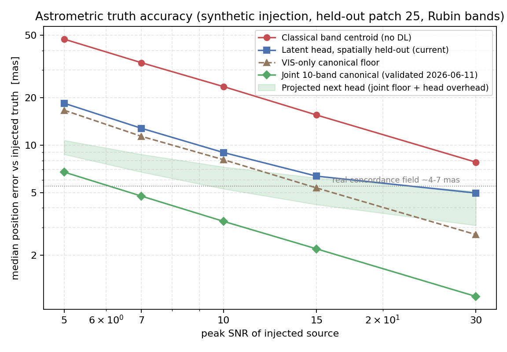
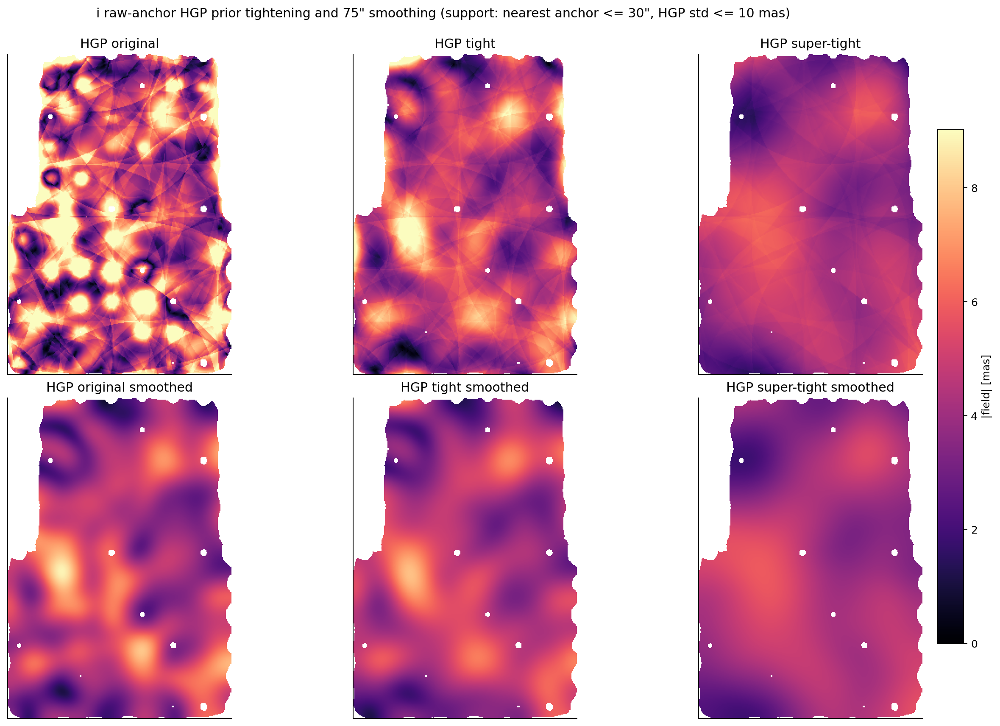
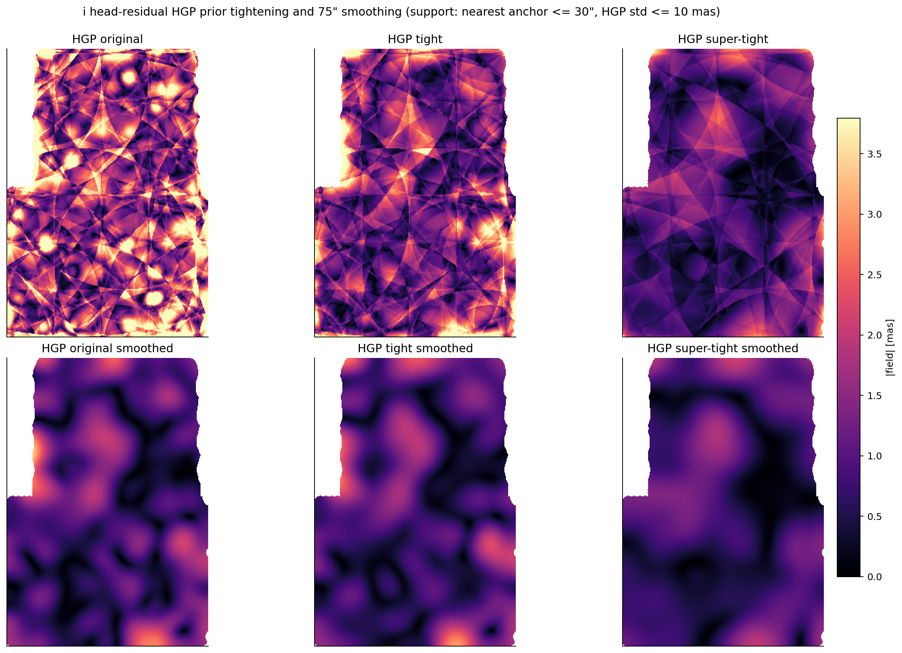

# JAISP (Joint AI Survey Processing)

## Full Documentation and Experimental Report

JAISP is a self-supervised, multi-instrument representation-learning project for joint Rubin Observatory and Euclid image analysis. Its immediate goal is to learn a spatially precise shared representation from Rubin optical imaging and Euclid VIS/NISP imaging, then reuse that representation for source detection, astrometric alignment, PSF modelling, and photometry. The longer-term motivation is survey-scale precision cosmology: reducing the model-dependent error budget introduced when detection, astrometry, PSF estimation, and photometry are solved as separate classical stages.

This document is intentionally both a user guide and a project history. It records the current runnable stack, the scientific motivation, the data products, the architecture evolution, negative results, active checkpoints, and open milestones. The history is kept because future developers, collaborators, and AI agents need to understand not only what the current code does, but why earlier approaches were abandoned and which claims are already supported by tests.

---

## How to Read This Document

The documentation is organized to serve two audiences at once. A new human reader can begin with the motivation, data, and current stack to understand the scientific problem and the active code path. A returning developer or AI agent can use the architecture history, downstream-head sections, checkpoint tables, and command blocks to recover the state of the project without reconstructing it from notebooks.

A recurring pattern in this file is: **scientific question -> method -> result -> interpretation -> current limitation**. This is deliberate. JAISP is not a single finished model; it is an active research system whose current design emerged from several failed or superseded alternatives. Negative results are therefore part of the scientific content. For example, the move from contrastive/JEPA-style latent alignment to masked pixel reconstruction is not an implementation detail; it is one of the central experimental lessons of the project.

When using this file operationally, prefer the checkpoints and commands marked as current. When using it scientifically, pay attention to the distinction between production components, baselines, QA/model-selection tools, and historical experiments. Several modules remain intentionally hybrid: classical centroiding, peak-finding, and PSF-based measurements are still used as labels, controls, or diagnostics while the learned representation matures.

## Current Stack Snapshot

| Layer | Current default | Notes |
|-------|-----------------|-------|
| Imaging data | Euclid: `data/euclid_tiles_all_q1/` (791 tiles) + `data/edf_s_ood/euclid_tiles_edfs_q1/` (72 tiles); Rubin: `data/rubin_tiles_all/` (unchanged) | **Q1 era (since 2026-07-03/04)**: Euclid pixels re-fetched from public Q1 MER mosaics via IRSA IBE cutouts (`io/refetch_euclid_q1.py`), identical tiling/schema to the DR1-era product. Q1 EDF-S tiles have real `var_*` maps (the old EDF-S product did not; its symlinks are now broken). DR1-era `data/euclid_tiles_all/` retained but historical. |
| Foundation | `models/checkpoints/jaisp_v10_q1_long/checkpoint_best.pt` (**current production**, v10 architecture retrained on Q1, 2026-07-04, best val 7.1014); DR1-era `jaisp_v10_warmstart` and `jaisp_v8_fine` retained for completed baselines | v10 architecture (`models/jaisp_foundation_v10.py`): v9 concat fusion + Charbonnier loss + core-L2 weighting, fused scale 0.4"/px. Q1 feature caches: `data/cached_features_v10_q1/` (790 ECDFS) and `.../v10_q1_edfs/` (72 EDF-S); the DR1 full cache `cached_features_v10_warmstart/` was deleted. **In flight (2026-07-08)**: matched from-scratch fused-scale ablation pair, 0.2"/px vs 0.4"/px (`jaisp_v10_q1_fused0{2,4}_scratch`) — see the fused-scale ablation section. |
| Detection | **`checkpoints/q1_detection/centernet_vis_sep.pt`** at `conf=0.30`, spike veto off (Q1 production, selected 2026-07-05 bake-off); exports `data/detection_labels/centernet_q1_790_vissep_thresh03.pt` (224 det/tile) and `centernet_q1_edfs_vissep_thresh03.pt` (277 det/tile) | Q1 bake-off on 108 held-out tiles: F1 93.9 (completeness 93.3, purity 94.5). Injection: 50% depth **25.04 all-band vs 24.59 VIS-only → +0.45 mag fusion gain**; stem control +0.03 only; NISP-only peaks at 36.8%; Rubin-only ≈0 is DR1-era evidence, not re-verified on Q1. Round-2 self-training rejected (`q1_detection_r2/`: F1 93.7, depth 24.90 — no gain). MER recovery: purity 0.944, ≥95% at S/N≥7.9. Spike-veto-off rule carries over from DR1 (argparse defaults still have the veto ON; flags must be passed). DR1-era `centernet_v10_uncertain_synth_r2` / `stem_centernet_v10_uncertain_synth_r2` retained as history. |
| Astrometry | **`models/checkpoints/latent_position_q1_vissep/best.pt`** (Q1 production corrector, 2026-07-06); patch-disjoint control `latent_position_q1_vissep_patchval25/best.pt`; DR1-era `latent_position_v10_no_psf` et al. retained | Q1 chain complete (driver `models/astrometry2/run_q1_astrometry_downstream.sh`): 790-tile eval raw→head MAE **60.6 → 27.5 mas**, head median **13.4 mas**; patch-disjoint val 14.6 vs prod 14.9 mas — no leakage. EDF-S zero-shot (real Q1 var maps): raw→head **61.0 → 27.1 mas** on 51,623 anchors. Anchors: `anchors_centernet_q1_vissep{,_dedup}.npz` (555,380 → 154,024 after 50 mas dedup). Interpretive framework unchanged from DR1 era: the head is a *corrector* with an intrinsic ~17–18 mas faint-end ceiling (Q1 injection truth: 18.9 mas Rubin @ SNR 5, `injection_truth_results_q1.json`); the classical joint 10-band fitter remains the production position *instrument*. **Gaia PM self-calibration (2026-07-01, DR1-era positions)**: measured survey epoch 2024.826 (~8.8 yr baseline), PM-robust tie ~(−2.6, −2.3) mas, bright floor 2.63 mas; Q1 re-run owed. |
| Smooth field QA | `models/astrometry2/fit_direct_pinn.py` | **Q1 products (2026-07-06)**: PINN raw smoothed field median 7.1 mas; HGP super-tight raw field RMS 6.6–12.9 mas, head-residual 1.3–2.8 mas (`latent_position_q1_vissep/concordance_pinn_q1_vissep_raw.fits`, `hgp_q1_vissep_*_supertight.fits`) — same qualitative picture as DR1. DR1-era detail: fits raw or head-residual anchors from eval-exported caches after 50 mas dedup. In the current v10 Gaussian run, the deduped head residuals are already small (all-band median **13.2 mas**) and residual PINN fields do not materially improve per-source medians; they are QA products, not production corrections. **Reproducibility floor (2026-06-10 audit)**: two PINN fits on identical anchors with identical settings differ by ~5 mas RMS (vector r~0.69) unsmoothed; only the >=150"-smoothed component is reproducible (r~0.73-0.90). Sub-degree structure in any single PINN product is solver noise. Dedup also destabilizes sparse bands: z anchors drop 3.2x and the z field inflates ~2x (5.4 -> ~10 mas) on dedup inputs. |
| Concordance uncertainty / model check | `models/astrometry2/fit_hierarchical_gp_concordance.py` | Experimental hierarchical GP-style field with posterior std maps. Current v10 HGP products exist on both raw and head-residual Gaussian/ePSF caches with dedup enabled, at three prior settings (original / tight / super-tight). HGP super-tight on raw recovers a coherent few-mas degree-scale concordance field — this component is real and era-stable: after 150" smoothing it reproduces across PINN refits, dedup choices, seed catalogs, and the v8-era production field (r up to 0.92). The earlier claim that the head-residual field shows "the same morphology at ~1 mas" is **not established**: it rests on pooled vector cosine ~0.5 (Pearson 0.27-0.39) and every head-residual HGP product has negative held-out improvement (notebook 09). HGP-vs-PINN differences below the ~5 mas PINN run-to-run floor are not interpretable. Both remain QA products, not production corrections. |
| PSF | Astrometry ablation checkpoint: `models/checkpoints/foundation_epsf_head_gaia_pca_v10_pm_v5_snr_cap_window/checkpoint_best.pt`; earlier run: `models/checkpoints/foundation_epsf_head_gaia_gaussian_v10_pm/` | Active path: Gaia-selected stars with proper-motion correction (`--obs-epoch-year 2025.0`) and image-based centroid refinement, frozen V10 foundation features, low-rank residual ePSF head, W&B image diagnostics. The PCA/SNR-cap/window checkpoint was tested as a v10 astrometry centroid ablation and did **not** improve astrometry versus Gaussian centroids. Older PSFField/PCA/V4 attempts are archived under `models/older_architectures/psf/`. |
| Photometry | `models/checkpoints/photometry_foundation_200_fast/checkpoint_best.pt`; experiment: `models/checkpoints/rendered_stamp_v2_bigstamp/checkpoint_best.pt` | Current main learned v8 photometry head plus scarlet-like residual-scene and rendered-stamp experimental paths. PSFField-backed photometry is historical until the new ePSF head is wired into photometry. |

Figure policy for this file: keep only figures that change the reader's understanding. Repetitive good/worst galleries, per-epoch W&B panels, and minor variants should stay in notebooks or checkpoint folders unless they support a new conclusion.

The table above should be read as a maturity map rather than a simple list of files. The foundation checkpoint is the current representation backbone. Detection and photometry are active downstream products. The latent astrometry head is the current per-object correction layer. The smooth-field solvers, especially HGP, are presently diagnostic and model-selection tools, not production corrections. This distinction matters because a correction that improves an intermediate residual map is not automatically a correction that improves held-out source positions.

---

## Motivation

Rubin Observatory's LSST and ESA's Euclid will together produce the deepest, widest multi-wavelength imaging survey ever conducted. They observe the same sky, but through very different eyes: Rubin captures six optical bands (u through y) at 0.2 arcsec/pixel over a 512x512 tile grid, while Euclid provides a single ultra-sharp visible channel (VIS) at 0.1 arcsec/pixel on a ~1084x1084 grid, plus three near-infrared bands (Y, J, H) delivered as MER mosaics at the same 0.1 arcsec/pixel scale. Jointly analyzing these instruments enables science that neither can achieve alone -- sharper source detection by combining Euclid's resolution with Rubin's depth, sub-pixel astrometric alignment across surveys, and more precise photometric measurements that leverage all 10 wavelength channels simultaneously.

The challenge is that these instruments have different pixel scales, point-spread functions, noise properties, and coordinate systems. Classical survey pipelines address this through a chain of parametric models: fit a Gaussian PSF, solve a polynomial WCS, propagate analytical uncertainties through each stage. Each link in this chain introduces model assumptions that may not hold -- the PSF isn't truly Gaussian, the WCS residuals aren't truly random, the uncertainty propagation assumes independence that doesn't exist. Recent analysis of the Rubin pipeline (Wilson & Naylor 2025, SITCOMTN-159) illustrates this concretely: single-visit astrometric uncertainties have a ~5 milliarcsecond systematic floor not captured by the pipeline's error model, and coadd uncertainties follow an unexplained power-law relationship with the actual position scatter rather than the expected quadrature model. These are exactly the kind of model-dependent artifacts that accumulate when each stage relies on analytical assumptions about the previous stage's output.

The classical state of the art for Euclid astrometry is demonstrated by Libralato et al. (2024, arXiv:2411.02487), who achieve 0.7 mas precision on VIS through iterative effective PSF modelling and geometric distortion calibration -- but this requires individual unresampled exposures, bright point sources (globular cluster stars at SNR > 100), Gaia DR3 as an external reference, and processes each filter independently with empirical colour corrections applied post-hoc. These conditions are rarely met in extragalactic survey fields.

**The working thesis of JAISP is that a data-driven representation can reduce the accumulation of model-dependent errors across the joint-survey pipeline.** A neural network that sees thousands of galaxies across 10 bands can learn empirical regularities that are difficult to capture with independent parametric stages: the effective PSF, wavelength-dependent centroid shifts, field-dependent noise structure, chip-edge behavior, and cross-instrument morphology changes. The goal is not to discard physical modeling, but to move as much of the representation as possible from hand-specified assumptions into quantities learned directly from the pixels and then validated against classical controls.

JAISP addresses this by learning a single spatially precise shared representation from both instruments through self-supervised pretraining, then attaching lightweight task-specific heads for detection, astrometry, and photometry. The central insight -- arrived at after five failed iterations -- is that **pixel-space reconstruction** via a Masked Autoencoder (MAE), where the model hides one band and learns to reconstruct it from the remaining bands, forces the encoder to preserve the exact spatial layout needed by precision cosmology tasks. Latent-space objectives like JEPA and contrastive learning optimize for "feature similarity" but allow the network to discard sub-pixel spatial information, which is precisely what astrometry and photometry demand.

### The Pipeline

The system works in two layers. First, a foundation model is trained once through self-supervised masked band prediction: given 9 of 10 bands, reconstruct the held-out band at pixel precision. This pretraining forces the encoder to learn cross-instrument spatial correspondence, noise properties, and spectral relationships without any labels. Second, the frozen encoder features are reused by three downstream heads, each of which trains only a small task-specific network on top.

```
 Rubin tiles (6 bands, 512x512, 0.2"/px)
 Euclid tiles (VIS + NISP Y/J/H, all ~1084x1084 @ 0.1"/px from MER mosaics)
         |
    [ Foundation Model (self-supervised MAE) ]
         |
         +-- frozen encoder features
         |
    +----+----+--------------------+
    |         |                    |
 Detection  Astrometry         Photometry
 (3 choices)(head + QA field)  (PSF + residual scene fit)
```

This two-layer design means the expensive foundation pretraining only happens once. Each downstream task gets the benefit of 10-band multi-instrument features without paying the cost of encoding from scratch.

### Classical Scaffolding and the Path to End-to-End Learning

An honest account of the current system: while the foundation model is genuinely data-driven, the downstream heads still lean on classical methods in places -- particularly for generating training labels. The astrometry matcher, for example, currently uses Gaussian PSF fitting to refine centroid positions for its training targets, and the detection head bootstraps from classical VIS peak-finding pseudo-labels. This is a practical necessity, not a philosophical choice. With ~200 training tiles, the downstream heads don't yet have enough data to learn everything from scratch, and the foundation encoder is frozen during downstream training so it can't adapt its features for each specific task.

The intended progression, as the dataset and methods mature:

1. **Current stage -- classical labels, learned prediction.** Classical centroiding and peak-finding generate training labels. The model learns to predict offsets, detect sources, and extract fluxes from the foundation encoder's learned features. This already outperforms purely classical approaches because the encoder has learned cross-instrument spatial correspondence that no classical pipeline captures.

2. **Self-training -- model-refined labels.** The model's own predictions refine its training data. The CenterNet detection head already does this: round-1 trains on VIS pseudo-labels, round-2 uses the model's confident novel detections as new labels and demotes classical artifacts the model rejects. This same principle extends to astrometry (use the model's offset predictions to generate better centroid targets) and photometry (use learned PSF features instead of parametric PSF models).

3. **End-to-end -- no classical stage.** Unfreeze the foundation encoder and let task-specific gradients flow back into the representation. The encoder specializes toward centroid-relevant features for astrometry, morphology-relevant features for detection, and SED-relevant features for photometry. No explicit PSF model, no parametric WCS correction, no hand-tuned uncertainty propagation. The model learns the instrument from the data.

This is not speculative -- each transition is a concrete engineering step. The foundation model already encodes enough spatial precision for pixel-level reconstruction across instruments. The remaining work is propagating that precision through the downstream heads and eventually closing the loop to let the tasks inform the representation.

### Why a Foundation Model -- Transfer and Marginal Cost per Task

The case for the foundation isn't "does it beat a task-specific baseline on this field's test split" -- it's about **what we can do with the foundation that we cannot do without it**. Three properties matter:

1. **Multi-band entanglement, learned once.** A u-band source and its NISP-H counterpart are the same physical object, but they appear very differently in pixels: different PSF, different noise, different flux, different morphology. The MAE objective (reconstruct the held-out band from the other nine) forces the encoder to learn these cross-band correspondences. A task-specific model trained from scratch on 790 tiles of ECDFS data doesn't have the sample budget to learn u-to-H mapping and also learn the downstream task. The foundation amortises that learning once.

2. **Instrumental-effect awareness.** PSF differences between Rubin (seeing-limited, broad, ~0.7" FWHM) and Euclid (diffraction-limited, sharp, ~0.2" FWHM VIS), pixel-scale differences (0.2 vs 0.1"/px), bandpass shapes, noise correlations, chip-edge effects, DCR -- these are all implicit in what the encoder reconstructs. The per-band, per-instrument BandStems make this explicit in the architecture; MAE pretraining makes it explicit in the learned weights.

3. **Marginal cost per downstream task approaches zero.** Detection, astrometry, photometry, and (eventually) shape measurement all consume the same frozen features. The foundation's pretraining cost is paid once; each new task only trains a small head. The more downstream tasks we add, the smaller the foundation's amortised cost becomes. This is also why "does the foundation help THIS task" is the wrong question in isolation -- the right question is "does the foundation help ALL tasks, collectively, enough to justify its cost."

The fourth property is the one we value most and have tested least:

4. **Transfer to new fields without retraining.** A foundation that learned multi-band physics from ECDFS tiles SHOULD work zero-shot on EDF-North, EDF-South, or any new LSST+Euclid deep field. The expensive part (foundation pretraining) should not need to be repeated per field. Downstream heads trained on ECDFS SHOULD continue to apply, provided the new field's sources have the same statistical properties. This is exactly what a foundation model is for. **Update (2026-06): the first out-of-distribution evaluation has now been executed** — the frozen v10 stack was run zero-shot on EDF-S (72 paired tiles, no retraining). With the correct (real-variance) noise model, detection and astrometry transfer with only a modest, uniform ~5-15% degradation vs ECDFS at matched SNR. See the dedicated section *Out-of-Distribution Evaluation & MER-Catalogue Validation* below for the full results, plus catalogue-validated completeness/purity and injection-recovery depth on both fields.

The long-term plan is to (a) keep using OOD performance -- not the in-distribution train/val split -- as the primary success metric for future foundation versions, and (b) extend the EDF-S evaluation to the other deep fields.

---

## Data

### Euclid imaging switch: local DR1-era FITS → public Q1 MER mosaics (2026-07-03/04)

The Euclid pixels were re-fetched from the **public Q1 MER mosaics** served by IRSA, replacing the original local-FITS-derived tiles whose exact release provenance was never firmly established. Everything downstream of the pixels (foundation, feature caches, detection, astrometry, figures) was re-derived on Q1; the DR1-era products are retained on disk for the completed DR1-era results but must not be mixed with Q1 work.

- **Fetcher**: `io/refetch_euclid_q1.py`. Discovers coverage via the IRSA SIA collection `euclid_DpdMerBksMosaic` (astroquery, 60" radius) and pulls server-side cutouts through the IRSA **IBE cutout API** (`.../ibe/data/euclid/q1/MER/<TILEID>/...fits?center=<ra>,<dec>&size=1084pix`), so only 1084×1084 cutouts transfer, never the ~1.5 GB mosaics. Bands VIS/Y/J/H, science + noise products (rms sanitized, squared → `var_*`). `_best_row` picks the MER mosaic with maximum interior margin; 5-attempt retry with backoff absorbs transient IRSA 400s.
- **Tiling is reproduced exactly**: tile centers are read from the old NPZs, filenames are unchanged (`<tile_id>_euclid.npz`), and the NPZ key set is byte-identical to the DR1-era product (`img/var/wcs/pixel_scale_{VIS,Y,J,H}` + `ra_center, dec_center, tile_id, euclid_tile_id`). Only pixels/WCS/rms values changed.
- **Completion** (logs `refetch_euclid_q1.log`, `refetch_euclid_q1_retry.log`): ECDFS 791/791 tiles (619 on pass 1, 172 transient failures recovered on pass 2, 0 missing) → `data/euclid_tiles_all_q1/`; EDF-S 72/72 → `data/edf_s_ood/euclid_tiles_edfs_q1/`.
- **EDF-S variance caveat RESOLVED**: the Q1 EDF-S tiles carry real, fully finite `var_*` maps in all four bands — the old EDF-S product had none, forcing the MAD-based rms fallback that clouded the first OOD run (Caveat 1 in the OOD section). Note the old `data/edf_s_ood/euclid_tiles_edfs/` entries are now **72 broken symlinks** (their targets under `EDFS/tiles_product/patch_25/` were replaced by a different stacked-schema product); use the `_q1` dir.
- **Q1 feature caches** (both exported from `models/checkpoints/jaisp_v10_q1_long/checkpoint_best.pt`): `data/cached_features_v10_q1/` (790 tiles × 4 augments = 3160 files, plus `pseudo_labels*.pt`; log `precompute_v10_q1.log`) and `data/cached_features_v10_q1_edfs/` (72 files; log `precompute_features_q1_edfs.log`). The DR1-era full cache `data/cached_features_v10_warmstart/` **no longer exists on disk** — older sections referencing it describe completed DR1-era runs; only the 200-tile `cached_features_v10_warmstart_200/` subset survives.

The rest of this section describes the tiling/schema, which is unchanged by the switch (paths reading `data/euclid_tiles_all/` now have Q1 twins under `data/euclid_tiles_all_q1/`).

The current checkout contains the products used by the retained v8 downstream pipeline and the newer v10 detection / Gaia PSF-head work:

- **Current flat training set**: `data/rubin_tiles_all/` and `data/euclid_tiles_all_q1/` (Q1; the DR1-era `data/euclid_tiles_all/` is retained but historical). The Rubin side contains 790 tiles; the Euclid side contains 791 readable files, of which 790 are matched Rubin+Euclid pairs and one is Euclid-only. Rubin-driven loaders ignore the unmatched Euclid tile.
- **200-tile downstream subset**: `data/rubin_tiles_200/` and `data/euclid_tiles_200/`, both symlink subsets of the flat training set. Current detection training, v10 cached features, and retained v8 cached features use this subset.
- **Astrometry canonical labels**: `data/astrometry_labels/joint_canonical_790.pt`. Precomputed joint multi-band canonical positions per tile (one entry per CenterNet-seeded, VIS-gated source: VIS-px position, SNR, joint-fit flag, bands used). Built by `models/astrometry2/precompute_joint_canonical_labels.py`; consumed by `train_latent_position.py --canonical-labels`.
- **Current PSF star stamps**: `data/psf_training_gaia_pm/`. Gaia-selected point-source stamps for all 10 bands, with per-star `stamps`, `rms`, `frac_xy`, `pos_norm`, `pos_pix`, `snr`, `flux`, `tile_id`, Gaia magnitude, and `source_id`. Built with proper-motion propagation to the image epoch and **image-based centroid refinement**: WCS-projected Gaia positions are used to identify stars and cut a first stamp, then `_refine_centroid_in_stamp` re-derives the source position from the stamp pixels and the stamp is re-cut around the refined position. Stamps where refinement locked onto a neighbour or noise spike (peak >3 px from centre) are dropped. This replaces both the older CenterNet/V4 stamp set and the original raw-WCS Gaia set (`data/psf_training_gaia/` no PM, `data/psf_training_gaia_pm/` historical raw-WCS variant before centroid refinement was added).
- **Patch-organized tract5063 product**: `data/rubin_tiles_tract5063/patch_{14,15,24}/` and `data/euclid_tiles_tract5063/patch_{14,15,24}/`, with 280 files per instrument. These are useful for patch-level inspection and ingestion provenance; the flat loaders above are the current training interface.
- **Historical ECDFS 144-tile subset**: referenced in older checkpoints and experiment notes, but the `data/rubin_tiles_ecdfs/` and `data/euclid_tiles_ecdfs/` directories are not present in this checkout.

These products use compatible NPZ schemas. In the flat set, filenames encode tract/patch metadata directly, for example `tile_x02816_y00512_tract5063_patch_14.npz` and `tile_x02816_y00512_tract5063_patch_14_euclid.npz`.


*Left: Spatial distribution of Rubin tile centers by patch, covering the ECDFS field. Right: Tile counts per patch showing matched Rubin+Euclid pair availability.*


*All 10 bands for a sample matched tile. Top row: Rubin u/g/r/i/z/y (512x512, 0.2"/px). Bottom row: Euclid VIS and NISP Y/J/H (all ~1084x1084, 0.1"/px from MER mosaics). Note the different noise properties across bands.*


*Per-pixel RMS (noise) maps for the same tile, derived from the variance arrays in the NPZ files. Rubin RMS shows chip-edge effects and depth variations. Euclid NISP RMS reveals satellite trails and detector artifacts. These maps are used for per-pixel noise normalization in the foundation model BandStems and in the astrometry matcher.*

### Tiling and Overlap

Tiles are laid out on a regular grid with 256-pixel stride in both x and y, but each Rubin tile is 512x512 pixels. This means adjacent tiles overlap by **256 pixels (50%)** in each direction. A given point on the sky appears in up to 4 overlapping tiles.

This overlap has several benefits:

- **Foundation pretraining**: The same source appears in multiple tiles at different positions relative to tile edges. This acts as free data augmentation -- the model sees a galaxy near the center of one tile and near the edge of a neighbor, learning position-invariant features. This is particularly valuable given the current dataset size.
- **Detection**: Sources near tile edges (where detection is hardest) appear near the center of overlapping tiles, so the detector learns to find sources regardless of their position within a tile.
- **Astrometry**: Shared sources in overlap regions help diagnose whether any smooth residual WCS/concordance field is coherent across tile boundaries. The current ECDFS result is that this smooth term is small compared with object-level centering scatter.

The downside is that tile count overstates statistical independence. In the legacy 144-tile ECDFS subset, 50% overlap means there are only roughly ~36 truly independent sky areas. The expanded flat set improves sample count substantially, but overlap still matters when designing train/val/test splits or making final downstream performance claims.

**Overlap duplicates are pixel-identical copies, not re-measurements (verified 2026-06-10).** Overlapping tiles are crops of the same coadd mosaic: the shared region of two adjacent Rubin tiles is bit-identical, and the Euclid cutouts match exactly up to a 1-px Cutout2D rounding offset. Three hard consequences: (1) a source measured in N overlapping tiles yields N *identical* classical centroids — there is no sqrt(N) label-noise reduction from averaging duplicates, and cross-tile "repeatability" of raw measurements is exactly zero (confirmed on 1.02M duplicate pairs in the v10 anchor archive); (2) any tile-level train/val split leaks *labels verbatim*: a val-tile duplicate carries the identical label its train-tile copy was fit to, which is why seed-42 val and train statistics are indistinguishable; honest evaluation requires a spatially disjoint (patch-level) split; (3) training currently presents each overlap-region source up to 4x per epoch with the same noisy label, amplifying label-noise fitting. The overlap *is* still useful as input-side augmentation (same pixels, different crop context — the head's prediction jitter across crop contexts measures only ~1.3 mas median).

### Tile Size, Fused Scale, and Resolution Tradeoffs

The stored Rubin tile product is 512x512 pixels (102" x 102" on sky), which balances source density and spatial context. The fine-scale v8/v9/v10 foundation lineage does not train on the full stored tile at once: it draws 256x256 Rubin random crops, paired with matching Euclid crops, so the transformer sees a smaller sky area at a finer fused scale. Tile size and `fused_pixel_scale_arcsec` should therefore be treated together.

#### How tile size flows through the architecture

```
Rubin tile: T × T pixels at 0.2"/px    →  sky coverage = T × 0.2"
Euclid tile: ~(T×2) × (T×2) at 0.1"/px →  same sky coverage
                    ↓
BandStems (native resolution, no downsampling)
                    ↓
StreamEncoders (stride-2 ConvNeXt stages)
                    ↓
Bottleneck tokens: T × 0.2 / fused_scale  per axis
                    ↓
Transformer: O(n²) in total token count
```

The bottleneck token count -- and therefore transformer cost -- is controlled by **both** tile size and fused scale jointly:

| Tile (Rubin px) | Sky | Fused scale | Bottleneck tokens | Attention cost | Sources/tile |
|---|---|---|---|---|---|
| 256×256 | 51" | 0.8"/px | ~64×64 = 4K | 1× (baseline) | ~125 |
| 512×512 full tile (v7) | 102" | 0.8"/px | ~128×128 = 16K | 16× | ~500 |
| 1024×1024 | 204" | 0.8"/px | ~256×256 = 65K | **260×** | ~2000 |
| **256×256 crop (v8 current)** | **51"** | **0.4"/px** | **~128×128 = 16K** | **16× (same as v7 full tile)** | **~125** |
| 512×512 | 102" | 0.4"/px | ~256×256 = 65K | 260× (too expensive) | ~500 |

The key insight: **256×256 crops at 0.4"/px fused scale give the same transformer cost as the v7 full-tile setup but with 2× finer bottleneck spatial resolution.**

#### What tile size affects per component

**Foundation model (transformer bottleneck)**: This is where tile size matters most. The transformer's self-attention mixes spatial information across all tokens in a tile. Larger tiles give the transformer more context -- more sources, more PSF variation, more of the WCS distortion pattern. But astronomical sources are local: a typical galaxy at z~0.5 is ~5" = 25 Rubin pixels = 50 VIS pixels. The transformer doesn't need arcminute context to reconstruct a galaxy's missing band -- it needs the galaxy plus enough surrounding sky to estimate noise. With 4× more tiles from the same data, smaller tiles provide more sample diversity, which can compensate for less per-tile context.

**Detection (CenterNet/StemCenterNet)**: Detection is fundamentally local -- each source is detected by its immediate neighborhood in the feature map. Tile size affects sources per tile but not what the model learns about individual sources. No meaningful impact from tile size changes.

**Astrometry**: The smooth concordance field varies on degree scales and is small in ECDFS (~5 mas). The global PINN/grid solver combines all tiles and is useful for WCS QA or fallback smooth correction, but the dominant error is object-level centering scatter. The latent position head is local, so tile size matters mostly through the spatial detail encoded by the foundation features, not through the smooth field solver.

**Latent position head (per-object alignment)**: The head extracts local features at each source position: a 5×5 window from the bottleneck (~4" at 0.8"/px) and a 17×17 window from the VIS stem (~1.7" at 0.1"/px). **Changing tile size does not change the resolution of these local features.** What it changes is how much context the transformer had when computing the bottleneck features -- but the extracted window is always the same size. The fused scale, however, directly changes how much spatial detail the bottleneck encodes: at 0.4"/px instead of 0.8"/px, the 5×5 window would cover ~2" with 2× finer spatial structure.

**Galaxy morphology**: A galaxy easily fits within any tile size ≥256×256 Rubin pixels. The foundation model learns galaxy morphology from the reconstruction loss ("given 9 bands, predict the 10th at pixel level"), which is purely local. Tile size does not limit this. What limits galaxy morphology learning is the bottleneck resolution -- at 0.8"/px, fine galaxy structure (spiral arms, colour gradients, tidal features) is compressed to a few bottleneck pixels. Finer fused scale preserves more of this structure through the transformer.

#### Why fused scale matters more than tile size

The fused scale (`fused_pixel_scale_arcsec`) sets the angular resolution of the bottleneck -- the finest spatial detail the transformer can reason about. At v7's 0.8"/px:

- Each bottleneck pixel covers 8 VIS pixels (4 Rubin pixels)
- A compact galaxy (2" effective radius) is ~5 bottleneck pixels across
- Sub-pixel centroiding in the bottleneck means ~400 mas precision (before the VIS stem path refines it)

At 0.4"/px:

- Each bottleneck pixel covers 4 VIS pixels (2 Rubin pixels)
- The same galaxy is ~10 bottleneck pixels across
- The transformer sees 2× finer spatial structure, which helps for morphology-dependent tasks (chromatic centroid shifts, deblending, galaxy shape measurement)
- Sub-pixel centroiding in the bottleneck improves to ~200 mas precision

The cost is quadratic in tokens: at 0.4"/px with 512×512 tiles, the bottleneck would be 256×256 = 65K tokens -- prohibitively expensive for dense attention. But at 0.4"/px with 256×256 crops, the bottleneck is 128×128 = 16K tokens -- identical cost to the v7 full-tile baseline. This is the configuration v8 adopts (see the v8 section below).

### Rubin NPZ files (`data/rubin_tiles_all/tile_x*_y*.npz`)

| Key      | Shape            | Description                        |
|----------|------------------|------------------------------------|
| `img`    | `[6, 512, 512]`  | Flux in 6 bands (u, g, r, i, z, y) |
| `var`    | `[6, 512, 512]`  | Variance per pixel (converted to RMS internally) |
| `mask`   | `[6, 512, 512]`  | Bitmask per pixel (NO_DATA=256, BAD=1, SAT=2, DETECTED=32) |
| `bands`  | `[6]`            | Band name strings (u, g, r, i, z, y) |
| `wcs_hdr`| string           | FITS WCS header for astrometric calibration |

Pixel scale: 0.2 arcsec/pixel. Each tile covers roughly 102 x 102 arcsec on the sky. The patch-organized tract5063 product uses the same Rubin schema; the historical ECDFS subset used the same schema when present.

### Euclid NPZ files (`data/euclid_tiles_all/tile_x*_y*_euclid.npz`)

| Key              | Shape             | Pixel Scale    |
|------------------|-------------------|----------------|
| `img_VIS`        | `[~1084, ~1084]`  | 0.1 arcsec/px  |
| `img_Y`, `img_J`, `img_H` | `[~1084, ~1084]` | 0.1 arcsec/px (MER mosaics) |
| `var_VIS/Y/J/H`  | same              | Variance       |
| `wcs_VIS/Y/J/H`  | string            | FITS WCS       |

Euclid VIS has twice the angular resolution of Rubin, which is why preserving it at native resolution (rather than downsampling to match Rubin) is so important for the foundation model design. The patch-organized tract5063 product uses the same Euclid schema; the historical ECDFS subset used the same schema when present.

### Supported Bands

| Instrument | Bands                           | Wavelength Range | Count |
|------------|---------------------------------|------------------|-------|
| Rubin      | `rubin_u`, `rubin_g`, `rubin_r`, `rubin_i`, `rubin_z`, `rubin_y` | 320-1060 nm | 6 |
| Euclid     | `euclid_VIS`, `euclid_Y`, `euclid_J`, `euclid_H` | 550-2020 nm | 4 |
| **Total**  |                                 |                  | **10** |

Each band has its own `BandStem` -- a small per-band CNN that handles noise normalization and initial feature extraction. This per-band design allows the model to learn band-specific noise properties and PSF characteristics while producing a common feature representation for downstream fusion.

---

## Foundation Model

### Architecture History (v1 through v10)

The foundation model went through ten major iterations over the course of this project. This history is retained as experimental evidence, not nostalgia. Each failed or superseded version revealed a specific constraint on self-supervised astronomical representations: sources are sparse, sky background dominates the pixels, instruments have incompatible native resolutions, and precision cosmology depends on sub-pixel spatial fidelity rather than only semantic similarity. The overall arc is a progression from **latent-space alignment** (v1-v5) to **pixel-space reconstruction** (v6-v10), driven by the realization that contrastive and JEPA-style objectives can learn useful similarity metrics while still discarding the exact spatial information needed by astrometry, detection, deblending, and photometry.

> *If you only need the current architecture, skip to [v10 — PSF-aware Loss (Current Production)](#v10-psf-aware-loss-current-production). V7 is described first because v8 inherits the v7 architecture, and v10 inherits the v9 (= v8 + concat fusion) lineage.*

#### v1: Patch-Level Contrastive Learning

The first approach was conceptually straightforward: take large patches from Rubin and Euclid images at the same sky location, encode each through a Vision Transformer (ViT), and train with a contrastive loss (NT-Xent) to pull co-located patch pairs together while pushing non-overlapping pairs apart. Rubin patches were 192x192 pixels, Euclid patches 384x384 (accounting for the 2x pixel scale difference), and each was compressed to a single embedding vector.

This failed comprehensively. The core problem is that astronomical imaging is dominated by empty sky -- roughly 95% of pixels in any given patch are featureless background noise. When you compress an entire 192x192 patch to a single vector, the handful of galaxies and stars (occupying maybe 5% of the area) get averaged into the background. The model quickly learned that "flat Rubin background" matches "flat Euclid background" and collapsed, with separation metrics dropping to ~0.002. The embeddings carried no useful information about actual astronomical sources.

#### v2: Signal-Based Patch Sampling

Rather than abandon the patch-contrastive framework entirely, v2 attempted to fix the data problem. Instead of extracting random patches, it evaluated multiple candidate patches and selected those with the highest astronomical signal, weighted by inverse variance. The idea was to force the model to see patches containing actual galaxies and stars rather than empty sky.

This helped somewhat -- the model did learn slightly more meaningful embeddings -- but was ultimately a band-aid on a fundamental architectural flaw. The problem isn't just which patches you train on; it's that compressing any 192x192 astronomical image to a single vector inherently destroys the spatial information needed for astrometry. A galaxy's precise sub-pixel position cannot survive global average pooling. This realization led to rethinking the representation granularity entirely.

#### v3: DETR-JEPA (Object-Centric Learning)

The third approach asked: "What if we don't compress the whole patch, but instead let the model discover individual objects?" Inspired by DETR (Detection Transformer), v3 used a ViT backbone to produce spatial feature tokens, then fed them to a DETR-style decoder with 100 learnable object queries. Each query attended to the spatial features and was trained to "discover" one astronomical source. Hungarian matching found the optimal 1-to-1 correspondence between Rubin and Euclid object slots, and a contrastive loss pulled matched objects together.

This was a creative idea -- moving from patch-level to object-level learning, where each embedding corresponds to a single astronomical source. But in practice it was fragile. The Hungarian matching added instability during training, and the object queries didn't reliably converge to distinct sources in crowded deep-field images where hundreds of faint galaxies overlap. More fundamentally, even perfect per-object embeddings don't give you pixel-level spatial precision -- they tell you "these two objects are the same source" but not exactly where that source is to sub-pixel accuracy.

#### v4: Native-Resolution JEPA with InformationMap

v4 made a critical architectural shift: instead of extracting patches, process the full 512x512 tile at native resolution. This eliminated the information loss from patching entirely. The architecture used per-band CNN stems with noise normalization, a shared ViT-like trunk with positional encodings, and a BYOL/JEPA-style student-teacher framework with exponential moving average (EMA).

Two important innovations appeared in v4. First, **InformationMap weighting**: instead of treating all pixels equally, the loss was weighted by a signal-to-noise map combined with Sobel gradient magnitudes. This naturally focused learning on source pixels (high SNR, strong gradients) rather than empty background, solving the background-dominance problem without resorting to patch sampling. InformationMap weighting proved valuable enough to survive into v6 and v7, where it was extended with an RMS-adaptive minimum weight floor to prevent hallucination in noisy bands (see v7 Training).

Second, v4 introduced a **shift-tolerant alignment loss** that allowed tokens to match within a +/-5 pixel tolerance window. The reasoning was that Rubin and Euclid have genuine sub-pixel astrometric misalignments, so forcing exact positional matching would create conflicting gradients.

The shift tolerance turned out to be a mistake. By allowing 5 pixels of slack, the model had no incentive to learn precise spatial correspondence -- it could satisfy the loss with spatially imprecise features. This is the opposite of what astrometry needs. The EMA teacher also added complexity without clear benefit over simpler training schemes.

#### v5: Strict-Position JEPA

v5 was a targeted fix for v4's spatial imprecision: remove the shift tolerance entirely (`shift_px=0`) and force exact token-to-token matching at corresponding spatial positions. Everything else remained the same -- InformationMap weighting, per-band stems, ViT backbone, VICReg regularization to prevent collapse.

This version exposed the fundamental limits of the JEPA approach for precision cosmology. Three problems compounded:

1. **Resolution ceiling**: The ViT used 16x16 patch tokens, meaning each token covered 3.2 arcseconds on the sky. Astrometry needs precision below 0.2 arcseconds -- the tokenization itself is too coarse by an order of magnitude.
2. **Latent-space loss is the wrong objective**: Cosine similarity between token embeddings rewards "similar features" but doesn't require the network to preserve exact spatial layout. Two tokens can be highly similar in embedding space while differing in the precise sub-pixel positions of the sources they encode.
3. **Strict matching vs real misalignments**: Real Rubin-Euclid data has genuine 0.25-0.5 pixel instrument misalignments. Forcing exact token-to-token matching on misaligned data creates conflicting supervision signals that prevent convergence.

The decisive evidence came from a simple baseline comparison: a straightforward CNN with a cost volume (the astrometry2 module) achieved 38 milliarcsecond (mas) accuracy on the astrometry task, while v5's JEPA features only managed 47 mas. The expensive self-supervised representation was *worse* than a simple supervised CNN. This proved that the JEPA approach, regardless of how it was tuned, was not learning the spatial information that precision cosmology requires.

**The key lesson from v1-v5**: Latent-space alignment objectives -- whether contrastive (v1-v2), object-centric (v3), or JEPA-style (v4-v5) -- optimize for feature similarity, not spatial precision. They allow the network to learn "this region looks like that region" without knowing exactly where things are at the sub-pixel level. For precision cosmology, you need the encoder to preserve exact pixel positions. The only way to guarantee this is to require the network to actually reconstruct pixels.

#### v6: Masked Band Prediction (Dense Reconstruction)

v6 represents the fundamental paradigm shift from latent-space alignment to pixel-space reconstruction. Instead of making embeddings match across instruments, the model is trained to predict a held-out band's pixel values from the remaining bands. This is a masked autoencoder (MAE), but operating on wavelength bands rather than spatial patches.

The architecture replaced the ViT with a dense convolutional pipeline: per-band CNN stems (BandStem with GroupNorm for batch-size-1 compatibility), a ConvNeXt encoder with three stride-2 downsampling stages producing dense feature maps at H/8 resolution, a transformer bottleneck operating on these dense tokens, and a U-Net decoder with skip connections that reconstructs back to full resolution. FiLM (Feature-wise Linear Modulation) conditioning tells the decoder which band to predict. The loss is InformationMap-weighted L1 in noise-normalized units -- the same signal-aware weighting that proved valuable in v4, now applied to a reconstruction objective. Total: 20.8M parameters.

Training used a two-phase curriculum:
- **Phase A** (`cross_instrument_prob=0.0`): Rubin-only. Mask one Rubin band, reconstruct it from the other five. This teaches the model spectral relationships and spatial structure within one instrument.
- **Phase B** (`cross_instrument_prob=1.0`): Joint Rubin + Euclid. Mask any one of the 10 bands, reconstruct it from the other 9. This teaches cross-instrument spatial correspondence, since reconstructing a Euclid band from Rubin features (or vice versa) requires the encoder to learn precise alignment.

The reason this works is simple and powerful: to reconstruct a held-out band at the pixel level, the encoder *must* preserve sub-pixel spatial information. If a galaxy is at position (245.3, 167.8) in the input bands, the decoder needs to place reconstructed flux at exactly that position in the output. There is no shortcut -- you can't get high pixel-level fidelity without encoding precise positions. This is exactly the spatial precision that astrometry, detection, and photometry need downstream.

**Limitation**: Phase B downsampled Euclid VIS (~1084x1084 at 0.1"/px) to Rubin's 512x512 grid before encoding. This was a pragmatic choice to avoid dealing with mixed resolutions, but it discarded the 2x resolution advantage that makes VIS the most valuable single channel for astrometry and deblending.

#### v7: Mixed-Resolution MAE (prior production)

v7 fixes v6's resolution bottleneck. Instead of forcing all instruments onto one pixel grid, each instrument processes at its native resolution through independent encoder branches with different depths. The branches are designed so that after their respective downsampling stages, both streams arrive at approximately the same physical angular scale (~0.8 arcsec/pixel). At this common physical scale they fuse into a shared latent representation, pass through a transformer bottleneck, and then decode back to the target band's native resolution.

A key design choice is how per-band features are aggregated within each stream. The Euclid stream uses **fixed-slot concatenation** followed by a learned 1×1 projection, preserving per-band PSF and color structure (VIS PSF: 0.2" vs NISP PSF: ~0.5") through the entire encoder. The Rubin stream uses mean pooling (all 6 optical bands have similar PSFs). This asymmetric design ensures the encoder can learn band-specific spatial features for Euclid while keeping the Rubin path efficient.

VIS features are never downsampled to Rubin's coarser grid. When the model reconstructs any Euclid band, it decodes to the full ~1084x1084 resolution. When it reconstructs a Rubin band, it decodes to 512x512. The encoder learns to preserve each instrument's native spatial information throughout.

See the next section for the full v7 architecture.

### Version Summary

| Version | Approach | Key Idea | Outcome |
|---------|----------|----------|---------|
| v1 | Patch contrastive | Match Rubin-Euclid patch embeddings | Failed: background collapse |
| v2 | Patch contrastive | Signal-based patch selection | Abandoned: patch-level still lossy |
| v3 | DETR-JEPA | Object-level manifold matching | Abandoned: complexity, no precision gain |
| v4 | Native-res JEPA | InformationMap + shift tolerance | Superseded: spatially imprecise |
| v5 | Native-res JEPA | Strict position matching | Failed: JEPA can't enforce pixel precision |
| v6 | Dense MAE | Pixel-space reconstruction | Works but VIS downsampled to Rubin grid |
| v7 | Mixed-res MAE | 2-stream (Rubin mean / Euclid concat), native resolution | Prior production: preserves per-band PSF structure, RMS-aware loss. Superseded by v8 for retained downstream heads and by v10 for new foundation work. |
| v8 | Fine-scale MAE | v7 architecture + configurable fused scale + random crop | Historical / retained checkpoint: 2× finer bottleneck (0.4"/px), same token count via 256×256 crops. Existing CenterNet v8 cache, v8 latent astrometry baseline, and photometry checkpoints still load v8 features. |
| v9 | Symmetric concat fusion + adversarial masking | v8 architecture + Rubin StreamFuser switched from mean to concat (`rubin_concat=True`) + adversarial drop of wavelength-adjacent same-instrument bands | Superseded by v10 warm-start. Motivated by notebook 05 — fixes the gradient asymmetry where Rubin per-band gradients were attenuated 1/6× by mean fusion. All 10 bands reached std ratio ~1.0 (the clearest v9 win). **Probe caveat (2026-06-10 audit)**: the "Euclid R² jumped from −0.32 (v8) to +0.13" comparison used the old probe protocol; under the revised May-16 protocol applied to all three checkpoints (`io/_nb13_outputs/cross_instrument_summary_{v8,v9}_rerun.json`), source-centered MLP Euclid R² is 0.794 (v8) / 0.796 (v9) / 0.816 (v10) — the bottlenecks are equivalent in extractable Euclid content. ~25K extra params (0.27% of total). |
| v10 | v9 + Charbonnier loss + core-L2 weighting | v9 architecture + per-pixel L1 replaced by Charbonnier (L2-like near zero, L1-like at large residuals) + extra L2 penalty on high-info "core" pixels | Current production architecture. Standalone module `models/jaisp_foundation_v10.py`. DR1-era checkpoint `models/checkpoints/jaisp_v10_warmstart/checkpoint_best.pt` retained for completed DR1-era results. |
| v10-Q1 | v10 retrained on Euclid Q1 MER imaging | Same architecture/loss; data switch to `data/euclid_tiles_all_q1` (public Q1 MER mosaics) | **Current production checkpoint**: `models/checkpoints/jaisp_v10_q1_long/checkpoint_best.pt` (2026-07-04; from-scratch 100 ep + 150 ep continuation; best val 7.1014). Feeds caches `data/cached_features_v10_q1{,_edfs}`, the Q1 detection redo, and the Q1 astrometry rerun. A 0.2"/px fused-scale ablation pair launched 2026-07-08 (see the fused-scale ablation section). |

### v7 Mixed-Resolution MAE (Historical)

**File**: `models/older_architectures/jaisp_foundation_v7.py`

> v7 was the first production foundation and remains available as a comparison baseline. v10 (below) is the current production model and is what new downstream work targets; v8 is retained for completed baselines and older photometry. This section describes the v7 architecture because v8 inherits it wholesale with only the fused-scale and crop changes summarised later.

The v7 architecture has three main stages: per-instrument encoding at native resolution, cross-instrument fusion at a shared physical scale, and target-specific decoding back to native resolution.

**Encoding**: The model has two instrument streams, each with its own encoder branch:

- **Rubin stream**: Six BandStems (one per optical band) produce per-band feature maps. These are **mean-pooled** into a single tensor and fed through a StreamEncoder with 2 ConvNeXt downsampling stages. Mean pooling is acceptable here because all Rubin bands have similar PSFs (~0.7-1.0") and variable band availability (some tiles may lack u or y) is handled gracefully.
- **Euclid stream**: Four BandStems (VIS, Y, J, H) produce per-band feature maps. These are **concatenated** into fixed slots (4 × 64 = 256 channels, with zero-filled slots for masked bands during MAE training) and projected back to 64 channels via a learned 1×1 convolution. This preserves per-band structure through the entire encoder -- critical because the Euclid bands have very different PSFs (VIS: 0.2", NISP Y/J/H: ~0.5") and the encoder needs to learn band-specific spatial features for downstream photometry and deblending. The fused features pass through a StreamEncoder with 3 ConvNeXt downsampling stages.

The branch depths are chosen so that both streams converge to approximately 0.8 arcsec/pixel -- this is a physics-grounded design where the fusion happens at matched angular resolution, not matched pixel count.

**Fusion**: The encoded streams are interpolated to a common spatial grid, summed with learned stream identity embeddings (so the transformer can distinguish Rubin from Euclid features), and passed through a transformer bottleneck with 4 layers and 8 attention heads operating on approximately 132×132 tokens with 2D sinusoidal positional encodings.

**Decoding**: A per-stream TargetDecoder upsamples back to the target band's native resolution using bilinear interpolation and skip connections. The skip connections are routed from whichever encoder pyramid level has the closest matching physical scale, fusing information across both instrument streams at each decoder stage. FiLM conditioning tells the decoder which specific band to reconstruct.

```
Rubin:  6 BandStems -> mean pool -> [64, 512, 512]      -> 2-stage encoder --\
                                                                               --> latent @ 0.8"/px
Euclid: 4 BandStems -> concat+1×1 proj -> [64, 1084, 1084] -> 3-stage encoder --/    (~132×132 tokens)
         (VIS/Y/J/H)  (zero-fill missing bands)                                          |
                                                                           Stream fusion +
                                                                           learned stream embeddings
                                                                                          |
                                                                           Transformer bottleneck
                                                                           (depth=4, heads=8)
                                                                                          |
                                                                           TargetDecoder with
                                                                           pyramid skip connections
                                                                                          |
                                                                           Native-resolution output
                                                                           (Euclid->~1084, Rubin->512)
```

The Euclid concat+project design (via the `StreamFuser` module) is the key architectural difference from earlier versions. By preserving per-band information through the encoder, the model can learn that the same galaxy looks different in VIS vs H-band due to PSF differences -- exactly the information that photometry and deblending need. During MAE training, when one Euclid band is masked as the reconstruction target, its slot is zero-filled; the 1×1 projection learns to ignore zeros, so the encoder gracefully handles variable band availability.

NISP Y/J/H data comes from Euclid MER mosaics, already resampled to 0.1"/px (same as VIS).

**Training**: Unlike v6's two-phase curriculum, v7 training is unified from epoch 1. Tiles with Euclid coverage use cross-instrument masking; Rubin-only tiles automatically fall back to within-instrument prediction. In the current flat training set, the Rubin side is effectively fully paired (790 matched pairs), so almost every sample participates in cross-instrument learning.

**Loss**: InformationMap-weighted L1 in noise-normalized (SNR) space, with two RMS-aware mechanisms:

1. **RMS-adaptive InformationMap floor**: The original InformationMap used a fixed minimum weight (`min_weight=0.001`) for blank-sky pixels. This meant that for noisy bands (u, y) where almost no pixels exceed the SNR threshold, the model could hallucinate sources at near-zero loss cost -- the info weights were negligible at blank-sky locations, so false sources went unpunished. The adaptive floor raises the minimum weight based on the tile's mean RMS: `adaptive_min = 0.001 + sigmoid(mean_rms - 1.0) * 0.3`. Bands with higher noise get a higher floor, ensuring blank-sky pixels contribute meaningfully to the loss and penalizing hallucinations.

2. **Tile-level RMS band weight**: The per-target loss is multiplied by the target band's mean RMS across the tile: `loss = mean_rms * pixel_loss`. In noise-normalized space, noisy bands naturally produce smaller loss magnitudes (targets are flatter). This multiplicative weight compensates, giving noisy bands proportionally larger gradients so the model cannot coast on the easy high-SNR bands (g/r/i/z).

Training uses mixed-precision (bfloat16 autocast) and supports multi-GPU via `torchrun` with DistributedDataParallel.

**Reference checkpoint** (`jaisp_v7_concat` / `v7_rms_aware_loss`):

| Parameter | Value |
|-----------|-------|
| `stem_ch` | 64 |
| `hidden_ch` | 256 |
| `transformer_depth` | 4 |
| `transformer_heads` | 8 |
| `fused_pixel_scale_arcsec` | 0.8 |
| `cross_instrument_prob` | 1.0 |
| Epoch | 92 |
| Total params | 13.3M |
| Location | `models/checkpoints/jaisp_v7_concat/checkpoint_best.pt` |

This is the RMS-aware loss run ([wandb](https://wandb.ai/AI-Astro/JAISP-Foundation-v7/runs/x9y9os7r)), trained on 790 matched tile pairs with correct NISP MER pixel scales (0.1"/px) and RMS-adaptive InformationMap weighting. It is kept available for comparison experiments; retained older downstream heads moved to v8, while new foundation/PSF work and the active detection retrain target v10.

Reconstruction quality across bands: Rubin g/r/i/z achieve near-perfect fidelity (Pearson r >= 0.989). Rubin u and Euclid NISP bands are solid (r = 0.87-0.97). Euclid VIS is the weakest band (r = 0.87, std_ratio = 0.92), likely because reconstructing the highest-resolution channel from coarser inputs is the hardest prediction task. Mean Pearson r across all 10 bands is 0.955.

### v8 Fine-Scale MAE (Historical -- completed downstream baseline)

**Files**: `models/older_architectures/jaisp_foundation_v8.py`, `models/older_architectures/jaisp_dataset_v8.py`, `models/older_architectures/train_jaisp_foundation_v8.py`

**Checkpoint**: `models/checkpoints/jaisp_v8_fine/checkpoint_best.pt`. This remains the foundation for the existing CenterNet v8 cache, latent position head v8, and foundation photometry checkpoints. New PSF-head work and the latest detection checkpoints have moved to v10.

V8 started as an experimental fork of V7 testing whether a finer bottleneck resolution would improve per-object alignment for galaxies with colour gradients. It became the first strong production foundation: the v8 latent position head reduces cross-instrument alignment residuals by ~74-79% (vs. ~51% for the v7 head), and the retained CenterNet cache plus older photometry head still operate on v8 features. The architecture is identical to V7 except:

1. **Configurable fused scale**: `fused_pixel_scale_arcsec` defaults to **0.4"/px** instead of 0.8"/px, giving 2× finer spatial resolution in the bottleneck.
2. **Auto-computed stream depths**: Stream encoder depths are derived automatically from the fused scale (Rubin depth=1, Euclid depth=2 at 0.4"/px) instead of hardcoded.
3. **Random crop training**: Uses 256×256 random crops from the existing 512×512 Rubin tiles (and corresponding ~542×542 Euclid crops). This keeps the bottleneck at ~128×128 = 17K tokens -- **identical cost to v7** -- while providing 2× finer features.

The random cropping also serves as data augmentation: each 512×512 tile can yield many different 256×256 crops across epochs, effectively increasing training diversity without re-tiling the data.

| Config | V7 (historical) | V8 (historical / retained checkpoint) |
|--------|-----|-----|
| Fused scale | 0.8"/px | 0.4"/px |
| Rubin input | 512×512 (full tile) | 256×256 (random crop) |
| Euclid input | ~1084×1084 | ~542×542 (random crop) |
| Rubin stream depth | 2 | 1 |
| Euclid stream depth | 3 | 2 |
| Bottleneck tokens | ~128×128 = 16K | ~128×128 = 16K |
| Bottleneck resolution | 800 mas/pixel | 400 mas/pixel |
| Total params | 13.3M | 9.1M |
| Sky context per tile | 102" | 51" |

```bash
# Single GPU (v8 entrypoint is now under older_architectures/)
cd models && python older_architectures/train_jaisp_foundation_v8.py \
    --rubin_dir ../data/rubin_tiles_all --euclid_dir ../data/euclid_tiles_all \
    --output_dir ./checkpoints/jaisp_v8_fine \
    --fused_pixel_scale_arcsec 0.4 --crop_size_rubin 256 \
    --hidden_ch 256 --epochs 100 --lr 3e-4 --accum_steps 4 \
    --wandb_name v8_fused04_crop256

# Multi-GPU
cd models && torchrun --nproc_per_node=2 older_architectures/train_jaisp_foundation_v8.py \
    --rubin_dir ../data/rubin_tiles_all --euclid_dir ../data/euclid_tiles_all \
    --output_dir ./checkpoints/jaisp_v8_fine \
    --fused_pixel_scale_arcsec 0.4 --crop_size_rubin 256 \
    --epochs 100 --lr 3e-4 --accum_steps 2
```

**Outcome**: the hypothesis held up. The v8 latent position head reaches ~9-11 mas median cross-instrument residual on Rubin g/r/i/z and NISP Y/J/H (vs. ~13-15 mas for the v7 head at the same evaluation protocol), and the retained CenterNet/astrometry/photometry heads were retrained against v8 features. V7 is retained as a comparison baseline but is no longer the recommended starting point for new downstream work; new detection and PSF work now target v10.

### Cross-instrument signal in the foundation bottleneck (notebook 05)

**File**: `io/05_foundation_cross_instrument_attribution.ipynb`

After v8 became production, a question remained from the original MAE design: when reconstructing one band from the other nine, does the encoder *actually* use cross-instrument signal, or does it shortcut on within-instrument neighbours? The MAE loss does not penalise the encoder for ignoring Euclid when reconstructing a Rubin band — Rubin r and i alone could be enough.

This is not a question that a single ablation can answer cleanly: even a model that ignores cross-instrument inputs would degrade if you zeroed Euclid at inference, simply because Euclid is intrinsically more informative pixel-for-pixel (especially VIS at 0.1"/px). The wavelength-distance confound makes simple input ablations ambiguous.

Notebook 05 introduces two complementary diagnostics that *do* discriminate:

1. **Input gradient attribution.** For each `(target_band, source_band)` pair, mask the target during inference and compute the gradient of the reconstruction loss with respect to each source-band input. The mean absolute gradient (normalised by mean input magnitude) directly measures *what the encoder is using*, not *what would be intrinsically informative*. A model that has learned to ignore Euclid will produce essentially zero gradient on Euclid pixels.
2. **Linear/MLP probe on the bottleneck.** Train ridge and small-MLP regressors `bottleneck → log(SNR per band)` for each of the 10 bands at random points and at source-centered points (VIS-detected peaks). If the bottleneck encodes a band's information, the probe should reach a comparable R² to the corresponding within-instrument prediction.

Headline v8 result:

- **Diagnostic 1.** When *any* Rubin band is masked, ~99.97% of the gradient lands on `euclid_VIS` — not on the other Rubin bands. When NISP Y/J/H is masked, again ~100% of attribution flows through other Euclid bands (mostly VIS again). When VIS itself is masked, attribution spreads across other Euclid bands and a small ~5% Rubin contribution. The encoder routes *everything* through VIS as a universal spatial scaffold.
- **Diagnostic 2 (random+ridge).** Rubin mean R² 0.31, Euclid mean R² 0.14 — Rubin information dominates linearly.
- **Diagnostic 2b (source-centered, MLP).** Rubin R² 0.39, Euclid R² 0.26 (ratio 0.65). Euclid info is in the bottleneck but stored *non-linearly* — ridge cannot recover it (negative R² at source positions); a 2-layer MLP can.

Two reasons for the VIS monopoly emerged from inspecting the architecture:

1. **Asymmetric stream fusion.** The Rubin `StreamFuser` mean-pools 6 BandStems before passing to the StreamEncoder; the Euclid `StreamFuser` uses concat+1×1-projection that preserves per-band identity. Backprop through the mean operation divides each Rubin band's gradient by 6, while each Euclid band's gradient flows through its own concat slot at full strength. The encoder structurally cannot learn per-Rubin-band features that the bottleneck would store linearly, and the gradient flow is biased toward Euclid by construction.
2. **VIS is intrinsically the most informative single band.** 4× the native resolution of Rubin (0.1"/px vs 0.2"/px), the deepest Euclid band, broadband (550–900 nm) overlapping much of the Rubin range. Even with symmetric architecture, an unconstrained encoder may converge on VIS as a universal source.

These two findings drive v9 (architectural symmetry) and the open question of whether v9 alone breaks the VIS monopoly or whether further intervention is needed.

#### Representation probe, scaled and corrected (2026-06-28, paper Figure 4)

The Diag-2b source-centered ridge+MLP probe was extracted from notebook 05 and first run as a v7-vs-v10 comparison to motivate the version upgrade. **That motivation framing did not survive scaling, and the episode is a cautionary tale about small-N in-distribution probes.**

- **Small-N artifact**: at 6 tiles (~110 sources, 256-d features) the probe is underdetermined. It produced a clean-looking but false story — Rubin "only nonlinearly encoded" (ridge R²≈0 was underfitting, n_train<n_feat) and Euclid NISP J "linear R²=0.84" (one lucky draw). Scaling to ~60 tiles / ~1000 sources (6-fold grouped spatial hold-out) inverted it: Rubin became linearly decodable and the v10 J/H linear values collapsed to ~0.2 with ±0.8 fold scatter.
- **Instability diagnosed**: the ±0.8 swing was one pathological fold driven by ~16/1077 VIS-detected sources that are pure noise in NISP (S/N<0.3), acting as leverage outliers, compounded by unstandardized features under a fixed Ridge α.
- **Corrected protocol** (→ `cross_instrument_summary_{v7,v10}_fixed.json`): standardize features per fold, RidgeCV α, and per-band restrict the regression to sources with signal in that band (drops ~1.5% non-detections; faint dynamic range preserved). This stabilizes everything. The v10 half of this protocol is the **regeneration cell in `paper_figures/figure_4_probe.ipynb` (`REGEN=True`)**.
- **Robust result**: **both v7 and v10 linearly encode all ten bands** at ridge R²≈0.7–0.92 (MLP only marginally higher), so the representation is richly *linear*. **v7 ≈ v10** — v10 is only modestly better (Euclid +0.04–0.09; the one real standout is y-band, 0.78→0.92). The probe does **not** discriminate versions, consistent with the v8≈v9≈v10 equivalence and the principle of judging versions by OOD/downstream, not in-distribution probes. Caveat: the target (per-source log-SNR ≈ brightness) is an *easy* quantity to decode, so high R² is a representation-richness check, not a strong cross-instrument-content claim.
- **Effective-dimensionality cross-check** (results in `bottleneck_effdim_v7_v10.json`): v7 and v10 bottlenecks have essentially the same effective dimensionality (participation ratio ~5 cov / ~8 corr; spectral-entropy dim ~15 vs ~18 of 256; ~75% variance in top-5 PCs) — both low-dimensional, reinforcing that the versions are near-equivalent. (Raw Shannon entropy of the 256-d latent is avoided — undersampled at these counts.)
- **Paper Figure 4** (`paper_figures/figure_4_probe.ipynb` → `paper/figures/fig4_probe.png`) was therefore **reframed** from a v7-vs-v10 motivation to a two-panel v10 analysis (titled **decodability** / **information routing**): **decodability (left)** — the probe dumbbell (open=ridge, filled=MLP, gray bar=fold scatter), x-axis = linear-probe R²; all ten bands are linearly decodable (R² 0.7–0.92). VIS reads back lowest only because sources are *selected* on VIS S/N (truncated range). (A bits/MI top-axis via I ≳ −½·log₂(1−R²) was tried and removed — it is only a Gaussian-assumption monotonic relabel of R², not a rigorous information measurement.) **information routing (right)** — input-gradient attribution. The full 10-band attribution (`attribution_v10.json`) shows VIS absorbs ~100% (the v10 analogue of the v8 ~99.97%-on-VIS Diag-1 result), so the published panel **removes VIS entirely** (`attribution_v10_novis.json`, regenerated by the figure notebook's `REGEN` cell) to expose the routing among the other nine: a Rubin g/r hub + spectral-neighbour + NISP usage, and a near-closed NISP block (Y/J/H mutual). Each row's effective number of source bands n_eff = 2^H (Shannon entropy of the routing distribution — a well-defined, assumption-free quantity) is annotated: Rubin ~4–7, NISP ~2–3. The right panel is a VIS-absent counterfactual. The figure thus reads as: which bands are linearly decodable from the latent (left), and how reconstruction information is routed/entropy-distributed among bands (right).

### v9 — Symmetric Concat Fusion + Adversarial Cross-instrument Masking (Historical)

**Files**: `models/older_architectures/jaisp_foundation_v8.py` (with `rubin_concat=True`), `models/older_architectures/jaisp_dataset_v9.py`, `models/older_architectures/train_jaisp_foundation_v9.py`

**Status**: superseded by v10 warm-start. Checkpoints in `models/checkpoints/jaisp_v9/`.

V9 is two changes layered on top of v8:

1. **Symmetric concat fusion.** The Rubin StreamFuser is now configured with `use_concat=True`, matching the Euclid stream. Each of the 6 Rubin BandStems gets its own channel slot in a 384-channel concat tensor that is projected back to 64 channels via a learned 1×1 convolution. This:
   - Preserves per-Rubin-band identity through the encoder, so the bottleneck *can* represent per-filter colour structure rather than only the Rubin mean.
   - Restores per-band gradient flow — each Rubin band now receives its full gradient signal at backprop, not 1/6.
   - Costs **+24,704 parameters** (0.27% of v8 total). No spatial-resolution change anywhere.
2. **Adversarial cross-instrument masking** (`adversarial_drop` in `jaisp_dataset_v9.py`). With probability `p_adversarial = 0.25`, the target band is masked together with 1–2 wavelength-adjacent within-instrument neighbours. For example, masking `rubin_g` may also drop `rubin_u` and `rubin_r`, forcing the encoder to reconstruct g from `rubin_i/z/y` plus all 4 Euclid bands. This applies symmetrically: masking `euclid_J` may drop `euclid_Y` and `euclid_H`, forcing reconstruction from VIS plus the 6 Rubin bands. The standard one-band masking is preserved for 75% of training steps so the inference distribution remains the dominant case.

Wavelength neighbours (used by `_wavelength_neighbours`):

| Target | nearest within-instrument neighbours |
|---|---|
| `rubin_u` | `rubin_g`, `rubin_r` |
| `rubin_g` | `rubin_r`, `rubin_u` |
| `rubin_r` / `rubin_i` / `rubin_z` | wavelength-adjacent Rubin pair |
| `rubin_y` | `rubin_z`, `rubin_i` |
| `euclid_VIS` | `euclid_Y`, `euclid_J` |
| `euclid_Y` | `euclid_J`, `euclid_VIS` |
| `euclid_J` | `euclid_H`, `euclid_Y` |
| `euclid_H` | `euclid_J`, `euclid_Y` |

The minimum guard `remaining < 2 → skip drop` ensures the encoder always receives at least 2 context bands. Both StreamFusers handle partial inputs gracefully (concat fusers fill missing slots with zeros; the projection learns to ignore them).

**Outcomes (mid-training, epoch ~93 / 100)**:

- val/best_loss = 5.697 (was 5.902 at v9 epoch 47, 5.872 at epoch 60, 5.792 at epoch 68 — improving steadily). Note v8's best val loss (3.29) is **not comparable**: v9's adversarial multi-band masking is a harder reconstruction task, so the loss scales differ by construction.
- All 10 bands reach **bright-source Pearson r ∈ [0.86, 0.997]** with **std ratio ∈ [0.94, 1.13]** — well-calibrated dynamic range across the board. v8 had Euclid std ratio 0.4–0.7 (regressing to mean); v9 has it ≈ 1.0. This is the single clearest v9 win.
- `rubin_u` recovered the most: from r=0.93 std=0.25 in early v9 training to r=0.96 std=0.95 by epoch ~75. Concat fusion let the encoder learn u-band-specific features that mean fusion was averaging away.
- The notebook 05 diagnostic was rerun against the v9 best.pt mid-training. Under the *old* probe protocol, source-centered ridge probe Euclid R² moved from −0.32 to +0.13 and the MLP-probe Euclid/Rubin ratio from 0.65 to 0.79. **2026-06-10 correction**: the probe protocol was revised on May 16 (crop sampling, leave-one-tile-out folds, 120-source feature matrix), and rerunning the *revised* protocol on all three checkpoints gives source-centered MLP Euclid R² = **0.794 (v8) / 0.796 (v9) / 0.816 (v10)** — v8's bottleneck already contained the Euclid information; the old probe was too weak to extract it. The apparent v8→v9 information gain was a measurement artifact, not an architecture effect. Rerun sidecars: `io/_nb13_outputs/cross_instrument_summary_v8_rerun.json`, `_v9_rerun.json`.
- The VIS-monopoly at the gradient level **persists** in v9 (cross/within ratio 6241 vs 2009 in v8 — even more concentrated on VIS). The architectural fix did not change *what input the encoder pulls from*, only *what the bottleneck stores*. The interpretation: VIS is intrinsically the right source band given its resolution + depth + sharpness, and the encoder learned this in both v8 and v9. The v9 contribution is that the bottleneck no longer compresses Rubin info away — it stores Rubin SED variance linearly while still using VIS as the spatial scaffold.

**Decision**: v9 became the warm-start source for v10 and remains the production lineage. The std-ratio calibration win (Euclid std ratio 0.4-0.7 → ~1.0) is real; the bottleneck-*content* improvement did not survive the protocol-matched rerun (see correction above). Under same-protocol probes and matched-source downstream astrometry, v8/v9/v10 are equivalent; concat fusion changed gradient routing (cross/within attribution 2068 → ~6600) and reduced linearly-decodable Rubin content (source ridge 0.34 → 0.01) without changing extractable Euclid content. There is still no reason to return to v8 for new work — but also no measured downstream reason to prefer v9/v10 beyond the calibration improvement.

### v10 — PSF-aware Loss (Current Production)

**Files**: `models/jaisp_foundation_v10.py` (standalone — does not inherit from v8), `models/jaisp_dataset_v10.py`, `models/train_jaisp_foundation_v10.py`. The v10 module defines the full architecture (`JAISPFoundationV10`, `JAISPMixedEncoderV10`, all building blocks and helpers); `JAISPTrainerV10` builds the v10 model directly without inheriting from earlier trainers.

**Status**: the v10 *architecture* is current production; the production *checkpoint* is now the Q1 retrain `models/checkpoints/jaisp_v10_q1_long/checkpoint_best.pt` (see "v10-Q1" below). The DR1-era `models/checkpoints/jaisp_v10_warmstart/checkpoint_best.pt` (warm-started from v9) produced the completed DR1-era detection export, the v10 Gaussian/ePSF astrometry comparison, and the Gaia/V10 ePSF-head checkpoints, and is retained for those baselines.

V10 addresses an issue that is independent of v9's cross-instrument question: **per-source PSF profile residuals**. v9's reconstruction diagnostics (and v8's, equally) show systematic donut/dipole patterns at source positions — the model's predicted PSF is slightly broader than the truth at sharp cores, and slightly narrower at the wings. Two diagnostic patterns:

- *Donut*: red ring around white/blue centre → predicted PSF too narrow at peak, missing the wings (model under-predicts halo, over-predicts core).
- *Dipole*: red on one side, blue on the other → sub-pixel centroid offset.

The donut pattern is the more systematic effect and traces to the L1 base loss. L1 has a constant gradient ±1 regardless of residual magnitude, so the per-pixel optimum collapses to the *median* of the conditional pixel distribution. For a sharp PSF, the median is broader than the true PSF. The model is incentivised toward smoother predictions — exactly what we see.

V10 makes two loss-side changes (both gated on new parameters with v8/v9-preserving defaults):

1. **Charbonnier base loss** (`loss_type="charbonnier"`, default `charbonnier_eps=1e-3`):

   ```
   per_pixel = sqrt((pred - target_norm)^2 + eps^2)
   ```

   At large residuals (≫ eps) Charbonnier is L1-like — robust to noise outliers. Near zero (≲ eps) it's L2-like — gradient proportional to residual, no median-broadening incentive. This pushes predictions to match peaks exactly while staying robust on noisy edges. Verified: at residual = 1e-4, L1 gradient = ±1 (discontinuous), Charbonnier gradient = ±0.0995 (smooth, proportional to residual).

2. **High-info L2 weighting** (`core_l2_weight=0.2`, `core_info_threshold=0.5`):

   ```
   high_info = (info_w > core_info_threshold).float()
   core_loss = (high_info * (pred - target_norm)^2).sum() / high_info.sum()
   loss = rms_weight * (pixel_loss + core_l2_weight * core_loss)
   ```

   On pixels the InformationMap declares "this is a source core", an extra L2 penalty explicitly rewards predicting the peak exactly. Doesn't require source detection — leverages the existing info-map infrastructure.

Both changes are pure loss modifications: zero new parameters, ~5% additional FLOPs per training step from the extra `(pred-target)^2` reduction. The v9 architecture (concat fusion + adversarial masking) carries forward unchanged. The trainer also wires per-band normalised loss telemetry (`train/band_X_norm`) so dashboards show real per-band performance comparisons rather than RMS-weight-amplified loss values.

**Operational note**: v10 was warm-started from v9 (`--resume models/checkpoints/jaisp_v9/checkpoint_best.pt --resume_weights_only`) with lower LR, preserving v9's concat-fusion representation while polishing the reconstruction loss around source cores. The current PSF-head run uses this checkpoint rather than v8.

**2026-06-10 audit — v8/v10 downstream equivalence.** A matched-source comparison (131,515 identical sources present in both the v8 and v10 astrometry eval archives) shows the foundation upgrade did not change astrometry: head-corrected residual median is **8.6 mas for both**, MAE 17.2 (v8) vs 17.8 (v10) — v10 marginally heavier-tailed. Raw per-source offsets are also identical across eras (r=0.985, median |Δ|=0.0 mas), so the apparent degradation in the v10 per-band tables relative to v8-era numbers is entirely the new, fainter CenterNet-v10 seed catalog (v10-only sources: 76 mas raw rms vs 48 mas for the matched population). Under the same probe protocol the three bottlenecks are equivalent in extractable content (v8/v9/v10 Euclid MLP R² 0.794/0.796/0.816). The practical implication: judge future foundation versions by frozen-protocol probes applied to *all* compared checkpoints plus matched-source downstream metrics — and the discriminating test the project has not yet run is zero-shot transfer to a non-ECDFS field. A provenance note: the current `io/_nb13_outputs/cross_instrument_summary.json` is a **v8** measurement under the May-16 protocol (a rerun on `jaisp_v8_fine` reproduces it to 4 decimals), so the notebook's "v8" table label is correct; the old-protocol v8 record is preserved in git (`d3d3a97`).

### v10-Q1 — Retrain on Euclid Q1 imaging (CURRENT PRODUCTION, 2026-07-04)

When the Euclid imaging was switched from the original local FITS tiles to the public Q1 MER mosaics (see the Data section for the switch itself), the foundation was retrained so that frozen features match the new pixels. The architecture, loss, and recipe are identical to v10 — this is a data change, not an architecture version bump — so the checkpoint keeps the v10 name with a `_q1` suffix.

Two runs, same 790-tile ECDFS pairing (751 train / 39 val), Rubin unchanged (`data/rubin_tiles_all`), Euclid from `data/euclid_tiles_all_q1`:

1. **`jaisp_v10_q1`** — from scratch on Q1 (no `--resume`), 100 epochs, fused 0.4"/px, crop 256, `p_adversarial 0.25`, Charbonnier `eps=1e-3`, `core_l2_weight 0.2`, lr 3e-4, accum 4, 2×L40S DDP (~2.5 h). W&B run `ppqg2zpl` (2026-07-04 06:36).
2. **`jaisp_v10_q1_long`** — weights-only warm-start from the above, 150 further epochs, otherwise identical (`--warmup_epochs 8`). Best val loss **7.1014**. W&B run `6mp93zyf` (2026-07-04 09:37–13:26, ~3.8 h). **Production checkpoint: `models/checkpoints/jaisp_v10_q1_long/checkpoint_best.pt`** (9.2M params).

```bash
torchrun --nproc_per_node=2 models/train_jaisp_foundation_v10.py \
    --rubin_dir data/rubin_tiles_all --euclid_dir data/euclid_tiles_all_q1 \
    --output_dir models/checkpoints/jaisp_v10_q1_long \
    --resume models/checkpoints/jaisp_v10_q1/checkpoint_latest.pt --resume_weights_only \
    --fused_pixel_scale_arcsec 0.4 --crop_size_rubin 256 \
    --p_adversarial 0.25 --loss_type charbonnier --charbonnier_eps 1e-3 \
    --core_l2_weight 0.2 --core_info_threshold 0.5 \
    --epochs 150 --warmup_epochs 8 --lr 3e-4 --accum_steps 4 \
    --wandb_project JAISP-Foundation-v10 --wandb_name jaisp_v10_q1_long
```

Everything downstream of the foundation was re-derived on Q1 features: bottleneck caches `data/cached_features_v10_q1` (790 ECDFS tiles) and `data/cached_features_v10_q1_edfs` (72 EDF-S tiles) were exported from `jaisp_v10_q1_long/checkpoint_best.pt` via `models/precompute_features.py` (see `logs/precompute_features_q1_edfs.log`). The Q1 detection redo and Q1 astrometry rerun sections below consume these. The DR1-era `jaisp_v10_warmstart` checkpoint and its caches are retained for the completed DR1-era results but should not be mixed with Q1 imaging.

### Fused-scale ablation — one rung finer, 0.2"/px (RUNNING, launched 2026-07-08)

**Question.** v7→v8 halved the fused scale (0.8→0.4"/px) at constant transformer cost by halving the training crop. Is there still headroom one more rung down? Physically there should be information left: the VIS PSF FWHM is ~0.16", so a 0.4"/px bottleneck undersamples the VIS PSF by ~2.4×; at 0.2"/px the bottleneck grid approaches VIS Nyquist sampling, and the gap that the latent position head currently bridges by reaching back to the 0.1"/px VIS stem shrinks by half. The counter-pressure is context: 128-px Rubin crops cover only 25.6" (~30 sources instead of ~125), less sky for the transformer to estimate noise/background from. This ablation also feeds the paper's §7 "finer or multi-scale bottleneck" discussion with an actual measurement instead of speculation.

**Design.** Two matched **from-scratch** runs on Q1 data, one per GPU, identical recipe except the fused scale / crop pair:

| Run | Fused scale | Crop (Rubin px) | Bottleneck tokens | Params | Output dir |
|-----|------------|-----------------|-------------------|--------|-----------|
| A | 0.2"/px | 128 | ~128×128 = 16K (same cost) | 6.5M | `models/checkpoints/jaisp_v10_q1_fused02_scratch` |
| B (control) | 0.4"/px | 256 | ~128×128 = 16K | 9.2M | `models/checkpoints/jaisp_v10_q1_fused04_scratch` |

Both: 300 epochs, warmup 8, lr 3e-4, batch 1 × accum 8 on a single L40S (effective batch 8, matching production's 2-GPU × accum-4), `p_adversarial 0.25`, Charbonnier/core-L2 as production, seed 42. Logs: `logs/train_v10_q1_fused02_scratch.log`, `logs/train_v10_q1_fused04_scratch.log`; W&B names match the output dirs. ~14 h each.

**Why a from-scratch 0.4 control instead of comparing against production:** the strict `load_state_dict` resume cannot warm-start a 0.2" model (the Euclid stream depth changes from 2 to 1, so shapes differ), so run A is necessarily from scratch; B removes the schedule/restart confound (production was 100 + 150 epochs across two runs). The decision comes from A vs B only.

**Implementation notes discovered while setting this up:**
- `compute_stream_depths` clamps depths with `max(1, ·)`, contradicting its own docstring: at fused 0.2"/px Rubin gets depth 1 (lands at 0.4"/px) and is bilinearly upsampled onto the 0.2" fused grid, rather than the documented depth 0. The VIS/NISP stream genuinely lands at 0.2"/px (depth 1), which is the stream that carries the precision, and Rubin's ~0.7" seeing means little is lost — but a true native-Rubin variant would need `StreamEncoder` to support depth 0 (it currently doesn't project stem→hidden channels without at least one down stage).
- `TargetDecoder.stage_sizes` degrades gracefully (`min(h_t, cur_h*2)` + final clamp to target), so no decoder changes were needed; smoke-tested cleanly at 0.2"/px (stream depths rubin=1/euclid=1, decoder channels [128]/[128]).
- Validation deep-copies the training dataset, so val also runs on crops — val losses are internally consistent per run but the A-vs-B decision should NOT be read off val loss alone (different crop statistics).

**Evaluation plan (post-training):** (1) the frozen notebook-13 probe protocol (source-centered MLP R² per instrument) applied identically to both checkpoints; (2) masked-band reconstruction metrics on the held-out tiles (Figure-3 machinery); (3) if A wins or ties there, the expensive confirmation is retraining the latent position head on A's features to test whether the ~17-18 mas intrinsic faint-end ceiling moves — that is the number that would actually change the paper's story. Per the 2026-06-10 audit, in-distribution probes may again show equivalence; the EDF-S zero-shot protocol is the discriminating test if a decision is needed.

**Status: RUNNING as of 2026-07-08.** Update this block with results when the runs finish. A related but NOT-run idea recorded for later: `--transformer_depth 0` (conv-only fusion, zero-code ablation of the bottleneck transformer) against control B — answers the "does full self-attention over 16K tokens earn its cost" referee question.

---

## Downstream Heads

Downstream heads reuse frozen foundation features and train only lightweight task-specific layers. The current production foundation is v10 (`models/checkpoints/jaisp_v10_warmstart/checkpoint_best.pt`); the active detection, PSF, and astrometry rerun paths consume it directly. Existing v8 astrometry and photometry checkpoints remain completed baselines, and the V7-based checkpoints remain available as older comparisons.

The downstream modules should be read as scientific tests of the representation. Detection tests whether the foundation latent contains multi-band source evidence beyond VIS peak-finding. Astrometry tests whether the latent preserves enough local spatial information to improve cross-instrument centering. PSF and photometry test whether the representation can support physically interpretable flux extraction and blend modeling. A downstream head is therefore not only a utility script; it is an experiment asking what information the foundation has actually learned.

### 1. Detection

**Directory**: `models/detection/`

Detection is the first downstream test of whether the foundation representation contains useful multi-band structure. A source finder based only on Euclid VIS is sharp and conservative, but it cannot use colour, low-surface-brightness evidence, or NISP/Rubin information in a learned way. The JAISP detection experiments ask whether a frozen multi-instrument encoder can provide a better source-evidence field while remaining stable enough to generate labels for later stages such as PSF modelling and photometry.

#### Q1 detection redo (2026-07-05/06) — CURRENT production detector

After the Q1 imaging switch and v10-Q1 foundation retrain, the detection stack was rebuilt from scratch on Q1 pixels. Four heads were trained on the frozen `jaisp_v10_q1_long` foundation (`checkpoints/q1_detection/`, per-variant training logs in `logs/q1_detection/`): `centernet_vis_peak.pt`, `centernet_vis_sep.pt`, `centernet_mer.pt` (MER-catalogue labels), and `stem_mer.pt` (native-resolution stem control, MER labels — note the Q1 stem control differs from the DR1 bake-off's vis_peak-labelled StemCN).

- **Bake-off** (108 held-out patch-25 tiles, VIS<24.5, 5 px match, Gaia mask on; `bakeoff_metrics.json`, log `q1_bakeoff_eval.log`): **`centernet_vis_sep` selected as production — F1 93.9 @ conf 0.30** (completeness 93.3, purity 94.5, 25,209 det). cn_mer 94.7 and stem_mer 97.2 score higher *against MER* but are MER-trained, so MER-agreement favours them by construction; cn_vis_peak 85.1.
- **Injection depth** (final 108-tile run, `injection_metrics.json`, log `q1_injection_full.log` — this overwrote a preliminary 24-tile eval, so quotes of 24.88/24.43 are stale): cn_vis_sep 50% depth **25.04 all-band vs 24.59 VIS-only → fusion gain +0.45 mag**; cn_mer 25.1/24.7/+0.40; stem_mer +0.03 only — the fusion gain lives in the fused bottleneck, not the stems. NISP-only injections peak at **36.8% completeness** (never reach 50%). **Rubin-only ≈ 0 was NOT re-verified on Q1** — that claim rests on the DR1-era test (notebook `io/17` Test 3); the paper states it, flag if a referee pushes.
- **MER-catalogue recovery** (`mer_recovery.json`): 93–100% bright end, 83–88% at mag 25.2–26.8; vs S/N: 46% @2.4, 81% @5.3, ≥95% @≥7.9; purity 0.944; median positional offset 34.1 mas. Matched/extra/missed breakdown in `legB_extras_metrics.json` (matched 23,500; missed 2,593 with median VIS 4.5σ — faint). Caveat: `logs/q1_legB.log` ends in a traceback (`legB_extras.py:49` zero-dim concat) after saving `legB_raw.pkl`; the metrics JSON came from an unlogged fixed rerun — numbers are sane but the producing command is not in the log.
- **Round-2 self-training gives NO gain** (`q1_detection_r2/`, logs `st_smoke.log`, `cn_r2.log`, `r1_vs_r2.log`): label refinement (+17 promoted, −54,799 demoted, 188 spike-vetoed), 25 epochs from `centernet_vis_sep.pt`, W&B `cn_vis_sep_r2`. Round 2 vs round 1: F1 93.7 vs 93.9, depth 24.90 vs 25.04, gain +0.43 vs +0.45. **Round 1 kept as production.**
- **Production exports**: `data/detection_labels/centernet_q1_790_vissep_thresh03.pt` (790 ECDFS tiles, mean 224 det/tile, 0 errors) and `centernet_q1_edfs_vissep_thresh03.pt` (72 EDF-S tiles, mean 277 det/tile). EDF-S zero-shot vs MER (`edfs_ood_metrics.json`): completeness 93.4 / purity 93.1 footprint-restricted (75.6 unrestricted) / F1 93.2 at conf 0.3.
- **Figure source of truth is now `paper/paper_figures/`**, not `io/`: Fig 5 = `figure_5_detection.ipynb`, Fig 6 = `figure_6_injection.ipynb` (reads the three cached Q1 evals under `checkpoints/q1_detection/`). The DR1-era `io/06`, `io/17`, and `io/detector_bakeoff*` notebooks are historical.

The subsections below describe the DR1-era stack and remain the methodological record (architecture, self-training design, spike-veto lessons); their checkpoint paths and numbers are superseded by the Q1 block above.

The detection stack supports three complementary source-finding choices. Historical production used the v8 fused-bottleneck CenterNet cache (`data/detection_labels/centernet_v8_r2_790.pt`). The DR1-era v10 detector work was the uncertain-ignore + synthetic-source round-2 pair: fused CenterNet at `checkpoints/centernet_v10_uncertain_synth_r2/centernet_best.pt` and native StemCenterNet at `checkpoints/stem_centernet_v10_uncertain_synth_r2/stem_centernet_best.pt`.

1. **Classical VIS baseline**: native-resolution Euclid VIS peak-finding with optional bright-star/spike diagnostics. This is fast, robust, and remains the bootstrap source list for pseudo-label generation.
2. **Foundation + CenterNet (fused bottleneck)**: a dense detector on top of the frozen foundation **fused bottleneck**. This is still the cleanest batch-export path because `models/detection/run_centernet_detections.py` supports it directly. The chosen v10 inference threshold is `0.30`, with the spike veto disabled.
3. **Foundation + StemCenterNet (native stems)**: a dense detector on top of the frozen foundation **BandStems** at native resolution. In the latest notebook comparison this is the best detector by pooled F1, using `conf_threshold=0.55` and spike veto disabled. It preserves high-resolution local structure better than the bottleneck head, while the uncertain-ignore/synthetic training makes it less brittle around ambiguous faint sources.

The point of keeping all three is scientific comparison, not redundancy. Classical VIS is the baseline and pseudo-label source. The fused-bottleneck detector tests whether the self-supervised latent has learned genuinely multi-band source evidence. The stem detector tests whether native-resolution foundation features improve local source finding beyond what the coarser bottleneck can express.

The current operational recommendation is therefore two-tiered. For a runnable 790-tile export today, use fused CenterNet with `conf_threshold=0.30` and spike veto off. For the best detector decision from notebook 06, use StemCenterNet with `conf_threshold=0.55`; a StemCenterNet batch exporter should mirror the notebook `run_detector(...)` path before it replaces the CenterNet cache downstream. The older v8 all-790-tile cache remains the downstream production artifact until a v10 cache is regenerated and validated.


#### Current v10 detection decision (Notebook 06)

Notebook 06 (`io/06_detection_comparison.ipynb`) is now the live comparison notebook for the two v10 neural detectors against classical VIS references. The latest conclusions:

- **SEP assist is not the preferred label/reference path.** The SEP-assisted VIS variant adds extra candidates, but the visual ablation did not make the reference cleaner enough to justify using it. For the next pseudo-label regeneration, use the cleaner VIS-only classical labels and regenerate/bump any cached `pseudo_labels.pt` products.
- **Disable the spike veto for inference.** Setting `SPIKE_VETO_RADIUS = 0` and `SPIKE_VETO_WIDTH = 0` recovered bright/large real objects that had been marked as neural misses. The veto remains useful as a diagnostic/training control, but it is not the current export setting.
- **Chosen inference thresholds**: CenterNet `0.30`, StemCenterNet `0.55`. **2026-06-10 audit**: the original 5-tile sweep had no saved outputs and — despite the stated VIS-only decision baseline — was actually scored against the SEP-assisted reference (which contributes ~27-30% of reference points). A seeded 10-tile sweep with saved evidence (`io/_nb06_outputs/sweep_seeded.json`) scores both detectors against both references at 2 px and 5 px match radii: against the **VIS-only** reference, StemCenterNet's optimum is exactly `0.55` (F1 73.9%/74.6%), while CenterNet's optimum is `0.40` (F1 75.1%); `0.30` costs 1.4-1.9 pp F1, buying ~5 pp recall for ~7 pp precision (P=64.4%/R=85.0% at 0.30 vs P=71.0%/R=79.8% at 0.40). Against the SEP-assisted reference, `0.30` is the exact CenterNet optimum (F1 78.9%) — i.e. the original choice was an artifact of the reference used. `0.30` is retained as a deliberate recall-biased operating point; conclusions are insensitive to match radius. Note the final notebook cell sets `0.555` for Stem while all prose says `0.55`; the sweep value is `0.55` and the difference is negligible.
- **Best detector in the notebook**: against the SEP-assisted reference StemCenterNet at `0.55` pools F1 ~85-86%; against the VIS-only reference both detectors land at F1 ~74-75%, with Stem's precision ceiling vs VIS-only at ~67% partly reflecting real sources that the no-SEP reference drops. The earlier "recall 89.7%, precision 83.8%, F1 86.7%" figures came from the unsaved 5-tile sweep against the SEP-assisted reference.


*Notebook 06 comparison of VIS labels with and without SEP assistance. Current interpretation: SEP is useful as a diagnostic proposal source, but not as the preferred classical reference for retraining decisions.*


*Five random VIS tiles, spike veto off. Vertical lines mark pooled best-F1 thresholds (`0.35` / `0.55`). CenterNet has a broad `0.30-0.40` plateau, so the chosen export value is `0.30` for slightly higher completeness. (See the seeded 10-tile sweep in `io/_nb06_outputs/sweep_seeded.json` for the saved-evidence version: vs the VIS-only reference the CenterNet optimum is `0.40`.)*


*Classical VIS, CenterNet, and StemCenterNet overlaid on one VIS tile at the selected operating points (`0.30` / `0.55`) with spike veto off.*


*Bright/large-source diagnostic after disabling the spike veto. The earlier "neural missed" bright objects were mostly veto artifacts rather than detector failures.*

#### Detection Approach: Why CenterNet, Not DETR

The detection head went through two major neural iterations. Understanding why the first was abandoned helps explain the current design.

**DETR (Detection Transformer) -- tried first, abandoned.** DETR is a set-prediction architecture from natural image detection. It uses a transformer decoder with learned "object queries" -- fixed-size slots that each learn to claim one object through cross-attention to spatial features. Training requires Hungarian matching to find the optimal assignment between predicted slots and ground-truth objects, and a composite loss that teaches matched slots to predict positions while pushing unmatched slots toward zero confidence.

DETR was a poor fit for astronomical source detection for several reasons:

- **Designed for the wrong problem.** DETR's innovations (set prediction, no NMS, no anchor boxes) solve problems that don't exist in astronomical imaging. Sources at the 0.8"/px bottleneck resolution are effectively point-like -- there are no overlapping bounding boxes to deduplicate. The set-prediction framework adds complexity without corresponding benefit.
- **Data-hungry.** The original DETR paper trained for 500 epochs on 118,000 images. Our historical ECDFS detection experiments used only ~130 training tiles (from a 144-tile subset). With so little data, the model struggled to converge -- the 500 object queries exhibited "query collapse" where all predictions clustered at a single location for many epochs before slowly spreading out.
- **Expensive.** 500 queries cross-attending to ~17,000 memory tokens through 6 transformer decoder layers is computationally heavy for what is fundamentally "find bright spots in a feature map."
- **Slow convergence.** Even after resolving data-augmentation consistency issues, DETR took 25+ epochs to reach val loss 1.02, and the confidence head struggled to differentiate real sources from empty queries.

The DETR code is preserved in `detector.py`, `matcher.py`, and `train_detection.py` for reference.

#### Current Detection Choices

**Classical VIS** is the control baseline. It runs source detection directly on the Euclid VIS image at native 0.1"/px resolution and remains the preferred pseudo-label/reference source for the neural training loops. The notebook now keeps SEP-assisted proposals out of the primary reference because they made the candidate list noisier rather than clearly cleaner. Classical VIS is simple and interpretable, but it is limited to what is visible in VIS.

**Foundation + CenterNet (fused bottleneck)** treats detection as a per-pixel prediction problem on the frozen foundation bottleneck. The retained production checkpoint uses v8 features; the latest v10 checkpoints use v10 warm-start features. The foundation model has already fused Rubin, VIS, and NISP streams into a shared multi-band latent, so the detector head operates on a representation that has deep cross-band mixing built in. This is the learned version of classical peak-finding -- but operating on rich 10-band features instead of a simple coadd.

This approach is a natural fit for astronomical source detection because:

- **Every pixel gets direct supervision.** No Hungarian matching, no set prediction instability. Each pixel's heatmap target is simply a Gaussian centered at the nearest ground-truth source. The focal loss (from CornerNet/CenterNet) handles the extreme class imbalance between source pixels and empty sky.
- **Fast convergence.** With direct per-pixel supervision and only 3.5M trainable parameters, CenterNet converges much faster than DETR on the historical 144-tile subset. Val loss drops steadily from epoch 1 without the query-collapse plateau that plagued DETR.
- **Naturally extensible.** Additional per-pixel heads can be added cheaply by appending more output channels. The current architecture already supports an optional profile head for source shape parameters (ellipticity, half-light radius, Sersic index) that can be activated when training labels become available -- this is important for future integration with tools like Tractor that need shape priors for deblending and forced photometry.

**StemCenterNet (native stems, uncertain/synthetic round 2)** reuses the pretrained BandStems directly at native band resolution. Rubin, VIS, and NISP streams are projected into a common VIS-frame feature grid, fused with a lightweight residual encoder-decoder, and then converted to the same heatmap/offset-style outputs as the bottleneck detector. This path preserves more local spatial detail than the bottleneck detector. The latest round-2 run adds low-threshold uncertain-source ignore regions and synthetic injected sources, and it currently beats fused CenterNet in the notebook's 5-tile threshold sweep.

In practice, the two neural detectors test different hypotheses:

- **CenterNet on the fused bottleneck** asks whether the foundation model learned strong multi-band source evidence.
- **StemCenterNet on native-resolution stems** asks whether high-resolution stem features improve localization and close-pair recovery beyond the coarser fused bottleneck.

#### How Foundation + CenterNet Works

A CenterNet-style detector represents each object by its **center point** rather than by a bounding box or a learned query slot. The network produces a dense heatmap over an output grid: bright pixels mean "a source center is probably here," dark pixels mean background. During training, each catalog source is painted onto the target heatmap as a small Gaussian peak centered on the source position. That gives nearby pixels a graded target instead of asking the model to hit one exact pixel, which is important for sub-pixel astronomy labels and for output grids that are not exactly the same resolution as the input image.

At inference time, CenterNet is essentially learned peak finding. The code looks for local maxima in the predicted heatmap, keeps peaks above a confidence threshold, and then reads auxiliary predictions at those peak pixels. In this repo the auxiliary heads are `offset` for sub-grid position refinement, `log_flux` as a brightness proxy, and an optional future `profile` head for shape parameters. This is why CenterNet fits the source-detection problem cleanly: most astronomical detections are point centers or compact galaxy centers, so the detector does not need object queries, anchor boxes, or box-overlap matching. It just needs a good source-evidence image plus small per-source corrections.

The frozen foundation encoder processes the multi-band input tile and produces a bottleneck feature map. V7 full-tile features are approximately 130x130; v8/v10 fine-scale full-tile caches are approximately 262x262 (`[256, ~262, ~262]` per tile). A decoder neck with three progressive 2x bilinear upsampling stages (each followed by Conv-BN-ReLU) upsamples the bottleneck 8x. Labels and predictions are normalized to tile coordinates, so the output grid does not have to be exactly one VIS pixel per cell. Four parallel prediction heads then produce dense per-pixel outputs:

```
Frozen foundation encoder (v10/v8 fine-scale current path; v7 baseline)
  -> bottleneck [B, 256, Hf, Wf]             (v10/v8: ~262x262, v7: ~130x130)
  -> Flat conv: 256 -> 128 channels
  -> 3x bilinear 2x upsample + Conv-BN-ReLU:
       128 -> 64 channels
        64 -> 64 channels
        64 -> 64 channels
  -> Dense prediction heads:
       Heatmap  [B, 1, 8Hf, 8Wf]  -- source probability (sigmoid)
       Offset   [B, 2, 8Hf, 8Wf]  -- sub-grid refinement
       Log flux [B, 1, 8Hf, 8Wf]  -- brightness proxy
       Profile  [B, 4, 8Hf, 8Wf]  -- (e1, e2, r_half, sersic_n) [optional, future]
```

At inference, source detection is simple: find local maxima in the heatmap (via max-pooling NMS with kernel 7), threshold on confidence, optionally apply artifact masks, and read off the offset, flux, and profile values at each kept peak location. The latest notebook decision is to disable the thin VIS spike veto for export because it removed real bright/large sources. The fine-scale v8/v10 heads operate on a finer-than-v7 output grid; final source positions are normalized and can be mapped back into VIS pixels or sky coordinates by downstream code.

#### How StemCenterNet Works

StemCenterNet keeps the same CenterNet-style output heads but swaps the backbone:

```
Frozen BandStems at native resolution
  -> Rubin bands (6 stems) -> learned weighted Rubin stream
  -> Euclid bands (4 stems: VIS/Y/J/H) -> learned weighted Euclid stream
  -> reproject Rubin to Euclid frame, concatenate streams
  -> shallow residual encoder-decoder
  -> Dense prediction heads at VIS resolution:
       Heatmap  [B, 1, ~1084, ~1084]
       Offset   [B, 2, ~1084, ~1084]
       Log flux [B, 1, ~1084, ~1084]
       Profile  [B, 4, ~1084, ~1084]  [optional]
```

Compared with the bottleneck detector, this path gives the head much more local spatial information but less deep cross-band fusion. Earlier v1-v8 experiments found that fused CenterNet worked better overall for multiband detection, likely because the bottleneck acts as a useful denoising and semantic-fusion stage. The latest uncertain/synthetic v10 StemCenterNet run reverses that notebook-level comparison: at the selected threshold it has better pooled agreement with the deduplicated VIS classical reference. The older teacher-guided mode is still available; in `StemCenterNetDetector.predict()`, `proposal_points` plus `proposal_radius` can keep only stem detections near teacher proposals.

#### Training: Self-Training Pipeline

Since there is no curated source catalog for this field, both neural detectors use a **self-training loop** that bootstraps from noisy classical pseudo-labels and progressively cleans them.

**Pseudo-labels**: When Euclid VIS is available, sources are detected in the VIS image at native 0.1"/px resolution using classical peak-finding (3-sigma threshold, Gaussian smoothing, subpixel centroiding). This preserves VIS's spatial precision. Notebook 06 compared the current SEP-assisted VIS proposal path against the cleaner VIS-only path; the current decision is to use the VIS-only labels as the reference for future retraining. If the implementation changes from the existing cached labels, regenerate `pseudo_labels.pt` and bump the pseudo-label cache version so cached SEP-assisted labels are not silently reused.

Bright-star artifacts are handled by optional masks, not by removing large circular regions from the science image. The thin spike-ridge mask first identifies saturated bright cores, estimates dominant radial spike angles from high-flux pixels in an annulus, and masks only narrow ray segments with actual line evidence. It is not a generic Sobel/Laplacian or second-derivative edge detector, so galaxy rims, spiral arms, and blend edges are not removed merely for being sharp. However, the latest notebook diagnostics show that applying this veto at inference can suppress real bright/large objects. Current export settings therefore set spike radius/width to zero; keep the spike mask as a training/diagnostic control, not as the default inference gate. When VIS is unavailable, Rubin g+r+i coadd pseudo-labels are used as a fallback.

**Precomputed features**: The fused-bottleneck CenterNet path can cache encoder outputs to disk. Historical production used `data/cached_features_v8_fine/`; v10 detector retraining can use the 200-tile subset `data/cached_features_v10_warmstart_200`, while full-tile astrometry/PSF runs should use the full cache `data/cached_features_v10_warmstart`. Cached mode skips the full foundation encoder forward pass for the bottleneck; astrometry still computes the VIS stem live.

**Live stem training**: StemCenterNet does not use cached bottleneck features. It runs directly from the frozen foundation BandStems at native resolution, which is more expensive but preserves more local structure.

**Self-training rounds**:
1. **Round 1**: Train on VIS pseudo-labels. The model learns what sources look like in 10-band feature space.
2. **Label refinement**: Run the trained detector on all tiles. High-confidence novel detections that don't match any VIS pseudo-label are **promoted** as new labels (sources visible in other bands but not VIS). Existing pseudo-labels where the model has low confidence can be **demoted** (artifacts like diffraction spikes that appear only in VIS -- the other 9 bands show nothing, so the model assigns low confidence). The latest v10 experiments also use low-threshold uncertain-source ignore regions, so plausible unlabeled sources are not trained as hard negatives, plus synthetic injected sources with perfect centers to stabilize the heatmap/offset heads.
3. **Round 2**: Retrain on VIS labels + promoted labels - demoted labels.

For the fused CenterNet path, round-2 promotion can still use the thin spike veto (`promotion_spike_radius`, `promotion_spike_width`) as a hard-negative/diagnostic control. The current inference/export recommendation is different: set `spike_veto_radius=0` and `spike_veto_width=0`. Notebook 06 showed that the veto can remove real bright/large sources, so any downstream cache should record whether the veto was disabled.

Bright/extended galaxies need a separate treatment from diffraction spikes. The optional `--bright_rescue` path finds high-S/N resolved VIS components, assigns **one** center per component, and adds only those not already covered by an existing label or exported detection. "Near an existing object" is adaptive: the match radius scales with the component footprint, clipped by `--bright_rescue_match_min` and `--bright_rescue_match_max`, so broad galaxies get a larger coverage radius than compact stars. The rescue mask still removes thin spike ridges first, so it does not turn diffraction spikes into labels. Use this before generating a StemCenterNet teacher if bright galaxies are being missed by the fused detector.

For the older teacher-guided stem path, cleaning adds four extra controls:

- **Teacher labels / proposals**: `--teacher_labels` points to a fused CenterNet detection-label `.pt` file. These labels can be merged into the stem label set and used to decide whether raw VIS labels near bright stars are supported.
- **Bright-star ignore zones**: `--bright_ignore_radius` marks broad halo/ring neighborhoods as ignore regions for negative heatmap loss. Positive labels remain supervised, but unlabeled ambiguous halo pixels do not force the model to learn "background."
- **Thin spike hard negatives**: `--teacher_spike_radius` and `--teacher_spike_width` remove labels on spike ridges and leave those ridge pixels unignored, so false positives there remain penalized as background.
- **Teacher-gated promotion**: `--require_teacher_for_promotion` prevents StemCenterNet from promoting high-resolution detections that are not near fused CenterNet proposals.

**Loss**: Each ground-truth source is rendered as a 2D Gaussian (sigma=2 pixels in VIS-resolution heatmap coordinates, ≈ 0.2") on the heatmap target. Gaussian rendering uses bounded per-source computation (only within 3σ radius) to avoid OOM at VIS resolution. The loss combines:

| Loss Term | Type | Where Applied | Weight | Purpose |
|-----------|------|---------------|--------|---------|
| `loss_hm` | Focal loss | All non-ignored pixels | 1.0 | Teaches source vs background; focal weighting handles ~99% empty-sky imbalance. Stem teacher-guidance can ignore ambiguous bright-star halo pixels while preserving spike ridges as hard negatives. |
| `loss_off` | L1 | Only at GT source positions | 1.0 | Sub-pixel offset refinement |
| `loss_flux` | L1 | Only at GT source positions | 0.1 | Flux estimation (lower weight: pseudo-labels are noisy) |

Detection development originally used 130 training tiles and 14 validation tiles from a 144-tile ECDFS subset. The current recommended training uses a 200-tile subset (`data/rubin_tiles_200`, `data/euclid_tiles_200`). The v10 and retained v8 cached-feature sets both use 4 augmentation variants per tile (`800` feature files plus `pseudo_labels.pt` for 200 tiles); older v7 runs used 8 variants. The full 790-tile flat dataset is available but 200 tiles is sufficient for detection accuracy.

#### Files

| File | Description |
|------|-------------|
| `centernet_detector.py` | `CenterNetDetector` model: 8× decoder neck + heatmap/offset/flux/profile heads |
| `stem_centernet_detector.py` | `StemCenterNetDetector`: native-resolution BandStem fusion + dense heads; supports optional proposal gating at prediction time |
| `centernet_loss.py` | Focal loss, bounded Gaussian heatmap rendering (memory-safe at VIS scale), optional ignore masks for ambiguous negatives, masked offset/flux L1 |
| `train_centernet.py` | CenterNet training loop (supports live encoder or cached features mode) plus spike-veto-aware W&B visualization |
| `train_stem_centernet.py` | StemCenterNet training loop (live native-resolution stem features) with uncertain ignore masks, synthetic source injection, and optional fused-CenterNet teacher guidance |
| `run_centernet_detections.py` | Active v8/v9/v10 detector batch exporter for detection-label `.pt` files; auto-loads fused CenterNet or native-resolution StemCenterNet checkpoints and reports veto/rescue counts |
| `../precompute_features.py` | One-time foundation encoder feature caching; supports v7/v8/v9/v10 via `load_foundation()` (which routes via checkpoint config markers) |
| `cached_dataset.py` | Dataset loading precomputed features + pseudo-labels with label refinement support |
| `self_train.py` | Self-training loop: VIS labels -> train -> promote/demote, with optional uncertain-source ignore masks, synthetic source injection, spike diagnostics, and bright/extended rescue |
| `self_train_stem.py` | Self-training loop for StemCenterNet, including optional teacher-gated promotion |
| `dataset.py` | Pseudo-label generation (VIS, SEP-assist diagnostics, optional spike masks, or Rubin fallback), tile dataset, uncertain ignore masks, synthetic-source injection |
| `detect.png` | Example qualitative comparison figure for the three detection choices |
| `detector.py` | `JaispDetector` (DETR, archived -- kept for reference, see note below) |
| `matcher.py` | Hungarian matcher + DETR loss (archived) |
| `train_detection.py` | DETR training loop (archived) |

### 2. Astrometry and Concordance

**Directory**: `models/astrometry2/`

The astrometry module aligns sources across the 10 bands of the joint Rubin + Euclid stack so that downstream forced photometry, SED fitting, and shape measurement can sample every band at the same physical location. It does this through two complementary mechanisms:

- A **per-object correction** -- the **latent position head** -- that predicts a source-specific offset from image features. This is the primary correction.
- A **smooth WCS-residual field** -- fit by PINN, NN, control-grid, or HGP solvers -- that captures any remaining coherent distortion. After the head runs this field is attenuated to ~1 mas, with a morphology that mirrors the raw few-mas concordance, and is treated as QA, not as a correction.

#### Q1 astrometry rerun (2026-07-06) — CURRENT production chain

With the Q1 imaging switch and the v10-Q1 foundation retrain, the full astrometry chain was re-run end-to-end on Q1 pixels with the Q1 production detector. The long DR1-era subsections below remain the methodological record (design decisions, audits, label-noise program); the numbers in this block supersede them operationally.

**Chain (all completed 2026-07-06, driver `models/astrometry2/run_q1_astrometry_downstream.sh`, log `logs/q1_astrometry_downstream.log`):**

1. **Detection seed export**: v10-Q1-long foundation + `checkpoints/q1_detection/centernet_vis_sep.pt`, threshold 0.3, 790 tiles, mean 224 det/tile, 0 errors → `data/detection_labels/centernet_q1_790_vissep_thresh03.pt` (`logs/export_q1_vissep_detections.log`).
2. **Raw anchors**: 555,380 anchors → `models/checkpoints/latent_position_q1_vissep/anchors_q1_vissep_raw.npz`. Bright-end (S/N≥30) median raw radial offsets: Rubin r 14.1, i 13.3, z 9.6 mas; NISP Y/J/H 25.0/19.1/20.5 mas (`logs/export_raw_anchors_q1.log`).
3. **Head training** (LatentPositionHead, 0.69M trainable, frozen v10-Q1 encoder, cache `data/cached_features_v10_q1`): production head `models/checkpoints/latent_position_q1_vissep/best.pt` (672/118 tile split, 30 epochs, best val MAE **14.9 mas** at epoch 28, W&B `vnbzbev5`); patch-disjoint control `latent_position_q1_vissep_patchval25/best.pt` (patch 25 held out, best val MAE **14.6 mas**, W&B `ygwe5wqj`) — no leakage signal, consistent with the DR1-era patch-disjoint audit.
4. **Eval + dedup**: 790-tile eval, ALL-band raw MAE **60.6 → head 27.5 mas** (54.6% improvement), head median **13.4 mas**; anchors `anchors_centernet_q1_vissep.npz` (555,380) → 50 mas dedup → `anchors_centernet_q1_vissep_dedup.npz` (154,024).
5. **Field fits (QA)**: PINN raw median residual 48.8 vs raw 50.1 mas, smoothed field median 7.1 / max 8.3 mas (`concordance_pinn_q1_vissep_raw.fits`); HGP super-tight (length scales 300/900, priors 4/2/1 mas, robust-iters 3, spatial holdout) on raw: per-band field RMS 6.6–12.9 mas, posterior std ~1.8–4.9 mas (`hgp_q1_vissep_raw_supertight.fits`); on head residuals: field RMS 1.3–2.8 mas (`hgp_q1_vissep_headresid_supertight.fits`); extra SNR≥10 raw variant `hgp_q1_vissep_raw_supertight_snr10.fits`. Same qualitative structure as DR1-era: coherent few-mas degree-scale raw field, attenuated to ~1–3 mas after the head.
6. **OOD (EDF-S, zero-shot)**: 72-tile detection export (mean 277 det/tile) + head eval: 51,623 anchors, raw MAE **61.0 → head 27.1 mas** (55.5%) → `anchors_edfs_q1_vissep.npz`, `eval_edfs/results.json` (`logs/astrom_eval_edfs.log`). Transfer holds on Q1.

**Figures** (rendered 2026-07-06/07 from `paper/paper_figures/`): `fig7_astrometry_agreement.png` (figure_7.ipynb), `fig8_head_correction.png` (figure_8.ipynb), `fig9_astrometry_injection.png` (figure_astrometry_injection.ipynb, from `injection_truth_results_q1.json`), `fig10_concordance_field.png` (figure_9_concordance.ipynb — note the notebook name still says 9 but it now writes fig10).

**Gaia proper-motion self-calibration (2026-07-01, DR1-era positions).** Source of truth: `io/_nb09_outputs/gaia_selfcal_check.py` → `gaia_selfcal_results.json` / `gaia_selfcal_curve.json` (consumed by the concordance figure notebook). Method: Gaia DR3 (epoch 2016.0) matched to joint-canonical positions (`data/astrometry_labels/joint_canonical_790_vispeak.pt`, 0.3" match, N=265, 88 bright); the effective survey epoch is *measured* by robust regression of Gaia residual vs proper motion (slope = t_eff − 2016), nulling the slope. Results: t_eff = **2024.826** (~8.8 yr baseline); naive 2016-epoch comparison gives a (41.9, −21.7) mas tie and 66.7 mas bright floor; at the self-cal epoch the tie is **(−2.6, −2.3) mas** with bright-end floor **2.63 mas** (3.45 mas all sources). PM handling matters only for stars, not galaxies. This supersedes the non-PM 2026-06-12 check (bulk +3.7/+1.9 mas, 5.4 mas scatter).

**Concordance-field transferability test (2026-07-08, `io/19_concordance_field_transfer.ipynb`).** Triggered by an apparent tension between the Fig 7 caption (bright clouds = the field, mostly a common shift), the HGP decomposition (~7 mas common), and §5's "applying the fitted field to held-out positions does not improve them" (which had only ever been tested pooled — insensitive by construction, since a ~7 mas shift under ~50 mas scatter changes the pooled median by <1 mas; measured: 50.6 → 51.0 mas). Three geometry regimes, all on Q1 dedup anchors with the production HGP recipe:
- **In-sample** (production field at bright S/N≥30 positions, all patches): pooled bright cloud center **7.8 → 1.2 mas** (common component alone → 1.6 mas) — the caption's identification is verified, the field measured mostly from faint anchors predicts the bright-source offsets, and the common term does carry most of it.
- **Interpolation** (bright sources inside the fit's own held-out 300" spatial blocks, refit excluding them): **9.4 → 0.8 mas** center, median radial 14.0 → 10.3 mas — the field genuinely transfers as a *correction* at ranges within the 300"/900" correlation scales, a true held-out improvement.
- **Extrapolation** (refit excluding all of patch 25, evaluate patch-25 bright): does **not** transfer — 4.5 → 8.1 mas (Rubin pool); the bright offset drifts across the field (per-patch centers 12.6 → 4.7 mas from patch 4 to 25), so predicting an unfitted patch is extrapolation beyond the correlation length and gets the local value wrong.
Net: §5's sentence is falsified in its literal reading (held-out bright positions at interpolation range DO improve) and should be qualified by population (scatter-dominated faint majority sees nothing) and geometry (no extrapolation to unfitted sky). Products: `anchors_centernet_q1_vissep_dedup_nopatch25.npz`, `hgp_q1_vissep_raw_supertight_nopatch25.fits`, metrics/plot in `io/_nb19_outputs/`.

**Still owed (as of 2026-07-08):**
- ~~§5 "measurement, not a correction" sentence rewrite~~ DONE 2026-07-08: §5 close rewritten (closure test + two-senses qualification), Fig 7 caption gained the field-average/drift clause, Fig 10 caption gained the bright-cloud closure sentence (7.8→1.2 mas); compiles clean.
- Re-run the Gaia self-cal on Q1 canonical positions — the concordance figure's Gaia annotation still reads the DR1-era `gaia_selfcal_curve.json` (flagged in the driver's end-of-run NOTE).
- Eval/anchor export for the Q1 patchval25 head (dir has only checkpoints; the DR1-era template `io/_nb09_outputs/eval_patchval_when_done.sh` needs Q1 paths). The training-level val comparison (14.6 vs 14.9 mas) already answers the leakage question.

#### Foundation field head research line (2026-07-01/02) — CLOSED, negative result

A short research excursion asked: can the foundation's multi-band representation *measure* the concordance field better than the classical joint fit, by letting faint sources carry field information at lower per-source noise? Motivation (design doc `models/astrometry2/field_head_DESIGN.md`, 2026-07-01): the production latent position head regresses each band toward the VIS centroid, which *erases* the field it corrects — head-residual field ~1 mas ≈ shuffled null, i.e. the head is "a corrector, not a measurer."

- **v0 (NISP field head)** — per-band head whose target is the band's OWN centroid (jitter self-supervision), input = the band's own stem plus the fused bottleneck for shape/deblending context only; offsets predicted in band pixel frame, mapped to sky through the local WCS Jacobian; reuses the LatentPositionHead architecture. Surviving artifacts: `models/astrometry2/train_field_head.py`, `eval_field_head.py`, checkpoint `models/checkpoints/field_head_nisp_v0/{best,latest}.pt` (committed in `7ec7874`, trained 2026-07-01/02). Finding: the per-band-target + own-stem design *preserves* the field that the production head erases — the design premise held.
- **v1 (all-band truth-trained position head)** — the follow-up asked whether a truth-trained all-band head could beat the classical joint 10-band fit as a field measurer. **It could not** — the classical joint fit is already near the Cramér–Rao bound for this measurement, so there is no information for the head to add. v1 was deleted deliberately: `train_field_head_v1.py` was added in commit `95d0dc5` and deleted in `8bc7c22` (both 2026-07-02); its checkpoint and notebook were removed before any commit, so v0's files are the only on-disk trace of the line.
- **Decision**: keep the existing latent position head as the corrector and the classical joint fit as the field measurer. Do not rebuild a field head without a genuinely new angle (real-galaxy morphology priors or per-exposure data rather than coadds).

#### Glossary

The astrometry section uses several recurring acronyms. Definitions collected here once, used by name afterwards.

| Term | Meaning |
|---|---|
| **WCS** | World Coordinate System -- the FITS-standard mapping from pixel `(x, y)` to sky `(RA, Dec)`. Each instrument's pipeline solves its own WCS, and the offsets between two solutions on the same source are what the concordance field tries to capture. |
| **Concordance field** | A smooth 2D function `F(x, y) → (dRA, dDec)` that captures the residual mismatch between two WCS solutions across a tile. Built from many matched-source offsets. |
| **Anchor** | A single matched source pair (Rubin band ↔ VIS) that contributes one measured `(dRA, dDec)` at a known sky position. Anchors are the data points a smooth-field solver fits. |
| **Centroid** | The sub-pixel position of a source. Common flavours here: detection peak (cheap), Gaussian fit (control convention for head training/eval), FoundationEPSFHead-refined (current v10 PSF ablation), and archived PSFField-refined (negative-result baseline). |
| **MADxy** | Median Absolute Deviation across both pixel axes -- a robust scatter metric for centroid uncertainty. Quoted in mas. |
| **mas / arcsec** | Milliarcsecond / arcsecond. 1 arcsec = 1000 mas. ECDFS Rubin coadds have ~0.7 arcsec FWHM; VIS is ~0.16 arcsec. |
| **CenterNet** | Anchor-free object detector that emits a per-pixel "centerness" heatmap plus a sub-pixel offset. Used as a 10-band-aware alternative to classical peak finding. |
| **PINN** | Physics-Informed Neural Network. An MLP `(x, y) → (dRA, dDec)` trained with auxiliary loss terms that encode physical priors: curl-free (`∂dRA/∂y = ∂dDec/∂x`, true for optical distortion), Laplacian smoothness, and band consistency (one shared geometric field plus a small per-band chromatic residual). |
| **NN solver** | A plain MLP (no physics terms) trained with smooth L1 / Huber loss; the less-constrained baseline against which PINN is compared. |
| **GP** | Gaussian Process. Models the field as a Bayesian random function with a covariance kernel that controls smoothness. *Single-kernel GP* = one length scale (the notebook 08 cross-check). *HGP* = multiple scales plus hierarchical multi-band structure (notebook 09). |
| **RBF** | Radial Basis Function -- kernel of the form `φ(x) = exp(−‖x − c‖² / 2ℓ²)` centered at `c` with width `ℓ`. HGP expands the field as a sum of RBFs at multiple length scales. |
| **HGP** | Hierarchical Gaussian Process -- the multi-scale Bayesian field solver. Decomposes each band's field as `field_band = common + instrument_group + band_specific`, fitted by a single linear solve, returning posterior uncertainty maps and a calibrated holdout. |
| **King 1983 floor** | Photon-noise centroid precision, `σ ≈ FWHM / (2.35 · SNR)` per axis. The theoretical lower bound for centering accuracy. |
| **SITCOMTN-159** | Wilson & Naylor 2025 Rubin commissioning technical note on astrometric uncertainty; the source of the ~5 mas WCS-solution floor we model with `--label-noise-floor`. |
| **ECDFS** | Extended Chandra Deep Field South -- the development field. ~3 deg², 790 tiles. |
| **MER** | Euclid's MERge pipeline -- produces resampled multi-band coadded mosaics on a common 0.1 arcsec/px grid for VIS, Y, J, H. |
| **dRA*** | RA offset corrected for the `cos(Dec)` factor so that 1 mas in dRA* equals 1 mas in dDec on the sky. |
| **Head** | Shorthand for the latent position head. "Raw" = before-head residual, "head" = after-head residual, "head_resid" = the per-anchor head-corrected `(dRA, dDec)` used as input to a residual-field fit. |

---

#### Why the per-object head is the primary correction (the diagnostic)

When sources detected in Rubin and VIS are matched purely by sky coordinates, the median radial offset is **40–60 mas** in Rubin g/r/i/z and NISP Y/J/H, **60 mas** in Rubin y, and **120 mas** in Rubin u (790 tiles, all 10 bands, classical detector). Notebook 07 (`io/07_astrometry_centering_diagnostics.ipynb`) takes this raw offset apart and finds:

| Quantity | Median |
|---|---:|
| Smooth per-tile bulk / concordance field | **5.4 mas** |
| Post-bulk source residual | **47.5 mas** |
| Rubin detection-peak → Rubin PSF-fit centroid | **52.7 mas** |
| VIS detection-peak → VIS PSF-fit centroid | **7.0 mas** |
| Change in measured VIS−Rubin offset from re-centering | **54.0 mas** |
| Rubin r-vs-i band-centering offset | **47.8 mas** |

The smooth bulk field is small (5.4 mas); switching from detection-peak to PSF-fit centroids changes the measured offset by 54 mas -- comparable to the offset itself. **Centering, not WCS distortion, is the dominant raw error.** This is consistent with the King 1983 photon-noise scaling: at the typical Rubin coadd FWHM ≈ 1.56 px and SNR 10–30 the predicted floor is ≈33 mas per axis, exactly what we observe.


*Switching from detection-peak to PSF-fit centroids changes the measured Rubin–VIS offset by ~54 mas, comparable to the raw offset itself -- evidence that the residual is source-level centroid ambiguity, not a smooth WCS field.*

The implication: a global WCS correction can only remove the small ~5 mas coherent component. The dominant per-source centroid scatter has to be corrected one source at a time, conditioned on the actual image content. That is what the latent position head does. The smooth field is then a secondary QA product.

##### How this compares to instrument-floor astrometry (Libralato et al. 2024)

Libralato et al. (2024, A&A, arXiv:2411.02487) achieved **0.7 mas (1D, VIS)** and **~3 mas (NISP)** on bright unsaturated stars in NGC 6397, using individual unresampled exposures, iterative ePSF modelling, and Gaia DR3 as an external anchor. Our 30–50 mas scatter is *not* instrument-limited; it comes from working on resampled MER coadded mosaics (which destroy the sub-pixel phase that single exposures preserve), with faint galaxies (SNR 10–30, not >100), and without an external Gaia-anchored reference frame. Their finding that VIS has colour-dependent centroid systematics at the sub-mas level (their Appendix C) directly motivates feeding the full 10-band bottleneck into the position head: chromatic centroid shifts are real even for point sources and worse for galaxies with colour gradients.

Euclid NIR DR1 processing notes add one practical caveat for NISP bands: conservative persistence masking can reduce the number of Gaia-matched sources available to the NIR astrometric calibration, especially on DET13/DET14, and in affected regions the NIR solution can degrade from the typical ~10 mas RMS to >=50 mas. The draft reports this as a small-area DR1 issue (~0.4% of the area under a 50 mas RMS threshold) and notes that the fix is expected for later processing. JAISP uses MER resampled mosaics rather than the original NIR detector products, so we may not see the persistence DQ flags directly; the relevant symptom for us is a local NISP/VIS agreement failure or high-residual anchor population that may trace upstream persistence masking, high variance, or streak-like artifacts rather than a learned-head failure.

---

#### What we built (the pipeline)

The completed v8 pipeline and the active v10 rerun share the same stages. The head is the primary correction; the smooth-field solvers are diagnostic / QA.

1. **Source detection / centroiding** (classical peak-finder or exported CenterNet/StemCenterNet labels). VIS centroids are refined to Gaussian-fit photon centroids for the control run, or to FoundationEPSFHead centroids for the PSF ablation.
2. **Cross-instrument matching**: sky-coordinate match each non-VIS band to VIS, with quality cuts (raw offset < 200 mas, SNR > 5).
3. **Latent feature extraction**: run the frozen foundation encoder once per tile to get the fused 10-band bottleneck (0.4 arcsec/px for v8/v10, 256 channels) and the raw VIS BandStem feature map (0.1 arcsec/px, 64 channels).
4. **Per-object offset prediction**: `latent_position_head.py` extracts local windows from both feature maps (5×5 bottleneck, 11×11 VIS-stem), processes them through a small ConvNeXt + Conv + MLP head (687K parameters), and outputs `(dx, dy, log σ)` in VIS pixel space, converted to sky arcsec via the local WCS Jacobian.
5. **Evaluation**: `eval_latent_position.py` reports raw and head-corrected residuals per band and exports an `anchors.npz` cache for any downstream field fit. The cache contains one entry per detection per tile -- **including duplicates from overlap regions**, where the same physical source is detected in adjacent tiles and projected to identical RA/Dec via the shared patch-boundary WCS.
6. **Anchor deduplication**: `dedup_anchors.py` greedy-clusters per-band entries within `--radius-arcsec 0.05` (50 mas) and keeps the highest-SNR rep of each cluster, writing a `*_dedup.npz` cache next to the original. In the current v10 runs, Gaussian anchors reduce **693,564 -> 201,952** source-band entries and ePSF anchors reduce **1,136,535 -> 367,596**. Dedup is the *default* downstream input for both density / number-count work and the smooth-field fits (see "Why dedup matters for the smooth-field fits" below). The non-deduped cache is retained only as the raw archive.
7. **Optional smooth residual field**: `fit_direct_pinn.py` (PINN/NN) or `fit_hierarchical_gp_concordance.py` (HGP) fit a smooth field to raw or head-residual anchors -- QA, not a correction unless it beats the zero-field baseline on held-out anchors.

##### The latent position head

The bottleneck path captures chromatic morphology from all 10 bands (star vs galaxy, colour gradients, DCR); the VIS-stem path provides fine spatial precision. The combination can in principle place positions more accurately than any single-band centroid.

**Training** uses jitter-based self-supervision: VIS Gaussian-fit centroids are the targets, controlled Gaussian jitter (~30 mas) creates approximate input positions, and the head learns to recover the photon centroid that the local features encode. Training augments with random 90°/180°/270° rotations and horizontal/vertical flips (16 orientations per source) -- the pixel-to-sky Jacobian is correctly transformed for each augmentation so the sky-space loss stays valid. The Rayleigh NLL loss includes a per-source label-noise term `σ_eff = sqrt(σ_pred² + σ_label²)` with `σ_label = 5 mas` by default, capturing the SITCOMTN-159 WCS-solution systematic floor and preventing overfitting to noisy bright-source labels.

**Why Gaussian centroids remain the default.** The head extracts features at the jittered position; in the v7/v8 runs those features encoded the Gaussian/photon centroid convention. The archived PSFField-refined centroids differed from photon centroids by ~16 mas because they incorporated a learned PSF model the astrometry head could not see. Training the head to match that target created an irreducible ~29–30 mas plateau in both v7 and v8 runs (table below). The v10 rerun tested the newer FoundationEPSFHead centroider as an explicit ablation using the same v10 CenterNet detections and cached foundation features. It produced more anchors but worse alignment, so Gaussian-fit photon centroids remain the production convention for astrometry.

| Run | Foundation | Centroid labels | Detection / anchor source | Outcome |
|---|---|---|---|---|
| Baseline (v7) | v7 | Gaussian fit | classical | 17.7 mas |
| v8 + PSFField | v8 | PSFField v3 | CenterNet v8 | 29.3 mas |
| v7 + PSFField (ablation) | v7 | PSFField v3 | CenterNet v8 | 29.9 mas |
| **v8 no-PSF** | **v8** | **Gaussian fit** | **classical anchors** | **headline result; see below** |
| **v8 no-PSF** | **v8** | **Gaussian fit** | **CenterNet anchors** | **high-density downstream pipeline; see below** |
| **v10 Gaussian control** | **v10** | **Gaussian fit** | **CenterNet v10, conf=0.3** | **current default; eval median 48.5 -> 11.3 mas, MAE 62.6 -> 25.4 mas** |
| v10 ePSF-centroid ablation | v10 | FoundationEPSFHead | CenterNet v10, conf=0.3 | not default; more anchors but worse residuals, median 70.7 -> 26.7 mas, MAE 76.0 -> 39.2 mas |

The v7 and v8 PSFField runs converge to the *same* ~29 mas plateau, proving that the archived PSFField target convention was the bottleneck. The v10 ePSF test is better controlled because the PSF model and v10 features are wired into the centroiding path, but it still does not beat the Gaussian convention. This means the next PSF-related astrometry work should debug centroid-definition / ePSF-fitting behaviour before treating ePSF centroids as labels.

A second v8-specific lesson: **`bottleneck_window=5` works best even though v8 runs at 0.4 arcsec/px.** The auto-scaling default of 11×11 (~4 arcsec coverage) is too large for the head's 3×3 ConvNeXt kernel to integrate effectively, and dilutes the signal.

##### Current v10 anchor caches

The current v10 astrometry comparison keeps detector selection fixed and varies only the centroid convention:

- **Gaussian control**: v10 CenterNet detections at `conf=0.3`, Gaussian-fit photon centroids. This is the current default.
- **ePSF ablation**: the same v10 CenterNet detections, but centroids refined by `FoundationEPSFHead`.

The eval products are kept in two forms: the raw per-tile archive from `eval_latent_position.py --save-anchors`, and a 50 mas sky-deduped cache for density diagnostics and smooth-field fits.

| Cache | Centroid convention | Archive anchors | Dedup anchors | Dedup SNR >= 30 | Dedup raw median | Dedup head median |
|---|---|---:|---:|---:|---:|---:|
| `latent_position_v10_no_psf/anchors_centernet_v10*.npz` | Gaussian fit | 693,564 | 201,952 | 9,730 | 54.1 mas | 13.2 mas |
| `latent_position_v10_epsf_centroid/anchors_centernet_v10_epsf*.npz` | FoundationEPSFHead | 1,136,535 | 367,596 | 76,598 | 74.5 mas | 34.4 mas |

The ePSF ablation yields many more deduped anchors and many more high-SNR anchors, but those anchors are less precise. The Gaussian control reduces all-SNR dedup medians **54.1 -> 13.2 mas**; the ePSF ablation reduces **74.5 -> 34.4 mas**. This is a centroid-definition result, not a detector result: both runs use the same exported v10 CenterNet labels.

Historical v8 notebooks also compare classical peak-finder caches against CenterNet caches. Those are useful for understanding detector effects, but they are not the current v10 Gaussian-vs-ePSF comparison.

##### Why dedup matters for the smooth-field fits

Both PINN ([fit_direct_pinn.py](models/astrometry2/fit_direct_pinn.py)) and HGP ([fit_hierarchical_gp_concordance.py](models/astrometry2/fit_hierarchical_gp_concordance.py)) treat every anchor as an independent observation with an inverse-variance / SNR-weighted contribution. Neither has a duplicate-aware weighting term. When the same physical source is fed in 2–3× from adjacent tiles -- with **identical** RA/Dec because the patch-boundary WCS is shared, so the duplicates are not even sampling slightly different points -- the fits incur three problems:

- **Spatial sampling bias**: overlap zones get 2–3× weight relative to interior zones, pulling the fitted field toward the seam pattern of the tile grid.
- **False posterior tightness**: inverse-variance weighting reports very high information content where duplicates concentrate, even though they're not statistically independent.
- **No genuine noise reduction**: with identical RA/Dec there is no spatial averaging benefit; you just get the same input twice with two slightly different offset readings, which the fitter cannot disentangle from genuine close-source structure.

For these reasons the pipeline runs `dedup_anchors.py` immediately after `eval_latent_position.py --save-anchors`, and downstream consumers (PINN, HGP, density / number-count work) point at the matching `*_dedup.npz` cache. The non-deduped cache is kept as a forensic archive only.

##### The four smooth-field solvers

All four are diagnostic in the current workflow. The latent head is the correction; a smooth field is applied only if it beats the zero-field baseline on held-out anchors.

- **Control grid** (`field_solver.py`) -- bilinear basis on a regular grid, weighted least squares with finite-difference smoothness regularisation and adaptive per-node anchor weights. Grid resolution auto-reduces in sparse regions.
- **NN** (`nn_field_solver.py`) -- plain MLP with residual connections, Adam + cosine LR + gradient clipping + best-state tracking. Optional Huber loss. No grid hyperparameter, infinitely differentiable, scales to any density.
- **PINN** (`pinn_field_solver.py`) -- same MLP + automatic-differentiation auxiliary losses for curl-free, Laplacian, and band-consistency priors. Preferred for the global field diagnostic because the physics priors keep noisy anchors from becoming spurious structure.
- **HGP** (`fit_hierarchical_gp_concordance.py`) -- global finite-rank Bayesian field. Multi-scale RBF features and the hierarchical decomposition `field_band(x, y) = common(x, y) + instrument_group(x, y) + band_specific(x, y)`. Output FITS adds `{BAND}.DRA_STD` / `{BAND}.DDE_STD` posterior std maps and a JSON summary with spatial-holdout calibration. Note: its `COVERAGE` extension is *distance to nearest anchor in arcsec*, not anchor density, and must be used to mask unsupported extrapolation.

**Why HGP exists at all when PINN already works.** Four things HGP gives that PINN doesn't, all from a single Bayesian linear solve:

1. **Per-pixel posterior uncertainty** (`{BAND}.DRA_STD` / `{BAND}.DDE_STD`) -- PINN can only quote uncertainty indirectly via bootstrap/null tests.
2. **Spatial-holdout calibration of that uncertainty** -- z-score std should be ≈1; HGP can self-check this, PINN can't.
3. **Hierarchical decomposition** -- `COMMON` shared by all bands, `GROUP` separating Rubin from NISP, per-band residual. PINN is one global field with no per-instrument attribution.
4. **Overfitting check** via train-vs-holdout residual matching. HGP self-diagnoses when its priors are too loose.

---

#### Latest v10 latent-head results (notebook 08)

Notebook 08 (`io/08_astrometry_before_after.ipynb`) has been rerun on the v10 CenterNet-threshold-0.3 anchor cache after 50 mas deduplication. The current astrometry story is now the **v10 Gaussian-centroid control** versus the **v10 FoundationEPSFHead centroid ablation**, with detector selection held fixed.

##### Eval-export headline: Gaussian beats ePSF

`eval_latent_position.py` was run on all 790 ECDFS tiles with the same v10 foundation checkpoint, same exported CenterNet detections, and same cached bottleneck features.

| Run | Archive anchors | Raw MAE | Head MAE | Raw median | Head median | Improvement |
|---|---:|---:|---:|---:|---:|---:|
| v10 Gaussian control | 693,564 | 62.6 mas | 25.4 mas | 48.5 mas | 11.3 mas | 59.5 % |
| v10 ePSF-centroid ablation | 1,136,535 | 76.0 mas | 39.2 mas | 70.7 mas | 26.7 mas | 48.4 % |

The ePSF path produces more source-band measurements, but those measurements are less precise. The practical conclusion is that the improved PSF head is **not yet improving astrometry**; Gaussian-fit photon centroids remain the default target convention.

**Leakage caveat (2026-06-10 audit; RESOLVED 2026-06-11 — see the patch-disjoint result below).** These eval numbers cover all 790 tiles, ~85% of which the head trained on, and the tile-level seed-42 split does not hold out *sky*: ~95% of val-tile sources have pixel-identical duplicates in training tiles (see Tiling and Overlap). The patch-disjoint retrain settled the question: **there is no material leakage inflation** — the head trained without patch 25 reproduces the production numbers on patch 25 in every band and SNR bin (pooled median 10.7 vs 11.0 mas). The interim "val-pure 3-4× worse" estimate from the 2026-06-10 audit was selection bias in the single-detection subset, not memorization. The remaining — and more fundamental — caveat is that at the faint end these label residuals measure *emulation of the classical centroid* (whose own noise, ~70 mas at SNR 5-7, far exceeds the 13 mas residual) rather than positional truth; see the patch-disjoint result section below.

##### Patch-disjoint baseline (2026-06-10/11): RESULT — no leakage, but the metric measures measurement emulation

**Result (2026-06-11).** The patch-disjoint retrain (`latent_position_v10_patchval25`, patch 25 fully held out) finished at best disjoint-val MAE **14.0 mas**, *below* the production head's leaky-split plateau (14.8), tracking under the production curve at every epoch. The matched-source, border-excluded comparison on identical patch-25 sources (N=88,807; `io/_nb09_outputs/patch25_verdict.txt`):

| | raw med | production head med | patch-disjoint head med |
|---|---:|---:|---:|
| pooled | 50.7 | 11.0 | **10.7** |
| SNR 5-7 | 71.9 | 13.6 | **12.9** |
| SNR 7-10 | 57.9 | 12.6 | **12.0** |
| SNR 15-30 | 28.8 | 8.1 | **7.9** |
| SNR >=30 | 13.2 | 8.2 | 8.4 |

Two conclusions, one reassuring and one structural:

1. **No spatial memorization.** The head trained without patch 25 matches (slightly beats) the production head on patch 25 in every band and SNR bin. The earlier "val-pure 3-4x worse" finding was selection bias from the pathological single-detection population (their anomalous raw residuals — 98 vs 72 mas at the same nominal SNR — flag them as blends/edge cases, not representative faint sources). The published per-source numbers replicate on never-seen sky.
2. **But the metric is now understood to measure *emulation of the classical measurement*, not astrometric truth.** At SNR 5-7 the classical centroid's own noise is ~70 mas/source (the raw median, matching the FWHM/SNR model). A head residual of 13 mas against those labels on *unseen* sky is only possible because the head sees the same pixels the classical centroid is computed from — the target band is part of the fused bottleneck — so it can predict where the noisy centroid will land, noise included. The head generalizes as an emulator of the Gaussian-centroid operator. Whether its positions are closer to *truth* than classical centroids cannot be determined from label residuals on any split; at the faint end, all label-based metrics saturate this way.

**How the next steps actually unfolded (2026-06-11, day):**
1. The masked-band evaluation idea was **retired before execution** — the label noise also enters through the head's *query coordinates* (the head is queried at the band centroid), so masking the band from the encoder cannot isolate truth error.
2. The **synthetic injection truth test** (gold standard, immune to the emulation degeneracy) was built and run — see the injection milestone entry for full numbers. Headline: the head's positions ARE truth-accurate at the VIS-canonical floor + 2-4 mas (Rubin SNR 5: 18.5 mas vs 47 mas classical), so the faint-anchor program is real; the head's mechanism is VIS-localization transfer.
3. **Joint 10-band canonical centroiding** was then truth-validated as a better canonical definition (2.4-2.5x lower floor at every SNR); the subsequent patch-disjoint retrain on joint labels falsified the label-limited hypothesis for the head — see the A/B verdict under "Joint canonical labels" below.
4. The **Gaia-PM absolute check** remains open (real-PSF complement to the idealized injection).


*Median position error vs injected truth (synthetic injection into held-out patch-25 tiles, Rubin bands). Red: classical single-band centroid (no DL). Brown dashed: the VIS-only canonical definition — the current head's training target. Blue: the spatially held-out head on VIS labels. Purple: the head retrained on joint labels — measured, and overlapping the blue curve at the faint end (18.1 vs 18.5 mas at SNR 5): the falsification of the label-limited hypothesis, visible directly — the head's faint-end error is intrinsic (~17-18 mas), not label-driven. Green: the joint 10-band classical fit, the production position instrument. Gray dotted: the ~4-7 mas real concordance field for scale.*

##### Joint canonical labels (2026-06-11)

- **Fitter**: `models/astrometry2/joint_centroid.py` — one shared sky position per source fitted across all available bands (profile likelihood: per-band amplitude/background solved in closed form, 2-D outer optimization; per-band tile-level WCS affines; two-pass band selection by amplitude significance; VIS-only fallback). ~17 ms/source; truth-validated equal to the reference implementation.
- **Labels**: `models/astrometry2/precompute_joint_canonical_labels.py` -> `data/astrometry_labels/joint_canonical_790.pt` (790 tiles, 326,132 sources, 94.7% joint-fit / 5.3% VIS-fallback, 0 errors). Same CenterNet seeding and VIS gating as production, so ONLY the canonical refinement changes.
- **Trainer**: `train_latent_position.py --canonical-labels <pt>` consumes the precomputed positions (bypassing the per-epoch `detect_and_refine_vis`); `--val-patches` provides the spatially disjoint split. Training is pure canonical-position regression, so swapping the labels is the complete intervention.
- **A/B verdict (2026-06-11 evening): the label-limited hypothesis is FALSIFIED.** `latent_position_v10_patchval25_joint` (patch 25 held out, joint labels, otherwise identical) shows **no faint-end improvement** on the injection harness: 18.1 mas vs 18.5 (VIS labels) at SNR 5, far from the projected 9-10; only a small bright-end gain (5.0 → 3.9 mas at SNR 30). Interpretation: the head's faint-end truth error is an **intrinsic localization ceiling (~17-18 mas)** of the current architecture — its earlier coincidence with the VIS-canonical floor was not causal. Prime suspect: the 0.4"/px bottleneck resolution. Consequences: (a) the production retrain on joint labels is cancelled (no gain); (b) the classical joint fitter itself — 6.7 mas at SNR 5 — is the project's best position instrument and moves into the measurement chain directly (`export_joint_anchors.py` → `models/checkpoints/anchors_joint_canonical_790.npz`, with per-band sigma and per-source canonical sigma from the chi2 curvature, eval-matched filters. **Completed 2026-06-11**: 707,850 anchors / 790 tiles / 0 errors; raw per-band medians 20-25% tighter than the production archive purely from the better reference — r 36.7 vs 48.6 mas, i 33.1 vs 45.4, g 47.0 vs 58.3, NISP ~40 vs ~44 — with per-source canonical sigma medians 4-8 mas); (c) "beat 6.7 mas at SNR 5 on the injection harness" is the measured target for any future head architecture (deferred). Methodological note: the label-residual metric would have shown improvement on the new labels — only the truth harness caught that the gain was phantom, one afternoon before it would have entered production. Next: sigma-weighted PINN/HGP fits on the joint anchors and the notebook-08 sparse-field test.

##### Field fits on joint anchors — gate verdict (2026-06-12; `io/_nb09_outputs/joint_field_gate_verdict.txt`)

PINN/HGP fits on the joint-anchor archive, all comparisons on the common support at 150" smoothing:

1. **The field-measurement apparatus improved ~5x.** PINN run-to-run on the joint anchors: **0.5-0.9 mas** difference, r=0.86-0.99 (old archive: 1.9-2.8 mas smoothed, ~5.2 mas unsmoothed pooled). HGP-vs-PINN agreement: **1.0-1.6 mas**, r=0.88-0.96 in most bands — better than the v8-era benchmark (2 mas, r~0.86) — and the **z-band pathology is gone** (r=0.80 vs 0.27 on the old dedup archive). Denser, tighter anchors stabilized everything.
2. **The faint-anchor gate passes where there is field signal to measure.** Faint-only (SNR<10) split-half self-consistency: g r=0.86, NISP Y/J/H r=0.65-0.77 (diffs ~3 mas on ~5 mas fields) — faint sources alone now measure the NISP and g fields reproducibly, and the faint-only field matches the era-stable v8-era external reference better than the bright-only field does (NISP J r=0.86 vs 0.55; bright-only is anchor-starved at 35k total). Rubin r/i/z split-halves are noise-dominated (r=0.11-0.46) — but see point 3 for why.
3a. **NISP per-band structure (verified 2026-06-12).** All four Euclid bands share an *identical* WCS (one MER grid; confirmed by header comparison — do not attribute per-band fields to "separate astrometric solutions"). The per-band NISP fields are nonetheless real (run-to-run r=0.98 per band; band-to-band r=0.57-0.65, i.e. 2-3 mas of genuine band-specific structure on top of a shared group field, each band correlating with the Y/J/H mean at r~0.86). Since the header defines only the grid, these maps measure *effective registration residuals of the stacked flux on the shared grid* — candidate mechanisms (not yet distinguished): per-exposure registration residuals entering each band's stack, wavelength-dependent NISP distortion, 0.3"-to-0.1" resampling interacting with band-dependent PSFs, and chromatic source-population centroid shifts. Rubin bands by contrast show only ~2 mas mutually uncorrelated residue (G-vs-R r=-0.22) — a chromatic/noise floor, not coherent calibration structure. **Duplicate control (2026-06-12)**: refitting on a 20-mas-deduplicated anchor set (708k→220k) changes the NISP maps by 0.8-0.9 mas (r=0.95-0.97) — indistinguishable from the refit noise floor — confirming that overlap duplicates (pixel-identical copies) only re-weight, and do not drive, the measured fields; product `joint_field_products/pinn_joint_dedup.fits`.
3b. **The joint canonical changes the field decomposition (expected, important).** Per-band offsets are now measured against the SED-weighted joint position, so the field component COMMON to all bands is absorbed into the canonical itself: Rubin per-band field amplitudes drop from ~4-6 to **1.9-2.8 mas** (little band-specific signal left — those bands are effectively calibrated to ~2 mas relative to the canonical), while NISP retains a ~5 mas group-coherent field. The full joint field still reproduces the v8-era production field's morphology (NISP J r=0.92, g r=0.86) at the reduced amplitudes. The common (canonical-vs-absolute-sky) component is now testable only against an external reference — i.e. the Gaia check.
4. **Program answer**: the original question — "can more (faint) anchors improve the field measurement?" — is answered **yes, demonstrably**: sub-mas reproducible fields, restored two-solver agreement, and faint sources carrying the NISP field measurement on their own.

##### Gaia absolute validation (2026-06-12; `io/_nb09_outputs/gaia_absolute_check.txt`)

293 Gaia DR3 stars (quality-cut, PM-propagated to epoch 2025.0; cache `data/gaia_ecdfs_astrometry_cache.npz`) matched to joint-canonical positions within 0.3":

- **Frame tie**: the canonical frame sits **(+3.7, +1.9) mas** from Gaia ICRS — a single bulk offset of ~4 mas.
- **Absolute per-star accuracy on real stars/PSFs**: radial median **4.4-4.8 mas** at G 14-18.5, rising to 9.2 mas at G 20-21. This is the real-sky counterpart of the idealized-injection numbers (1-3 mas bright): the difference budget includes real PSF structure, DCR, residual WCS error, and the field itself.
- **The absorbed common component is visible against Gaia**: per-quadrant bulk offsets vary coherently by ~±2-4 mas across the field — the canonical-vs-absolute-sky structure that the joint canonical removed from per-band offsets, at exactly the few-mas concordance amplitude. As predicted in the decomposition note above, it reappears only against an external frame.

With this, the astrometric chain is externally validated end-to-end: per-band relative calibration (injection truth + split-half fields) and absolute frame accuracy (Gaia). The remaining rigor item is the injection realism upgrade (ePSF PSFs, SED-weighted amplitudes); the next program focus is **photometry**.

##### Original plan (started 2026-06-10): patch-disjoint baseline and the label-noise program

The active experiment establishes the first leakage-free astrometry baseline and sets up the program for using fainter sources as real anchors. What is being tested, and how to interpret it later:

1. **Patch-disjoint retrain (running).** `train_latent_position.py` gained `--val-patches`; the run `latent_position_v10_patchval25` (W&B project JAISP-LatentPosition) retrains the production head config with **patch 25 held out entirely** (108 tiles, 13.7%; all other settings identical to `latent_position_v10_no_psf`: v10 features cache, CenterNet thresh-0.3 labels, 30 epochs, lr 3e-4). Output: `models/checkpoints/latent_position_v10_patchval25/`. Patch 25 only shares sky with the rest of the data along its border strip, so contamination drops from ~95% of val sources to the boundary rows.
2. **Evaluation protocol for that run**: evaluate on patch-25 tiles only (`data/{rubin,euclid}_tiles_patch25` hold exactly this set), excluding sources whose position also falls under any non-patch-25 tile footprint (border strip); compare against the *production* head evaluated on the same tiles (for the production head, patch 25 is ~85% training sky — the gap between the two heads on identical tiles directly measures the leakage inflation). The patch-disjoint number — not 11.3 mas — is the baseline that subsequent improvements must beat.
3. **Why this ordering**: per the 2026-06-10 audit, faint-source centering label noise is the binding constraint (raw ~50 mas pooled vs ~12 mas at SNR≥30 vs ~5 mas real field), the head genuinely halves unseen-faint noise but appears to remove it in-sample, and the notebook-08 sparse-field test (head-corrected faint sources as field anchors) currently fails (24 mas vs "few mas" criterion). Planned levers, in order: **joint multi-band centroiding** for training targets (one position across 10 bands instead of 10 independent fits — band noise *is* independent, unlike overlap duplicates); **heteroscedastic head** (predict offset + sigma with an NLL loss, suppressing noise-chasing on faint labels and giving calibrated anchor weights); **duplicate-aware, sigma-weighted field fitting** on dense anchors (fixes both the double-counting and the dedup-induced PINN z-band starvation). The gate for "faint sources have become real anchors" is the existing sparse-field test passing its own few-mas criterion.
4. **Truth metrics** (label-free, since overlap repeatability is unavailable — duplicates are pixel-identical): **synthetic source injection** with known positions (machinery exists in notebook 06's injection cells; needs adapting from detection to astrometry), and **Gaia-PM bright-end absolute validation** (machinery exists in `models/psf/build_psf_gaia_training_set.py`).

##### Deduped anchor comparison

Notebook 08 defaults to the deduped v10 Gaussian cache: `models/checkpoints/latent_position_v10_no_psf/anchors_centernet_v10_dedup.npz`. The ePSF ablation is available via `JAISP_ASTROMETRY_RUN=epsf_centroid`.

| Source | Pool | N | Median SNR | Raw median | Head median | Head gain | Raw MADxy | Head MADxy |
|---|---|---:|---:|---:|---:|---:|---:|---:|
| v10 Gaussian | all SNR | 201,952 | 9.4 | 54.1 mas | 13.2 mas | 75.6 % | 43.3 mas | 10.8 mas |
| v10 Gaussian | SNR >= 30 | 9,730 | 41.3 | 12.2 mas | 8.0 mas | 34.2 % | 9.3 mas | 6.7 mas |
| v10 Gaussian | SNR < 30 | 192,222 | 9.1 | 56.9 mas | 13.7 mas | 75.9 % | 46.0 mas | 11.2 mas |
| v10 ePSF | all SNR | 367,596 | 12.1 | 74.5 mas | 34.4 mas | 53.9 % | 74.1 mas | 28.7 mas |
| v10 ePSF | SNR >= 30 | 76,598 | 57.1 | 47.1 mas | 23.9 mas | 49.2 % | 49.4 mas | 19.7 mas |
| v10 ePSF | SNR < 30 | 290,998 | 9.7 | 100.0 mas | 37.3 mas | 62.7 % | 74.2 mas | 31.7 mas |

The Gaussian run has fewer high-SNR anchors after dedup, but much better per-source precision. This is why anchor count alone is not the metric to optimize.

##### Per-band before/after on the v10 Gaussian cache

On the deduped Gaussian cache, the head reduces per-band medians to 11-16 mas for Rubin g/r/i/z and NISP Y/J/H, 27 mas for Rubin y, and 44 mas for Rubin u. Subtracting the fitted PINN field after the head changes per-source medians by essentially zero -- the post-head field amplitude is well below per-source noise. Notebook 09 (below) shows that this small post-head field is still spatially coherent under HGP super-tight priors, so "field below source noise" is the accurate framing rather than "no field at all".

| Band | N | Raw median | Raw+PINN | Head median | Head+PINN | raw field | head field |
|---|---:|---:|---:|---:|---:|---:|---:|
| u | 6,898 | 130.3 | 129.9 | 43.9 | 43.7 | 9.8 | 1.6 |
| g | 19,686 | 63.2 | 63.0 | 15.0 | 15.0 | 4.7 | 0.7 |
| r | 22,255 | 53.2 | 53.0 | 12.9 | 13.0 | 4.5 | 1.1 |
| i | 20,270 | 50.6 | 50.3 | 13.4 | 13.4 | 5.4 | 0.9 |
| z | 15,418 | 58.4 | 58.8 | 16.2 | 16.2 | 5.8 | 1.1 |
| y | 7,694 | 96.5 | 96.2 | 27.1 | 27.1 | 6.4 | 1.7 |
| NISP Y | 33,932 | 47.9 | 47.5 | 11.2 | 11.2 | 6.9 | 1.1 |
| NISP J | 38,370 | 48.9 | 48.0 | 11.3 | 11.3 | 7.6 | 1.3 |
| NISP H | 37,429 | 49.7 | 49.1 | 11.5 | 11.4 | 6.2 | 1.1 |


*Notebook 08 Part 1 -- v10 Gaussian deduped CenterNet cache. Raw / Raw+PINN / Head / Head+PINN medians per band. The fitted residual smooth field is small after the head.*

##### Anchor density and per-source precision

The v10 Gaussian head still turns faint/mid-SNR detections into useful astrometric anchors. On the i band, 51.9 % of anchors are SNR < 10, 39.0 % are 10 <= SNR < 30, and only 9.1 % are SNR >= 30. Median per-cell density at 60 arcsec resolution rises from a few bright anchors per arcmin^2 to tens of all-SNR anchors per arcmin^2.

| Band | bright anchors / arcmin^2 | all anchors / arcmin^2 | density gain | raw MADxy | head MADxy | scatter gain |
|---|---:|---:|---:|---:|---:|---:|
| u | 0 | 11 | effectively infinite | 105.5 | 32.4 | 3.3x |
| g | 2 | 33 | 16.5x | 51.0 | 12.2 | 4.2x |
| r | 3 | 37 | 12.3x | 42.3 | 10.7 | 3.9x |
| i | 3 | 34 | 11.3x | 39.9 | 10.9 | 3.7x |
| z | 2 | 25 | 12.5x | 45.4 | 12.9 | 3.5x |
| y | 1 | 13 | 13.0x | 71.3 | 20.2 | 3.5x |
| NISP Y | 1 | 54 | 54.0x | 38.9 | 9.3 | 4.2x |
| NISP J | 1 | 62 | 62.0x | 39.5 | 9.5 | 4.2x |
| NISP H | 2 | 60 | 30.0x | 40.0 | 9.5 | 4.2x |


*Part 3b -- per-band anchor density at SNR >= 30 versus all-SNR anchors on 60 arcsec cells.*


*Part 3b -- raw-to-head MADxy improvement. The v10 Gaussian head reduces per-source scatter by roughly 3.3-4.2x depending on band.*

##### SNR-stratified smooth-field refits and null tests

The main QA result is that the remaining smooth fields after the head are small and usually close to the shuffled-null floor. This weakens the old claim that the head can robustly stand in as a concordance-grade smooth-field measurement on faint sources. It still provides strong per-source alignment, but the field-level signal after the head is marginal.

| Slice | kind | N used | N full | field RMS | null RMS | signal/null |
|---|---|---:|---:|---:|---:|---:|
| all | raw | 60,000 | 201,952 | 5.63 +/- 2.03 mas | 5.08 mas | 1.1x |
| all | head_resid | 60,000 | 201,952 | 3.43 +/- 2.36 mas | 2.42 mas | 1.4x |
| classical SNR >= 30 | raw | 9,730 | 9,730 | 10.79 +/- 8.72 mas | 29.28 mas | 0.4x |
| classical SNR >= 30 | head_resid | 9,730 | 9,730 | 2.47 +/- 1.11 mas | 1.72 mas | 1.4x |
| top tercile | raw | 60,000 | 67,313 | 7.10 +/- 2.52 mas | 4.47 mas | 1.6x |
| top tercile | head_resid | 60,000 | 67,313 | 2.40 +/- 0.98 mas | 2.18 mas | 1.1x |
| middle tercile | raw | 60,000 | 67,326 | 6.41 +/- 3.96 mas | 4.96 mas | 1.3x |
| middle tercile | head_resid | 60,000 | 67,326 | 2.87 +/- 1.19 mas | 3.05 mas | 0.9x |
| bottom tercile | raw | 60,000 | 67,313 | 3.75 +/- 0.94 mas | 2.98 mas | 1.3x |
| bottom tercile | head_resid | 60,000 | 67,313 | 3.92 +/- 1.46 mas | 2.41 mas | 1.6x |


*Part 4b -- bootstrap field RMS with 1-sigma bars compared with a shuffled-position null. Most head-residual fields are only marginally above null.*

##### Independent single-kernel-GP and sparse-field tests are negative on v10

The band-matched single-kernel GP check on i-band SNR >= 30 raw anchors does **not** confirm the PINN field: GP field RMS is **20.99 mas**, PINN field RMS is **9.39 mas**, vector-difference RMS is **20.24 mas**, and the GP hits its 15 arcsec lower length-scale bound with z-score std **1.71**. Treat this as a model-mismatch warning: a single-kernel GP at this fold size does not have enough basis flexibility to cross-validate PINN. The hierarchical GP (notebook 09) is the better cross-check and is summarized below.

The source-disjoint sparse-field recovery test is also negative in the latest v10 run. Fitting the head-implied field from non-classical anchors (`SNR < 30`) gives field RMS **4.8 mas**, but its vector RMS relative to the classical raw field is **23.98 mas** with median disagreement **17.84 mas**. This replaces the earlier v8-positive sparse-field claim: the current v10 Gaussian head is excellent as a per-object alignment correction, but it should not yet be advertised as a standalone faint-source concordance-field proxy.


*Part 5 -- latest v10 run. The head-implied non-classical field does not reproduce the classical raw field closely enough to support the old sparse-field recovery claim.*

---

#### v10 HGP cross-checks (notebook 09)

Notebook 09 (`io/09_astrometry_hgp_vs_pinn.ipynb`) fits HGP on both raw and head-residual anchors from the v10 Gaussian deduped cache (`anchors_centernet_v10_dedup.npz`) at three prior settings, then applies a 75 arcsec Gaussian smoothing (≈ 1/4 of the 300 arcsec basis spacing) to remove basis-lattice ridges. The HGP products live next to the latent-position checkpoint:

- Raw: `concordance_hgp_centernet_v10_raw{,_tight,_supertight}_dedup.fits`
- Head-residual: `concordance_hgp_centernet_v10_head_resid{,_tight,_supertight}_dedup.fits`

The three prior ladders are:

| Setting | Length scales (arcsec) | Priors common/group/band (mas) |
|---|---|---|
| Original | 45, 120, 300, 900 | 25 / 12 / 6 |
| Tight | 120, 300, 900 | 8 / 6 / 4 |
| Super-tight | 300, 900 | 4 / 2 / 1 |

The under-constrained "original" setting overfits per-tile noise (the on-disk sidecar reports a 40 % train/holdout gap and z-score std ~1.7, meaning the loose posteriors are not self-consistent on a held-out spatial fold). The super-tight setting can only fit degree-scale structure shared across instruments and closes that gap. The original and tight runs are kept on disk as a prior-sensitivity ladder, not as production fits.

##### Reading the maps: lattice ridges are scaffolding, coarse pattern is field

The unsmoothed HGP fields contain criss-cross ridges that move with basis length-scale (denser at 45 arcsec, sparser at 300 arcsec). Section 7c overlays the per-arcmin^2 anchor density on the super-tight HGP map and confirms the bright ridges sit *between* RBF centres rather than on high-density anchor clumps -- the fine-scale structure is a basis-function lattice, not data structure. Anchor density is uniform at ~20-50 anchors per arcmin^2 across the support region, so neither solver's topology is driven by anchor clumping.

The diagnostic distinction matters: **the fine ridges that change with basis scale are model artefact, and the coarse topology that survives all three priors is field**. Always read the smoothed bottom row of the prior-tightening figures as the honest field view; the unsmoothed top row mixes field with scaffolding.


*§7c i band -- HGP super-tight `|F|` (left), arcmin-binned anchor density (centre), HGP map with density contours overlaid (right). The bright HGP ridges do not track the high-density regions: the criss-cross is a basis-lattice artefact, not anchor clumping.*

##### Raw anchors: HGP recovers a coherent few-mas degree-scale field

On raw anchors, the smoothed HGP map shows a coherent few-mas concordance field with topology that survives all three prior settings. In the i band the super-tight smoothed panel runs ~2-6 mas across the support region: brighter in the lower-centre band, dim in the upper-left. The same large-scale pattern is present in the original-prior and tight-prior smoothed panels, with progressively cleaner amplitude as the short basis scales are dropped.

The cross-prior persistence is the load-bearing test: a basis-lattice artefact moves when you change the basis (45/120/300/900 → 120/300/900 → 300/900 arcsec); a real field does not. Reproducibility across all three settings is evidence of signal.


*§9 i band -- raw-anchor HGP at original / tight / super-tight priors (top row) and after 75" smoothing (bottom row). The fine criss-cross changes as the basis length-scales change; the coarse bright/dim topology survives all three settings, identifying it as field signal rather than a model artefact.*

##### Head-residual anchors: same morphology, lower amplitude

Repeating the prior-tightening sweep on head-residual anchors gives ~0.5-1.5 mas amplitude in the super-tight smoothed panel, with a bright/dim topology visually resembling the raw fits. **2026-06-10 downgrade**: the quantitative cross-correlations do not support "same morphology" — pooled raw→head vector Pearson is 0.27-0.39 (cosine ~0.5; i-band super-tight pair Pearson 0.09), versus 0.85-0.99 for within-kind cross-prior pairs, and every head-residual HGP product has *negative* held-out improvement in the notebook's own spatial-holdout test. The defensible statement is: the head removes most of the per-source signal, and any residual coherent field is at or below the ~1 mas level where solver priors dominate. "The head attenuates the field without flattening its morphology" should not be quoted as an established result.


*§10 i band -- head-residual HGP at the same three prior settings. The smoothed bottom row carries the same coarse topology as the raw figure (dim upper-left, brighter lower-centre band) at ~1 mas instead of ~3-5 mas. The latent head attenuates the field but does not absorb its morphology.*

##### How this changes the PINN-vs-HGP comparison

Per-band field RMS on the v10 deduped Gaussian cache, support-masked (nearest anchor ≤ 30 arcsec):

| Band | PINN raw | PINN head_resid | HGP super-tight raw | HGP super-tight head_resid |
|---|---:|---:|---:|---:|
| u | 11.6 | 2.3 | 4.0 | 2.6 |
| g | 5.7 | 0.9 | 3.5 | 1.3 |
| r | 5.3 | 1.4 | 3.9 | 1.2 |
| i | 7.1 | 1.1 | 4.3 | 1.1 |
| z | 9.8 | 1.4 | 3.5 | 1.5 |
| y | 10.8 | 2.4 | 3.3 | 2.4 |
| NISP Y | 8.0 | 1.3 | 7.5 | 1.1 |
| NISP J | 8.6 | 1.4 | 7.9 | 1.2 |
| NISP H | 7.7 | 1.3 | 7.4 | 1.1 |

Two things stand out:

1. **On head-residual anchors the two solvers agree on amplitude** (~1-2 mas per band) but disagree on whether that amplitude has *coherent morphology*. PINN's curl-free + Laplacian + band-consistency priors smooth post-head residuals down to noise; HGP super-tight retains a coherent topology that tracks the raw few-mas field (see figures above).
2. **On raw anchors HGP super-tight reports systematically lower amplitudes than PINN** -- by ~2-7 mas in Rubin g/r/i/z/u/y and within ~0.5 mas in NISP. The super-tight HGP priors are doing their job: they only let amplitude through on degree-scale structure shared across instruments, so unconstrained per-band signal that PINN folds into a single global field gets discounted. NISP bands -- where PINN's band-consistency prior and HGP's hierarchy concur -- are the cleanest comparison and the two agree.

This replaces the earlier framing that HGP super-tight cross-validates PINN. **2026-06-10 resolution — most of the "disagreement" is PINN fit noise, and the rest is a dedup-induced PINN instability.** Controlled refits established: (1) two PINN fits on *identical* anchors with identical settings differ by ~5.2 mas pooled RMS (vector r≈0.69) — the same size as the apparent HGP-PINN disagreement (5.17 mas), so unsmoothed solver comparisons below this floor are not interpretable; (2) the 50-mas dedup cuts z-band anchors 3.2× and the under-constrained PINN inflates the z field ~2× (5.4 → ~10 mas) — the production v10 PINN raw product inherited this; refitting PINN on the *non-dedup* cache restores the z band and recovers most of the v8-era HGP-PINN agreement (z difference 8.9 → 3.3 mas); (3) HGP itself is insensitive to dedup (non-dedup vs dedup HGP: r=0.92-0.98, ~1 mas differences) — its tight priors do the duplicate-discounting that PINN lacks; (4) after 150" smoothing, the degree-scale field agrees across PINN refits, dedup choices, seed catalogs, *and across foundation eras* (v10 refits vs the v8-era production field: r up to 0.92, differences 1-3 mas). The degree-scale ~4-7 mas concordance field is real and stable; sub-degree structure in any single unsmoothed PINN product is solver noise. Practical rules: fit PINN on dense (non-dedup) anchors or watch per-band anchor counts; run PINN twice before interpreting new structure; compare solvers only on the ≥150"-smoothed component or via super-tight HGP.

One caveat: even the super-tight head-residual HGP product reports z-score std ~2.2 (calibration factor ~2.2 in the sidecar JSON), meaning the posterior uncertainty is over-confident on a held-out spatial fold. Treat HGP `{BAND}.DRA_STD` / `{BAND}.DDE_STD` values as model-internal, not as calibrated 1σ on the actual residual scatter, until further work tightens the priors or restructures the basis. Raw-anchor super-tight is similarly miscalibrated (factor ~1.4); the cleanest fits in this collection are the raw-anchor tight and original products (factors 1.33-1.37).

##### Hierarchical decomposition (still informative)

The HGP sidecar JSON breaks each band's field into a common, instrument-group, and per-band residual component. Comparing the original and super-tight raw-anchor products (`concordance_hgp_centernet_v10_raw{,_supertight}_dedup.fits.json`):

| Component | RAW original | RAW super-tight |
|---|---:|---:|
| COMMON (all bands) | 6.89 mas | 4.36 mas |
| GROUP_RUBIN | 3.30 | 2.13 |
| GROUP_NISP | 3.77 | 2.99 |
| BAND_u | 5.16 | 1.69 |
| BAND_g | 3.72 | 2.07 |
| BAND_r | 3.28 | 1.73 |
| BAND_i | 3.14 | 1.46 |
| BAND_z | 4.10 | 2.65 |
| BAND_y | 4.53 | 1.98 |
| BAND_NISP_Y/J/H | 2.78-3.12 | 1.53-1.59 |

COMMON carries the degree-scale concordance and survives tightening (6.89 → 4.36 mas, similar order). GROUP_RUBIN and GROUP_NISP capture the inter-instrument differential. Per-band residuals collapse most aggressively as the priors tighten -- BAND_u drops from 5.16 to 1.69 mas, BAND_i from 3.14 to 1.46, BAND_NISP_Y from 3.12 to 1.54. This is consistent with the loose-prior per-band tier absorbing per-tile noise that the basis cannot explain at smaller length scales; the super-tight refit forces that noise out and leaves only what's degree-scale-coherent.


*§4 -- HGP hierarchical decomposition under loose priors. COMMON carries the WCS/concordance signal; GROUP_RUBIN and GROUP_NISP capture the instrument differential; per-band tiers compress sharply at super-tight settings, indicating they were absorbing per-tile noise rather than instrument-specific signal.*

##### Anchor-level convergence ladder

At the actual anchor positions (not on the gridded field map), the source-weighted median improvement from subtracting the fitted field on raw anchors is:

| Solver | weighted median Δ (mas) |
|---|---:|
| HGP original | 0.5464 |
| HGP tight | 0.5016 |
| HGP super-tight | 0.4517 |
| PINN reference | 0.4243 |

After the head, the same comparison gives **HGP super-tight 0.0462 mas vs PINN 0.0101 mas** (HGP original 0.0709, HGP tight 0.0563). Both solvers reduce to sub-0.1 mas improvements at the anchor level. The **~10× gap between raw and head-residual anchor-level improvements** is the cleanest single-number evidence that the head consumed most of the per-source coherent component -- but the field-level HGP map shows that ~1 mas of coherent structure still survives the head at the population scale, even when the per-source impact is negligible.

---

#### Conclusions

**The headline numbers.** The current v10 Gaussian-centroid head is the production astrometry default. On the 790-tile CenterNet v10 eval cache it improves raw/head **62.6 -> 25.4 mas MAE** and **48.5 -> 11.3 mas median**. On the 50 mas deduped cache used by Notebook 08, the all-band median is **54.1 -> 13.2 mas**. Rubin g/r/i/z and NISP Y/J/H land at about **11-16 mas median**, Rubin y at **27 mas**, and Rubin u at **44 mas**. These numbers replicate on spatially held-out sky (patch-disjoint retrain, 2026-06-11: pooled 10.7 vs 11.0 mas on identical sources) — there is no leakage inflation. The substantive caveat is interpretive: at the faint end the residual-vs-label metric measures how well the head emulates the classical centroid (label noise ~70 mas at SNR 5-7 vs 13 mas residual). The injection truth test (2026-06-11) measured the actual accuracy: head positions are good to **18.5 mas vs truth at peak-SNR 5** (classical band centroid: 47 mas) — the VIS-canonical floor plus 2-4 mas at every SNR. See the truth-accuracy figure and the "Joint canonical labels" section for the in-progress floor improvement.

**The ePSF centroid ablation is negative.** FoundationEPSFHead centroiding produces more anchors (**1,136,535** archive anchors; **367,596** after dedup) but worsens astrometric quality relative to the Gaussian control: archive eval **76.0 -> 39.2 mas MAE**, median **70.7 -> 26.7 mas**; dedup Notebook 08 median **74.5 -> 34.4 mas**. The PSF head remains valuable as an instrument model, but it should not currently provide astrometry labels.

**The head is the correction, the smooth field is QA.** After the v10 Gaussian head, residual smooth fields are small at the per-source level: the all-anchor bootstrap/null result is **3.43 +/- 2.36 mas** for head residuals versus **2.42 mas** shuffled null — note the real fit barely beats the shuffled null, by the notebook's own criterion a marginal detection — and applying PINN to head residuals changes per-source medians essentially not at all. The earlier population-level claim that HGP super-tight detects a ~1 mas head-residual field "with the same morphology as the raw concordance" is **not supported quantitatively** (raw→head vector Pearson 0.27-0.39; negative held-out improvement for every head-residual HGP product) and should not be quoted. The defensible summary: per-source impact of any post-head field is negligible, and its existence as coherent structure is below the solver-prior noise floor.

**The sparse-field proxy claim is not supported by the latest v10 run.** The old v8-positive statement that head-implied faint-source fields could stand in for bright-star concordance should be withdrawn for now. In v10 Notebook 08, the non-classical head-implied field has RMS **4.8 mas**, but disagrees with the classical raw field by **23.98 mas vector RMS** and **17.84 mas median** on disjoint anchors.

**HGP-vs-PINN "disagreement" resolved (2026-06-10).** HGP delivers per-pixel posterior uncertainty, spatial-holdout calibration, instrument/band attribution, and an overfitting check -- none of which PINN provides. The apparent loss of HGP-PINN agreement between the v8-era products (diff ~2 mas, vector r~0.86) and the v10-era products (diff ~5.2 mas, r~0.57) is **not a property of the data, the head, or the foundation**: (a) PINN's own run-to-run reproducibility on identical anchors is ~5.2 mas (r≈0.69) unsmoothed, so the v10-era "disagreement" is within solver noise; (b) the one systematic component is the z band, where 50-mas dedup starves the PINN fit (3.2× fewer anchors) and inflates the field 2× — refitting PINN on the non-dedup cache restores z and most of the agreement; (c) HGP is insensitive to dedup (r=0.92-0.98 across that choice). The degree-scale (≥150"-smoothed) field is reproducible across solvers, refits, catalogs, and foundation eras. Both remain QA products; compare them only at degree scales.

**Operational rules-of-thumb.**
- Train and evaluate the control head with **Gaussian-fit photon centroids**. Treat PSF centroids as an ablation unless they beat this control; the archived PSFField target created a 16 mas mismatch and a 29 mas plateau.
- Use **`bottleneck_window=5`** for the v8 baseline and current v10 rerun -- the auto-scaling 11×11 default diluted the signal in the migration tests.
- Use **PINN/NN/control-grid** and **HGP** in parallel for smooth-field diagnostics. Read HGP through the *smoothed* (75 arcsec Gaussian) prior-tightening row: lattice ridges in the unsmoothed row are model scaffolding, and the coarse pattern that survives the prior ladder (original / tight / super-tight) is signal. Do not promote any smooth field to a correction product unless it beats the zero-field baseline on held-out/source-disjoint anchors.
- The **`SNR ≥ 30`** classical-anchor cut is calibrated to the King 1983 floor at 0.7 arcsec FWHM (~10 mas centroid precision). If a result depends strongly on it, rerun with `SNR ≥ 50` and `SNR ≥ 100`.

---

#### Implementation reference

##### Files

| File | Description |
|------|-------------|
| `matcher_v6.py` | V6-based patch matcher -- deprecated, version-pinned (historical concordance experiments). |
| `matcher_v7.py` | V7-based patch matcher (frozen V7 BandStems + optional stream stages + trainable adapters, per-pixel RMS support) -- deprecated, version-pinned. |
| `dataset.py` | Patch + RMS extraction, WCS matching, CenterNet detector integration, rotation/flip augmentation. |
| `source_matching.py` | Classical peak-finding, WCS-based source matching, PSF-fit centroiding, SNR estimation. |
| `field_solver.py` | Control-grid least-squares field solver. |
| `nn_field_solver.py` | MLP-based field solver. |
| `pinn_field_solver.py` | Physics-Informed NN field solver (curl-free, Laplacian, band consistency). |
| `fit_direct_pinn.py` | Direct concordance from raw or head-residual anchors. Dispatches to PINN (`--solver pinn`, default) or NN (`--solver nn`). |
| `fit_hierarchical_gp_concordance.py` | Hierarchical GP concordance with posterior uncertainty maps and spatial-holdout calibration. QA / model-selection only. |
| `train_astro_v6.py` | Training script (V6 backbone) -- deprecated, version-pinned. |
| `train_astro_v7.py` | Training script (V7 backbone, CenterNet or classical sources) -- deprecated, version-pinned. |
| `infer_concordance.py` | Per-tile inference → FITS export. |
| `infer_global_concordance.py` | Global multi-tile concordance fitting. |
| `apply_concordance.py` | Apply fitted concordance fields to data. |
| `sky_cube.py` | 10-band sky cube extraction; can apply a smooth concordance field when requested. |
| `latent_position_head.py` | Latent-space canonical position head for per-object multi-band alignment. |
| `train_latent_position.py` | Training script for the latent position head. Supports `--val-patches` (spatially disjoint split) and `--canonical-labels` (precomputed joint canonical targets). |
| `eval_latent_position.py` | Cross-instrument eval: align all 9 bands to VIS, per-band metrics, anchor export. |
| `joint_centroid.py` | Joint multi-band canonical centroiding (profile-likelihood; injection-validated 2.4-2.5x better than VIS-only, 2026-06-11). |
| `precompute_joint_canonical_labels.py` | One-time builder for `data/astrometry_labels/joint_canonical_790.pt` (joint canonical positions per tile, VIS-fallback included). |
| `viz.py` | Diagnostic visualisations. |

##### End-to-end v10 rerun pipeline (commands)

The completed v8 no-PSF run is the baseline result. The current rerun switches
to v10 features, exports CenterNet anchors at threshold 0.3, keeps the
Gaussian-centroid convention as the control, and tests the newer
FoundationEPSFHead as a separate centroid-label ablation.

```bash
# 1. Export v10 detector labels once and reuse them for both astrometry runs.
PYTHONPATH=models python models/detection/run_centernet_detections.py \
    --encoder_ckpt      models/checkpoints/jaisp_v10_warmstart/checkpoint_best.pt \
    --centernet_ckpt    checkpoints/centernet_v10_uncertain_synth_r2/centernet_best.pt \
    --rubin_dir         data/rubin_tiles_all \
    --euclid_dir        data/euclid_tiles_all \
    --out               data/detection_labels/centernet_v10_790_thresh03.pt \
    --conf_threshold    0.3 \
    --spike_veto_radius 0 \
    --spike_veto_width  0

# 2a. Train the v10 Gaussian-centroid control on one GPU, using the full
# cached v10 bottleneck directory. Run this in a screen/tmux session if needed.
PYTHONUNBUFFERED=1 CUDA_VISIBLE_DEVICES=0 PYTHONPATH=models python -u models/astrometry2/train_latent_position.py \
    --rubin-dir        data/rubin_tiles_all \
    --euclid-dir       data/euclid_tiles_all \
    --foundation-checkpoint models/checkpoints/jaisp_v10_warmstart/checkpoint_best.pt \
    --features-cache-dir data/cached_features_v10_warmstart \
    --centernet-labels data/detection_labels/centernet_v10_790_thresh03.pt \
    --output-dir       models/checkpoints/latent_position_v10_no_psf \
    --epochs 30 --bottleneck-window 5 \
    --wandb-project JAISP-LatentPosition \
    --wandb-run-name latent_position_v10_no_psf_thresh03_cached

# 2b. Train the v10 ePSF-centroid ablation on another GPU, same detections/cache.
PYTHONUNBUFFERED=1 CUDA_VISIBLE_DEVICES=1 PYTHONPATH=models python -u models/astrometry2/train_latent_position.py \
    --rubin-dir        data/rubin_tiles_all \
    --euclid-dir       data/euclid_tiles_all \
    --foundation-checkpoint models/checkpoints/jaisp_v10_warmstart/checkpoint_best.pt \
    --features-cache-dir data/cached_features_v10_warmstart \
    --centernet-labels data/detection_labels/centernet_v10_790_thresh03.pt \
    --psf-checkpoint   models/checkpoints/foundation_epsf_head_gaia_pca_v10_pm_v5_snr_cap_window/checkpoint_best.pt \
    --output-dir       models/checkpoints/latent_position_v10_epsf_centroid \
    --epochs 30 --bottleneck-window 5 \
    --wandb-project JAISP-LatentPosition \
    --wandb-run-name latent_position_v10_epsf_centroid_thresh03_cached

# 3a. Evaluate/export Gaussian-centroid anchors.
PYTHONPATH=models python models/astrometry2/eval_latent_position.py \
    --rubin-dir        data/rubin_tiles_all \
    --euclid-dir       data/euclid_tiles_all \
    --foundation-checkpoint models/checkpoints/jaisp_v10_warmstart/checkpoint_best.pt \
    --head-checkpoint  models/checkpoints/latent_position_v10_no_psf/best.pt \
    --features-cache-dir data/cached_features_v10_warmstart \
    --detector-labels  data/detection_labels/centernet_v10_790_thresh03.pt \
    --centroid-engine  gaussian \
    --save-anchors     models/checkpoints/latent_position_v10_no_psf/anchors_centernet_v10.npz \
    --output-dir       models/checkpoints/latent_position_v10_no_psf/eval_centernet

# 3b. Evaluate/export ePSF-centroid anchors.
PYTHONPATH=models python models/astrometry2/eval_latent_position.py \
    --rubin-dir        data/rubin_tiles_all \
    --euclid-dir       data/euclid_tiles_all \
    --foundation-checkpoint models/checkpoints/jaisp_v10_warmstart/checkpoint_best.pt \
    --head-checkpoint  models/checkpoints/latent_position_v10_epsf_centroid/best.pt \
    --features-cache-dir data/cached_features_v10_warmstart \
    --detector-labels  data/detection_labels/centernet_v10_790_thresh03.pt \
    --centroid-engine  epsf \
    --psf-checkpoint   models/checkpoints/foundation_epsf_head_gaia_pca_v10_pm_v5_snr_cap_window/checkpoint_best.pt \
    --save-anchors     models/checkpoints/latent_position_v10_epsf_centroid/anchors_centernet_v10_epsf.npz \
    --output-dir       models/checkpoints/latent_position_v10_epsf_centroid/eval_centernet_epsf

# 4. Deduplicate overlap-region anchors before density or field work.
PYTHONPATH=models python models/astrometry2/dedup_anchors.py \
    --anchors models/checkpoints/latent_position_v10_no_psf/anchors_centernet_v10.npz \
    --output  models/checkpoints/latent_position_v10_no_psf/anchors_centernet_v10_dedup.npz \
    --radius-arcsec 0.05

PYTHONPATH=models python models/astrometry2/dedup_anchors.py \
    --anchors models/checkpoints/latent_position_v10_epsf_centroid/anchors_centernet_v10_epsf.npz \
    --output  models/checkpoints/latent_position_v10_epsf_centroid/anchors_centernet_v10_epsf_dedup.npz \
    --radius-arcsec 0.05

# 5a. PINN raw/head-residual QA fields for the Gaussian default.
PYTHONPATH=models python models/astrometry2/fit_direct_pinn.py \
    --cache  models/checkpoints/latent_position_v10_no_psf/anchors_centernet_v10_dedup.npz \
    --output models/checkpoints/latent_position_v10_no_psf/concordance_pinn_centernet_v10_raw.fits

PYTHONPATH=models python models/astrometry2/fit_direct_pinn.py \
    --cache  models/checkpoints/latent_position_v10_no_psf/anchors_centernet_v10_dedup.npz \
    --use-head-resid \
    --output models/checkpoints/latent_position_v10_no_psf/concordance_pinn_centernet_v10_head_resid.fits

# 5b. PINN raw/head-residual QA fields for the ePSF ablation.
PYTHONPATH=models python models/astrometry2/fit_direct_pinn.py \
    --cache  models/checkpoints/latent_position_v10_epsf_centroid/anchors_centernet_v10_epsf_dedup.npz \
    --output models/checkpoints/latent_position_v10_epsf_centroid/concordance_pinn_centernet_v10_raw.fits

PYTHONPATH=models python models/astrometry2/fit_direct_pinn.py \
    --cache  models/checkpoints/latent_position_v10_epsf_centroid/anchors_centernet_v10_epsf_dedup.npz \
    --use-head-resid \
    --output models/checkpoints/latent_position_v10_epsf_centroid/concordance_pinn_centernet_v10_head_resid.fits

# 6. Experimental HGP concordance fits on raw and head-residual anchors at
#    three prior settings each. The super-tight setting (length scales 300/900,
#    priors 4/2/1 mas) is the one to read for degree-scale field structure;
#    original and tight are kept as a prior-sensitivity ladder. Six commands
#    below for the Gaussian default; substitute the ePSF anchors and output
#    paths for the ablation.

# 6a-orig. HGP raw, original priors.
PYTHONPATH=models python models/astrometry2/fit_hierarchical_gp_concordance.py \
    --anchors models/checkpoints/latent_position_v10_no_psf/anchors_centernet_v10_dedup.npz \
    --output  models/checkpoints/latent_position_v10_no_psf/concordance_hgp_centernet_v10_raw_dedup.fits \
    --offset-kind raw --bands u,g,r,i,z,y,nisp_Y,nisp_J,nisp_H \
    --length-scales 45,120,300,900 --max-centers-per-scale 120 \
    --prior-common-mas 25.0 --prior-group-mas 12.0 --prior-band-mas 6.0 \
    --robust-iters 3 --huber-k 3.0 --dstep-arcsec 5.0 \
    --holdout-mode spatial --save-components --write-coverage --seed 42

# 6a-tight. HGP raw, tight priors.
PYTHONPATH=models python models/astrometry2/fit_hierarchical_gp_concordance.py \
    --anchors models/checkpoints/latent_position_v10_no_psf/anchors_centernet_v10_dedup.npz \
    --output  models/checkpoints/latent_position_v10_no_psf/concordance_hgp_centernet_v10_raw_tight_dedup.fits \
    --offset-kind raw --bands u,g,r,i,z,y,nisp_Y,nisp_J,nisp_H \
    --length-scales 120,300,900 --max-centers-per-scale 120 \
    --prior-common-mas 8.0 --prior-group-mas 6.0 --prior-band-mas 4.0 \
    --robust-iters 3 --huber-k 3.0 --dstep-arcsec 5.0 \
    --holdout-mode spatial --save-components --write-coverage --seed 42

# 6a-supertight. HGP raw, super-tight priors. This is the production-quality
# diagnostic; read its smoothed map as the field view.
PYTHONPATH=models python models/astrometry2/fit_hierarchical_gp_concordance.py \
    --anchors models/checkpoints/latent_position_v10_no_psf/anchors_centernet_v10_dedup.npz \
    --output  models/checkpoints/latent_position_v10_no_psf/concordance_hgp_centernet_v10_raw_supertight_dedup.fits \
    --offset-kind raw --bands u,g,r,i,z,y,nisp_Y,nisp_J,nisp_H \
    --length-scales 300,900 --max-centers-per-scale 120 \
    --prior-common-mas 4.0 --prior-group-mas 2.0 --prior-band-mas 1.0 \
    --robust-iters 3 --huber-k 3.0 --dstep-arcsec 5.0 \
    --holdout-mode spatial --save-components --write-coverage --seed 42

# 6b-orig. HGP head-residual, original priors.
PYTHONPATH=models python models/astrometry2/fit_hierarchical_gp_concordance.py \
    --anchors models/checkpoints/latent_position_v10_no_psf/anchors_centernet_v10_dedup.npz \
    --output  models/checkpoints/latent_position_v10_no_psf/concordance_hgp_centernet_v10_head_resid_dedup.fits \
    --offset-kind head_resid --bands u,g,r,i,z,y,nisp_Y,nisp_J,nisp_H \
    --length-scales 45,120,300,900 --max-centers-per-scale 120 \
    --prior-common-mas 25.0 --prior-group-mas 12.0 --prior-band-mas 6.0 \
    --robust-iters 3 --huber-k 3.0 --dstep-arcsec 5.0 \
    --holdout-mode spatial --save-components --write-coverage --seed 42

# 6b-tight. HGP head-residual, tight priors.
PYTHONPATH=models python models/astrometry2/fit_hierarchical_gp_concordance.py \
    --anchors models/checkpoints/latent_position_v10_no_psf/anchors_centernet_v10_dedup.npz \
    --output  models/checkpoints/latent_position_v10_no_psf/concordance_hgp_centernet_v10_head_resid_tight_dedup.fits \
    --offset-kind head_resid --bands u,g,r,i,z,y,nisp_Y,nisp_J,nisp_H \
    --length-scales 120,300,900 --max-centers-per-scale 120 \
    --prior-common-mas 8.0 --prior-group-mas 6.0 --prior-band-mas 4.0 \
    --robust-iters 3 --huber-k 3.0 --dstep-arcsec 5.0 \
    --holdout-mode spatial --save-components --write-coverage --seed 42

# 6b-supertight. HGP head-residual, super-tight priors.
PYTHONPATH=models python models/astrometry2/fit_hierarchical_gp_concordance.py \
    --anchors models/checkpoints/latent_position_v10_no_psf/anchors_centernet_v10_dedup.npz \
    --output  models/checkpoints/latent_position_v10_no_psf/concordance_hgp_centernet_v10_head_resid_supertight_dedup.fits \
    --offset-kind head_resid --bands u,g,r,i,z,y,nisp_Y,nisp_J,nisp_H \
    --length-scales 300,900 --max-centers-per-scale 120 \
    --prior-common-mas 4.0 --prior-group-mas 2.0 --prior-band-mas 1.0 \
    --robust-iters 3 --huber-k 3.0 --dstep-arcsec 5.0 \
    --holdout-mode spatial --save-components --write-coverage --seed 42
```

##### Optional diagnostics not embedded above

The chromatic and SNR diagnostics are kept in `docs/figures/` but not embedded in this section: `astrometry_chromatic_diagnostic.png` (per-band colour-dependent centroid trends) and `astrometry_snr_diagnostic.png` (SNR-tail). The centring diagnostic plus the v10 Notebook 08 figures carry the main astrometry story.
### 3. PSF Modelling and Photometry

**Directory**: `models/psf/`

PSF modelling and photometry form the bridge between representation learning and physically interpretable survey products. Detection and astrometry can be evaluated mostly through positions and residuals; photometry must additionally explain the observed pixel intensities under blending, noise, morphology, and PSF convolution. The active PSF path is now a **foundation-conditioned effective PSF head** trained on Gaia-selected point-source stamps. Older PSFField, PCA, and V4 NN-ePSF attempts are preserved under `models/older_architectures/psf/` as historical reference, not as the recommended route.

The PSF is a fundamental survey property consumed by three downstream tasks (astrometry centroiding, forced photometry, eventually shape measurement). It lives in its own module rather than under `photometry/` because it is not a sub-concept of any one task.

#### Why PSFs matter for this project

Astrometry2 initially plateaued at 40-50 mas MAE, and notebook 07 traces that raw-anchor residual to **centering / centroid-definition scatter** rather than a missing smooth concordance field. PSF modelling is still important, but the astrometry migration showed that learned-PSF-refined centroids are not automatically better latent-head labels: used directly as targets they create a ~29-30 mas plateau. The current astrometry target convention remains Gaussian-fit photon centroids; the PSF head is trained as a separate instrument model for diagnostics and future photometry.

#### Current architecture: foundation ePSF head

The active implementation is `models/psf/foundation_epsf_head.py`, trained by `models/psf/train_foundation_epsf_head.py`.

```
f(pos_tile, band, frozen V10 local features) -> oversampled unit-flux ePSF
```

The head predicts a positive, unit-sum oversampled ePSF for each star and band, then renders it back to native pixels at the recorded sub-pixel phase. The model is deliberately constrained:

- **Analytic base ePSF**: the default base is a per-band Gaussian with expected core widths (`rubin_u/g/r/i/z/y` about 430/400/390/380/385/395 mas; `euclid_VIS/Y/J/H` about 120/190/195/200 mas). A Moffat base is also available. Empirical PCA bases are now opt-in only because the old PCA training set baked in bad centroids and produced visibly wrong field-centre reconstructions.
- **Low-rank residual**: the learned component is a small per-band residual basis. A coefficient MLP predicts how to mix the basis at each tile position and band, keeping the head from inventing arbitrary high-frequency PSF structure.
- **Foundation conditioning**: coefficients are conditioned on frozen V10 bottleneck features plus Euclid VIS stem features extracted around the source location, tile position Fourier features, and a band embedding.
- **Flux/background solve outside the head**: during training, rendered PSF stamps are scaled by an analytic optimal flux and optional local constant background. The head learns PSF shape, not source brightness.
- **Regularization**: coefficient L2, residual/basis L2, basis total variation, and optional ePSF total variation keep the residual small and smooth.

The head can be loaded with `load_foundation_epsf_head(...)`; `render_at_native(...)` converts the oversampled ePSF to native stamp pixels at each star's `frac_xy`.

#### Training data: Gaia stars

The current star stamps live in `data/psf_training_gaia_pm/` and are produced by `models/psf/build_psf_gaia_training_set.py`. Gaia replaces the earlier CenterNet/V4 star list because the older list had enough coordinate/centroid failures to make the learned PSF visibly wrong. Two corrections were added on top of the initial Gaia builder:

1. **Proper-motion propagation** to the image observation epoch (controlled by `--obs-epoch-year` or `--obs-epoch-mjd`). Without it, high-PM nearby stars introduce per-star residual offsets at the few-mas level.
2. **Image-based centroid refinement**. Even after PM correction, Rubin/Euclid coadd WCS solutions have residuals of tens of mas plus systematic offsets between WCS-projected position and actual coadd centroid (dither/coaddition asymmetries). The first version of `build_psf_gaia_training_set.py` cut stamps directly at WCS-projected Gaia positions, which produced clean **dipole residuals** in high-SNR Rubin bands (\|chi\|≈8 in `r`/`i`). The fix mirrors what `build_psf_v4_training_set.py` already did for CenterNet sources: cut a first stamp at the WCS position, run `_refine_centroid_in_stamp` on the stamp pixels, re-cut around the refined integer pixel, and reject stamps where the refined peak landed >3 px from centre. Gaia is still the *source list*, but the *centroid* used for `frac_xy` is image-derived.

The Gaia stamp files contain one NPZ per band with native-resolution stamps, RMS maps, sub-pixel phase (`frac_xy`), tile position (`pos_norm`, `pos_pix`), SNR, flux estimate, tile id, Gaia magnitude, and `source_id`. The first cell of `io/10_psf_visualization.ipynb` is the sanity check: it displays random Gaia stars and reports centroid residual summaries.

Build command (overwrites the output dir):

```bash
PYTHONUNBUFFERED=1 PYTHONPATH=models python -u models/psf/build_psf_gaia_training_set.py \
    --rubin-dir data/rubin_tiles_all \
    --euclid-dir data/euclid_tiles_all \
    --out-dir data/psf_training_gaia_pm \
    --stamp-size 32 \
    --snr-thr 10 \
    --obs-epoch-year 2025.0 \
    --cache /tmp/gaia_psf_cache_pm.npz
```

#### Current run

The active run is the V10 + analytic-Gaussian version on the PM-corrected, centroid-refined Gaia stamps:

```bash
python -u models/psf/train_foundation_epsf_head.py \
    --train-dir data/psf_training_gaia_pm \
    --rubin-dir data/rubin_tiles_all \
    --euclid-dir data/euclid_tiles_all \
    --foundation-checkpoint models/checkpoints/jaisp_v10_warmstart/checkpoint_best.pt \
    --features-cache-dir data/cached_features_v10_warmstart \
    --output-dir models/checkpoints/foundation_epsf_head_gaia_pca_v10_pm_v5_snr_cap_window \
    --epochs 60 \
    --max-stars-per-tile 256 \
    --min-snr 10 \
    --val-frac 0.10 \
    --base-epsf-mode checkpoint \
    --base-epsf-checkpoint models/checkpoints/psf_pca_bank_v10_pm_v2/bank.pt \
    --base-sigma-scale 1.0 \
    --loss-snr-cap 1000 \
    --loss-radius-px 13 \
    --loss-taper-px 2 \
    --train-base \
    --device cuda:0 \
    --wandb-project JAISP-Foundation-EPSF \
    --wandb-name foundation_epsf_gaia_pca_v10_pm_v5_snr_cap_window \
    --wandb-image-every 5 \
    --wandb-n-examples 6 \
    --wandb-max-visual-tiles 2
```

W&B logs scalar train/validation losses plus diagnostic images:

- `vis/heldout_fits`: observed / model / residual / ePSF panels for held-out Gaia stars.
- `vis/epsf_base_vs_head`: per-band analytic base vs foundation-conditioned head ePSF.
- `vis/coeff_hist`: residual-basis coefficient histograms.
- `vis/median_pearson`, `vis/median_abs_chi`: compact visual-quality scalars.

#### Empirical per-band ePSF baseline

Notebook 10 diagnostics of the V10 Gaia/Gaussian run show that the broad profiles and moments are reasonable, but the remaining residuals are concentrated in the PSF core/first ring while the residual-head coefficients saturate. The next baseline is therefore a no-NN, no-spatial-variation empirical ePSF bank: fit one positive unit-flux oversampled ePSF per band directly through the native-pixel renderer, with analytic per-star flux/background solves and a core-weighted loss. This tests whether the simple per-band ePSF is already enough before reintroducing foundation-conditioned residuals.

With the 32x32 native training stamps, use a 15 native-pixel fit radius: this keeps the empirical wing constrained almost to the stamp edge without letting the radial-profile boundary at 13 px create an artificial dip.

```bash
python models/psf/fit_empirical_epsf_bank.py \
    --train-dir data/psf_training_gaia_pm_v2 \
    --output models/checkpoints/empirical_epsf_bank_psf_training_gaia_pm_v2_r15.pt \
    --epochs 80 \
    --batch-size 128 \
    --device cuda:0 \
    --loss-radius-px 15 \
    --loss-taper-px 2 \
    --core-loss-radius-px 3 \
    --core-loss-weight 3
```

Then test whether the learned residual head adds anything beyond that empirical base:

```bash
python -u models/psf/train_foundation_epsf_head.py \
    --train-dir data/psf_training_gaia_pm_v2 \
    --rubin-dir data/rubin_tiles_all \
    --euclid-dir data/euclid_tiles_all \
    --foundation-checkpoint models/checkpoints/jaisp_v10_warmstart/checkpoint_best.pt \
    --features-cache-dir data/cached_features_v10_warmstart \
    --output-dir models/checkpoints/foundation_epsf_head_empirical_base_v10_pm \
    --base-epsf-mode checkpoint \
    --base-epsf-checkpoint models/checkpoints/empirical_epsf_bank_psf_training_gaia_pm_v2_r15.pt \
    --epochs 40 \
    --max-stars-per-tile 256 \
    --min-snr 10 \
    --val-frac 0.10 \
    --core-loss-radius-px 3 \
    --core-loss-weight 3 \
    --device cuda:0
```

#### Per-band WCS centroid bias and the gauge-freedom bug (2026-05-16)

Notebook 10 sections 14 and 15 revealed that residual chi stacks against the production head + r15 empirical bank had a clean signed-dipole pattern at the source pixel for every Rubin band — the unmistakable signature of a sub-pixel centroid mis-registration between data and model. Per-star Adam fits jointly with analytic flux+bg (section 15) measured per-band median offsets of:

- Rubin u: ~27 mas (worst — likely a mix of DCR and the low-SNR centroiding floor)
- Rubin g/r/i/z: 10–15 mas, mixed directions per band
- Rubin y: ~7 mas
- Euclid VIS/Y/J/H: 1–3 mas (essentially zero; the Gaia anchoring is clean for Euclid)

These directions vary per band, so this is per-band WCS / projection bias in the *labels* (the `frac_xy` derived from Gaia RA/Dec → pixel through each band's WCS), not a single empirical-bank build bug. After absorbing the bias as a per-star δ, Rubin r/i/z core |chi| drops from 2–5 to 0.7–1.7 (near the |N(0,1)| ≈ 0.674 noise floor), confirming the diagnosis. The Euclid wing-ring pattern in the same chi stack is a separate problem (model wing-flux deficit, not a centroid issue).

##### Bank-fit changes

`models/psf/fit_empirical_epsf_bank.py` and `psf_residual_loss_with_centroid_nuisance` in `train_foundation_epsf_head.py` were extended to support continuous per-star centroid refinement on top of the existing discrete grid:

- New kwargs `centroid_refine_steps`, `centroid_refine_lr` in the loss function. When `centroid_refine_steps > 0`, after the grid winner is chosen, run Adam on per-star delta with the ePSF detached (the loss block is wrapped in `torch.enable_grad()` so this works inside `@torch.no_grad()` validation passes too).
- New CLI flags `--centroid-refine-steps` (default 10) and `--centroid-refine-lr` (default 0.02) on `fit_empirical_epsf_bank.py`. Grid range widened from 0.20 → 0.30 native px to bracket the measured biases.

##### Gauge-freedom bug in the bank fit

The marginalised loss is invariant under `(bank ← shift by Δ) + (δ ← δ − Δ)` — there is no constraint anchoring the bank's *absolute* centroid. With Adam refinement enabled, the bank drifts during training to whatever Adam settles on, and per-star δ compensates. Measured: the recentred-v2 bank ended up at 5–17 mas offsets per band (worse than the original r15 bank's 4–10 mas drift). The dipole at delta=0 in notebook section 16 (bank-only chi stack) is partly this gauge drift plus the underlying WCS bias.

**Workaround used 2026-05-16:** post-shift each band's bank to its weighted centroid (0, 0) via bilinear `F.grid_sample`, then re-normalise to unit flux. Saved as `empirical_epsf_bank_psf_training_gaia_pm_v2_r15_centroidv2_recentered.pt`. The notebook 10 cell that does this lives in cell 7 (`EMPIRICAL_BASE_CKPT_OVERRIDE` machinery).

**Proper fix (TODO):** add a 1st-moment penalty to the bank fit loss (or hard-project the bank after each opt step), so future refits don't need the post-shift workaround.

##### Head retrain on the recentred bank

The OLD head was trained with `--centroid-fit-max-px 0.20`, which let per-star δ absorb the WCS bias inside the training loss. The head therefore had no gradient pressure to learn the bias via its residual basis — and at inference (δ=0) the dipole returns. This is why notebook 10 section 14 still showed the dipole even with the trained head.

**The actual fix is to disable centroid marginalisation at head training time** so the head must learn the per-band shift via its rank-2 residual basis. Bank fit and head training have different roles here:

- Bank fit: marginalise (otherwise the bank inherits the bias and gets smeared); accept gauge drift and post-shift.
- Head training: do NOT marginalise; force the residual basis to encode the per-band shift.

Production command (cuda:1 — astrometry holds cuda:0):

```bash
PYTHONUNBUFFERED=1 python -u models/psf/train_foundation_epsf_head.py \
    --train-dir data/psf_training_gaia_pm_v2 \
    --rubin-dir data/rubin_tiles_all \
    --euclid-dir data/euclid_tiles_all \
    --foundation-checkpoint models/checkpoints/jaisp_v10_warmstart/checkpoint_best.pt \
    --features-cache-dir data/cached_features_v10_warmstart \
    --output-dir models/checkpoints/foundation_epsf_head_empirical_r15_centroidv2_recentered_v1 \
    --base-epsf-mode checkpoint \
    --base-epsf-checkpoint models/checkpoints/empirical_epsf_bank_psf_training_gaia_pm_v2_r15_centroidv2_recentered.pt \
    --epochs 40 \
    --max-stars-per-tile 256 \
    --min-snr 10 \
    --val-frac 0.10 \
    --loss-radius-px 15 \
    --loss-taper-px 2 \
    --core-loss-radius-px 3 \
    --core-loss-weight 3 \
    --centroid-fit-max-px 0 \
    --device cuda:1 \
    --wandb-project JAISP-Foundation-EPSF \
    --wandb-name foundation_epsf_empirical_r15_centroidv2_recentered_v1 \
    --wandb-image-every 5 \
    --wandb-n-examples 6 \
    --wandb-max-visual-tiles 2
```

If `val_corechi` plateaus at 1.5–2.5 instead of bottoming out near the noise floor, the rank-2 residual basis isn't enough capacity to represent the per-band shift cleanly — bump `--basis-rank 4` next round. If it bottoms out near 1 but shows real Gaia-noise overfit on the highest-SNR stars, re-introduce a *small* `--centroid-fit-max-px 0.03` (absorbs ~6 mas noise, leaves the ~20 mas bias for the head).

#### Archived PSF attempts

The older PSFField, PCA, V4 NN-ePSF, CenterNet-star-selection, and validation scripts moved to `models/older_architectures/psf/`. Small reference checkpoints moved with them under `models/older_architectures/psf/checkpoints/`.

Those attempts remain scientifically useful because they explain what failed:

- **PSFField v3**: continuous SIREN PSFField with SED conditioning and DCR. It improved some NISP residuals and reached 14.6 mas median centroid drift, but VIS/Rubin residuals and the centroid-label mismatch made it a poor target for current astrometry.
- **PCA empirical ePSF bank**: useful as a quick visualization baseline, but centroid problems in the training stamps produced wrong field-centre ePSFs. It should not be used as the default base for the new head.
- **V4 NN-ePSF attempt**: superseded by the foundation-conditioned head and Gaia star list.

The archived code will need import-path repair before reuse because it was intentionally moved out of the active `models/psf/` package during cleanup.

#### Photometry heads

Photometry now has several complementary paths, but they have not yet been fully migrated from PSFField to the new ePSF head:

- **V8 foundation photometry head**: `models/photometry/foundation_head.py` is the learned downstream head. It consumes CenterNet detections after latent-head astrometry correction, extracts frozen V8 bottleneck + VIS-stem features, predicts morphology refinements, solves per-band fluxes through the renderer, and trains by local scene residual chi-square.
- **Scarlet-like residual optimizer**: `models/photometry/scarlet_like.py` fits local blend scenes with non-negative VIS morphology templates, PSF-convolved per-band rendered templates, non-negative per-band fluxes, and an explicit noise-weighted residual loss. This is a baseline/refinement reference for galaxies and blends where a pure PSF template should leave structured residuals.
- **RenderedStampHead experiment**: `models/photometry/rendered_stamp_head.py` predicts per-source, per-band positive unit-sum rendered stamps directly from frozen V8 features, with no explicit PSF, morphology template, or convolution step. The latest local checkpoint is `models/checkpoints/rendered_stamp_v2_bigstamp/checkpoint_best.pt` (stamp size 71, 200-tile run). Treat this as an experimental end-to-end photometry path, not the default production baseline.
- **Historical PSFField matched-filter photometry**: `models.photometry.PSFFieldPhotometryPipeline` used PSFField templates and remains conceptually useful as a compact-source baseline, but its old PSF dependency is archived and should be ported to `FoundationEPSFHead` before being treated as current.

The current learned head is Euclid-native VIS/Y/J/H first, where VIS morphology
and NISP images share the same 0.1"/px grid. Rubin support should either
resample the VIS morphology to Rubin's 0.2"/px native grid or reproject Rubin to
the VIS grid before sharing templates.

`io/11_flux_psf_field_photometry_validation.ipynb` is now historical until the compact-source baseline is ported from PSFField to the new ePSF head. `io/12_flux_scarlet_like_photometry.ipynb` visualizes the per-scene optimizer. `io/13_flux_foundation_photometry_head.ipynb` loads the current photometry-head checkpoint and compares learned-head residuals against PSF-only residuals on the same CenterNet + astrometry-corrected catalog.

---

## Out-of-Distribution Evaluation & MER-Catalogue Validation

This section records the 2026-06 campaign that (a) executed the first out-of-distribution (OOD) evaluation on EDF-S, (b) validated detection against the real Euclid MER catalogue on both fields, (c) measured the true (catalogue-independent) detection depth by injection-recovery, (d) quantified the multi-band detection gain, and (e) tested whether training the detector on MER labels helps. Work lives in `io/15_ood_evaluation_edfs.ipynb` (EDF-S/OOD), `io/06_detection_comparison.ipynb` (ECDFS/in-distribution), and `io/17_detection_validation.ipynb` (reproducible, plotted MER-match / injection / multi-band / fine-tune tests, backed by committed code in `models/detection/validation_utils.py` and `models/detection/finetune_centernet_mer.py`).

### Data provenance (clarified)

A point of frequent confusion, now pinned down: the JAISP **imaging** and the **catalogues** come from different Euclid releases.

- **Euclid imaging** (VIS + NISP Y/J/H tiles): bulk-downloaded from the **ESA archive** and aligned to Rubin tiles in `io/03_euclid_matching_MER.ipynb`. This is almost certainly **DR1** (the `euclid_tile_id` stored in the tiles, e.g. ECDFS `TILE101374533/534`, `TILE101375806`; EDF-S `TILE102021011`, are DR1 indices). The IRSA-SIA path in notebooks 01/02 (`euclid_DpdMerBksMosaic`, which would be Q1) is a *secondary* pathway and not what produced the production tiles. The exact release is not recoverable from on-disk artifacts.
- **Rubin imaging**: LSST **DP1** (Data Preview 1) ComCam coadds (Butler `REPO="dp1"`, `COLLECTION="LSSTComCam/DP1"`, `deep_coadd`, skymap `lsst_cells_v1`), tract 5063 for ECDFS.
- **Gaia** (PSF/astrometry anchors): **DR3** (`gaiadr3.gaia_source`).
- **MER catalogue** (this section's truth reference): Euclid **Q1** MER final catalogue, table `euclid_q1_mer_catalogue`, pulled from IRSA TAP via `pyvo` (`https://irsa.ipac.caltech.edu/TAP`). VIS AB mag is computed from the µJy fluxes as `mag = 23.9 - 2.5*log10(flux_detection_total)`. **Tile-ID numbering differs between releases**: querying Q1 by the stored DR1 `euclid_tile_id` returns 0 rows; query by RA/Dec box instead (large footprints need an async TAP job). So all detection/catalogue comparisons here are **DR1 imaging vs Q1 catalogue** on the same sky — close, but small source-list differences between releases are an expected caveat.

### EDF-S real-variance re-run (Caveat-1 resolution)

The original EDF-S OOD tiles lacked `var_*` maps, forcing a MAD-based RMS fallback. They were re-downloaded **with variance** (euclid `var_VIS/Y/J/H`, rubin `var`+`mask`) and both stages re-run. Switching MAD→real var is a *re-weighting* of the joint-canonical astrometry fit, and it moves bands in **both** directions, so it is not a uniform "fix":

- **Detection**: mean **456→332 det/tile** (MAD inflated counts ~37%, mostly spurious detections in high-noise regions; max collapsed 1019→469). Apples-to-apples vs ECDFS (413/tile, real var), EDF-S now detects **~20% fewer**, not more — i.e. EDF-S is a shallower/harder field, *flipping* the MAD-era "EDF-S is denser" read.
- **Astrometry** (per-band median offset, MAD→real var, vs ECDFS reference): optical Rubin g/r/i/z pulled **down** ~3-8 mas (g 71→63, r 56→47, i 53→46, z 61→57; ECDFS 47/37/33/39), NISP lifted **up** ~4-9 mas (Y/J/H 41/38/35 → 46/46/44; ECDFS ~40). A controlled experiment — re-running the exporter on 30 ECDFS tiles with `--euclid-no-var` (a flag added to `export_joint_anchors.py`) — reproduced the same swing (optical +8-10 mas, NISP −5-10 mas), proving it is an **instrument-independent re-weighting artifact of the MAD fallback**, not field-dependent.
- **Net**: the original Caveat-1 ("Rubin g/r/i/z ~1.5× worse on EDF-S") was *mostly the MAD fallback*. With real variance, EDF-S is a **modest, uniform ~5-15% worse than ECDFS across all SNR bins** — a real but small OOD penalty, consistent with shallower DP1 ComCam Rubin data. Both detection and astrometry now tell one coherent story.

The real-var anchors are `models/checkpoints/anchors_joint_canonical_edfs_var.npz` (MAD version backed up as `..._edfs_MADvar_backup.npz`); the var-based detection cache is `data/detection_labels/centernet_v10_edfs_thresh03.pt` (MAD backup `..._MADvar_backup.pt`).

### Detection vs the MER catalogue (completeness & purity)

CenterNet detections were matched (0.5″, per-tile WCS) against the clean MER reference (`vis_det=1 & spurious_flag=0`), binned by VIS magnitude. Purity is matched against the *full* catalogue (a lower bound on true purity). Notebook 15 §1c (EDF-S) and notebook 6 (ECDFS):

| Field | completeness | purity | median match offset |
| --- | --- | --- | --- |
| ECDFS (in-distribution) | 90.8% | 62.9% | 52 mas |
| EDF-S (OOD) | 89.6% | 69.4% | 47 mas |

Completeness **transfers almost perfectly** (in-dist ≈ OOD). The ~47-52 mas match offset independently agrees with the Step-2 astrometry residuals. Two caveats surfaced by the per-magnitude curve and the visual overlay (§1c-vis): (i) the bright end (mag ≲ 22) dips to ~83% — about half is **extended-galaxy centroid offset** (MER centroid >0.5″ from the CenterNet peak; recovers to ~86% at a 2″ radius, and point-like sources are ~92%), the rest genuine bright-star/diffuse suppression (the known bright-star detection-suppression caveat); (ii) ~30% of detections are unmatched (deblending differences, bright-star artifacts, overlap edges, and DR1-vs-Q1 source-list differences).

**Anatomy of the disagreements** (notebook `io/17_detection_validation.ipynb`, Test 5; code in `models/detection/validation_utils.py:analyze_mer`). Per-band aperture SNR was measured at matched detections, unmatched ("extra") detections, missed MER sources, and random empty ("null") positions. Findings: **misses** are faint — their VIS aperture-SNR distribution peaks near the detection floor. **Extras** carry *some* real excess flux (their max-band SNR distribution peaks ~3-4, clearly above the null ~1) but are **mostly faint/marginal**, far below matched detections; only ~5% are unambiguously bright-real, and only ~15% of those are NIR/Rubin-brighter-than-VIS (genuine multi-band detections MER's VIS-driven catalogue missed). So the ~30% extras are **not** a large hidden population of bright multi-band sources — **MER purity is therefore a mild lower bound, not drastically misleading**, and the genuine multi-band-missed population is real but small. (A postage-stamp gallery of example extras and misses is in Test 6.)

**Crucially, MER-matching completeness is optimistically biased** — MER's own faint catalogue is itself incomplete, so the faint sources it lists are the easy-to-detect ones. The honest depth comes from injection.

### Injection-recovery: the true detection depth

A catalogue-independent completeness benchmark via **source recycling**: take real isolated MER sources of known VIS mag, extract their all-10-band stamps (real PSF + SED), scale by a factor to a fainter target magnitude, inject at empty good-coverage positions, and re-run the **frozen** detector. Magnitude comes straight from the donor; the profile is automatically realistic. (Two methodology lessons learned the hard way: synthetic narrow-PSF injection at fixed *peak*-SNR fails entirely — narrow profiles wash out in the 0.4″ fused grid — and source-recycling preserves *angular size*, so a clean point-source depth requires restricting donors to compact sources; mixing in extended/LSB donors drops even the bright-end completeness to ~78% because completeness is surface-brightness-dependent, not just magnitude-dependent.)

Point-source completeness (compact donors, all-band, 20 ECDFS tiles): **99% @ mag 22.5, 93% @ 24, 77% @ 25, 50% depth ≈ VIS 25.5, ~30% @ 26.5.** This is markedly steeper than the MER-matched ~90% "flat to 26" — confirming the bias above. **The honest point-source detection depth is VIS ≈ 25.5 (50%).**

### Multi-band detection gain

Same injection, but inject the source **VIS-only** vs **all-10-band** (matched donors/positions/magnitudes); the gap is the multi-band contribution:

| VIS mag | VIS-only | all-10-band | gain |
| --- | --- | --- | --- |
| 22.5 | 85.3% | 98.9% | +13.7 |
| 24.0 | 80.0% | 92.6% | +12.6 |
| 25.0 | 56.8% | 76.8% | +20.0 |
| 25.5 | 35.3% | 53.2% | +17.9 |
| 26.0 | 29.5% | 44.2% | +14.7 |

The 10-band foundation adds a consistent **+10-20 points of completeness over VIS-alone**, peaking ~+20 at VIS≈25, and pushes the 50% depth ~0.5 mag fainter (≈25.0→≈25.5). This is the JAISP detection value proposition, measured. (Note: CenterNet detects on the frozen v10 foundation's encoding of *all 10 bands* — `feats = encoder({10-band dict})` — not a single band; the head is the only trained part. A flip side: a bright source present *only* in VIS, with no counterpart in any other band, is recovered only ~85%, because the fused detector learned that real sources appear in multiple bands and partly discounts single-band signal — relevant for genuine single-band transients/artifacts, fine for normal astrophysical sources.)

**Band-subset breakdown — where does detection sensitivity come from?** (notebook `io/17_detection_validation.ipynb` Test 3.) Injecting the donor into one band subset at a time (matched donors/positions/mags) gives recovery vs VIS-equivalent magnitude:

| inj. mag | VIS-only | NISP-only | Rubin-only | all-10 |
| --- | --- | --- | --- | --- |
| 22.5 | 85% | 97% | ~0% | 99% |
| 23.5 | 86% | 80% | ~0% | 96% |
| 24.5 | 88% | 57% | ~0% | 93% |
| 25.5 | 35% | 20% | ~0% | 53% |

Two clear, architecturally meaningful results: (i) the **NISP-only** curve is a **high-z optical-dropout proxy** — a Lyman-break source can vanish from the optical yet remain in the NIR; the detector recovers NISP-only injections at **~97% (mag 22.5) down to ~57% (mag 24.5)**, so it can find sources that an optical/VIS-driven catalogue (MER's VIS detection) would entirely miss (at the bright end NISP-only even beats VIS-only, because three NIR bands corroborate where VIS is a single channel). (ii) **Rubin optical-only injections are essentially never detected (~0%)** — the detector is **Euclid-anchored**: its heatmap lives at VIS (0.1″/px) resolution and it was trained on VIS-detected labels, so Rubin (0.2″/px) contributes added *depth/SNR in fusion* but cannot *drive* a detection on its own. (NISP-only recovery is an upper bound on the NIR-only reach at a given flux: a true dropout would be intrinsically faint in the dropped bands.)

### Training the detector on MER labels

Does supervising the detector with the real catalogue help? A minimal MER-supervised trainer (`scratchpad mer_finetune_train.py`): frozen v10 foundation, warm-start the production CenterNet head, train the head only on clean MER VIS labels (mag<26) rendered as CenterNet heatmap targets. **Spatially disjoint split**: train on DR1 tiles 534+806 (200-tile subsample), **hold out tile 533 entirely**. Evaluated on held-out 533 (25 tiles) at conf 0.3:

| held-out 533 | Baseline (classical+synth) | MER fine-tuned |
| --- | --- | --- |
| MER completeness | 93.6% | 86.2% |
| MER purity | 62.8% | **93.5%** |
| Injection 50% depth | ~VIS 26.0 | ~VIS 25.2 |

MER fine-tuning **trades recall for precision**: purity jumps +31 points (false-positive rate 37%→6.5%) at the cost of ~0.8 mag of depth. This is an *operating-point shift*, not a uniform win, and it is on held-out sky so it is a fair test (no leakage/emulation). It does *not* by itself prove the fine-tuned head is on a better precision/recall frontier — that needs a threshold-matched comparison (re-cut both detectors to matched purity and compare completeness), which is the natural follow-up. The fine-tuned checkpoint is `checkpoints/centernet_v10_MERfinetune/centernet_best.pt`.

### How to judge detection quality (summary)

Three rungs, in increasing rigour: (1) completeness/purity vs MER — competitive (~90%) but catalogue-biased; (2) **injection-recovery** — the catalogue-independent truth, giving a 50% point-source depth of VIS ≈ 25.5; (3) the **multi-band gain** — the foundation's actual value proposition, ~+0.5 mag of depth over VIS-alone. The detection threshold (`conf_threshold`, currently 0.3) is the recall/purity knob; because the detector ingests SNR-normalised input it is already ~background-adaptive (per-tile completeness barely tracks the ~6%-uniform EDF-S noise), so a background-dependent threshold buys little within a uniform-depth field.

### Final paper head decision & detection figures (2026-06-29)

The exploratory numbers above were measured on assorted tile sets and head variants. For the paper they were re-run on a **single fixed protocol**: the 16 disjoint held-out tiles in `data/bakeoff_eval16_stems.txt` (held out of the 200-tile training set), source-recycling injection with **compact donors only**, `n=15`/mag, conf `0.30`, evaluated by `models/detection/validation_utils.py` (`eval_injection`, `eval_mer`, `analyze_mer`, `per_band_snr`).

**Paper head = CenterNet on the frozen v10 fused 10-band bottleneck, `vis_peak` labels, round-1, full 200 tiles** → `checkpoints/centernet_v10_vispeak_r1_full/centernet_best.pt`. Chosen by a head bake-off judged on **injection truth, not MER agreement**. (NB: this supersedes `centernet_v10_uncertain_synth_r2` as the paper head; the uncertain/synthetic flags are no-ops in the cached CenterNet path and only ever affected the live StemCenterNet.)

Canonical paper injection numbers (16 held-out tiles, conf 0.30):

| metric | value |
| --- | --- |
| 50% point-source depth, all 10 bands | VIS 26.0 |
| 50% point-source depth, VIS only | VIS 25.6 |
| **multi-band gain** | **+0.4 mag** |
| 50% depth, NISP only (dropout proxy) | VIS 24.5 |
| 50% depth, Rubin only | ~0 (Euclid-anchored) |
| MER completeness (VIS<24.5), purity @ 0.30 | ~84%, ~56% (purity = conservative floor) |

These (200-tile head, 16 disjoint tiles) are the paper figures of record. The earlier "~25.5 depth / +10–20 pp gain" estimates were 20-tile / mixed-donor / different-head runs; the 24-tile bake-off head separately gave an inflated +44 pp gain purely from undertraining (low VIS-only baseline) — 200 tiles rebalanced VIS-only and gave the honest +0.4 mag.

**Head comparison (justifies the choice; same 16 tiles, conf 0.30):**

| 50% depth (VIS mag) | CenterNet (fused bottleneck) | StemCenterNet (native stems) |
| --- | --- | --- |
| all 10 bands | 26.0 | 25.9 |
| VIS only | 25.6 | 25.9 |
| **multi-band gain** | **+0.43** | **+0.04** |
| NISP only (dropout) | 24.5 | 23.1 |

Both reach ~26 in VIS-driven depth, but **only the fused bottleneck fuses**: CenterNet converts the other 9 bands into +0.43 mag of depth and is 1.4 mag more sensitive in the NISP-only dropout regime, while StemCenterNet's native stems gain essentially nothing (+0.04). An SEP-relabelled training variant (`vis_sep` in `dataset.py`) was also tested in the bake-off and gave no depth improvement over `vis_peak` (it beat vis_peak only on MER *agreement*, which did not predict detector quality) — discarded.

**Paper figures** (generators in `paper_figures/`, PNGs in `paper/figures/`):
- **Fig 5 — inference overlay**: `figure_5_detection.ipynb` → `fig5_detection.png`. One held-out VIS tile `tile_x00768_y01280_tract5063_patch_25` (0.1″/px, 1.8′). Overlays: classical VIS (cyan ○, multi-scale peaks + SEP, 3σ), CenterNet (magenta ×, thr 0.30), StemCenterNet (orange +, thr 0.55), clean Q1 MER (red □). 15″ scale bar, no title/axes. Cache `_fig5_overlay_cache.pkl`.
- **Fig 6 — detection performance** (combined, 3 panels): `figure_6_injection.ipynb` → `fig6_detection_performance.png`. *Top*: completeness vs VIS mag — injection all-10/VIS-only/NISP-only + MER-catalogue recovery (dashed) + normalized MER VIS-mag histogram (qualitative background). *Bottom-left*: completeness vs measured VIS aperture S/N. *Bottom-right*: completeness (VIS<24.5) + purity vs detection threshold, 0.30 working point marked. Pure assembly of two caches: `_fig6_injection_cache.pkl` (injection) + `_fig7_completeness_cache.pkl` (catalogue/S-N/threshold sweep). (The standalone `figure_7_completeness.ipynb` was folded into Fig 6 and removed; its cache is retained because Fig 6 reads it.)
- **Head-comparison table** (`tab:detection_heads`): the CenterNet-vs-StemCenterNet table above.
- **Paper order**: Fig 5 overlay → head-comparison table (decide CenterNet) → Fig 6 performance (characterize the chosen head). All captions are version-agnostic ("the foundation", not "v10").

---

## Project Structure

```
JAISP/
|
+-- README.md                          Short project overview
+-- DOCUMENTATION.md                   This file (full documentation)
+-- requirements.txt                   Python dependencies
|
+-- data/
|   +-- rubin_tiles_all/               Full flat Rubin training tiles (790 tiles, *.npz)
|   +-- euclid_tiles_all/              Full flat Euclid training tiles (790 tiles, *.npz)
|   +-- rubin_tiles_200/               200-tile subset (symlinks, used for downstream training)
|   +-- euclid_tiles_200/              200-tile subset (symlinks, used for downstream training)
|   +-- rubin_tiles_tract5063/         Patch-organized tract5063 tiles (patches 14/15/24)
|   +-- euclid_tiles_tract5063/        Patch-organized tract5063 Euclid tiles
|   +-- cached_features_v8_fine/       Precomputed V8 encoder features for retained CenterNet cache
|   +-- cached_features_v10_warmstart/ Full V10 cached bottlenecks for astrometry/PSF/full export work
|   +-- cached_features_v10_warmstart_200/ V10 cached-feature subset for CenterNet retraining
|   +-- detection_labels/              Detection label caches (v8 production; v10 export products)
|   +-- download_tiles_product.sh      Helper for fetching/regenerating the tile product
|
+-- checkpoints/
|   +-- centernet_v10_vispeak_r1_full/  PAPER head: CenterNet vis_peak r1, full 200 tiles (Fig 5/6)
|   +-- centernet_v10_uncertain_synth_r2/ Earlier V10 fused CenterNet evaluated in notebook 06
|   +-- centernet_v10_warmstart_nsig2_round2_conservative/ Older conservative V10 CenterNet retrain
|   +-- centernet_v8_fine/             Retained production CenterNet (on jaisp_v8_fine)
|   +-- centernet_v7_rms_aware/        V7 CenterNet baseline
|   +-- stem_centernet_v10_uncertain_synth_r2/ Latest V10 native-stem detector evaluated in notebook 06
|   +-- stem_centernet_v10_teacher_guided/ Older teacher-guided native-stem detector experiment
|   +-- stem_centernet_v7_rms_aware_200/ V7 StemCenterNet baseline
|
+-- models/
|   +-- jaisp_foundation_v10.py        V10 standalone foundation (current production, PSF-aware loss)
|   +-- jaisp_dataset_v10.py           V10 dataset (random crop + adversarial drop + context/target sampling)
|   +-- train_jaisp_foundation_v10.py  V10 training entrypoint (JAISPTrainerV10, builds v10 model directly)
|   +-- foundation_utils.py            Shared tile-IO + FrozenEncoder helpers (canonical home; re-exported from astrometry2)
|   +-- load_foundation.py             Checkpoint dispatcher: v8/v9/v10 -> JAISPFoundationV10, v7 -> legacy v7 (lazy-imported from older_architectures)
|   +-- precompute_features.py         One-time foundation encoder feature caching (v7/v8/v9/v10 via load_foundation())
|   |
|   +-- older_architectures/           Archived prior foundations (importable but not the live path)
|   |   +-- jaisp_foundation_v6.py     V6 single-grid MAE
|   |   +-- jaisp_foundation_v7.py     V7 mixed-resolution MAE
|   |   +-- jaisp_foundation_v8.py     V8 fine-scale MAE (completed downstream baseline)
|   |   +-- jaisp_dataset_v6.py        V6 data loader
|   |   +-- jaisp_dataset_v7.py        V7 mixed-resolution split helpers
|   |   +-- jaisp_dataset_v8.py        V8 random crop + split helpers
|   |   +-- jaisp_dataset_v9.py        V9 dataset (concat fusion + adversarial drop)
|   |   +-- train_jaisp_foundation_v7.py V7 training entrypoint
|   |   +-- train_jaisp_foundation_v8.py V8 training entrypoint
|   |   +-- train_jaisp_foundation_v9.py V9 training entrypoint
|   |   +-- eval_foundation_v7.py      V7 evaluation/diagnostics
|   |   +-- psf/                       Archived PSFField/PCA/V4 attempts and small checkpoints
|   |
|   +-- detection/                     Source detection head
|   |   +-- centernet_detector.py      CenterNet model: 8x decoder + heads
|   |   +-- stem_centernet_detector.py Native-resolution stem-based CenterNet
|   |   +-- centernet_loss.py          Focal loss + bounded heatmap targets + optional ignore masks
|   |   +-- train_centernet.py         CenterNet training (live or cached features) + spike-aware W&B viz
|   |   +-- train_stem_centernet.py    StemCenterNet training + fused-teacher guidance
|   |   +-- run_centernet_detections.py Active fused/Stem CenterNet batch exporter
|   |   +-- cached_dataset.py          Dataset for cached features + labels
|   |   +-- self_train.py              Self-training: train -> refine -> retrain
|   |   +-- self_train_stem.py         Stem self-training: teacher-guided train -> refine -> retrain
|   |   +-- dataset.py                 VIS pseudo-labels, SEP/spike diagnostics, uncertain masks, synthetic sources
|   |   +-- detect.png                 Example detection comparison figure
|   |
|   +-- astrometry2/                   Per-object astrometry head + concordance QA fields
|   |   +-- matcher_v6.py              V6 patch matcher (deprecated, version-pinned)
|   |   +-- matcher_v7.py              V7 patch matcher (deprecated, version-pinned)
|   |   +-- train_astro_v6.py          V6 training script (deprecated, version-pinned)
|   |   +-- latent_position_head.py    Latent-space canonical position head (per-object alignment); imports ConvNeXtBlock from jaisp_foundation_v10
|   |   +-- dataset.py                 Patch dataset + per-pixel RMS + detector integration
|   |   +-- source_matching.py         Classical detection utilities
|   |   +-- field_solver.py            Control-grid least-squares field solver
|   |   +-- nn_field_solver.py         MLP field solver
|   |   +-- pinn_field_solver.py      PINN field solver (physics-informed)
|   |   +-- fit_direct_pinn.py        Direct PINN from raw centroids
|   |   +-- fit_hierarchical_gp_concordance.py Global HGP-style concordance + uncertainty
|   |   +-- dedup_anchors.py          Cross-tile anchor deduplication (greedy 50 mas cluster, keep highest-SNR rep)
|   |   +-- train_astro_v7.py          V7 training script (deprecated, version-pinned)
|   |   +-- train_local_matcher.py     Local matcher training script
|   |   +-- train_latent_position.py   Latent position head training script
|   |   +-- eval_latent_position.py    9-band → VIS cross-instrument alignment eval
|   |   +-- infer_concordance.py       Per-tile inference -> FITS export
|   |   +-- infer_global_concordance.py  Global multi-tile concordance fitting
|   |   +-- apply_concordance.py       Apply fitted concordance fields to data
|   |   +-- sky_cube.py                Aligned 10-band sky cube extraction
|   |   +-- viz.py                     Diagnostic visualizations
|   |
|   +-- psf/                           Active Gaia/foundation ePSF modelling
|   |   +-- foundation_epsf_head.py     V10-conditioned analytic-base + low-rank residual ePSF head
|   |   +-- train_foundation_epsf_head.py Gaia-star training loop + W&B diagnostics
|   |   +-- build_psf_gaia_training_set.py Gaia-selected 10-band star stamp builder
|   |   +-- build_psf_v4_training_set.py Helper functions retained for stamp cutting/SNR utilities
|   |
|   +-- photometry/                    Forced photometry and residual-scene experiments
|   |   +-- psf_field_pipeline.py      Legacy PSFField-backed forced photometry; needs ePSF-head port
|   |   +-- scarlet_like.py            Positive morphology residual scene optimizer
|   |   +-- foundation_head.py         V8-feature morphology head trained by residual chi-square
|   |   +-- train_foundation_photometry_head.py CenterNet + astrometry-corrected training loop
|   |   +-- rendered_stamp_head.py     End-to-end per-source rendered-stamp photometry experiment
|   |   +-- train_rendered_stamp_head.py RenderedStampHead training loop
|   |   +-- forced_photometry.py       Matched-filter flux estimator
|   |   +-- stamp_extractor.py         Batched postage stamp extraction + local sky estimation
|   |   +-- pipeline.py               End-to-end photometry pipeline
|   |
|   +-- checkpoints/                   Saved model weights
|   |   +-- jaisp_v10_warmstart/       Current production foundation
|   |   +-- jaisp_v9/                  V9 concat-fusion + adversarial-mask checkpoint (warm-start source for v10)
|   |   +-- jaisp_v8_fine/             V8 fine-scale checkpoint; retained for completed downstream baselines
|   |   +-- latent_position_v8_no_psf/ V8 latent astrometry baseline + anchors
|   |   +-- latent_position_v10_no_psf/ Current v10 Gaussian-centroid astrometry default
|   |   +-- latent_position_v10_epsf_centroid/ Completed v10 FoundationEPSF centroid ablation
|   |   +-- foundation_epsf_head_gaia_pca_v10_pm_v5_snr_cap_window/ Current Gaia/V10 ePSF-head candidate
|   |   +-- foundation_epsf_head_gaia_gaussian_v10_pm/ Earlier Gaia/V10 ePSF-head baseline
|   |   +-- photometry_foundation_200_fast/ Current learned photometry-head run
|   |   +-- photometry_foundation_200_emppsf/ Empirical-PSF photometry ablation
|   |   +-- rendered_stamp_v2_bigstamp/ Experimental end-to-end rendered-stamp head
|   |   +-- jaisp_v7_concat/           Prior production foundation baseline
|   |   +-- astro_v7_psffit/           Historical V7 astrometry matcher
|
+-- io/                                Data I/O notebooks and scripts
+-- wandb/                             Experiment tracking logs
```

### Notebooks (`io/`)

The notebooks are numbered to reflect a rough pipeline order: data ingestion -> matching -> coverage -> detection -> astrometry -> PSF -> photometry.

| # | Notebook | Purpose |
|---|----------|---------|
| 00 | `00_joint_visual_check.ipynb` | First-principles Euclid+Rubin visual check on one ECDFS region. Motivates the offset scale that the rest of the pipeline removes. |
| 01 | `01_getdata_patch.ipynb` | Per-patch Rubin coadd ingestion with overlapping 512x512 tiles plus matched Euclid VIS+NISP cutouts. Canonical NPZ schema producer. |
| 02 | `02_getdata_tract.ipynb` | Tract-wide variant of 01: loops over every patch in a tract. Used for bulk tile production. |
| 03 | `03_euclid_matching_MER.ipynb` | Euclid MER mosaic alignment to Rubin tiles via `EuclidAligner`; writes per-tile Euclid NPZs. |
| 04 | `04_coverage_map.ipynb` | Coverage stats and tract/patch breakdown for the flat tile set. |
| 05 | `05_foundation_cross_instrument_attribution.ipynb` | Foundation-model diagnostic: input gradient attribution (10x10 matrix) plus linear/MLP probes on the bottleneck. Active default is the v10 warm-start foundation; retained sidecars compare v8/v9/v10. |
| 06 | `06_detection_comparison.ipynb` | Current detection decision notebook. Compares VIS-only vs SEP-assisted classical references, v10 CenterNet vs v10 StemCenterNet, spike-veto effects, and threshold sweeps. Current choices: spike veto off, CenterNet `0.30` (recall-biased; VIS-only optimum is `0.40`), StemCenterNet `0.55` (optimal vs VIS-only). Saved seeded-sweep evidence: `io/_nb06_outputs/sweep_seeded.json`. |
| 07 | `07_astrometry_centering_diagnostics.ipynb` | Centering / centroid-noise / SNR / morphology diagnostic study on sample tiles. Source of the ~50 mas centering finding. |
| 08 | `08_astrometry_before_after.ipynb` | Headline before/after across 790 tiles, 9 non-VIS bands. Defaults to the v10 Gaussian-centroid control and can switch to the ePSF ablation with `JAISP_ASTROMETRY_RUN=epsf_centroid`. |
| 09 | `09_astrometry_hgp_vs_pinn.ipynb` | HGP prior-tightening sweep on v10 raw and head-residual anchors at original/tight/super-tight settings, with 75 arcsec lattice-smoothing. Establishes the few-mas raw concordance field and the ~1 mas attenuated copy that survives the latent head. Supports `JAISP_ASTROMETRY_RUN`. |
| 10 | `10_psf_visualization.ipynb` | Gaia PSF-star sanity checks plus ePSF visualization/validation. Uses the current v10 `FoundationEPSFHead` candidate and imports tile-IO helpers from `foundation_utils.py`. |
| 11 | `11_flux_psf_field_photometry_validation.ipynb` | Historical PSFField forced-photometry validation; needs porting to `FoundationEPSFHead` before it is current again. |
| 12 | `12_flux_scarlet_like_photometry.ipynb` | Per-scene scarlet-like residual photometry optimizer for galaxies and blends. |
| 13 | `13_flux_foundation_photometry_head.ipynb` | Foundation photometry head visualization on Euclid-native scenes; current paths use v10 foundation/CenterNet/astrometry and the `photometry_foundation_200_emppsf` checkpoint. |
| 14 | `14_astrometry_joint_anchor_field.ipynb` | **Current-era astrometry field notebook (2026-06-12)**: joint-anchor per-band field maps, apparatus checks (run-to-run / HGP-PINN / split-half tables), faint-anchor gate panels, Gaia absolute check. Loads precomputed products from `models/checkpoints/joint_field_products/`; executed with outputs. Supersedes the field analyses of notebooks 08/09 (kept as annotated historical records). |

### Paper figures (`paper/paper_figures/` → `paper/figures/`)

One notebook per figure; each saves its PNG into `paper/figures/`. The paper (`paper/main.tex`) has **11 figures** as of 2026-07-08, all Q1-era. Two notebooks are misnamed relative to the figure they now produce (renumbering happened when the astrometry-injection figure was inserted as Fig 9) — do not "fix" a figure by editing the notebook whose name matches its number without checking this table.

| Fig | PNG in `paper/figures/` | Source notebook | Content / status |
|---|---|---|---|
| 1 | `fig1_data.png` | `figure_1.ipynb` | Data and survey footprints; updated 2026-07-08 to quote 790 matched pairs (commit `cf970ad`). DR1 backup PNG kept. |
| 2 | `fig2_architecture.png` | `figure_2.ipynb` | Architecture / masked-band autoencoding schematic (2026-06-27). Sibling `fig2_coverage.png` is unused in the tex. |
| 3 | `fig3_reconstruction.png` | `figure_3_reconstruction.ipynb` | Masked-band reconstruction, three held-out ECDFS tiles. Q1-final (2026-07-04); cached in `_fig3_recon_cache_q1*.pkl`. |
| 4 | `fig4_probe.png` | `figure_4_probe.ipynb` | Decodability probe + information routing. Q1-final (2026-07-04). |
| 5 | `fig5_detection.png` | `figure_5_detection.ipynb` | VIS-frame detection overlay vs classical/catalogue references. Q1-final; round-1 kept (`fig5_detection_r2.png` variant unused). The detection-head comparison *table* in §4 is separate (tex ~line 188). |
| 6 | `fig6_detection_performance.png` | `figure_6_injection.ipynb` | Detection performance on 108 held-out tiles. Q1-final (2026-07-06). |
| 7 | `fig7_astrometry_agreement.png` | `figure_7.ipynb` | Raw astrometric agreement (bright-vs-all two-panel design). Q1 (2026-07-06). |
| 8 | `fig8_head_correction.png` | `figure_8.ipynb` | Per-object head effect on cross-survey agreement. Q1 (2026-07-06). |
| 9 | `fig9_astrometry_injection.png` | `figure_astrometry_injection.ipynb` | Injection-vs-truth astrometry (from `injection_truth_results_q1.json`, 2026-07-07). An earlier `figure_9_injection_DROPPED.ipynb` was abandoned. |
| 10 | `fig10_concordance_field.png` | `figure_9_concordance.ipynb` — **misnamed, writes Fig 10** | Concordance field before/after head correction; Gaia annotation still reads the DR1-era `gaia_selfcal_curve.json` (owed: Q1 re-run). |
| 11 | `fig11_ood.png` | `fig10_ood.ipynb` — **misnamed, writes Fig 11** | EDF-S zero-shot transfer (2026-07-06). |

---

## Quick Start

### 1. Foundation Model Training

```bash
# V8 fine-scale MAE (historical; entrypoint now lives under older_architectures/)
# Multi-GPU with bfloat16 AMP (adjust --nproc_per_node to number of GPUs)
cd models && torchrun --nproc_per_node=2 older_architectures/train_jaisp_foundation_v8.py \
    --rubin_dir  ../data/rubin_tiles_all \
    --euclid_dir ../data/euclid_tiles_all \
    --output_dir ./checkpoints/jaisp_v8_fine \
    --fused_pixel_scale_arcsec 0.4 --crop_size_rubin 256 \
    --hidden_ch 256 \
    --epochs 100 --lr 3e-4 --accum_steps 2 \
    --persistent_workers --num_workers 4 \
    --wandb_name v8_fused04_crop256

# Single-GPU fallback (plain python, no torchrun needed)
cd models && python older_architectures/train_jaisp_foundation_v8.py \
    --rubin_dir  ../data/rubin_tiles_all \
    --euclid_dir ../data/euclid_tiles_all \
    --output_dir ./checkpoints/jaisp_v8_fine \
    --fused_pixel_scale_arcsec 0.4 --crop_size_rubin 256 \
    --hidden_ch 256 \
    --epochs 100 --lr 3e-4 --accum_steps 4 \
    --persistent_workers --num_workers 4 \
    --wandb_name v8_fused04_crop256

# V9 — symmetric concat fusion + adversarial cross-instrument masking (historical).
# Same architecture as v8 except Rubin StreamFuser uses concat (rubin_concat=True);
# adversarial drop hides 1-2 wavelength-adjacent same-instrument bands with prob 0.25.
# Entrypoint also lives under older_architectures/.
cd models && torchrun --nproc_per_node=2 older_architectures/train_jaisp_foundation_v9.py \
    --rubin_dir  ../data/rubin_tiles_all \
    --euclid_dir ../data/euclid_tiles_all \
    --output_dir ./checkpoints/jaisp_v9 \
    --fused_pixel_scale_arcsec 0.4 --crop_size_rubin 256 \
    --p_adversarial 0.25 --n_extra_max 2 \
    --epochs 100 --lr 3e-4 --accum_steps 2 \
    --wandb_project JAISP-Foundation-v9 \
    --wandb_name v9_concat_adv25

# V10 — v9 + Charbonnier base loss + core-L2 weighting (PSF-aware loss).
# Two flavours: (a) from-scratch for clean comparison; (b) warm-start from v9 best.pt
# with lower LR + half the epochs to polish on top of v9 weights.
# (a) From scratch:
cd models && torchrun --nproc_per_node=2 train_jaisp_foundation_v10.py \
    --rubin_dir  ../data/rubin_tiles_all \
    --euclid_dir ../data/euclid_tiles_all \
    --output_dir ./checkpoints/jaisp_v10 \
    --fused_pixel_scale_arcsec 0.4 --crop_size_rubin 256 \
    --p_adversarial 0.25 \
    --loss_type charbonnier --charbonnier_eps 1e-3 \
    --core_l2_weight 0.2 --core_info_threshold 0.5 \
    --epochs 100 --lr 3e-4 --accum_steps 2 \
    --wandb_project JAISP-Foundation-v10 \
    --wandb_name v10_charb_corel2_02

# (b) Warm-start from v9 (faster, polish only):
cd models && torchrun --nproc_per_node=2 train_jaisp_foundation_v10.py \
    --rubin_dir  ../data/rubin_tiles_all \
    --euclid_dir ../data/euclid_tiles_all \
    --output_dir ./checkpoints/jaisp_v10_warmstart \
    --resume ./checkpoints/jaisp_v9/checkpoint_best.pt --resume_weights_only \
    --p_adversarial 0.25 \
    --loss_type charbonnier --core_l2_weight 0.2 \
    --epochs 50 --lr 1e-4 --accum_steps 2 \
    --wandb_project JAISP-Foundation-v10 \
    --wandb_name v10_warm_charb_corel2_02
```

### 2. Detection Head

```bash
# Classical VIS baseline
# No training step required; the classical detector is built into
# models/detection/dataset.py and astrometry2/source_matching.py.

# Current evaluated checkpoints (notebook 06, spike veto off):
#   CenterNet     checkpoints/centernet_v10_uncertain_synth_r2/centernet_best.pt
#                 selected conf_threshold = 0.30
#   StemCenterNet checkpoints/stem_centernet_v10_uncertain_synth_r2/stem_centernet_best.pt
#                 selected conf_threshold = 0.55
#
# Step 1: precompute v10 encoder features if you need to retrain fused CenterNet.
python models/precompute_features.py \
    --rubin_dir    data/rubin_tiles_200 \
    --euclid_dir   data/euclid_tiles_200 \
    --encoder_ckpt models/checkpoints/jaisp_v10_warmstart/checkpoint_best.pt \
    --out_dir      data/cached_features_v10_warmstart_200 \
    --n_augments   4

# Step 2: retrain / self-train if labels or checkpoint lineage changed.
# Use uncertain_ignore + synthetic sources for the newer r2 style. The
# synthetic count below is a template value; exact launch args are not
# serialized in the current checkpoint. If you disable SEP-assisted
# pseudo-labels, regenerate pseudo_labels.pt first.
python models/detection/self_train.py \
    --feature_dir  data/cached_features_v10_warmstart_200 \
    --rubin_dir    data/rubin_tiles_200 \
    --euclid_dir   data/euclid_tiles_200 \
    --out_dir      checkpoints/centernet_v10_uncertain_synth_r2 \
    --rounds 2 \
    --epochs 100 \
    --batch_size 1 \
    --lr 0.00005 \
    --sigma 2.0 \
    --nsig 2.0 \
    --head_ch 256 \
    --uncertain_ignore \
    --uncertain_nsig 1.8 \
    --uncertain_radius_px 5.0 \
    --synthetic_sources_per_tile 8 \
    --synthetic_weight 1.5 \
    --match_radius 0.01 \
    --promotion_spike_radius 0 \
    --promotion_spike_width 0 \
    --wandb_project jaisp-detection

# Step 3: export fused CenterNet detections over all 790 paired tiles.
# The key operational point is that the notebook and export must both use
# spike veto off, otherwise bright/large real objects can disappear from the
# cache. Astrometry uses the threshold-0.3 cache below as the anchor source.
python models/detection/run_centernet_detections.py \
    --encoder_ckpt   models/checkpoints/jaisp_v10_warmstart/checkpoint_best.pt \
    --centernet_ckpt checkpoints/centernet_v10_uncertain_synth_r2/centernet_best.pt \
    --rubin_dir      data/rubin_tiles_all \
    --euclid_dir     data/euclid_tiles_all \
    --out            data/detection_labels/centernet_v10_790_thresh03.pt \
    --conf_threshold 0.30 \
    --spike_veto_radius 0 \
    --spike_veto_width 0

# Step 4: train/evaluate native-resolution StemCenterNet.
python models/detection/self_train_stem.py \
    --encoder_ckpt models/checkpoints/jaisp_v10_warmstart/checkpoint_best.pt \
    --rubin_dir    data/rubin_tiles_200 \
    --euclid_dir   data/euclid_tiles_200 \
    --out_dir      checkpoints/stem_centernet_v10_uncertain_synth_r2 \
    --rounds 2 \
    --epochs 100 \
    --batch_size 1 \
    --lr 0.00005 \
    --nsig 2.0 \
    --sigma 2.0 \
    --uncertain_ignore \
    --uncertain_nsig 1.8 \
    --uncertain_radius_px 5.0 \
    --synthetic_sources_per_tile 8 \
    --synthetic_weight 1.5 \
    --teacher_spike_radius 0 \
    --teacher_spike_width 0 \
    --promotion_spike_radius 0 \
    --promotion_spike_width 0 \
    --wandb_project jaisp-detection

# Optional: export the selected StemCenterNet operating point. The same exporter
# now auto-loads fused CenterNet or native-resolution StemCenterNet checkpoints.
python models/detection/run_centernet_detections.py \
    --encoder_ckpt   models/checkpoints/jaisp_v10_warmstart/checkpoint_best.pt \
    --centernet_ckpt checkpoints/stem_centernet_v10_uncertain_synth_r2/stem_centernet_best.pt \
    --rubin_dir      data/rubin_tiles_all \
    --euclid_dir     data/euclid_tiles_all \
    --out            data/detection_labels/stem_centernet_v10_790_thresh055.pt \
    --conf_threshold 0.55 \
    --spike_veto_radius 0 \
    --spike_veto_width 0
```

### 3. Astrometry

The current astrometry correction is the v10 Gaussian-centroid latent position head: it predicts a per-object offset from frozen foundation features and reduces the dominant centering scatter. The older patch matcher and concordance field solvers are still available, but they are now best treated as smooth-field QA/fallback tools because ECDFS has only a few mas of coherent WCS residual. The completed v8 checkpoint is retained as the reference baseline; the v10 ePSF-centroid run is a completed negative ablation, not the default.

Key features:
- **Current v10 default**: Gaussian-centroid control on CenterNet threshold-0.3 labels improves archive eval medians **48.5 -> 11.3 mas** and deduped Notebook 08 medians **54.1 -> 13.2 mas** (replicate on held-out sky per the 2026-06-11 patch-disjoint result; faint-end label residuals measure centroid emulation — see eval section).
- **ePSF ablation**: the FoundationEPSFHead-centroid run produces more anchors but worse residuals (**70.7 -> 26.7 mas** archive median; **74.5 -> 34.4 mas** deduped median), so Gaussian-fit photon centroids remain the astrometry convention.
- **Retained v8 baseline**: completed v8 no-PSF checkpoint reduces raw 41-62 mas optical/NISP medians to ~9-15 mas, with Rubin u at ~30 mas.
- **Centering diagnosis**: notebook 07 shows the large raw offsets are source-level centering scatter; the smooth field is only ~5 mas.
- **Anchor comparison**: notebook 08 now fixes the detector cache and compares v10 Gaussian versus v10 ePSF centroid conventions, after 50 mas overlap deduplication.
- **Residual field QA**: PINN/NN fields fitted to head residuals are small and do not materially change median residuals; the latest bootstrap/null result is marginal rather than a production correction.
- **HGP concordance QA**: the hierarchical GP-style solver writes mean/std FITS maps and holdout calibration. Current v10 HGP products cover raw and head-residual anchors at original/tight/super-tight priors on both Gaussian and ePSF caches. Read HGP through the smoothed prior-tightening row (notebook 09 §9-§10): on raw it recovers a coherent few-mas degree-scale field; on head-residual it shows the same morphology attenuated to ~1 mas. PINN and HGP agree on raw amplitude but disagree on head-residual coherence -- HGP remains a diagnostic rather than a correction product.
- **Historical matcher path**: `train_astro_v7.py` remains available for per-patch matcher experiments and concordance exports.

The complete root-level command chain is listed in "End-to-end v10 rerun pipeline" above; the short examples below are the same commands expressed from inside `models/`.

```bash
cd models

# Train the v10 Gaussian-centroid control
PYTHONUNBUFFERED=1 CUDA_VISIBLE_DEVICES=0 PYTHONPATH=. python -u astrometry2/train_latent_position.py \
    --rubin-dir        ../data/rubin_tiles_all \
    --euclid-dir       ../data/euclid_tiles_all \
    --foundation-checkpoint checkpoints/jaisp_v10_warmstart/checkpoint_best.pt \
    --features-cache-dir ../data/cached_features_v10_warmstart \
    --centernet-labels ../data/detection_labels/centernet_v10_790_thresh03.pt \
    --output-dir       checkpoints/latent_position_v10_no_psf \
    --epochs 30 --bottleneck-window 5 \
    --wandb-project JAISP-LatentPosition \
    --wandb-run-name latent_position_v10_no_psf_thresh03_cached

# Train the v10 ePSF-centroid ablation on the same detections
PYTHONUNBUFFERED=1 CUDA_VISIBLE_DEVICES=1 PYTHONPATH=. python -u astrometry2/train_latent_position.py \
    --rubin-dir        ../data/rubin_tiles_all \
    --euclid-dir       ../data/euclid_tiles_all \
    --foundation-checkpoint checkpoints/jaisp_v10_warmstart/checkpoint_best.pt \
    --features-cache-dir ../data/cached_features_v10_warmstart \
    --centernet-labels ../data/detection_labels/centernet_v10_790_thresh03.pt \
    --psf-checkpoint   checkpoints/foundation_epsf_head_gaia_pca_v10_pm_v5_snr_cap_window/checkpoint_best.pt \
    --output-dir       checkpoints/latent_position_v10_epsf_centroid \
    --epochs 30 --bottleneck-window 5 \
    --wandb-project JAISP-LatentPosition \
    --wandb-run-name latent_position_v10_epsf_centroid_thresh03_cached

# Evaluate and export Gaussian-centroid anchors for concordance QA
PYTHONPATH=. python astrometry2/eval_latent_position.py \
    --rubin-dir        ../data/rubin_tiles_all \
    --euclid-dir       ../data/euclid_tiles_all \
    --foundation-checkpoint checkpoints/jaisp_v10_warmstart/checkpoint_best.pt \
    --head-checkpoint  checkpoints/latent_position_v10_no_psf/best.pt \
    --features-cache-dir ../data/cached_features_v10_warmstart \
    --detector-labels  ../data/detection_labels/centernet_v10_790_thresh03.pt \
    --centroid-engine  gaussian \
    --save-anchors     checkpoints/latent_position_v10_no_psf/anchors_centernet_v10.npz \
    --output-dir       checkpoints/latent_position_v10_no_psf/eval_centernet

# Evaluate and export ePSF-centroid anchors for the PSF ablation
PYTHONPATH=. python astrometry2/eval_latent_position.py \
    --rubin-dir        ../data/rubin_tiles_all \
    --euclid-dir       ../data/euclid_tiles_all \
    --foundation-checkpoint checkpoints/jaisp_v10_warmstart/checkpoint_best.pt \
    --head-checkpoint  checkpoints/latent_position_v10_epsf_centroid/best.pt \
    --features-cache-dir ../data/cached_features_v10_warmstart \
    --detector-labels  ../data/detection_labels/centernet_v10_790_thresh03.pt \
    --centroid-engine  epsf \
    --psf-checkpoint   checkpoints/foundation_epsf_head_gaia_pca_v10_pm_v5_snr_cap_window/checkpoint_best.pt \
    --save-anchors     checkpoints/latent_position_v10_epsf_centroid/anchors_centernet_v10_epsf.npz \
    --output-dir       checkpoints/latent_position_v10_epsf_centroid/eval_centernet_epsf
```

### 4. Concordance Inference

```bash
cd models

# Deduplicate the current v10 Gaussian archive before density/PINN work.
PYTHONPATH=. python astrometry2/dedup_anchors.py \
    --anchors checkpoints/latent_position_v10_no_psf/anchors_centernet_v10.npz \
    --output  checkpoints/latent_position_v10_no_psf/anchors_centernet_v10_dedup.npz \
    --radius-arcsec 0.05

# Fit raw and head-residual PINN QA fields for the current Gaussian default.
PYTHONPATH=. python astrometry2/fit_direct_pinn.py \
    --cache  checkpoints/latent_position_v10_no_psf/anchors_centernet_v10_dedup.npz \
    --output checkpoints/latent_position_v10_no_psf/concordance_pinn_centernet_v10_raw.fits

PYTHONPATH=. python astrometry2/fit_direct_pinn.py \
    --cache  checkpoints/latent_position_v10_no_psf/anchors_centernet_v10_dedup.npz \
    --use-head-resid \
    --output checkpoints/latent_position_v10_no_psf/concordance_pinn_centernet_v10_head_resid.fits

# Fit HGP super-tight on raw and head-residual anchors. Read both via the
# smoothed prior-tightening view in notebook 09 (§9, §10); QA only, not a
# production correction. See the "End-to-end v10 rerun pipeline" section for
# the full original / tight / super-tight ladder.
PYTHONPATH=. python astrometry2/fit_hierarchical_gp_concordance.py \
    --anchors checkpoints/latent_position_v10_no_psf/anchors_centernet_v10_dedup.npz \
    --output  checkpoints/latent_position_v10_no_psf/concordance_hgp_centernet_v10_raw_supertight_dedup.fits \
    --offset-kind raw --bands u,g,r,i,z,y,nisp_Y,nisp_J,nisp_H \
    --length-scales 300,900 --max-centers-per-scale 120 \
    --prior-common-mas 4.0 --prior-group-mas 2.0 --prior-band-mas 1.0 \
    --robust-iters 3 --huber-k 3.0 --dstep-arcsec 5.0 \
    --holdout-mode spatial --save-components --write-coverage --seed 42

PYTHONPATH=. python astrometry2/fit_hierarchical_gp_concordance.py \
    --anchors checkpoints/latent_position_v10_no_psf/anchors_centernet_v10_dedup.npz \
    --output  checkpoints/latent_position_v10_no_psf/concordance_hgp_centernet_v10_head_resid_supertight_dedup.fits \
    --offset-kind head_resid --bands u,g,r,i,z,y,nisp_Y,nisp_J,nisp_H \
    --length-scales 300,900 --max-centers-per-scale 120 \
    --prior-common-mas 4.0 --prior-group-mas 2.0 --prior-band-mas 1.0 \
    --robust-iters 3 --huber-k 3.0 --dstep-arcsec 5.0 \
    --holdout-mode spatial --save-components --write-coverage --seed 42
```

### 5. Latent Position Head (Per-Object Alignment)

```bash
# See the astrometry commands above. The completed baseline checkpoint is:
# models/checkpoints/latent_position_v8_no_psf/best.pt
# The v10 rerun writes:
# models/checkpoints/latent_position_v10_no_psf/
# models/checkpoints/latent_position_v10_epsf_centroid/
```

### 6. Foundation ePSF Head Training

```bash
PYTHONUNBUFFERED=1 python -u models/psf/train_foundation_epsf_head.py \
    --train-dir data/psf_training_gaia_pm \
    --rubin-dir data/rubin_tiles_all \
    --euclid-dir data/euclid_tiles_all \
    --foundation-checkpoint models/checkpoints/jaisp_v10_warmstart/checkpoint_best.pt \
    --features-cache-dir data/cached_features_v10_warmstart \
    --output-dir models/checkpoints/foundation_epsf_head_gaia_gaussian_v10_pm \
    --epochs 60 \
    --max-stars-per-tile 256 \
    --min-snr 10 \
    --val-frac 0.10 \
    --base-epsf-mode gaussian \
    --base-sigma-scale 1.0 \
    --device cuda:0 \
    --wandb-project JAISP-Foundation-EPSF \
    --wandb-name foundation_epsf_gaia_gaussian_v10_pm_refined \
    --wandb-image-every 5 \
    --wandb-n-examples 6 \
    --wandb-max-visual-tiles 2
```

`save_checkpoint` in `train_foundation_epsf_head.py` calls `wandb.save(..., policy="now")` after each successful `torch.save` and wraps the local save in try/except. If a write fails (e.g. disk full), training prints a warning and continues; if it succeeds, the checkpoint is uploaded to the wandb run's Files tab immediately. Added after the original `_pm` run crashed at epoch 23 with `PytorchStreamWriter failed writing file data.pkl: file write failed` and left zero-byte local checkpoints with no cloud copy.

### 7. Legacy V8 Foundation Photometry Head

```bash
python models/photometry/train_foundation_photometry_head.py \
    --rubin-dir data/rubin_tiles_all \
    --euclid-dir data/euclid_tiles_all \
    --foundation-checkpoint models/checkpoints/jaisp_v8_fine/checkpoint_best.pt \
    --detector-checkpoint checkpoints/centernet_v8_fine/centernet_best.pt \
    --astrometry-checkpoint models/checkpoints/latent_position_v8_no_psf/best.pt \
    --psf-checkpoint models/older_architectures/psf/checkpoints/psf_field_v3.pt \
    --features-cache-dir data/cached_features_v8_fine \
    --output-dir models/checkpoints/photometry_foundation_200_fast \
    --epochs 30 --max-tiles 200 \
    --max-sources 48 --max-sources-per-step 24 \
    --sub-grid 2 \
    --wandb-project jaisp-photometry \
    --wandb-name photometry_foundation_200_fast \
    --wandb-log-images
```

This photometry command is kept for reproducibility of the existing v8 photometry head. It still depends on the archived PSFField checkpoint and should be ported to `FoundationEPSFHead` before being treated as the current photometry baseline.

### 8. RenderedStampHead Experiment

```bash
python models/photometry/train_rendered_stamp_head.py \
    --rubin-dir data/rubin_tiles_all \
    --euclid-dir data/euclid_tiles_all \
    --foundation-checkpoint models/checkpoints/jaisp_v8_fine/checkpoint_best.pt \
    --detector-checkpoint checkpoints/centernet_v8_fine/centernet_best.pt \
    --astrometry-checkpoint models/checkpoints/latent_position_v8_no_psf/best.pt \
    --features-cache-dir data/cached_features_v8_fine \
    --output-dir models/checkpoints/rendered_stamp_v2_bigstamp \
    --epochs 10 --max-tiles 200 \
    --stamp-size 71 \
    --max-sources 48 --max-sources-per-step 24 \
    --wandb-project jaisp-photometry \
    --wandb-name rendered_stamp_v2_bigstamp \
    --wandb-log-images
```

---

## Checkpoints

### Current (use these)

| Checkpoint | Location | Description |
|------------|----------|-------------|
| **V10-Q1 foundation (PRODUCTION)** | `models/checkpoints/jaisp_v10_q1_long/checkpoint_best.pt` | v10 architecture retrained on Q1 imaging (2026-07-04, from-scratch 100 ep `jaisp_v10_q1` + 150 ep continuation, best val 7.1014). Source of the Q1 feature caches and everything Q1-downstream. |
| **Fused-scale ablation pair (RUNNING 2026-07-08)** | `models/checkpoints/jaisp_v10_q1_fused02_scratch/`, `..._fused04_scratch/` | Matched from-scratch 0.2"/px vs 0.4"/px runs, 300 epochs each; see the fused-scale ablation section for design and evaluation plan. |
| **CenterNet Q1 (PRODUCTION)** | `checkpoints/q1_detection/centernet_vis_sep.pt` | Q1 production detector, `conf=0.30`, spike veto off. Bake-off F1 93.9; injection depth 25.04 all-band, +0.45 mag fusion gain. Sibling heads `centernet_vis_peak.pt`, `centernet_mer.pt`, `stem_mer.pt` retained as bake-off comparisons; `q1_detection_r2/` is the rejected round-2 self-train. |
| **Latent position head Q1 (PRODUCTION corrector)** | `models/checkpoints/latent_position_q1_vissep/best.pt` | Q1 per-object astrometry corrector (2026-07-06): raw→head MAE 60.6→27.5 mas, median 13.4 mas; EDF-S zero-shot 61.0→27.1. Patch-disjoint control `latent_position_q1_vissep_patchval25/best.pt` (val 14.6 vs 14.9 — no leakage; eval export still owed). Anchor/field products live in the same dir. |
| **Field head v0 (closed research line)** | `models/checkpoints/field_head_nisp_v0/best.pt` | Per-band NISP field head (2026-07-01/02); design premise held but the v1 all-band follow-up could not beat the classical joint fit (near Cramér–Rao) and was deleted. Keep for the record; do not build on. |
| **V10 foundation warm-start (DR1-era)** | `models/checkpoints/jaisp_v10_warmstart/checkpoint_best.pt` | DR1-era production foundation. v9 concat fusion plus Charbonnier reconstruction loss and core-L2 weighting. Retained for completed DR1-era results; its full feature cache was deleted (only the `_200` subset remains). |
| **V8 foundation (fine-scale)** | `models/checkpoints/jaisp_v8_fine/checkpoint_best.pt` | Retained for completed downstream baselines and older photometry. Fine-scale 0.4"/px fused, 256×256 random-crop training. |
| **V7 foundation (RMS-aware)** | `models/checkpoints/jaisp_v7_concat/checkpoint_best.pt` | Prior production (epoch 92). Trained on 790 tile pairs with correct NISP pixel scales and RMS-aware loss. Retained as a comparison baseline. |
| **CenterNet v10 (DR1-era)** | `checkpoints/centernet_v10_uncertain_synth_r2/centernet_best.pt` | Superseded by `q1_detection/centernet_vis_sep.pt`. Fused-bottleneck CenterNet on V10 warm-start features. Notebook 06 selected `conf_threshold=0.30` for inference (pooled 5-tile F1 peak is `0.35`, but `0.30` keeps more sources on the same plateau). Export with spike veto off: `--spike_veto_radius 0 --spike_veto_width 0`. |
| **CenterNet v10 conservative retrain** | `checkpoints/centernet_v10_warmstart_nsig2_round2_conservative/` | Older fused-bottleneck V10 round-2 continuation on `data/cached_features_v10_warmstart_200`; retained as a comparison baseline. |
| **CenterNet v8 (retained production cache)** | `checkpoints/centernet_v8_fine/centernet_round2.pt` | Fused-bottleneck CenterNet, 2-round self-training on top of `jaisp_v8_fine`. Inference across all 790 tiles is cached at `data/detection_labels/centernet_v8_r2_790.pt` (~188 dets/tile) and feeds astrometry and older photometry experiments until the v10 cache is regenerated. |
| **CenterNet v7 (baseline)** | `checkpoints/centernet_v7_rms_aware/centernet_best.pt` | Fused-bottleneck CenterNet on top of `jaisp_v7_concat`. Kept as a v7-vs-v8 comparison. |
| **StemCenterNet v10 (DR1-era)** | `checkpoints/stem_centernet_v10_uncertain_synth_r2/stem_centernet_best.pt` | Superseded by the Q1 bake-off (`q1_detection/stem_mer.pt` is the Q1 stem control). Native-resolution stem detector from the uncertain-ignore + synthetic-source round-2 line. Notebook 06 selected `conf_threshold=0.55`, spike veto off — confirmed exactly optimal against the VIS-only reference in the seeded 10-tile sweep (`io/_nb06_outputs/sweep_seeded.json`); the older pooled recall `89.7%` / precision `83.8%` / F1 `86.7%` figures were measured against the SEP-assisted reference on 5 unsaved tiles. The batch exporter auto-loads Stem checkpoints too. |
| **StemCenterNet teacher-guided experiment** | `checkpoints/stem_centernet_v10_teacher_guided/` | Older native-resolution stem detector intended as high-resolution refinement around fused CenterNet proposals. Uses teacher labels, bright-star halo ignore masks, and thin-spike hard negatives. |
| **StemCenterNet v7 baseline** | `checkpoints/stem_centernet_v7_rms_aware_200/stem_centernet_best.pt` | Historical native-resolution stem detector on top of `jaisp_v7_concat`; kept as a baseline. |
| **Foundation ePSF head (Gaia/V10/PM/refined)** | `models/checkpoints/foundation_epsf_head_gaia_pca_v10_pm_v5_snr_cap_window/checkpoint_best.pt` | Current PSF-head candidate for astrometry ablation. Gaia-selected stars with PM correction to the image epoch and image-based centroid refinement, PCA base ePSF bank, frozen V10 features, low-rank residual ePSF head, SNR-capped/windowed loss. Earlier `..._gaia_gaussian_v10_pm/` is retained as a comparison baseline. |
| **Latent position head v10 Gaussian (DR1-era)** | `models/checkpoints/latent_position_v10_no_psf/best.pt` | Superseded by `latent_position_q1_vissep/best.pt`. DR1-era per-object astrometry correction. Uses v10 foundation features, CenterNet `conf=0.3` labels, Gaussian-fit photon centroids, and `bottleneck_window=5`; eval median **48.5 -> 11.3 mas** before dedup and **54.1 -> 13.2 mas** on the deduped Notebook 08 cache (replicate on held-out sky, 2026-06-11 patch-disjoint result; faint-end label residuals = centroid emulation). Matched-source comparison shows parity with the v8 head (8.6 vs 8.6 mas median on identical sources). |
| **Latent position head v10 ePSF ablation** | `models/checkpoints/latent_position_v10_epsf_centroid/best.pt` | Completed negative centroid-label ablation using `FoundationEPSFHead`; kept for comparison because it produces more anchors but worse residuals (**70.7 -> 26.7 mas** archive median; **74.5 -> 34.4 mas** deduped median). |
| **Latent position head v8 baseline** | `models/checkpoints/latent_position_v8_no_psf/best.pt` | Retained per-object astrometry baseline. Loads v8 foundation, Gaussian centroid targets, no PSFField labels. |
| **Foundation photometry head** | `models/checkpoints/photometry_foundation_200_fast/checkpoint_best.pt` | Existing learned photometry-head run on frozen v8 features; Euclid-native VIS/Y/J/H first. Still tied to the older PSFField/template path until ported to the new ePSF head. |
| **RenderedStampHead experiment** | `models/checkpoints/rendered_stamp_v2_bigstamp/checkpoint_best.pt` | End-to-end photometry experiment that predicts rendered per-band stamps directly from v8 features; useful for ablation against explicit PSF/template paths. |
| **Astrometry V7 matcher** | `models/checkpoints/astro_v7_psffit/checkpoint_best.pt` | Historical V7 multiband matcher with PSF-fit centroids, trained on 200 tiles. Use for matcher experiments, not the current headline correction. |
| **Latent position head (v7 baseline)** | `models/checkpoints/latent_position_head/best.pt` | Earlier v7 per-object alignment head. |

### Archived (historical reference only)

These checkpoint names are historical references from earlier runs; most are not present in this checkout. They are outdated -- trained on wrong NISP pixel scales (0.3"/px assumed instead of 0.1"/px) or on older, weaker foundation models. Do not use for new downstream work.

| Checkpoint | Location | Issue |
|------------|----------|-------|
| `jaisp_v7_baseline` | `checkpoints/jaisp_v7_baseline/` | Pre-RMS-aware, wrong NISP pixel scale |
| `jaisp_v7_run1` | `models/checkpoints/jaisp_v7_run1/` | hidden_ch=128, weaker model |
| `jaisp_v7_smoke` | `models/checkpoints/jaisp_v7_smoke/` | Smoke test only |
| `jaisp_v6_phaseB2` | `models/checkpoints/jaisp_v6_phaseB2/` | V6 architecture, archived |
| `centernet_v7_selftrain` | `models/checkpoints/centernet_v7_selftrain/` | Trained on `jaisp_v7_baseline` (wrong NISP), old neck architecture |
| `centernet_v7_patch25_*` | `checkpoints/centernet_v7_patch25_*/` | Trained on pre-RMS-aware foundation |
| `stem_centernet_v7_patch25_*` | `checkpoints/stem_centernet_v7_patch25_*/` | Trained on pre-RMS-aware foundation |
| `astrometry_v6_phaseB2` | `models/checkpoints/astrometry_v6_phaseB2/` | V6 astrometry, outdated |
| `detector_v1.pt`, `detector_v7.pt`, `centernet_v7.pt` | `models/checkpoints/` | Old standalone detector checkpoints |
| `psf_field_v1/v2/v3`, `psf_field_pca`, `psf_field_v4` | `models/older_architectures/psf/checkpoints/` | Archived PSFField/PCA/V4 attempts; kept for reference, not current. |

---

## Current Status

This section is intentionally redundant with earlier parts of the report. It is the quick operational summary: which checkpoints to use, which results are current, which components are diagnostic only, and which experiments are still open. When the project changes, this section should be updated first, and the longer method sections should then be revised to preserve the reasoning behind the change.

**Q1-era operational summary (updated 2026-07-08).** The whole stack moved to Euclid Q1 MER imaging in early July 2026; use these and nothing else for new work:
- Imaging: `data/euclid_tiles_all_q1/` + `data/rubin_tiles_all/`; EDF-S OOD: `data/edf_s_ood/euclid_tiles_edfs_q1/` (real var maps).
- Foundation: `models/checkpoints/jaisp_v10_q1_long/checkpoint_best.pt`; caches `data/cached_features_v10_q1{,_edfs}/`.
- Detection: `checkpoints/q1_detection/centernet_vis_sep.pt`, conf 0.30, veto off; exports `data/detection_labels/centernet_q1_{790,edfs}_vissep_thresh03.pt`. Headline: depth 25.04, fusion gain +0.45 mag; round-2 self-training rejected.
- Astrometry corrector: `models/checkpoints/latent_position_q1_vissep/best.pt` (raw→head 60.6→27.5 mas MAE, median 13.4; EDF-S zero-shot 61.0→27.1); classical joint 10-band fitter remains the production position instrument; PINN/HGP field products in the same checkpoint dir. Gaia PM self-cal: epoch 2024.826, tie ~2.5 mas, bright floor 2.63 mas (DR1-era positions; Q1 re-run owed).
- Figures: 11 paper figures, all Q1-final (see "Paper figures" under Project Structure for the notebook↔figure map and the two misnamed notebooks).
- In flight: fused-scale ablation pair `jaisp_v10_q1_fused0{2,4}_scratch` (launched 2026-07-08, ~14 h); owed: Gaia self-cal on Q1 positions, patchval25 Q1 eval export.

The blocks below are the DR1-era operational detail, retained as the record of that era.

**Foundation models**
- **V10 warm-start (DR1-era production)**: `models/checkpoints/jaisp_v10_warmstart/checkpoint_best.pt` -- v9 concat fusion with Charbonnier/core-L2 reconstruction loss. Used by the DR1-era detection export, PSF-head checkpoints, and v10 astrometry products. Standalone module: `models/jaisp_foundation_v10.py`. Superseded as production by `jaisp_v10_q1_long` (above).
- **V8 (retained for completed baselines)**: `models/checkpoints/jaisp_v8_fine/checkpoint_best.pt` -- fine-scale 0.4"/px fused, 256×256 random-crop training. Existing v8 astrometry and photometry checkpoints remain reference baselines.
- **V7 (prior production)**: `models/checkpoints/jaisp_v7_concat/checkpoint_best.pt` (epoch 92), RMS-aware loss, 790 tiles, correct NISP MER pixel scales. Retained as a comparison baseline; the v7 CenterNet and v7 latent-position checkpoints are still valid for ablations but are no longer the recommended starting point.

**Detection**
- **CenterNet v7**: `checkpoints/centernet_v7_rms_aware/` -- 2-round self-training on v7 foundation, 200 tiles.
- **CenterNet v8**: `checkpoints/centernet_v8_fine/centernet_round2.pt` -- on v8 features, 200 tiles. Best checkpoint used for inference on all 790 tiles -> `data/detection_labels/centernet_v8_r2_790.pt` (~188 detections/tile at conf=0.3).
- **CenterNet v10 current notebook choice**: `checkpoints/centernet_v10_uncertain_synth_r2/centernet_best.pt` -- fused-bottleneck CenterNet evaluated in notebook 06. Use threshold `0.30`, spike veto off. Batch exporter: `models/detection/run_centernet_detections.py`.
- **StemCenterNet v10 current notebook choice**: `checkpoints/stem_centernet_v10_uncertain_synth_r2/stem_centernet_best.pt` -- native-resolution stem detector evaluated in notebook 06. Use threshold `0.55`, spike veto off. It is the stronger detector against the SEP-assisted reference; against the VIS-only reference the two detectors are comparable (seeded sweep, `io/_nb06_outputs/sweep_seeded.json`). `run_centernet_detections.py` auto-loads Stem checkpoints for 790-tile export.
- **CenterNet v10 conservative / Stem teacher-guided**: `checkpoints/centernet_v10_warmstart_nsig2_round2_conservative/` and `checkpoints/stem_centernet_v10_teacher_guided/` are retained comparison baselines from the previous detection pass.
- Classical VIS detection remains a fast baseline.
- **Bright-star completeness (characterized 2026-06-18, `io/15`)**: detection count per tile anticorrelates with the fraction of the tile under bright extended flux (a saturated star's halo + diffraction spikes), `corr(Ndet, halo-fraction)` = -0.46 on ECDFS and -0.71 on EDF-S, a ~2x suppression on the worst tiles. It is **not** a removable background (sep subtraction on a bright-star tile moved 306->323) and is **not** an OOD or var-fallback artifact (it reproduces in-distribution with real var). Mechanism: the per-band stem computes `image/rms` then `clamp(SNR, max=100)` (`jaisp_foundation_v10.py`), so a saturated star pins a wide region at the clamp ceiling and dominates the GroupNorm statistics, depressing faint-source activations. Affects faint completeness near bright stars only; a fix would need local background subtraction or a bright-star-aware rescue pass. Pending ground-truth check against the MER catalog.

**PSF modelling**
- **Foundation ePSF head (tested astrometry ablation; not current astrometry default)**: `models/checkpoints/foundation_epsf_head_gaia_pca_v10_pm_v5_snr_cap_window/checkpoint_best.pt`.
  - Architecture: PCA/checkpoint per-band base ePSF + constrained low-rank residual, coefficients predicted from frozen V10 bottleneck/VIS-stem features, tile position, and band id.
  - Training: Gaia-selected stars in `data/psf_training_gaia_pm/` with proper-motion correction to the image epoch and image-based centroid refinement (see "Training data: Gaia stars" for why), 10 native bands, analytic flux/background solve, robust residual loss plus residual smoothness/size regularization.
  - Foundation: `models/checkpoints/jaisp_v10_warmstart/checkpoint_best.pt`.
  - Robustness: `save_checkpoint` wraps `torch.save` in try/except and uploads each successful checkpoint to wandb immediately (`policy="now"`), so a disk-write failure doesn't kill the run or leave only zero-byte local files.
  - Diagnostics: W&B `vis/heldout_fits`, `vis/epsf_base_vs_head`, `vis/coeff_hist`, `vis/median_pearson`, `vis/median_abs_chi`; notebook `io/10_psf_visualization.ipynb`.
  - Comparison baselines: `..._gaia_gaussian_v10_pm/`, `..._v10/` (no PM), `..._v10_pm_no_centroid_refine/` (PM but raw WCS centroids, produced clean dipole residuals at high SNR, kept to quantify the centroid-refinement gain).
  - Archived attempts: PSFField/PCA/V4 code and small checkpoints live in `models/older_architectures/psf/`.

**Astrometry -- current v10 default and retained v8 baseline**
- Latent position head loads the foundation via `load_foundation()` auto-detection (which now routes v8/v9/v10 to `JAISPFoundationV10` and v7 to legacy v7 via checkpoint config markers). The current v10 rerun uses `--features-cache-dir data/cached_features_v10_warmstart` and one CUDA device per training job; `--dual-gpu` remains available for uncached single-run prefetching but is not the recommended path for running Gaussian and ePSF in parallel.
- Current default checkpoint: `models/checkpoints/latent_position_v10_no_psf/best.pt`; retained v8 baseline: `models/checkpoints/latent_position_v8_no_psf/best.pt`.
- Completed v10 rerun: export `data/detection_labels/centernet_v10_790_thresh03.pt`, train `models/checkpoints/latent_position_v10_no_psf/` as the Gaussian-centroid control, then train `models/checkpoints/latent_position_v10_epsf_centroid/` using `FoundationEPSFHead` centroid labels. Both runs use the same detection cache and full v10 bottleneck cache so anchor selection, encoder cost, and centroid-definition changes are not confounded.
- Cross-instrument eval on 790 ECDFS tiles: Gaussian control gives **693,564** archive source-band measurements and improves raw/head **62.6 -> 25.4 mas MAE** and **48.5 -> 11.3 mas median** (replicate on held-out sky; see 2026-06-11 patch-disjoint result). The ePSF ablation gives **1,136,535** measurements but worse residuals: **76.0 -> 39.2 mas MAE** and **70.7 -> 26.7 mas median**.
- Deduped Notebook 08 result: Gaussian anchors reduce **693,564 -> 201,952** entries and have all-SNR median **54.1 -> 13.2 mas**. ePSF anchors reduce **1,136,535 -> 367,596** entries and have all-SNR median **74.5 -> 34.4 mas**. The ePSF path increases anchor count but decreases per-anchor astrometric quality.
- Notebook 07 diagnosis: the large raw residual is **centering / centroid-definition scatter**. Smooth per-tile bulk field is **5.4 mas**, post-bulk source residual is **47.5 mas**, and the measured offset changes by **54.0 mas** when recentered from detection to PSF-fit centroids.
- External NIR DR1 caveat: upstream persistence masking can locally worsen NISP astrometric calibration by removing Gaia matches, with the draft NIR paper noting rare regions degraded to >=50 mas RMS rather than the usual ~10 mas. Because JAISP starts from MER mosaics, treat this as a possible explanation for localized NISP/VIS residual outliers, not as a directly available correction flag.
- Notebook 08 now tests before/after residuals, v10 Gaussian-vs-ePSF anchor quality, SNR-stratified refits, bootstrap/shuffled-null significance, a band-matched GP cross-check and sparse-field recovery. The current conclusion is **strong per-object correction, weak residual smooth-field detection**. The old v8-positive sparse-field recovery claim no longer holds on the v10 Gaussian cache: head-implied non-classical field vs classical raw gives **23.98 mas vector RMS** and **17.84 mas median disagreement**.
- Residual PINN/concordance after the head is a QA/fallback product. On the v10 Gaussian cache, full-fit PINN head-residual field RMS is ~1.5 mas and changes medians essentially not at all; bootstrap/null tests put all/head_resid at **3.43 +/- 2.36 mas** versus **2.42 mas** shuffled null. `Head`, `Head+PINN` and `|Fhead|` should be read separately: per-object residual, residual after subtracting the fitted smooth field, and fitted smooth-field amplitude.
- Notebook 09 (`io/09_astrometry_hgp_vs_pinn.ipynb`) fits HGP on raw and head-residual anchors at three prior settings (original/tight/super-tight) for the v10 Gaussian cache. The super-tight smoothed maps show a coherent few-mas degree-scale concordance field on raw — confirmed real and era-stable by the 2026-06-10 controlled refits (reproduces across PINN repeats, dedup choices, seed catalogs, and the v8-era field after 150" smoothing). The head-residual "same morphology at ~1 mas" reading was downgraded (low cross-correlations, negative holdout). HGP-PINN differences below the ~5 mas PINN run-to-run floor are solver noise; the z-band discrepancy in the production products traces to dedup starving the PINN fit. HGP remains a QA product rather than a correction.
- `models/astrometry2/fit_hierarchical_gp_concordance.py` is the HGP solver. It fits anchors on either `--offset-kind raw` or `--offset-kind head_resid` with a hierarchical common/group/band decomposition and writes `{BAND}.DRA`, `{BAND}.DDE`, `{BAND}.DRA_STD`, `{BAND}.DDE_STD`, optional `COVERAGE`, optional `COMP_*` diagnostics and a JSON holdout-calibration summary. For overlap-region v10 anchor caches, run `dedup_anchors.py` first. The notebook 09 commands list the three prior ladders to keep on disk; super-tight (length scales 300/900, priors 4/2/1 mas) is the one to read as the field-level diagnostic.
- **Key lesson**: archived PSFField-refined centroids introduced a ~16 mas target mismatch when used as training labels; v7/v8 PSFField-label runs plateaued at **29-30 mas**. The v10 `FoundationEPSFHead` ablation is better controlled but still worse than Gaussian centroids. Gaussian-fit photon centroids remain the control convention.
- Field solvers (PINN / NN / control-grid / HGP) are foundation-agnostic. `eval_latent_position.py` exports per-source anchors via `--save-anchors` directly consumable by `fit_direct_pinn.py --cache` and `fit_hierarchical_gp_concordance.py --anchors`; use `--use-head-resid` or `--offset-kind head_resid` to fit the post-head residual field.

**Photometry**
- `models/photometry/foundation_head.py` is the learned V8 photometry head; the current main checkpoint is `models/checkpoints/photometry_foundation_200_fast/checkpoint_best.pt`. CenterNet detections are corrected by the latent astrometry head, frozen V8 features predict morphology refinements, and the training objective is local scene residual chi-square. The PSF/template dependency should be migrated from archived PSFField to `FoundationEPSFHead`.
- `models/photometry/rendered_stamp_head.py` is the newest end-to-end photometry experiment: it predicts per-source rendered stamps directly from frozen V8 features, avoiding explicit PSF/template decomposition. Current checkpoint: `models/checkpoints/rendered_stamp_v2_bigstamp/checkpoint_best.pt`.
- `models/photometry/scarlet_like.py` adds a scarlet-like residual scene optimizer for galaxies and blends: VIS-derived positive morphologies are convolved with per-band PSFs, then non-negative fluxes are fitted by reducing pixel residuals over the whole local scene. This is the optimizer baseline/refinement reference rather than the checkpointed neural head. Its PSF source should be updated to the new ePSF head.

**Open milestones**
- **Patch-disjoint astrometry baseline — DONE (2026-06-11)**: `latent_position_v10_patchval25` matches the production head on never-seen patch 25 in every band/SNR bin (pooled median 10.7 vs 11.0 mas). No leakage inflation; but the result exposed that faint-end label residuals measure *centroid emulation*, not positional truth (see the result section).
- **Masked-band evaluation — RETIRED before execution (2026-06-11)**: closer reading of the eval path showed the label noise also enters through the head's *query coordinates* (the head is queried at the band centroid and predicts the offset back to canonical), so masking the band from the encoder would not isolate truth error. Superseded by the injection test below.
- **Synthetic injection truth test — DONE (2026-06-11)**: `io/_nb09_outputs/injection_truth_test.py` injects sub-pixel point sources into all 10 bands of 6 held-out patch-25 tiles (5 SNR levels x 20 sources; idealized Gaussian PSFs matched to the centroid fitter; results in `injection_truth_results.json`). Median errors vs truth (mas), Rubin bands: at peak-SNR 5, classical band centroid **47.2** vs head canonical **18.5-19.0** vs VIS classical floor **16.7**; at SNR 30: band 7.8, head 4.4-5.0, VIS floor 2.7. Production and patch-disjoint heads agree throughout. **Three conclusions:** (1) the head's canonical positions are genuinely truth-accurate at roughly the VIS-anchor floor plus ~2-4 mas overhead — the faint-anchor program is real (2.5x better than classical band centroids at SNR 5, Rubin); (2) the label-residual metric only modestly understates true error (11-13 vs 18-19 mas at the faint end); (3) the head's mechanism is "transfer the VIS localization to the band" — it adds no precision beyond VIS, and where the band measurement is intrinsically sharper than VIS (the idealized NISP injections: band 7.8 mas vs head 16.5) the head makes positions *worse*. Caveats: Gaussian PSFs without wings, isolated sources (no blends), NISP injected unrealistically sharp (matched to the fitter's 2.5 px assumption rather than the real ~5 px MER PSF), peak-based SNR.
- **Gaia-PM absolute validation** at the bright end: remaining truth metric, complements injection with real-PSF sources.
- **Label-noise program for faint anchors**: joint multi-band centroid targets → heteroscedastic (offset, sigma) head → sigma-weighted duplicate-aware field fitting. Success gates: the truth metrics above, plus the notebook-08 sparse-field test (head-corrected faint anchors reproducing the classical-anchor field to a few mas). **Gate 1 PASSED (2026-06-11)**: on the injection harness, a single position fitted jointly across all 10 bands beats the VIS-only canonical target 2.4-2.5x at every SNR (16.6 → 6.7 mas at peak-SNR 5; `io/_nb09_outputs/joint_centroid_truth_results.json`, test script `joint_centroid_truth_test.py`). Projected head improvement on joint labels: ~19 → ~9-10 mas vs truth at SNR 5. Caveat: equal-SNR-in-all-bands injections are the best case; real SED-dependent gains will be smaller and the joint position is an SED-weighted canonical anchor (chromatic morphology folds into it). **Outcome (2026-06-11/12)**: the A/B retrain falsified the label-limited hypothesis (no faint-end head improvement — intrinsic ~17-18 mas ceiling); the joint fitter itself became the production position instrument: anchors `models/checkpoints/anchors_joint_canonical_790.npz`, field-fit apparatus ~5x more reproducible (gate verdict in the astrometry section), Gaia-validated 4.4-4.8 mas absolute at G<18.5.
- **Out-of-distribution evaluation -- FIRST RESULT (2026-06-18, EDF-S)** (see Motivation § "Why a Foundation Model"). Until now all metrics were on ECDFS tract5063; this is the first non-ECDFS field, run on the frozen v10 stack with **no retraining**. Field: EDF-S (tract 2394), 72 paired tiles in `data/edf_s_ood/`; pipeline and analysis in `io/15_ood_evaluation_edfs.ipynb`. **Important caveat on this run:** the EDF-S Euclid tiles carry no `var_*` maps, so VIS/NISP RMS used a MAD-based fallback (`_rms_from_var_or_image`), patched into `run_centernet_detections.py`, `astrometry2/joint_centroid.build_band_stack`, and `astrometry2/export_joint_anchors.py` (NISP branch); Rubin `var` is present and used directly. These are stopgaps to be removed once real-var tiles arrive.
  - **Transfers cleanly without retraining:** detection (456 det/tile vs ECDFS 413, 0 errors), NISP Y/J/H astrometry (35-41 mas vs ECDFS 40, marginally better), Rubin u/y, and the full SNR-binned centroid floor.
  - **Caveat 1 -- Rubin g/r/i/z ~1.5x worse at matched SNR** (at SNR 7-10: g 66 vs 50, r 65 vs 43, i 61 vs 39, z 78 vs 46 mas). The pooled-by-SNR view looks identical because NISP (~2x the source count) dominates the pool; only the per-band view exposes it. Two unresolved hypotheses: (1) the MAD var-fallback perturbs the joint-canonical weighting (NISP residuals shrink while Rubin grow -- consistent with the observed pattern); (2) genuine EDF-S Rubin optical depth/seeing difference. Decisive control: re-run `export_joint_anchors` on ~30 ECDFS tiles with Euclid var disabled.
  - **Caveat 2 -- bright-star detection suppression** (~2x fewer detections on high-halo tiles; `corr(Ndet, halo-fraction)` = -0.71 EDF-S, -0.46 ECDFS). Confirmed NOT a removable background (sep subtraction moved 306->323) and NOT introduced by the var fallback -- it reproduces in-distribution on ECDFS with real var. Mechanism: the per-band stem computes `image/rms` then `clamp(SNR, max=100)`, so a saturated star pins a wide region at the ceiling and dominates the GroupNorm statistics, depressing faint-source activations. Completeness-only; does not corrupt the astrometry of detected sources.
  - **Resolved by incoming data — UPDATE 2026-07:** both arrivals happened via the Q1 switch. (1) Q1 EDF-S tiles carry real, fully finite `var_*` maps; the Q1 astrometry chain re-ran EDF-S zero-shot with them (pooled raw→head 61.0→27.1 mas, healthy) — though the *per-band Rubin g/r/i/z breakdown* that defined Caveat 1 has not been explicitly re-examined on Q1 and remains a cheap owed check. (2) MER-catalogue ground truth is now in production use: Q1 detection scores completeness 93.4 / purity 93.1 on EDF-S and purity 0.944 on ECDFS recovery. Per the 2026-06-10 audit this OOD test is also the discriminating experiment for any future foundation version (relevant to the running fused-scale ablation), since in-distribution probes and downstream metrics show v8/v9/v10 as equivalent.
- **Foundation ablation on astrometry**: train the same latent position head with BandStem features disabled (VIS stem only, no bottleneck context). Measures how much the multi-band bottleneck is actually contributing vs. the single-band VIS features. Informs whether to invest in better foundations or better single-band heads.
- **Downstream tasks beyond astrometry**: weak-lensing shape measurement, photo-z inputs, transient classification. Each new task that consumes frozen foundation features reduces the foundation's amortised cost and tests a different aspect of the learned representation.

This is an active research codebase. Architecture and training defaults evolve with experiments.

---

## Building this Document as a PDF

The PDF version of this file (`DOCUMENTATION.pdf`) is produced with pandoc + xelatex. Pandoc ships bundled inside the `pypandoc` Python package on this machine; texlive (xelatex, dvipdfmx) is installed under `~/.local/bin/`.

The build needs two helper files: a Lua filter that forces every Pandoc table to fit the text width (without it, multi-column markdown tables with uneven dashes overflow into the margin) and a LaTeX header that adds `xurl` (so long URLs wrap mid-string), `titlesec`/`fancyhdr` (accent-colored section rules and a running header), and tight `longtable` settings.

First the Lua filter that fixes column widths:

```bash
cat > /tmp/fit_tables.lua << 'EOF'
local function block_text_len(block)
  local s = pandoc.utils.stringify(block) or ""
  return #s
end

local function cell_text_len(cell)
  local total = 0
  for _, block in ipairs(cell.contents) do
    total = total + block_text_len(block)
  end
  return total
end

local function row_text_lens(row, n)
  local out = {}
  for i = 1, n do out[i] = 0 end
  local i = 1
  for _, cell in ipairs(row.cells) do
    if i <= n then out[i] = cell_text_len(cell) end
    i = i + 1
  end
  return out
end

function Table(tbl)
  local n = #tbl.colspecs
  if n <= 1 then return tbl end
  local col_total = {}
  for i = 1, n do col_total[i] = 0 end
  for _, body in ipairs(tbl.bodies) do
    for _, row in ipairs(body.body) do
      local lens = row_text_lens(row, n)
      for i = 1, n do col_total[i] = col_total[i] + lens[i] end
    end
  end
  local grand = 0
  for i = 1, n do grand = grand + col_total[i] end
  if grand == 0 then return tbl end
  local floor_w = 0.08
  local remaining = 0.98 - n * floor_w
  if remaining < 0 then remaining = 0 end
  for i, cs in ipairs(tbl.colspecs) do
    local w = floor_w + remaining * (col_total[i] / grand)
    tbl.colspecs[i] = {cs[1], w}
  end
  return tbl
end
EOF
```

Then the LaTeX header:

```bash
cat > /tmp/pdf_header.tex << 'EOF'
\usepackage{etoolbox}
\usepackage{longtable}
\usepackage{booktabs}
\AtBeginEnvironment{longtable}{\footnotesize}
\setlength{\tabcolsep}{4pt}
\renewcommand{\arraystretch}{1.18}

\usepackage{xurl}
\urlstyle{same}

\usepackage{xcolor}
\definecolor{accent}{HTML}{1F4E79}
\definecolor{accent2}{HTML}{6E6E6E}
\usepackage{titlesec}
\titleformat{\section}
  {\Large\bfseries\color{accent}}
  {\thesection}{0.6em}{}[{\titlerule[0.6pt]}]
\titleformat{\subsection}
  {\large\bfseries\color{accent}}{\thesubsection}{0.5em}{}
\titleformat{\subsubsection}
  {\normalsize\bfseries\color{accent2}}{\thesubsubsection}{0.4em}{}
\titlespacing*{\section}{0pt}{1.4ex plus .5ex minus .2ex}{0.8ex}
\titlespacing*{\subsection}{0pt}{1.2ex plus .4ex minus .2ex}{0.6ex}

\usepackage{fancyhdr}
\pagestyle{fancy}
\fancyhf{}
\renewcommand{\headrulewidth}{0.4pt}
\fancyhead[L]{\small\color{accent2}\itshape JAISP Documentation}
\fancyhead[R]{\small\color{accent2}\nouppercase\leftmark}
\fancyfoot[C]{\small\color{accent2}\thepage}

\sloppy
\setlength{\emergencystretch}{3em}
EOF
```

Then build the PDF:

```bash
PANDOC=/home/shemmati/.local/lib/python3.9/site-packages/pypandoc/files/pandoc
export PATH="$HOME/.local/bin:$PATH"

$PANDOC DOCUMENTATION.md -o DOCUMENTATION.pdf \
  --pdf-engine=xelatex \
  --toc \
  --columns=200 \
  --lua-filter=/tmp/fit_tables.lua \
  --include-in-header=/tmp/pdf_header.tex \
  --metadata title="JAISP Documentation" \
  --metadata subtitle="Joint AI Survey Processing — Rubin + Euclid Foundation Model" \
  -V geometry:margin=0.85in \
  -V fontsize=10pt \
  -V mainfont="DejaVu Sans" \
  -V monofont="Source Code Pro" \
  -V colorlinks=true \
  -V linkcolor=accent \
  -V urlcolor=accent
```

Notes:
- `mainfont=DejaVu Sans` and `monofont=Source Code Pro` are used because the default Latin Modern fonts lack Greek letters (σ, δ) and math symbols (≈, ≤, ≥) that appear throughout this document.
- The Lua filter is the key fix for wide tables: it ignores Pandoc's column widths (which come from dash counts in the markdown separator row and rarely match content) and instead measures the actual character length in each column, then assigns width proportionally with an 8% per-column floor so short labels stay readable.
- `xurl` allows hyperlink text to break at any character, so long internal links and references (e.g. checkpoint paths in `models/checkpoints/...`) no longer push into the right margin.
- `\sloppy` plus `emergencystretch` let inline paragraph text relax glue rather than overflow.
- `--columns=200` prevents pandoc from prewrapping wide markdown table source. `geometry:margin=0.85in` and `fontsize=10pt` keep the document compact (~75 pages with all 18 figures).
- Run from the project root so that relative figure paths (`docs/figures/...`, `models/detection/...`) resolve correctly.
- Required TeX Live packages: `xurl`, `fancyhdr`, `tcolorbox`, `enumitem`, `sectsty`, `titlesec`, `booktabs` — install with `tlmgr install <pkg>` if missing.
