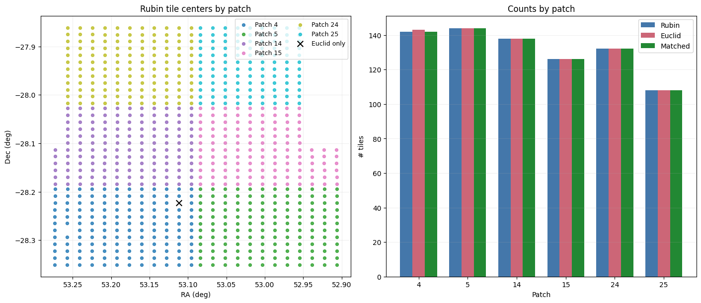
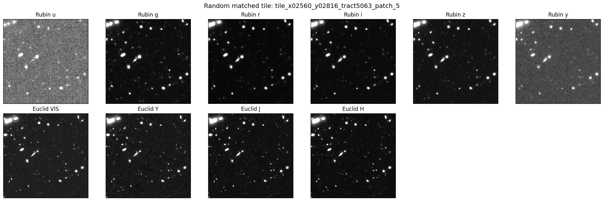
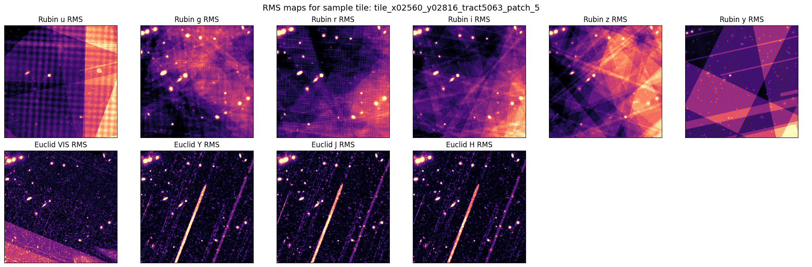
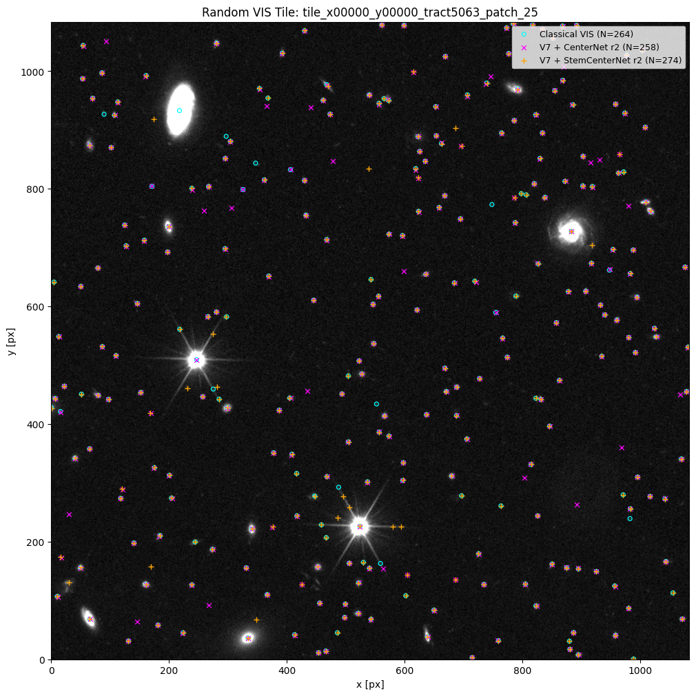
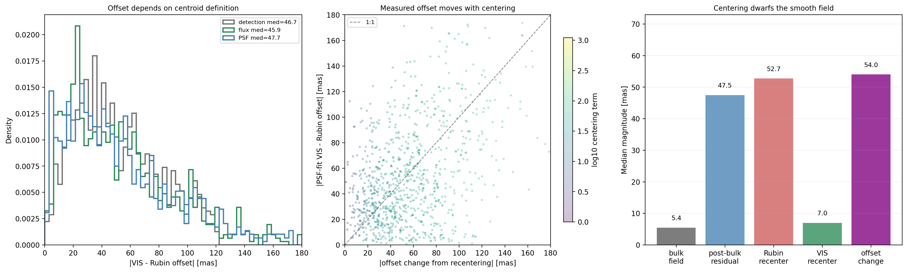
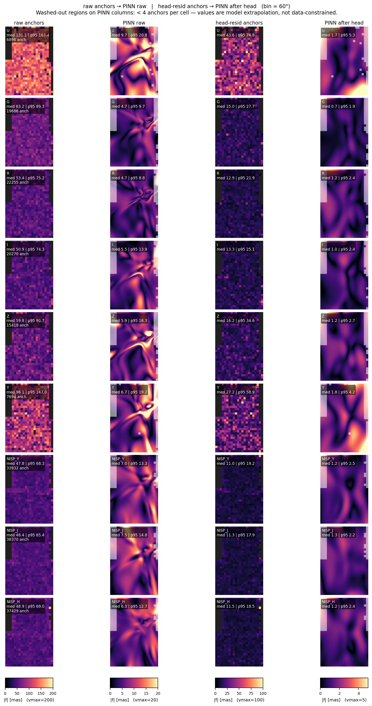
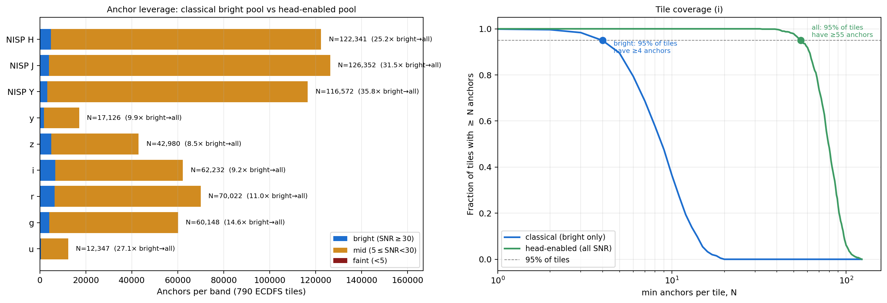
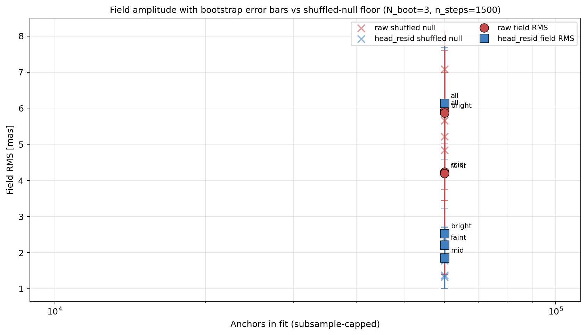
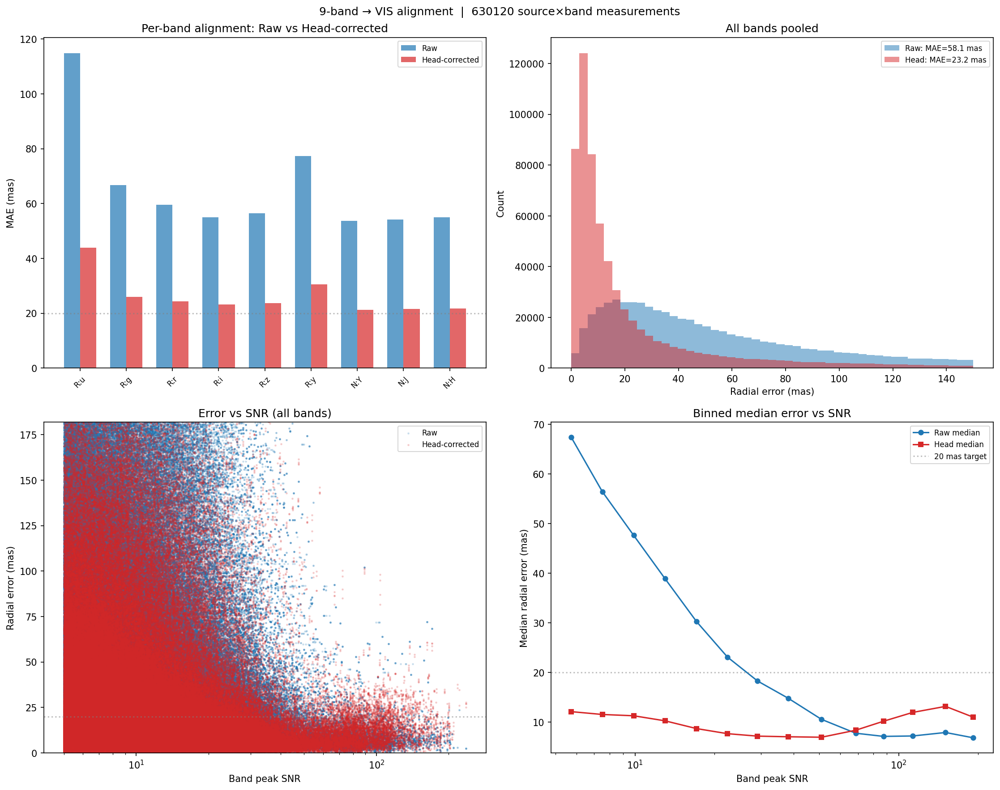

# JAISP (Joint AI Survey Processing)

## Full Documentation

A self-supervised multi-instrument foundation model for precision cosmology with Rubin Observatory and Euclid. The project was developed first on a 144-tile ECDFS subset and is now being retrained on a larger flat Rubin+Euclid tile extraction (`data/rubin_tiles_all/`, `data/euclid_tiles_all/`) containing 790 matched pairs.

---

## Table of Contents

1. [Current Stack Snapshot](#current-stack-snapshot)
2. [Motivation](#motivation)
3. [Data](#data)
4. [Foundation Model](#foundation-model)
   - [Architecture History (v1 through v8)](#architecture-history-v1-through-v8)
   - [v7 Mixed-Resolution MAE (Prior Production)](#v7-mixed-resolution-mae-prior-production)
   - [v8 Fine-Scale MAE (Current)](#v8-fine-scale-mae-current)
5. [Downstream Heads](#downstream-heads)
   - [Detection](#1-detection)
   - [Astrometry and Concordance](#2-astrometry-and-concordance)
   - [Latent Position Head](#latent-position-head-per-object-multi-band-alignment)
   - [PSF Modelling and Photometry](#3-psf-modelling-and-photometry)
6. [Project Structure](#project-structure)
7. [Quick Start](#quick-start)
8. [Checkpoints](#checkpoints)

---

## Current Stack Snapshot

| Layer | Current default | Notes |
|-------|-----------------|-------|
| Foundation | `models/checkpoints/jaisp_v8_fine/checkpoint_best.pt` | Fine-scale 0.4"/px fused MAE, trained with 256x256 Rubin random crops from the 512x512 tile product. |
| Detection | `checkpoints/centernet_v8_fine/centernet_round2.pt` | Fused-bottleneck CenterNet on v8 features; all-790-tile labels cached at `data/detection_labels/centernet_v8_r2_790.pt`. |
| Astrometry | `models/checkpoints/latent_position_v8_no_psf/best.pt` | Current no-PSF latent position head. Gaussian-fit photon centroids are the present target convention. |
| Smooth field QA | `models/astrometry2/fit_direct_pinn.py` | Fits raw or head-residual anchors from `anchors.npz`; post-head fields are about 1 mas and are QA/fallback products. |
| PSF | `models/checkpoints/psf_field_v3.pt` | Continuous SIREN PSFField for all 10 bands, used for PSF diagnostics and photometry. |
| Photometry | `models/checkpoints/photometry_foundation_200_fast/checkpoint_best.pt`; experiment: `models/checkpoints/rendered_stamp_v2_bigstamp/checkpoint_best.pt` | Current main learned v8 photometry head, plus PSFField matched-filter, scarlet-like residual-scene, and rendered-stamp experimental paths. |

Figure policy for this file: keep only figures that change the reader's understanding. Repetitive good/worst galleries, per-epoch W&B panels, and minor variants should stay in notebooks or checkpoint folders unless they support a new conclusion.

---

## Motivation

Rubin Observatory's LSST and ESA's Euclid will together produce the deepest, widest multi-wavelength imaging survey ever conducted. They observe the same sky, but through very different eyes: Rubin captures six optical bands (u through y) at 0.2 arcsec/pixel over a 512x512 tile grid, while Euclid provides a single ultra-sharp visible channel (VIS) at 0.1 arcsec/pixel on a ~1084x1084 grid, plus three near-infrared bands (Y, J, H) delivered as MER mosaics at the same 0.1 arcsec/pixel scale. Jointly analyzing these instruments enables science that neither can achieve alone -- sharper source detection by combining Euclid's resolution with Rubin's depth, sub-pixel astrometric alignment across surveys, and more precise photometric measurements that leverage all 10 wavelength channels simultaneously.

The challenge is that these instruments have different pixel scales, point-spread functions, noise properties, and coordinate systems. Classical survey pipelines address this through a chain of parametric models: fit a Gaussian PSF, solve a polynomial WCS, propagate analytical uncertainties through each stage. Each link in this chain introduces model assumptions that may not hold -- the PSF isn't truly Gaussian, the WCS residuals aren't truly random, the uncertainty propagation assumes independence that doesn't exist. Recent analysis of the Rubin pipeline (Wilson & Naylor 2025, SITCOMTN-159) illustrates this concretely: single-visit astrometric uncertainties have a ~5 milliarcsecond systematic floor not captured by the pipeline's error model, and coadd uncertainties follow an unexplained power-law relationship with the actual position scatter rather than the expected quadrature model. These are exactly the kind of model-dependent artifacts that accumulate when each stage relies on analytical assumptions about the previous stage's output.

The classical state of the art for Euclid astrometry is demonstrated by Libralato et al. (2024, arXiv:2411.02487), who achieve 0.7 mas precision on VIS through iterative effective PSF modelling and geometric distortion calibration -- but this requires individual unresampled exposures, bright point sources (globular cluster stars at SNR > 100), Gaia DR3 as an external reference, and processes each filter independently with empirical colour corrections applied post-hoc. These conditions are rarely met in extragalactic survey fields.

**The core thesis of JAISP is that data-driven methods can surpass these model-dependent approaches.** A neural network that sees thousands of galaxies across 10 bands learns what PSFs actually look like, how centroids shift with wavelength due to differential chromatic refraction, how noise correlates with field position -- all implicitly, from the pixels themselves, without anyone specifying parametric forms. The model doesn't assume a Gaussian PSF; it learns the actual instrument response. It doesn't assume quadrature uncertainty propagation; it learns the true error distribution. As the dataset grows, the learned representations should converge on reality rather than on the assumptions of any particular analytical model.

JAISP addresses this by learning a single spatially precise shared representation from both instruments through self-supervised pretraining, then attaching lightweight task-specific heads for detection, astrometry, and photometry. The central insight -- arrived at after five failed iterations -- is that **pixel-space reconstruction** via a Masked Autoencoder (MAE), where the model hides one band and learns to reconstruct it from the remaining bands, forces the encoder to preserve the exact spatial layout needed by precision cosmology tasks. Latent-space objectives like JEPA and contrastive learning optimize for "feature similarity" but allow the network to discard sub-pixel spatial information, which is precisely what astrometry and photometry demand.

### The Pipeline

The system works in two layers. First, a foundation model is trained once through self-supervised masked band prediction: given 9 of 10 bands, reconstruct the held-out band at pixel precision. This pretraining forces the encoder to learn cross-instrument spatial correspondence, noise properties, and spectral relationships without any labels. Second, the frozen encoder features are reused by three downstream heads, each of which trains only a small task-specific network on top.

```
 Rubin tiles (6 bands, 512x512, 0.2"/px)
 Euclid tiles (VIS + NISP Y/J/H, all ~1084x1084 @ 0.1"/px from MER mosaics)
         |
    [ Foundation Model (self-supervised MAE) ]
         |
         +-- frozen encoder features
         |
    +----+----+--------------------+
    |         |                    |
 Detection  Astrometry         Photometry
 (3 choices)(head + QA field)  (PSF + residual scene fit)
```

This two-layer design means the expensive foundation pretraining only happens once. Each downstream task gets the benefit of 10-band multi-instrument features without paying the cost of encoding from scratch.

### Classical Scaffolding and the Path to End-to-End Learning

An honest account of the current system: while the foundation model is genuinely data-driven, the downstream heads still lean on classical methods in places -- particularly for generating training labels. The astrometry matcher, for example, currently uses Gaussian PSF fitting to refine centroid positions for its training targets, and the detection head bootstraps from classical VIS peak-finding pseudo-labels. This is a practical necessity, not a philosophical choice. With ~200 training tiles, the downstream heads don't yet have enough data to learn everything from scratch, and the foundation encoder is frozen during downstream training so it can't adapt its features for each specific task.

The intended progression, as the dataset and methods mature:

1. **Current stage -- classical labels, learned prediction.** Classical centroiding and peak-finding generate training labels. The model learns to predict offsets, detect sources, and extract fluxes from the foundation encoder's learned features. This already outperforms purely classical approaches because the encoder has learned cross-instrument spatial correspondence that no classical pipeline captures.

2. **Self-training -- model-refined labels.** The model's own predictions refine its training data. The CenterNet detection head already does this: round-1 trains on VIS pseudo-labels, round-2 uses the model's confident novel detections as new labels and demotes classical artifacts the model rejects. This same principle extends to astrometry (use the model's offset predictions to generate better centroid targets) and photometry (use learned PSF features instead of parametric PSF models).

3. **End-to-end -- no classical stage.** Unfreeze the foundation encoder and let task-specific gradients flow back into the representation. The encoder specializes toward centroid-relevant features for astrometry, morphology-relevant features for detection, and SED-relevant features for photometry. No explicit PSF model, no parametric WCS correction, no hand-tuned uncertainty propagation. The model learns the instrument from the data.

This is not speculative -- each transition is a concrete engineering step. The foundation model already encodes enough spatial precision for pixel-level reconstruction across instruments. The remaining work is propagating that precision through the downstream heads and eventually closing the loop to let the tasks inform the representation.

### Why a Foundation Model — Transfer and Marginal Cost per Task

The case for the foundation isn't "does it beat a task-specific baseline on this field's test split" — it's about **what we can do with the foundation that we cannot do without it**. Three properties matter:

1. **Multi-band entanglement, learned once.** A u-band source and its NISP-H counterpart are the same physical object, but they appear very differently in pixels: different PSF, different noise, different flux, different morphology. The MAE objective (reconstruct the held-out band from the other nine) FORCES the encoder to learn these cross-band correspondences. A task-specific model trained from scratch on 790 tiles of ECDFS data doesn't have the sample budget to learn u-to-H mapping and also learn the downstream task. The foundation amortises that learning once.

2. **Instrumental-effect awareness.** PSF differences between Rubin (seeing-limited, broad, ~0.7" FWHM) and Euclid (diffraction-limited, sharp, ~0.2" FWHM VIS), pixel-scale differences (0.2 vs 0.1"/px), bandpass shapes, noise correlations, chip-edge effects, DCR — these are all implicit in what the encoder reconstructs. The per-band, per-instrument BandStems make this explicit in the architecture; MAE pretraining makes it explicit in the learned weights.

3. **Marginal cost per downstream task approaches zero.** Detection, astrometry, photometry, and (eventually) shape measurement all consume the same frozen features. The foundation's pretraining cost is paid once; each new task only trains a small head. The more downstream tasks we add, the smaller the foundation's amortised cost becomes. This is also why "does the foundation help THIS task" is the wrong question in isolation — the right question is "does the foundation help ALL tasks, collectively, enough to justify its cost."

The fourth property is the one we value most and have tested least:

4. **Transfer to new fields without retraining.** A foundation that learned multi-band physics from ECDFS tiles SHOULD work zero-shot on EDF-North, EDF-South, or any new LSST+Euclid deep field. The expensive part (foundation pretraining) should not need to be repeated per field. Downstream heads trained on ECDFS SHOULD continue to apply, provided the new field's sources have the same statistical properties. This is exactly what a foundation model is for. All training and evaluation in this repo so far has been in-distribution on ECDFS tract5063. Out-of-distribution evaluation on a different field is a milestone not yet executed. Without it we cannot distinguish "foundation helps on this field" from "foundation learned this specific field's idiosyncrasies."

The long-term plan is to (a) extend evaluation to at least one non-ECDFS field as soon as the astrometry pipeline settles, and (b) use that OOD performance number — not the in-distribution train/val split — as the primary success metric for future foundation versions.

---

## Data

The current checkout contains the products used by the v8 pipeline:

- **Current flat training set**: `data/rubin_tiles_all/` and `data/euclid_tiles_all/`. The Rubin side contains 790 tiles; the Euclid side contains 791 readable files, of which 790 are matched Rubin+Euclid pairs and one is Euclid-only. Rubin-driven loaders ignore the unmatched Euclid tile.
- **200-tile downstream subset**: `data/rubin_tiles_200/` and `data/euclid_tiles_200/`, both symlink subsets of the flat training set. Current detection training and cached v8 features use this subset.
- **Patch-organized tract5063 product**: `data/rubin_tiles_tract5063/patch_{14,15,24}/` and `data/euclid_tiles_tract5063/patch_{14,15,24}/`, with 280 files per instrument. These are useful for patch-level inspection and ingestion provenance; the flat loaders above are the current training interface.
- **Historical ECDFS 144-tile subset**: referenced in older checkpoints and experiment notes, but the `data/rubin_tiles_ecdfs/` and `data/euclid_tiles_ecdfs/` directories are not present in this checkout.

These products use compatible NPZ schemas. In the flat set, filenames encode tract/patch metadata directly, for example `tile_x02816_y00512_tract5063_patch_14.npz` and `tile_x02816_y00512_tract5063_patch_14_euclid.npz`.


*Left: Spatial distribution of Rubin tile centers by patch, covering the ECDFS field. Right: Tile counts per patch showing matched Rubin+Euclid pair availability.*


*All 10 bands for a sample matched tile. Top row: Rubin u/g/r/i/z/y (512x512, 0.2"/px). Bottom row: Euclid VIS and NISP Y/J/H (all ~1084x1084, 0.1"/px from MER mosaics). Note the different noise properties across bands.*


*Per-pixel RMS (noise) maps for the same tile, derived from the variance arrays in the NPZ files. Rubin RMS shows chip-edge effects and depth variations. Euclid NISP RMS reveals satellite trails and detector artifacts. These maps are used for per-pixel noise normalization in the foundation model BandStems and in the astrometry matcher.*

### Tiling and Overlap

Tiles are laid out on a regular grid with 256-pixel stride in both x and y, but each Rubin tile is 512x512 pixels. This means adjacent tiles overlap by **256 pixels (50%)** in each direction. A given point on the sky appears in up to 4 overlapping tiles.

This overlap has several benefits:

- **Foundation pretraining**: The same source appears in multiple tiles at different positions relative to tile edges. This acts as free data augmentation -- the model sees a galaxy near the center of one tile and near the edge of a neighbor, learning position-invariant features. This is particularly valuable given the current dataset size.
- **Detection**: Sources near tile edges (where detection is hardest) appear near the center of overlapping tiles, so the detector learns to find sources regardless of their position within a tile.
- **Astrometry**: Shared sources in overlap regions help diagnose whether any smooth residual WCS/concordance field is coherent across tile boundaries. The current ECDFS result is that this smooth term is small compared with object-level centering scatter.

The downside is that tile count overstates statistical independence. In the legacy 144-tile ECDFS subset, 50% overlap means there are only roughly ~36 truly independent sky areas. The expanded flat set improves sample count substantially, but overlap still matters when designing train/val/test splits or making final downstream performance claims.

### Tile Size, Fused Scale, and Resolution Tradeoffs

The stored Rubin tile product is 512x512 pixels (102" x 102" on sky), which balances source density and spatial context. The current v8 foundation does not train on the full stored tile at once: it draws 256x256 Rubin random crops, paired with matching Euclid crops, so the transformer sees a smaller sky area at a finer fused scale. Tile size and `fused_pixel_scale_arcsec` should therefore be treated together.

#### How tile size flows through the architecture

```
Rubin tile: T × T pixels at 0.2"/px    →  sky coverage = T × 0.2"
Euclid tile: ~(T×2) × (T×2) at 0.1"/px →  same sky coverage
                    ↓
BandStems (native resolution, no downsampling)
                    ↓
StreamEncoders (stride-2 ConvNeXt stages)
                    ↓
Bottleneck tokens: T × 0.2 / fused_scale  per axis
                    ↓
Transformer: O(n²) in total token count
```

The bottleneck token count -- and therefore transformer cost -- is controlled by **both** tile size and fused scale jointly:

| Tile (Rubin px) | Sky | Fused scale | Bottleneck tokens | Attention cost | Sources/tile |
|---|---|---|---|---|---|
| 256×256 | 51" | 0.8"/px | ~64×64 = 4K | 1× (baseline) | ~125 |
| 512×512 full tile (v7) | 102" | 0.8"/px | ~128×128 = 16K | 16× | ~500 |
| 1024×1024 | 204" | 0.8"/px | ~256×256 = 65K | **260×** | ~2000 |
| **256×256 crop (v8 current)** | **51"** | **0.4"/px** | **~128×128 = 16K** | **16× (same as v7 full tile)** | **~125** |
| 512×512 | 102" | 0.4"/px | ~256×256 = 65K | 260× (too expensive) | ~500 |

The key insight: **256×256 crops at 0.4"/px fused scale give the same transformer cost as the v7 full-tile setup but with 2× finer bottleneck spatial resolution.**

#### What tile size affects per component

**Foundation model (transformer bottleneck)**: This is where tile size matters most. The transformer's self-attention mixes spatial information across all tokens in a tile. Larger tiles give the transformer more context -- more sources, more PSF variation, more of the WCS distortion pattern. But astronomical sources are local: a typical galaxy at z~0.5 is ~5" = 25 Rubin pixels = 50 VIS pixels. The transformer doesn't need arcminute context to reconstruct a galaxy's missing band -- it needs the galaxy plus enough surrounding sky to estimate noise. With 4× more tiles from the same data, smaller tiles provide more sample diversity, which can compensate for less per-tile context.

**Detection (CenterNet/StemCenterNet)**: Detection is fundamentally local -- each source is detected by its immediate neighborhood in the feature map. Tile size affects sources per tile but not what the model learns about individual sources. No meaningful impact from tile size changes.

**Astrometry**: The smooth concordance field varies on degree scales and is small in ECDFS (~5 mas). The global PINN/grid solver combines all tiles and is useful for WCS QA or fallback smooth correction, but the dominant error is object-level centering scatter. The latent position head is local, so tile size matters mostly through the spatial detail encoded by the foundation features, not through the smooth field solver.

**Latent position head (per-object alignment)**: The head extracts local features at each source position: a 5×5 window from the bottleneck (~4" at 0.8"/px) and a 17×17 window from the VIS stem (~1.7" at 0.1"/px). **Changing tile size does not change the resolution of these local features.** What it changes is how much context the transformer had when computing the bottleneck features -- but the extracted window is always the same size. The fused scale, however, directly changes how much spatial detail the bottleneck encodes: at 0.4"/px instead of 0.8"/px, the 5×5 window would cover ~2" with 2× finer spatial structure.

**Galaxy morphology**: A galaxy easily fits within any tile size ≥256×256 Rubin pixels. The foundation model learns galaxy morphology from the reconstruction loss ("given 9 bands, predict the 10th at pixel level"), which is purely local. Tile size does not limit this. What limits galaxy morphology learning is the bottleneck resolution -- at 0.8"/px, fine galaxy structure (spiral arms, colour gradients, tidal features) is compressed to a few bottleneck pixels. Finer fused scale preserves more of this structure through the transformer.

#### Why fused scale matters more than tile size

The fused scale (`fused_pixel_scale_arcsec`) sets the angular resolution of the bottleneck -- the finest spatial detail the transformer can reason about. At v7's 0.8"/px:

- Each bottleneck pixel covers 8 VIS pixels (4 Rubin pixels)
- A compact galaxy (2" effective radius) is ~5 bottleneck pixels across
- Sub-pixel centroiding in the bottleneck means ~400 mas precision (before the VIS stem path refines it)

At 0.4"/px:

- Each bottleneck pixel covers 4 VIS pixels (2 Rubin pixels)
- The same galaxy is ~10 bottleneck pixels across
- The transformer sees 2× finer spatial structure, which helps for morphology-dependent tasks (chromatic centroid shifts, deblending, galaxy shape measurement)
- Sub-pixel centroiding in the bottleneck improves to ~200 mas precision

The cost is quadratic in tokens: at 0.4"/px with 512×512 tiles, the bottleneck would be 256×256 = 65K tokens -- prohibitively expensive for dense attention. But at 0.4"/px with 256×256 crops, the bottleneck is 128×128 = 16K tokens -- identical cost to the v7 full-tile baseline. This is the configuration v8 adopts (see the v8 section below).

### Rubin NPZ files (`data/rubin_tiles_all/tile_x*_y*.npz`)

| Key      | Shape            | Description                        |
|----------|------------------|------------------------------------|
| `img`    | `[6, 512, 512]`  | Flux in 6 bands (u, g, r, i, z, y) |
| `var`    | `[6, 512, 512]`  | Variance per pixel (converted to RMS internally) |
| `mask`   | `[6, 512, 512]`  | Bitmask per pixel (NO_DATA=256, BAD=1, SAT=2, DETECTED=32) |
| `bands`  | `[6]`            | Band name strings (u, g, r, i, z, y) |
| `wcs_hdr`| string           | FITS WCS header for astrometric calibration |

Pixel scale: 0.2 arcsec/pixel. Each tile covers roughly 102 x 102 arcsec on the sky. The patch-organized tract5063 product uses the same Rubin schema; the historical ECDFS subset used the same schema when present.

### Euclid NPZ files (`data/euclid_tiles_all/tile_x*_y*_euclid.npz`)

| Key              | Shape             | Pixel Scale    |
|------------------|-------------------|----------------|
| `img_VIS`        | `[~1084, ~1084]`  | 0.1 arcsec/px  |
| `img_Y`, `img_J`, `img_H` | `[~1084, ~1084]` | 0.1 arcsec/px (MER mosaics) |
| `var_VIS/Y/J/H`  | same              | Variance       |
| `wcs_VIS/Y/J/H`  | string            | FITS WCS       |

Euclid VIS has twice the angular resolution of Rubin, which is why preserving it at native resolution (rather than downsampling to match Rubin) is so important for the foundation model design. The patch-organized tract5063 product uses the same Euclid schema; the historical ECDFS subset used the same schema when present.

### Supported Bands

| Instrument | Bands                           | Wavelength Range | Count |
|------------|---------------------------------|------------------|-------|
| Rubin      | `rubin_u`, `rubin_g`, `rubin_r`, `rubin_i`, `rubin_z`, `rubin_y` | 320-1060 nm | 6 |
| Euclid     | `euclid_VIS`, `euclid_Y`, `euclid_J`, `euclid_H` | 550-2020 nm | 4 |
| **Total**  |                                 |                  | **10** |

Each band has its own `BandStem` -- a small per-band CNN that handles noise normalization and initial feature extraction. This per-band design allows the model to learn band-specific noise properties and PSF characteristics while producing a common feature representation for downstream fusion.

---

## Foundation Model

### Architecture History (v1 through v8)

The foundation model went through eight major iterations over the course of this project. Understanding this history is important because each version's failure revealed a specific insight about what self-supervised astronomical representations need. The overall arc is a progression from **latent-space alignment** (v1-v5) to **pixel-space reconstruction** (v6-v8), driven by the realization that precision cosmology demands sub-pixel spatial fidelity that contrastive and JEPA objectives fundamentally cannot enforce.

> *If you only need the current architecture, skip to [v8 Fine-Scale MAE (Current)](#v8-fine-scale-mae-current). V7 is described first because v8 inherits the v7 architecture with small changes.*

#### v1: Patch-Level Contrastive Learning

The first approach was conceptually straightforward: take large patches from Rubin and Euclid images at the same sky location, encode each through a Vision Transformer (ViT), and train with a contrastive loss (NT-Xent) to pull co-located patch pairs together while pushing non-overlapping pairs apart. Rubin patches were 192x192 pixels, Euclid patches 384x384 (accounting for the 2x pixel scale difference), and each was compressed to a single embedding vector.

This failed comprehensively. The core problem is that astronomical imaging is dominated by empty sky -- roughly 95% of pixels in any given patch are featureless background noise. When you compress an entire 192x192 patch to a single vector, the handful of galaxies and stars (occupying maybe 5% of the area) get averaged into the background. The model quickly learned that "flat Rubin background" matches "flat Euclid background" and collapsed, with separation metrics dropping to ~0.002. The embeddings carried no useful information about actual astronomical sources.

#### v2: Signal-Based Patch Sampling

Rather than abandon the patch-contrastive framework entirely, v2 attempted to fix the data problem. Instead of extracting random patches, it evaluated multiple candidate patches and selected those with the highest astronomical signal, weighted by inverse variance. The idea was to force the model to see patches containing actual galaxies and stars rather than empty sky.

This helped somewhat -- the model did learn slightly more meaningful embeddings -- but was ultimately a band-aid on a fundamental architectural flaw. The problem isn't just which patches you train on; it's that compressing any 192x192 astronomical image to a single vector inherently destroys the spatial information needed for astrometry. A galaxy's precise sub-pixel position cannot survive global average pooling. This realization led to rethinking the representation granularity entirely.

#### v3: DETR-JEPA (Object-Centric Learning)

The third approach asked: "What if we don't compress the whole patch, but instead let the model discover individual objects?" Inspired by DETR (Detection Transformer), v3 used a ViT backbone to produce spatial feature tokens, then fed them to a DETR-style decoder with 100 learnable object queries. Each query attended to the spatial features and was trained to "discover" one astronomical source. Hungarian matching found the optimal 1-to-1 correspondence between Rubin and Euclid object slots, and a contrastive loss pulled matched objects together.

This was a creative idea -- moving from patch-level to object-level learning, where each embedding corresponds to a single astronomical source. But in practice it was fragile. The Hungarian matching added instability during training, and the object queries didn't reliably converge to distinct sources in crowded deep-field images where hundreds of faint galaxies overlap. More fundamentally, even perfect per-object embeddings don't give you pixel-level spatial precision -- they tell you "these two objects are the same source" but not exactly where that source is to sub-pixel accuracy.

#### v4: Native-Resolution JEPA with InformationMap

v4 made a critical architectural shift: instead of extracting patches, process the full 512x512 tile at native resolution. This eliminated the information loss from patching entirely. The architecture used per-band CNN stems with noise normalization, a shared ViT-like trunk with positional encodings, and a BYOL/JEPA-style student-teacher framework with exponential moving average (EMA).

Two important innovations appeared in v4. First, **InformationMap weighting**: instead of treating all pixels equally, the loss was weighted by a signal-to-noise map combined with Sobel gradient magnitudes. This naturally focused learning on source pixels (high SNR, strong gradients) rather than empty background, solving the background-dominance problem without resorting to patch sampling. InformationMap weighting proved valuable enough to survive into v6 and v7, where it was extended with an RMS-adaptive minimum weight floor to prevent hallucination in noisy bands (see v7 Training).

Second, v4 introduced a **shift-tolerant alignment loss** that allowed tokens to match within a +/-5 pixel tolerance window. The reasoning was that Rubin and Euclid have genuine sub-pixel astrometric misalignments, so forcing exact positional matching would create conflicting gradients.

The shift tolerance turned out to be a mistake. By allowing 5 pixels of slack, the model had no incentive to learn precise spatial correspondence -- it could satisfy the loss with spatially imprecise features. This is the opposite of what astrometry needs. The EMA teacher also added complexity without clear benefit over simpler training schemes.

#### v5: Strict-Position JEPA

v5 was a targeted fix for v4's spatial imprecision: remove the shift tolerance entirely (`shift_px=0`) and force exact token-to-token matching at corresponding spatial positions. Everything else remained the same -- InformationMap weighting, per-band stems, ViT backbone, VICReg regularization to prevent collapse.

This version exposed the fundamental limits of the JEPA approach for precision cosmology. Three problems compounded:

1. **Resolution ceiling**: The ViT used 16x16 patch tokens, meaning each token covered 3.2 arcseconds on the sky. Astrometry needs precision below 0.2 arcseconds -- the tokenization itself is too coarse by an order of magnitude.
2. **Latent-space loss is the wrong objective**: Cosine similarity between token embeddings rewards "similar features" but doesn't require the network to preserve exact spatial layout. Two tokens can be highly similar in embedding space while differing in the precise sub-pixel positions of the sources they encode.
3. **Strict matching vs real misalignments**: Real Rubin-Euclid data has genuine 0.25-0.5 pixel instrument misalignments. Forcing exact token-to-token matching on misaligned data creates conflicting supervision signals that prevent convergence.

The decisive evidence came from a simple baseline comparison: a straightforward CNN with a cost volume (the astrometry2 module) achieved 38 milliarcsecond (mas) accuracy on the astrometry task, while v5's JEPA features only managed 47 mas. The expensive self-supervised representation was *worse* than a simple supervised CNN. This proved that the JEPA approach, regardless of how it was tuned, was not learning the spatial information that precision cosmology requires.

**The key lesson from v1-v5**: Latent-space alignment objectives -- whether contrastive (v1-v2), object-centric (v3), or JEPA-style (v4-v5) -- optimize for feature similarity, not spatial precision. They allow the network to learn "this region looks like that region" without knowing exactly where things are at the sub-pixel level. For precision cosmology, you need the encoder to preserve exact pixel positions. The only way to guarantee this is to require the network to actually reconstruct pixels.

#### v6: Masked Band Prediction (Dense Reconstruction)

v6 represents the fundamental paradigm shift from latent-space alignment to pixel-space reconstruction. Instead of making embeddings match across instruments, the model is trained to predict a held-out band's pixel values from the remaining bands. This is a masked autoencoder (MAE), but operating on wavelength bands rather than spatial patches.

The architecture replaced the ViT with a dense convolutional pipeline: per-band CNN stems (BandStem with GroupNorm for batch-size-1 compatibility), a ConvNeXt encoder with three stride-2 downsampling stages producing dense feature maps at H/8 resolution, a transformer bottleneck operating on these dense tokens, and a U-Net decoder with skip connections that reconstructs back to full resolution. FiLM (Feature-wise Linear Modulation) conditioning tells the decoder which band to predict. The loss is InformationMap-weighted L1 in noise-normalized units -- the same signal-aware weighting that proved valuable in v4, now applied to a reconstruction objective. Total: 20.8M parameters.

Training used a two-phase curriculum:
- **Phase A** (`cross_instrument_prob=0.0`): Rubin-only. Mask one Rubin band, reconstruct it from the other five. This teaches the model spectral relationships and spatial structure within one instrument.
- **Phase B** (`cross_instrument_prob=1.0`): Joint Rubin + Euclid. Mask any one of the 10 bands, reconstruct it from the other 9. This teaches cross-instrument spatial correspondence, since reconstructing a Euclid band from Rubin features (or vice versa) requires the encoder to learn precise alignment.

The reason this works is simple and powerful: to reconstruct a held-out band at the pixel level, the encoder *must* preserve sub-pixel spatial information. If a galaxy is at position (245.3, 167.8) in the input bands, the decoder needs to place reconstructed flux at exactly that position in the output. There is no shortcut -- you can't get high pixel-level fidelity without encoding precise positions. This is exactly the spatial precision that astrometry, detection, and photometry need downstream.

**Limitation**: Phase B downsampled Euclid VIS (~1084x1084 at 0.1"/px) to Rubin's 512x512 grid before encoding. This was a pragmatic choice to avoid dealing with mixed resolutions, but it discarded the 2x resolution advantage that makes VIS the most valuable single channel for astrometry and deblending.

#### v7: Mixed-Resolution MAE (prior production)

v7 fixes v6's resolution bottleneck. Instead of forcing all instruments onto one pixel grid, each instrument processes at its native resolution through independent encoder branches with different depths. The branches are designed so that after their respective downsampling stages, both streams arrive at approximately the same physical angular scale (~0.8 arcsec/pixel). At this common physical scale they fuse into a shared latent representation, pass through a transformer bottleneck, and then decode back to the target band's native resolution.

A key design choice is how per-band features are aggregated within each stream. The Euclid stream uses **fixed-slot concatenation** followed by a learned 1×1 projection, preserving per-band PSF and color structure (VIS PSF: 0.2" vs NISP PSF: ~0.5") through the entire encoder. The Rubin stream uses mean pooling (all 6 optical bands have similar PSFs). This asymmetric design ensures the encoder can learn band-specific spatial features for Euclid while keeping the Rubin path efficient.

VIS features are never downsampled to Rubin's coarser grid. When the model reconstructs any Euclid band, it decodes to the full ~1084x1084 resolution. When it reconstructs a Rubin band, it decodes to 512x512. The encoder learns to preserve each instrument's native spatial information throughout.

See the next section for the full v7 architecture.

### Version Summary

| Version | Approach | Key Idea | Outcome |
|---------|----------|----------|---------|
| v1 | Patch contrastive | Match Rubin-Euclid patch embeddings | Failed: background collapse |
| v2 | Patch contrastive | Signal-based patch selection | Abandoned: patch-level still lossy |
| v3 | DETR-JEPA | Object-level manifold matching | Abandoned: complexity, no precision gain |
| v4 | Native-res JEPA | InformationMap + shift tolerance | Superseded: spatially imprecise |
| v5 | Native-res JEPA | Strict position matching | Failed: JEPA can't enforce pixel precision |
| v6 | Dense MAE | Pixel-space reconstruction | Works but VIS downsampled to Rubin grid |
| v7 | Mixed-res MAE | 2-stream (Rubin mean / Euclid concat), native resolution | Prior production: preserves per-band PSF structure, RMS-aware loss. Superseded by v8 for all downstream work. |
| v8 | Fine-scale MAE | v7 architecture + configurable fused scale + random crop | **Current production**: 2× finer bottleneck (0.4"/px), same token count via 256×256 crops. All current downstream heads (CenterNet, latent position, PSFField, photometry) use v8 features. |

### v7 Mixed-Resolution MAE (Prior Production)

**File**: `models/jaisp_foundation_v7.py`

> v7 was the first production foundation and remains available as a comparison baseline. v8 (below) is the current production model and is what all downstream heads are now trained against. This section describes the v7 architecture because v8 inherits it wholesale with only the fused-scale and crop changes summarised later.

The v7 architecture has three main stages: per-instrument encoding at native resolution, cross-instrument fusion at a shared physical scale, and target-specific decoding back to native resolution.

**Encoding**: The model has two instrument streams, each with its own encoder branch:

- **Rubin stream**: Six BandStems (one per optical band) produce per-band feature maps. These are **mean-pooled** into a single tensor and fed through a StreamEncoder with 2 ConvNeXt downsampling stages. Mean pooling is acceptable here because all Rubin bands have similar PSFs (~0.7-1.0") and variable band availability (some tiles may lack u or y) is handled gracefully.
- **Euclid stream**: Four BandStems (VIS, Y, J, H) produce per-band feature maps. These are **concatenated** into fixed slots (4 × 64 = 256 channels, with zero-filled slots for masked bands during MAE training) and projected back to 64 channels via a learned 1×1 convolution. This preserves per-band structure through the entire encoder -- critical because the Euclid bands have very different PSFs (VIS: 0.2", NISP Y/J/H: ~0.5") and the encoder needs to learn band-specific spatial features for downstream photometry and deblending. The fused features pass through a StreamEncoder with 3 ConvNeXt downsampling stages.

The branch depths are chosen so that both streams converge to approximately 0.8 arcsec/pixel -- this is a physics-grounded design where the fusion happens at matched angular resolution, not matched pixel count.

**Fusion**: The encoded streams are interpolated to a common spatial grid, summed with learned stream identity embeddings (so the transformer can distinguish Rubin from Euclid features), and passed through a transformer bottleneck with 4 layers and 8 attention heads operating on approximately 132×132 tokens with 2D sinusoidal positional encodings.

**Decoding**: A per-stream TargetDecoder upsamples back to the target band's native resolution using bilinear interpolation and skip connections. The skip connections are routed from whichever encoder pyramid level has the closest matching physical scale, fusing information across both instrument streams at each decoder stage. FiLM conditioning tells the decoder which specific band to reconstruct.

```
Rubin:  6 BandStems -> mean pool -> [64, 512, 512]      -> 2-stage encoder --\
                                                                               --> latent @ 0.8"/px
Euclid: 4 BandStems -> concat+1×1 proj -> [64, 1084, 1084] -> 3-stage encoder --/    (~132×132 tokens)
         (VIS/Y/J/H)  (zero-fill missing bands)                                          |
                                                                           Stream fusion +
                                                                           learned stream embeddings
                                                                                          |
                                                                           Transformer bottleneck
                                                                           (depth=4, heads=8)
                                                                                          |
                                                                           TargetDecoder with
                                                                           pyramid skip connections
                                                                                          |
                                                                           Native-resolution output
                                                                           (Euclid->~1084, Rubin->512)
```

The Euclid concat+project design (via the `StreamFuser` module) is the key architectural difference from earlier versions. By preserving per-band information through the encoder, the model can learn that the same galaxy looks different in VIS vs H-band due to PSF differences -- exactly the information that photometry and deblending need. During MAE training, when one Euclid band is masked as the reconstruction target, its slot is zero-filled; the 1×1 projection learns to ignore zeros, so the encoder gracefully handles variable band availability.

NISP Y/J/H data comes from Euclid MER mosaics, already resampled to 0.1"/px (same as VIS).

**Training**: Unlike v6's two-phase curriculum, v7 training is unified from epoch 1. Tiles with Euclid coverage use cross-instrument masking; Rubin-only tiles automatically fall back to within-instrument prediction. In the current flat training set, the Rubin side is effectively fully paired (790 matched pairs), so almost every sample participates in cross-instrument learning.

**Loss**: InformationMap-weighted L1 in noise-normalized (SNR) space, with two RMS-aware mechanisms:

1. **RMS-adaptive InformationMap floor**: The original InformationMap used a fixed minimum weight (`min_weight=0.001`) for blank-sky pixels. This meant that for noisy bands (u, y) where almost no pixels exceed the SNR threshold, the model could hallucinate sources at near-zero loss cost -- the info weights were negligible at blank-sky locations, so false sources went unpunished. The adaptive floor raises the minimum weight based on the tile's mean RMS: `adaptive_min = 0.001 + sigmoid(mean_rms - 1.0) * 0.3`. Bands with higher noise get a higher floor, ensuring blank-sky pixels contribute meaningfully to the loss and penalizing hallucinations.

2. **Tile-level RMS band weight**: The per-target loss is multiplied by the target band's mean RMS across the tile: `loss = mean_rms * pixel_loss`. In noise-normalized space, noisy bands naturally produce smaller loss magnitudes (targets are flatter). This multiplicative weight compensates, giving noisy bands proportionally larger gradients so the model cannot coast on the easy high-SNR bands (g/r/i/z).

Training uses mixed-precision (bfloat16 autocast) and supports multi-GPU via `torchrun` with DistributedDataParallel.

**Reference checkpoint** (`jaisp_v7_concat` / `v7_rms_aware_loss`):

| Parameter | Value |
|-----------|-------|
| `stem_ch` | 64 |
| `hidden_ch` | 256 |
| `transformer_depth` | 4 |
| `transformer_heads` | 8 |
| `fused_pixel_scale_arcsec` | 0.8 |
| `cross_instrument_prob` | 1.0 |
| Epoch | 92 |
| Total params | 13.3M |
| Location | `models/checkpoints/jaisp_v7_concat/checkpoint_best.pt` |

This is the RMS-aware loss run ([wandb](https://wandb.ai/AI-Astro/JAISP-Foundation-v7/runs/x9y9os7r)), trained on 790 matched tile pairs with correct NISP MER pixel scales (0.1"/px) and RMS-adaptive InformationMap weighting. It is kept available for comparison experiments; all current downstream heads have moved to v8.

Reconstruction quality across bands: Rubin g/r/i/z achieve near-perfect fidelity (Pearson r >= 0.989). Rubin u and Euclid NISP bands are solid (r = 0.87-0.97). Euclid VIS is the weakest band (r = 0.87, std_ratio = 0.92), likely because reconstructing the highest-resolution channel from coarser inputs is the hardest prediction task. Mean Pearson r across all 10 bands is 0.955.

### v8 Fine-Scale MAE (Current)

**Files**: `models/jaisp_foundation_v8.py`, `models/jaisp_dataset_v8.py`, `models/train_jaisp_foundation_v8.py`

**Current checkpoint**: `models/checkpoints/jaisp_v8_fine/checkpoint_best.pt`. This is the foundation all current downstream heads (CenterNet v8, latent position head v8, PSFField v3, foundation photometry head) are trained on.

V8 started as an experimental fork of V7 testing whether a finer bottleneck resolution would improve per-object alignment for galaxies with colour gradients. It is now the production foundation: the v8 latent position head reduces cross-instrument alignment residuals by ~74-79% (vs. ~51% for the v7 head), and the downstream stack (CenterNet, PSFField, photometry) all operate on v8 features. The architecture is identical to V7 except:

1. **Configurable fused scale**: `fused_pixel_scale_arcsec` defaults to **0.4"/px** instead of 0.8"/px, giving 2× finer spatial resolution in the bottleneck.
2. **Auto-computed stream depths**: Stream encoder depths are derived automatically from the fused scale (Rubin depth=1, Euclid depth=2 at 0.4"/px) instead of hardcoded.
3. **Random crop training**: Uses 256×256 random crops from the existing 512×512 Rubin tiles (and corresponding ~542×542 Euclid crops). This keeps the bottleneck at ~128×128 = 17K tokens -- **identical cost to v7** -- while providing 2× finer features.

The random cropping also serves as data augmentation: each 512×512 tile can yield many different 256×256 crops across epochs, effectively increasing training diversity without re-tiling the data.

| Config | V7 (prior production) | V8 (current production) |
|--------|-----|-----|
| Fused scale | 0.8"/px | 0.4"/px |
| Rubin input | 512×512 (full tile) | 256×256 (random crop) |
| Euclid input | ~1084×1084 | ~542×542 (random crop) |
| Rubin stream depth | 2 | 1 |
| Euclid stream depth | 3 | 2 |
| Bottleneck tokens | ~128×128 = 16K | ~128×128 = 16K |
| Bottleneck resolution | 800 mas/pixel | 400 mas/pixel |
| Total params | 13.3M | 9.1M |
| Sky context per tile | 102" | 51" |

```bash
# Single GPU
cd models && python train_jaisp_foundation_v8.py \
    --rubin_dir ../data/rubin_tiles_all --euclid_dir ../data/euclid_tiles_all \
    --output_dir ./checkpoints/jaisp_v8_fine \
    --fused_pixel_scale_arcsec 0.4 --crop_size_rubin 256 \
    --hidden_ch 256 --epochs 100 --lr 3e-4 --accum_steps 4 \
    --wandb_name v8_fused04_crop256

# Multi-GPU
cd models && torchrun --nproc_per_node=2 train_jaisp_foundation_v8.py \
    --rubin_dir ../data/rubin_tiles_all --euclid_dir ../data/euclid_tiles_all \
    --output_dir ./checkpoints/jaisp_v8_fine \
    --fused_pixel_scale_arcsec 0.4 --crop_size_rubin 256 \
    --epochs 100 --lr 3e-4 --accum_steps 2
```

**Outcome**: the hypothesis held up. The v8 latent position head reaches ~9-11 mas median cross-instrument residual on Rubin g/r/i/z and NISP Y/J/H (vs. ~13-15 mas for the v7 head at the same evaluation protocol), and downstream heads have been retrained against v8 features across the board. V7 is retained as a comparison baseline but is no longer the recommended starting point for new downstream work.

---

## Downstream Heads

All current downstream heads reuse the frozen **V8** foundation encoder (`models/checkpoints/jaisp_v8_fine/checkpoint_best.pt`). Only lightweight task-specific layers are trained on top. This means each head gets the benefit of the full 10-band multi-instrument representation without the cost of encoding from scratch, and training each head is fast (hours, not days). The V7-based checkpoints (CenterNet v7, latent position v7) remain available as comparison baselines but are superseded by their v8 counterparts.

### 1. Detection

**Directory**: `models/detection/`

The detection stack supports three complementary source-finding choices. The fused-bottleneck CenterNet is now trained against the v8 foundation (`checkpoints/centernet_v8_fine/centernet_round2.pt`) with cached v8 bottleneck features in `data/cached_features_v8_fine/`.

1. **Classical VIS baseline**: native-resolution Euclid VIS peak-finding with bright-star masking. This is fast, robust, and remains the bootstrap source list for pseudo-label generation.
2. **Foundation + CenterNet (current: v8)**: a dense detector on top of the frozen foundation **fused bottleneck**. This is the strongest current option for broad 10-band semantic fusion, especially when the signal is spread across multiple bands rather than carried by one sharp VIS peak. The v8 round-2 checkpoint is used to produce the 790-tile detection label set (`data/detection_labels/centernet_v8_r2_790.pt`, ~188 detections/tile) that PSFField v3 and the foundation photometry head consume.
3. **Foundation + StemCenterNet**: a dense detector on top of the frozen foundation **BandStems** at native resolution. This preserves more local spatial detail than the bottleneck path. The reference checkpoint is `checkpoints/stem_centernet_v7_rms_aware_200/` (on v7 stems); a v8 retrain (`checkpoints/stem_centernet_v8_fine/`) is now also possible via the same `self_train_stem.py` script after `load_foundation()` was made V7/V8-agnostic. The v7 stem checkpoint is the live comparison baseline in `io/05_detection_comparison.ipynb`.

The point of keeping all three is scientific comparison, not redundancy. Classical VIS is the baseline and pseudo-label source. The fused-bottleneck detector tests whether the self-supervised latent has learned genuinely multi-band source evidence. The stem detector tests whether native-resolution foundation features improve local source finding beyond what the coarser bottleneck can express.



#### Detection Approach: Why CenterNet, Not DETR

The detection head went through two major neural iterations. Understanding why the first was abandoned helps explain the current design.

**DETR (Detection Transformer) -- tried first, abandoned.** DETR is a set-prediction architecture from natural image detection. It uses a transformer decoder with learned "object queries" -- fixed-size slots that each learn to claim one object through cross-attention to spatial features. Training requires Hungarian matching to find the optimal assignment between predicted slots and ground-truth objects, and a composite loss that teaches matched slots to predict positions while pushing unmatched slots toward zero confidence.

DETR was a poor fit for astronomical source detection for several reasons:

- **Designed for the wrong problem.** DETR's innovations (set prediction, no NMS, no anchor boxes) solve problems that don't exist in astronomical imaging. Sources at the 0.8"/px bottleneck resolution are effectively point-like -- there are no overlapping bounding boxes to deduplicate. The set-prediction framework adds complexity without corresponding benefit.
- **Data-hungry.** The original DETR paper trained for 500 epochs on 118,000 images. Our historical ECDFS detection experiments used only ~130 training tiles (from a 144-tile subset). With so little data, the model struggled to converge -- the 500 object queries exhibited "query collapse" where all predictions clustered at a single location for many epochs before slowly spreading out.
- **Expensive.** 500 queries cross-attending to ~17,000 memory tokens through 6 transformer decoder layers is computationally heavy for what is fundamentally "find bright spots in a feature map."
- **Slow convergence.** Even after resolving data-augmentation consistency issues, DETR took 25+ epochs to reach val loss 1.02, and the confidence head struggled to differentiate real sources from empty queries.

The DETR code is preserved in `detector.py`, `matcher.py`, and `train_detection.py` for reference.

#### Current Detection Choices

**Classical VIS** is the control baseline. It runs source detection directly on the Euclid VIS image at native 0.1"/px resolution and remains the pseudo-label source for both neural training loops. It is useful because it is simple, interpretable, and usually conservative around obvious sources, but it is limited to what is visible in VIS.

**Foundation + CenterNet (fused bottleneck)** treats detection as a per-pixel prediction problem on the frozen foundation bottleneck. The current checkpoint uses v8 features; the v7 checkpoint remains a baseline. The foundation model has already fused Rubin, VIS, and NISP streams into a shared multi-band latent, so the detector head operates on a representation that has deep cross-band mixing built in. This is the learned version of classical peak-finding -- but operating on rich 10-band features instead of a simple coadd.

This approach is a natural fit for astronomical source detection because:

- **Every pixel gets direct supervision.** No Hungarian matching, no set prediction instability. Each pixel's heatmap target is simply a Gaussian centered at the nearest ground-truth source. The focal loss (from CornerNet/CenterNet) handles the extreme class imbalance between source pixels and empty sky.
- **Fast convergence.** With direct per-pixel supervision and only 3.5M trainable parameters, CenterNet converges much faster than DETR on the historical 144-tile subset. Val loss drops steadily from epoch 1 without the query-collapse plateau that plagued DETR.
- **Naturally extensible.** Additional per-pixel heads can be added cheaply by appending more output channels. The current architecture already supports an optional profile head for source shape parameters (ellipticity, half-light radius, Sersic index) that can be activated when training labels become available -- this is important for future integration with tools like Tractor that need shape priors for deblending and forced photometry.

**V7 + StemCenterNet (native stems)** reuses the pretrained V7 BandStems directly at native band resolution. Rubin, VIS, and NISP streams are projected into a common VIS-frame feature grid, fused with a lightweight residual encoder-decoder, and then converted to the same heatmap/offset-style outputs as the bottleneck detector. This path preserves more local spatial detail than the bottleneck detector and remains useful as a stem-vs-bottleneck ablation, but it also makes the model more sensitive to sharp instrumental structure such as diffraction spikes and bright-star halos. The stem self-training loop uses a lighter bright-star veto during round-2 label promotion (`promotion_spike_radius=20`) to balance novel source discovery against artifact rejection.

In practice, the two neural detectors test different hypotheses:

- **CenterNet on the fused bottleneck** asks whether the foundation model learned strong multi-band source evidence.
- **StemCenterNet on native-resolution stems** asks whether foundation pretraining improves local detection when the head keeps more of the original spatial detail.

#### How Foundation + CenterNet Works

The frozen foundation encoder processes the multi-band input tile and produces a bottleneck feature map. For v7 full-tile features this is approximately 130x130; for the current v8 full-tile cache it is approximately 262x262 (`[256, ~262, ~262]` per tile). A decoder neck with three progressive 2x bilinear upsampling stages (each followed by Conv-BN-ReLU) upsamples the bottleneck 8x. Labels and predictions are normalized to tile coordinates, so the output grid does not have to be exactly one VIS pixel per cell. Four parallel prediction heads then produce dense per-pixel outputs:

```
Frozen foundation encoder (v8 current / v7 baseline)
  -> bottleneck [B, 256, Hf, Wf]             (v8: ~262x262, v7: ~130x130)
  -> Flat conv: 256 -> 128 channels
  -> 3x bilinear 2x upsample + Conv-BN-ReLU:
       128 -> 64 channels
        64 -> 64 channels
        64 -> 64 channels
  -> Dense prediction heads:
       Heatmap  [B, 1, 8Hf, 8Wf]  -- source probability (sigmoid)
       Offset   [B, 2, 8Hf, 8Wf]  -- sub-grid refinement
       Log flux [B, 1, 8Hf, 8Wf]  -- brightness proxy
       Profile  [B, 4, 8Hf, 8Wf]  -- (e1, e2, r_half, sersic_n) [optional, future]
```

At inference, source detection is simple: find local maxima in the heatmap (via max-pooling NMS with kernel 7), threshold on confidence, and read off the offset, flux, and profile values at each peak location. The current v8 head operates on a finer-than-v7 output grid; final source positions are normalized and can be mapped back into VIS pixels or sky coordinates by downstream code.

#### How V7 + StemCenterNet Works

StemCenterNet keeps the same CenterNet-style output heads but swaps the backbone:

```
Frozen V7 BandStems at native resolution
  -> Rubin bands (6 stems) -> learned weighted Rubin stream
  -> Euclid bands (4 stems: VIS/Y/J/H) -> learned weighted Euclid stream
  -> reproject Rubin to Euclid frame, concatenate streams
  -> shallow residual encoder-decoder
  -> Dense prediction heads at VIS resolution:
       Heatmap  [B, 1, ~1084, ~1084]
       Offset   [B, 2, ~1084, ~1084]
       Log flux [B, 1, ~1084, ~1084]
       Profile  [B, 4, ~1084, ~1084]  [optional]
```

Compared with the bottleneck detector, this path gives the head much more local spatial information but less deep cross-band fusion. That tradeoff is scientifically useful: if it wins, native-resolution pretraining is paying off directly for detection; if it loses on NIR-only or dropout-style sources, that tells us the fused latent is doing something genuinely important for multi-band reasoning.

#### Training: Self-Training Pipeline

Since there is no curated source catalog for this field, both neural detectors use a **self-training loop** that bootstraps from noisy classical pseudo-labels and progressively cleans them.

**Pseudo-labels**: When Euclid VIS is available, sources are detected in the VIS image at native 0.1"/px resolution using classical peak-finding (3-sigma threshold, Gaussian smoothing, subpixel centroiding). This preserves VIS's spatial precision. A **bright-star spike mask** (dilating saturated VIS cores by 40 VIS pixels, about 4 arcsec) suppresses obvious diffraction-spike detections during pseudo-label creation. When VIS is unavailable, Rubin g+r+i coadd pseudo-labels are used as a fallback.

**Precomputed features**: The fused-bottleneck CenterNet path can cache encoder outputs to disk. The current v8 cache is `data/cached_features_v8_fine/`; the no-augment v8 tensors are `[256, ~262, ~262]` for full 512x512 Rubin tiles. Training then runs only the lightweight decoder neck + heads -- no encoder forward pass needed per step. This is the fastest neural detection path in the repo.

**Live stem training**: StemCenterNet does not use cached bottleneck features. The available checkpoint runs directly from the frozen V7 BandStems at native resolution, which is more expensive but preserves more local structure.

**Self-training rounds**:
1. **Round 1**: Train on VIS pseudo-labels. The model learns what sources look like in 10-band feature space.
2. **Label refinement**: Run the trained detector on all tiles. High-confidence (>0.8) novel detections that don't match any VIS pseudo-label are **promoted** as new labels (sources visible in other bands but not VIS). Existing pseudo-labels where the model has low confidence (<0.3) are **demoted** (artifacts like diffraction spikes that appear only in VIS — the other 9 bands show nothing, so the model assigns low confidence). This is self-consistent: the model's multi-band understanding cleans its own training data.
3. **Round 2**: Retrain on VIS labels + promoted labels - demoted labels.

For the stem path, round-2 promotion uses a lighter bright-star veto mask (`promotion_spike_radius=20`) that allows the model to promote real novel sources near bright objects while still suppressing long spike chains from becoming training labels.

**Loss**: Each ground-truth source is rendered as a 2D Gaussian (sigma=2 pixels in VIS-resolution heatmap coordinates, ≈ 0.2") on the heatmap target. Gaussian rendering uses bounded per-source computation (only within 3σ radius) to avoid OOM at VIS resolution. The loss combines:

| Loss Term | Type | Where Applied | Weight | Purpose |
|-----------|------|---------------|--------|---------|
| `loss_hm` | Focal loss | All pixels | 1.0 | Teaches source vs background; focal weighting handles ~99% empty-sky imbalance |
| `loss_off` | L1 | Only at GT source positions | 1.0 | Sub-pixel offset refinement |
| `loss_flux` | L1 | Only at GT source positions | 0.1 | Flux estimation (lower weight: pseudo-labels are noisy) |

Detection development originally used 130 training tiles and 14 validation tiles from a 144-tile ECDFS subset. The current recommended training uses a 200-tile subset (`data/rubin_tiles_200`, `data/euclid_tiles_200`). The current v8 cache uses 4 augmentation variants per tile (`800` feature files plus `pseudo_labels.pt`); older v7 runs used 8 variants. The full 790-tile flat dataset is available but 200 tiles is sufficient for detection accuracy.

#### Files

| File | Description |
|------|-------------|
| `centernet_detector.py` | `CenterNetDetector` model: 8× decoder neck + heatmap/offset/flux/profile heads |
| `stem_centernet_detector.py` | `StemCenterNetDetector`: native-resolution BandStem fusion + dense heads; current checkpoint is v7 |
| `centernet_loss.py` | Focal loss, bounded Gaussian heatmap rendering (memory-safe at VIS scale), masked offset/flux L1 |
| `train_centernet.py` | CenterNet training loop (supports live encoder or cached features mode) |
| `train_stem_centernet.py` | StemCenterNet training loop (live native-resolution stem features) |
| `precompute_features.py` | One-time foundation encoder feature caching; supports v7 or v8 via `load_foundation()` |
| `cached_dataset.py` | Dataset loading precomputed features + pseudo-labels with label refinement support |
| `self_train.py` | Self-training loop: VIS labels → train → promote/demote → retrain |
| `self_train_stem.py` | Self-training loop for StemCenterNet with lighter artifact-aware promotion |
| `dataset.py` | Pseudo-label generation (VIS with saturation mask, or Rubin fallback), tile dataset |
| `detect.png` | Example qualitative comparison figure for the three detection choices |
| `detector.py` | `JaispDetector` (DETR, archived -- kept for reference, see note below) |
| `matcher.py` | Hungarian matcher + DETR loss (archived) |
| `train_detection.py` | DETR training loop (archived) |

### 2. Astrometry and Concordance

**Directory**: `models/astrometry2/`

The astrometry module now has two distinct roles:

1. **Per-object alignment**: the latent position head predicts an object-specific correction from image features. This is the current correction path for forced photometry and cross-band source alignment.
2. **Smooth concordance fields**: PINN/NN/control-grid solvers fit a global residual WCS field. In the current ECDFS data this field is small, so it is mainly a QA product, diagnostic plot, and fallback smooth correction rather than the main astrometric fix.

#### Key diagnostic finding (2026-04-17)

Analysis in notebook 06 (`io/06_astrometry_diagnostics.ipynb`) and the before/after summary in notebook 07 (`io/07_astrometry_before_after.ipynb`) show that the large raw offsets are dominated by **object-level centering / centroid-definition scatter**, not by a smooth WCS field.

Latest diagnostic numbers:

| Quantity | Median |
|---|---:|
| Smooth per-tile bulk/concordance field | **5.4 mas** |
| Post-bulk source residual | **47.5 mas** |
| Rubin detection centroid -> Rubin PSF-fit centroid | **52.7 mas** |
| VIS detection centroid -> VIS PSF-fit centroid | **7.0 mas** |
| Change in measured VIS-Rubin offset caused by recentering | **54.0 mas** |
| Rubin r-vs-i band-centering offset | **47.8 mas** |

The smooth field is therefore not the limiting correction in ECDFS. A concordance file can remove the small coherent residual and is still useful for WCS QA, but it cannot remove the dominant source-by-source centering ambiguity. The astrometry head is the right correction mechanism because it is conditioned on object image content and source quality.

The centroid scatter follows the King (1983) / SITCOMTN-159 scaling: sigma is proportional to FWHM/SNR. Bright unsaturated stars at SNR > 100 can approach a few mas; faint or extended sources at SNR 10-30 naturally produce tens of mas. Proper SNR-based weighting remains important for any smooth field fit, but it is not a replacement for per-object correction.


*Centering / centroid-definition scatter dominates the raw Rubin–VIS offset. Switching from detection-peak to PSF-fit centroids changes the measured offset by ~54 mas, comparable to the raw offset itself — evidence that the residual is not a smooth WCS field but source-level centroid ambiguity. This motivated the per-object latent position head over a purely global concordance correction.*


*Per-band four-panel breakdown across the tile grid. Columns (left → right): raw per-source anchors, PINN fit to raw anchors, head-residual anchors, PINN fit to head residuals. The PINN-raw column shows a coherent ~5 mas structured field; after the per-object latent head runs, the residual anchors (third column) look like scatter and the PINN fit to them (right column) is ~1 mas with no coherent structure. The head has absorbed the smooth component; the PINN/NN/grid solvers are now QA/fallback, not the primary correction.*

#### Context: Euclid instrument astrometric precision (Libralato et al. 2024)

Libralato et al. (2024, A&A, arXiv:2411.02487) demonstrated the astrometric floor of the Euclid instruments using ERO observations of the globular cluster NGC 6397. Through iterative effective PSF (ePSF) modelling and geometric distortion (GD) calibration on individual unresampled exposures, they achieved **0.7 mas (0.007 pixel) 1D precision for VIS** and **~3 mas (0.01 pixel) for NISP**, for bright well-measured stars just below saturation. This represents the state of the art for classical point-source astrometry with Euclid.

Their approach relies on several conditions that differ fundamentally from the JAISP setting:

| Aspect | Libralato et al. 2024 | JAISP |
|--------|----------------------|-------|
| **Images** | Individual unresampled exposures (4 dithers) | MER coadded mosaics (resampled to common grid) |
| **Sources** | Bright point sources in a globular cluster (SNR > 100) | Faint galaxies + stars in ECDFS (typical SNR 10-30) |
| **PSF modelling** | Iterative ePSF (pixel response × instrumental PSF), 4× oversampled, spatially varying 3×3 (VIS) or 5×5 (NISP) grid per detector | BandStem CNN learns implicit PSF representation from data |
| **Reference frame** | Gaia DR3 positions (propagated via proper motions) as external anchor | No external reference; self-consistent cross-instrument matching |
| **Instruments** | Euclid only (VIS + NISP), single-epoch | Rubin (6 bands, ground-based) + Euclid (4 bands, space-based), coadds |
| **Bands** | One filter at a time; colour-dependent systematics corrected empirically post-hoc | All 10 bands simultaneously via foundation model |
| **Distortion** | Explicit 3rd-order polynomial GD per detector, calibrated against Gaia | Small smooth concordance field for QA/fallback; per-object head for the dominant correction |

**Key implications for JAISP:**

1. **Our ~50 mas scatter is not instrument-limited.** Euclid VIS can reach 0.7 mas on bright stars. Our 30-50 mas scatter on faint galaxies from coadded mosaics is dominated by (a) source faintness (SNR 10-30 vs >100), (b) extended morphology (galaxies vs point sources), and (c) resampling of the coadded mosaics which destroys sub-pixel phase information that individual exposures preserve. The theoretical King-formula floor at SNR=20 with FWHM=1.56 px is ~33 mas per axis, consistent with what we observe.

2. **Colour-dependent centroid systematics are confirmed.** Libralato et al. found a clear systematic in proper motions as a function of (BP-RP) colour (their Appendix C), attributed to the broad VIS filter (550-900 nm) causing colour-dependent PSF variations. This validates our latent position head approach: chromatic centroid shifts are real at the sub-mas level even for point sources, and worse for galaxies with colour gradients. Using the fused 10-band bottleneck to predict positions should handle this naturally, since the bottleneck encodes the full SED.

The supporting chromatic diagnostic is kept in `docs/figures/astrometry_chromatic_diagnostic.png`. It is not embedded here because the centering and v8 cross-instrument figures already carry the main astrometry story; the chromatic plot is a targeted follow-up for colour-dependent centroid shifts.

3. **PSF models need to be used carefully.** Their ePSF fitting achieves much better centroid precision than a parametric Gaussian for bright isolated stars. In JAISP, however, PSFField-refined centroids were a worse training target for the latent head: v7 and v8 runs using PSFField labels plateaued near 29-30 mas. The head features encode the photon centroid visible in the local image window, not an external PSFField centroid that can differ by ~16 mas. Current best practice is to train/evaluate the head with Gaussian-fit photon-centroid labels and keep PSFField as a separate PSF/photometry product until a better joint training scheme is validated.

4. **The self-calibration paradigm applies.** Libralato et al. iterate: measure positions → refine ePSF → refine GD → re-measure. JAISP's latent position head could participate in a similar loop: train on current centroids → predict better positions → use those as new training labels → retrain. This is the same self-training principle already used for detection.

#### PSFField and centroid targets

`models/psf/PSFField` is the current PSF model. It supersedes the legacy `models/photometry/psf_net.py` path. The important astrometry lesson from the v8 migration is:

- **Do not use PSFField-refined centroids as latent-head training targets yet.** They introduce an invisible target/feature mismatch and produce a ~29-30 mas validation plateau.
- **Use Gaussian-fit photon centroids for latent-head training/evaluation** in the current pipeline.
- **Use PSFField for PSF diagnostics and forced photometry**, and revisit joint PSF + astrometry training once the target convention is explicit.

#### Current approach

**Latent position head (current correction)**: detect/centroid each source in a native band, project it into the VIS frame, and let the head predict a residual offset toward the VIS reference centroid. This is the path used for the latest before/after notebook and the `latent_position_v8_no_psf` checkpoint.

**Smooth field solvers (QA/fallback)**: `fit_direct_pinn.py` fits raw or head-residual anchors with PINN/NN smoothness priors. On raw anchors, the field amplitude is only ~5-9 mas and barely changes the tens-of-mas per-source residuals. On head residual anchors, the residual field amplitude is ~1 mas, confirming that the head has already removed the coherent component.

#### Sparse-field implication: the head as an anchor amplifier

A classical bright-only PINN concordance fit needs many high-SNR sources per resolution element of the smooth field. ECDFS supplies them, so the bright/raw fit recovers the ~5 mas smooth field directly. In sparser fields (shallow footprints, high galactic latitude, few unsaturated stars) the bright-anchor density collapses. Notebook 07 ([io/07_astrometry_before_after.ipynb](io/07_astrometry_before_after.ipynb)) makes this quantitative on ECDFS in five stages:

- **Part 3b — Anchor leverage and per-source precision.** Anchors are binned on a 1 arcmin × 1 arcmin grid (the same 60" scale used by the existing concordance field maps; the natural correlation-length scale for a smooth WCS distortion). Per band we report the median anchor density per cell at the classical (SNR≥30) and head-enabled (all SNR) thresholds, the cell-coverage curve, and the per-source MADxy improvement (head vs raw). The arcmin² density is the right metric for the field fit because the smooth-field uncertainty scales as `σ_field ∝ σ_anchor / √(anchors per resolution element)`, not per tile.
- **Part 4 — SNR-stratified PINN refits.** Stratifies the 9-band anchor pool into per-band SNR terciles and refits the PINN jointly across bands on each slice, on raw and head-residual anchors. Establishes the headline RMS per slice/kind.
- **Part 4b — Bootstrap and shuffled-null tests.** Bootstrap resamples each slice three times to put a 1σ_boot bar on the field RMS; permutes anchor positions while keeping offsets to measure the noise floor — the field RMS the PINN extracts when there is no spatial coherence by construction. Real RMS / null RMS is the cleanest single-number significance.
- **Part 4c — Gaussian Process cross-check.** Independent measurement of the smooth field on the bright/raw slice with a sklearn GP (RBF + white kernel, calibrated posterior). Three checks: GP RMS vs PINN RMS (method-independence), GP − PINN difference map (regulariser-vs-kernel cross-check), and a hold-out z-score histogram (calibration). The GP also reports its data-preferred length scale, a self-consistency check on the arcmin² resolution element.
- **Part 5 — Sparse-field recovery.** Side-by-side maps of bright-only, faint-only, all-anchors, and head-implied fields, plus the field-amplitude vs anchor-count summary.

Headline takeaways on ECDFS:

- **bright / raw** PINN field RMS reproduces the ECDFS ~5 mas reference: classical concordance works when bright stars are plentiful.
- **faint / raw** PINN is noise-dominated and overshoots the bright-only reference, exactly the failure mode of a bright-only workflow on a sparse field; the bootstrap σ is large and signal/null ratio is small.
- **all head_resid slices** sit near ~1 mas, hugging their shuffled-null floor — the head has already removed the coherent component, so there is genuinely nothing left for the PINN to fit.
- **Head-implied field** (the smoothed `raw - head_resid` PINN fit on all anchors) tracks the bright-only raw fit within a few mas, so the head's per-source predictions act as a dense sampling of the smooth concordance field.
- **GP cross-check** (Part 4c) returns a field RMS within a couple of mas of the PINN on the same anchors, with std(z) ≈ 1 on the held-out calibration set — independent confirmation that the smooth field amplitude is method-independent and the PINN regulariser is not introducing artefacts.

The takeaway: in a sparse field where bright anchors are too few to constrain the smooth WCS field directly, the head can stand in — it converts plentiful faint sources into effective anchors, and its averaged predictions are a usable proxy for the classical concordance measurement. This generalises the head's role from "per-object correction for forced photometry" to "concordance-grade WCS measurement in fields without enough bright stars."


*Anchor leverage per arcmin² (Part 3b). Left: per-band median anchor density at the classical SNR≥30 threshold versus the head-enabled all-SNR pool. The annotated multiplier is the per-band density gain at the natural 1 arcmin² resolution element of the smooth concordance field. Right: cell-coverage curve for the i band — the fraction of occupied 1 arcmin² cells with at least N anchors. The classical curve falls off rapidly; the head-enabled curve maintains tens of anchors per cell across 95% of the field. This is the statistical leverage that makes a head-enabled concordance fit work in regions where bright stars are too sparse.*


*Trust diagnostics (Part 4b). Bootstrap field RMS with 1σ_boot error bars (filled markers) vs shuffled-null floor (×) per SNR slice. Squares = head-residual fits, circles = raw-anchor fits. A real smooth-field measurement sits well above its corresponding null cross with a small fractional bootstrap σ. The head_resid slices are expected to land near zero and near their null floor — the head has already absorbed the coherent component, so the PINN has nothing left to fit.*

The remaining supporting figures from notebook 07 are saved by the notebook to `io/` and synced into `docs/figures/`: `per_source_precision.png` (Part 3b precision floor + SNR scaling) and `gp_vs_pinn_field.png` (Part 4c GP vs PINN map and calibration). The headline before/after bar chart and 9×4 spatial grid (`astrometry_before_after.png`, `concordance_3way.png`) are referenced earlier in this section.

#### Pipeline

The current v8 per-object pipeline proceeds through these stages:

1. **Source detection / centroiding**: Use the classical detector and Gaussian centroiding for the current best head training/evaluation path. CenterNet and PSFField variants exist, but the latest ablation found that PSFField centroid labels degrade the latent head.

2. **Cross-instrument matching**: Match each non-VIS band to VIS using WCS sky coordinates and source-level quality cuts. Sources with raw offset > 200 mas or SNR < 5 are excluded from the headline evaluation.

3. **Latent feature extraction**: Run the frozen foundation on the tile. Extract a local bottleneck window and a VIS-stem window around each source via bilinear sampling.

4. **Per-object offset prediction**: `latent_position_head.py` predicts `(dx, dy, log_sigma)` in VIS pixel space, converted to sky arcsec through the local WCS Jacobian.

5. **Evaluation and anchor export**: `eval_latent_position.py` reports raw and head residuals for all 9 non-VIS bands and can export `anchors.npz`.

6. **Optional smooth residual field**: `fit_direct_pinn.py --cache anchors.npz` fits raw or head-residual anchors. This is used to measure the remaining coherent WCS/concordance term; it is not the main correction applied on top of the head.

#### Matcher versions

- **V7** (`matcher_v7.py`): Uses frozen V7 BandStems (from `jaisp_v7_concat`), where VIS is processed at native resolution. Supports `--stream-stages N` to use frozen V7 stream encoder ConvNeXt stages after the stems for richer features. This matcher remains available for historical concordance experiments; the v8 latent head is the current per-object correction path.

The matcher supports multiband mode and remains available, but the latent position head is the current best route for per-object alignment.

#### SITCOMTN-159 Motivated Improvements

The astrometry pipeline incorporates findings from Wilson & Naylor (2025, SITCOMTN-159) on Rubin pipeline astrometric uncertainties:

- **PSF-fit centroiding**: Replaces simple flux-weighted centroids with 2D Gaussian PSF fitting via `scipy.optimize.least_squares`. This gives centroid precision ~FWHM/(2.35×SNR) per axis (King 1983), substantially better than flux-weighted centroids for bright sources.
- **Per-source SNR estimation**: Each matched source gets an SNR estimate from the PSF fit, used to compute expected centroid uncertainty.
- **Label noise floor**: The Rayleigh NLL loss includes per-source label noise: `σ_eff = sqrt(σ_pred² + σ_label²)`. The label noise captures the ~5 mas systematic floor in Rubin single-visit positions (from WCS solution errors not reflected in pipeline uncertainties) plus the VIS centroid uncertainty. This prevents the model from overfitting to noisy bright-source labels. Controlled by `--label-noise-floor` (default 0.005 arcsec = 5 mas).

#### Data Augmentation

Training patches are augmented with random 90/180/270-degree rotations and horizontal/vertical flips, giving up to 16 distinct orientations per source patch. The pixel-to-sky Jacobian matrix is correctly transformed for each augmentation so the sky-space loss remains valid. This is important for the data-limited regime -- with ~200 training tiles, augmentation significantly increases effective sample diversity.

#### Source Detection Options

The first stage of the pipeline -- detecting sources -- can use either:

- **Classical** (default): `detect_sources()` performs median background subtraction, Gaussian smoothing, and local maximum detection above an N-sigma threshold in both Rubin (g+r+i+z coadd) and VIS independently, then cross-matches via WCS. Simple, fast, and well-understood.
- **Neural** (optional): Pass `--detector-checkpoint` to replace classical detection with the trained CenterNet detector. The neural detector sees all 10 bands through the frozen foundation encoder and produces source positions directly in the VIS frame -- no cross-matching step needed. It can find fainter sources that are invisible in a 3-band coadd, providing more anchor points for the concordance fit (typically 200+ anchors per tile vs 50-150 with classical).

#### Field solvers

Three solvers are available for fitting the smooth concordance field from per-source offset measurements. In the latest workflow they are used mainly for raw/head-residual field diagnostics:

- **Control grid** (`field_solver.py`): Fits bilinear basis functions on a regular grid using weighted least squares. Includes finite-difference smoothness regularization and adaptive per-node anchor weights that prevent edge drift in regions with sparse source coverage. The grid resolution is automatically reduced for tiles with few matches to avoid underdetermined systems.
- **Neural network** (`nn_field_solver.py`): An MLP with residual connections (for >= 4 layers) that maps normalized (x, y) tile coordinates to (dRA, dDec) offsets, trained via Adam with cosine LR, gradient clipping, and best-state tracking. Optional Huber loss for robustness to outlier centroids. Has no grid resolution hyperparameter, is infinitely differentiable, and scales naturally to any source density. Select via `--solver nn` in `fit_direct_pinn.py`.
- **PINN** (`pinn_field_solver.py`): Physics-Informed Neural Network that encodes physical constraints via automatic differentiation: curl-free constraint (optical distortion fields are irrotational), Laplacian smoothness, and band consistency (achromatic geometric field + small per-band chromatic residual). Preferred for the global field diagnostic because the physics priors prevent noisy anchors from becoming spurious structure.

#### Files

| File | Description |
|------|-------------|
| `matcher_v7.py` | V7-based patch matcher (frozen V7 stems + optional stream stages + trainable adapters, per-pixel RMS support) |
| `dataset.py` | Patch + RMS extraction, WCS matching, CenterNet detector integration, rotation/flip augmentation |
| `source_matching.py` | Classical peak-finding, WCS-based source matching, PSF-fit centroiding, SNR estimation |
| `field_solver.py` | Control-grid least-squares field solver |
| `nn_field_solver.py` | MLP-based field solver |
| `pinn_field_solver.py` | Physics-Informed NN field solver (curl-free, Laplacian, band consistency) |
| `fit_direct_pinn.py` | Direct concordance from raw or head-residual anchors. Dispatches to PINN (`--solver pinn`, default) or NN (`--solver nn`) |
| `train_astro_v7.py` | Training script (V7 backbone, CenterNet or classical sources, saves full checkpoint metadata) |
| `infer_concordance.py` | Per-tile inference -> FITS export |
| `infer_global_concordance.py` | Global multi-tile concordance fitting |
| `apply_concordance.py` | Apply fitted concordance fields to data |
| `sky_cube.py` | 10-band sky cube extraction; can apply a smooth concordance field when requested |
| `train_local_matcher.py` | Local matcher training script |
| `latent_position_head.py` | Latent-space canonical position head for per-object multi-band alignment |
| `train_latent_position.py` | Training script for the latent position head |
| `eval_latent_position.py` | Cross-instrument eval: align all 9 bands to VIS, per-band metrics |
| `viz.py` | Diagnostic visualizations |

#### Latent Position Head (Per-Object Multi-Band Alignment)

The per-patch NN matcher and field solvers address the smooth concordance field (~5 mas in ECDFS). For per-object science -- forced photometry, SED fitting, shape measurement -- the bottleneck is the ~40-120 mas raw source-centering scatter. This scatter is source-by-source, so it must be corrected source-by-source.

The **latent position head** (`latent_position_head.py`) uses the frozen foundation encoder's multi-band representation to predict chromatically-informed source positions:

1. Run the frozen foundation encoder on the full tile (once) to get the fused bottleneck (v8 current: 0.4"/px, 256 ch; v7 baseline: 0.8"/px, 256 ch) and raw VIS BandStem features (0.1"/px, 64 ch).
2. For each detected source, extract local windows from both feature maps via bilinear `grid_sample`.
3. Process through a small trainable head (ConvNeXt + Conv + MLP, 687K params) to predict a position refinement `(dx, dy, log_sigma)` in VIS pixel space, converted to sky arcsec via the local Jacobian.

The bottleneck path captures chromatic morphology from all 10 bands (star vs galaxy, color gradients, DCR). The VIS stem path provides fine spatial precision. The combination can potentially place source positions more accurately than any single-band centroiding.

**Training**: Uses jitter-based self-supervision. VIS Gaussian-fit centroids serve as the current target convention; controlled Gaussian jitter (~30 mas) creates approximate input positions. The head learns to recover the photon centroid visible in the latent features. PSFField-refined centroids are not used as training targets in the current best run because they create a target/feature mismatch.

**v7 baseline** (`models/checkpoints/latent_position_head/best.pt`, 630K source×band measurements across 790 tiles): 44 mas raw median → **13.5 mas head median** (~51% improvement, consistent across all 9 bands). Kept as the direct v7-vs-v8 comparison for the v8 result below.

#### V8 migration and latest evaluated result (2026-04-17)

The latent position head now works with either v7 or v8 foundations via `load_foundation()` auto-detection. Pass any foundation checkpoint via `--foundation-checkpoint`. The bottleneck window auto-scales to match ~4" physical coverage (v7: 5×5, v8: 11×11) when `--bottleneck-window 0` is given, but **empirically `bottleneck_window=5` works best for v8 too** — the ConvNeXt block's 3×3 kernel can't effectively integrate a 11×11 input, so the larger window dilutes the signal.

A subtle but important lesson from the v8 migration: **do NOT use PSFField-refined centroids as training targets for the latent position head.** The head extracts features at the jittered position, and the features naturally encode "where the photon centroid is in the window." If the target is the PSFField-refined centroid (which differs from the photon centroid by ~16 mas), the head learns to match a quantity that is systematically offset from what it can see in features. The ablations confirmed this:

| Run | Foundation | Centroid labels | Detection | Val MAE |
|---|---|---|---|---|
| Baseline (v7) | v7 | Gaussian fit | classical | 17.7 mas |
| v8 + PSFField | v8 | PSFField v3 | CenterNet v8 | 29.3 mas |
| **v7 + PSFField (ablation)** | **v7** | **PSFField v3** | **CenterNet v8** | **29.9 mas** |
| **v8 no-PSF / no-CN** | **v8** | **Gaussian fit** | **classical** | **current best; see table below** |

The v7 and v8 runs with PSFField labels converge to identical ~29 mas plateaus, proving the foundation is not the bottleneck -- the target/feature mismatch creates an irreducible noise floor. The current architectural pattern is:

1. **Train** the head with Gaussian-fit VIS centroids as targets.
2. **Evaluate/use** the head prediction directly for the astrometric correction.
3. **Fit a residual PINN/NN field only as QA/fallback**, not as a major additional correction.

The optional `--psf-checkpoint` path in `eval_latent_position.py` exists for experiments, but it is not part of the current best astrometry claim.

**Latest v8 no-PSF cross-instrument result** (`models/checkpoints/latent_position_v8_no_psf/eval/results.json`, 790 tiles, SNR >= 5, raw offset < 200 mas):

| Band | N sources | Raw median | Head median | Head p68 | Median improvement |
|------|-----------|-----------:|------------:|---------:|-------------------:|
| rubin_u | 12,347 | 119.4 mas | 30.5 mas | 53.3 mas | 74.5% |
| rubin_g | 60,148 | 54.0 mas | 11.4 mas | 22.3 mas | 78.9% |
| rubin_r | 70,022 | 45.7 mas | 10.4 mas | 19.8 mas | 77.2% |
| rubin_i | 62,232 | 41.2 mas | 10.3 mas | 18.9 mas | 75.1% |
| rubin_z | 42,980 | 41.9 mas | 10.9 mas | 19.9 mas | 74.0% |
| rubin_y | 17,126 | 61.5 mas | 14.7 mas | 29.4 mas | 76.2% |
| nisp_Y | 116,572 | 41.3 mas | 9.4 mas | 17.0 mas | 77.2% |
| nisp_J | 126,352 | 41.9 mas | 9.4 mas | 17.0 mas | 77.5% |
| nisp_H | 122,341 | 42.2 mas | 9.5 mas | 17.0 mas | 77.6% |

The v8 head reduces the radial median residual by roughly **74-79%** across all bands. Rubin g/r/i/z and NISP Y/J/H reach **~9-11 mas median**; Rubin y is **14.7 mas**; Rubin u remains harder at **30.5 mas** because of low SNR and larger raw offsets. Applying a residual PINN field after the head changes medians by only ~0.0-0.2 mas, because the remaining smooth field amplitude is already ~1 mas.


*Headline v8 no-PSF result: raw (grey) vs. head-corrected (blue) radial offset distributions per band, 630K source×band measurements across 790 tiles. All bands converge to a similar post-head floor except Rubin u (noisier) and Rubin y (lower SNR).*

Optional astrometry diagnostics are available but intentionally not embedded here: `docs/figures/astrometry_before_after.png` for a representative per-source arrow plot, `docs/figures/astrometry_snr_diagnostic.png` for the SNR tail, and `docs/figures/astrometry_chromatic_diagnostic.png` for colour trends.

#### End-to-end v8 pipeline (ready to invoke)

```bash
# 1. Train the latent position head on v8 foundation with classical pipeline
CUDA_VISIBLE_DEVICES=0,1 PYTHONPATH=models python models/astrometry2/train_latent_position.py \
    --rubin-dir        data/rubin_tiles_all \
    --euclid-dir       data/euclid_tiles_all \
    --foundation-checkpoint models/checkpoints/jaisp_v8_fine/checkpoint_best.pt \
    --output-dir       models/checkpoints/latent_position_v8_no_psf \
    --epochs 30 --bottleneck-window 5 --dual-gpu \
    --wandb-project JAISP-LatentPosition

# 2. Cross-instrument evaluation + export PINN-ready anchors
PYTHONPATH=models python models/astrometry2/eval_latent_position.py \
    --rubin-dir        data/rubin_tiles_all \
    --euclid-dir       data/euclid_tiles_all \
    --foundation-checkpoint models/checkpoints/jaisp_v8_fine/checkpoint_best.pt \
    --head-checkpoint  models/checkpoints/latent_position_v8_no_psf/best.pt \
    --save-anchors     models/checkpoints/latent_position_v8_no_psf/anchors.npz \
    --output-dir       models/checkpoints/latent_position_v8_no_psf/eval

# 3a. Fit PINN-smoothed raw-anchor concordance field for QA/fallback
PYTHONPATH=models python models/astrometry2/fit_direct_pinn.py \
    --cache   models/checkpoints/latent_position_v8_no_psf/anchors.npz \
    --output  models/checkpoints/latent_position_v8_no_psf/concordance_pinn_raw_fixed.fits \
    --bands r i g z --include-nisp

# 3b. Fit the head-residual field; this should be ~1 mas if the head removed the coherent term
PYTHONPATH=models python models/astrometry2/fit_direct_pinn.py \
    --cache   models/checkpoints/latent_position_v8_no_psf/anchors.npz \
    --use-head-resid \
    --output  models/checkpoints/latent_position_v8_no_psf/concordance_pinn_head_resid_fixed.fits \
    --bands r i g z --include-nisp
```

### 3. PSF Modelling and Photometry

**Directory**: `models/psf/`

The PSF is a fundamental survey property consumed by three downstream tasks (astrometry centroiding, forced photometry, eventually shape measurement). It lives in its own module rather than under `photometry/` because it is not a sub-concept of any one task.

#### Why PSFs matter for this project

Astrometry2 initially plateaued at 40-50 mas MAE, and notebook 06 traces that raw-anchor residual to **centering / centroid-definition scatter** rather than a missing smooth concordance field. PSF modelling is still important, but the v8 astrometry migration showed that PSFField-refined centroids are not automatically better latent-head labels: used directly as targets they create a ~29-30 mas plateau. The current role of PSFField is PSF diagnostics and future forced photometry, with astrometric label use deferred until the centroid convention is made explicit in a joint PSF+head training loop.

#### PSFField architecture

Continuous, chromatic, spatially-varying PSF field for all 10 bands in one model:

```
f(xy_sub, x_tile, y_tile, band, sed) → intensity
```

- **Continuous** (SIREN-based, Sitzmann et al. 2020). The PSF is represented as an implicit function in arcsec coordinates, not a discretised stamp. Querying at sub-pixel offsets is exact rather than interpolated. This is what makes the next two items clean.
- **Pixel integration**: when comparing to data, each data pixel is integrated by evaluating the PSF on a K×K sub-grid (K=4) inside the pixel footprint. Rubin pixels integrate 0.2"×0.2" boxes, Euclid 0.1"×0.1". Same PSFField handles both with physically correct sampling.
- **Chromatic**: a per-source SED embedding (from the 10-band flux vector) conditions the SIREN. The PSF shape inside each band depends on the source's SED — a hot blue star has a slightly sharper r-band PSF than a cool red star in the *same* r filter, because the filter isn't monochromatic.
- **DCR term**: a small learnable 6×2 parameter block applies a colour-dependent centroid shift in Rubin bands only (space-based Euclid is immune). Captures residual differential chromatic refraction in stacked mosaics as a linear function of g−i colour.

`render_stamps(...)` produces pixel-integrated PSF stamps in batch for N stars in one band.

#### Training: jointly learn PSF *and* sub-pixel centroids

The centroid-smearing bug in naive PSF fitting is: stars are extracted at integer-pixel detection peaks, so each stamp has a random ~0.5-pixel sub-pixel offset. Averaging chi² over many stars trains the model to reproduce a PSF *convolved with the centroid-error distribution* — broader than the real PSF.

The fix is structural, not procedural: each star carries a **learnable sub-pixel centroid** as an `nn.Parameter`, optimised jointly with the SIREN via SGD. The converged centroids are by construction the sub-pixel refinement PSF-fitting gives you — astrometric labels fall out of PSF training for free.

Star selection (`models/psf/star_selection.py`):

1. **VIS-based detection** (sharpest PSF, no seeing variation, cleanest stellar locus). Candidates come from either CenterNet v8 pseudo-labels or classical `_pseudo_labels_vis` — both include bright-core detection and diffraction-spike masking.
2. **2D moment fit** on each candidate for FWHM and sub-pixel centroid.
3. **Stellar locus cut**: keep `|FWHM − median| < 8% × median` — the locus is a pencil-thin stripe in VIS because the VIS PSF is so sharp.
4. **Isolation cut**: no neighbour within 3".
5. **Per-band saturation cut**: reject stars whose peak pixel in any band falls in the top 5% for the tile.
6. **Cross-match VIS → Rubin via WCS** and extract 10-band stamps at sub-pixel positions (`F.grid_sample`).

Robust training (`models/psf/train_psf_field.py`):

- **Heteroscedastic χ² with variance floor**: `σ² ≥ (0.02 × peak)²` caps per-pixel SNR at 50. Without this, bright bands have so little Poisson noise that any 2% PSF imperfection explodes χ².
- **Huber loss**: per-pixel contributions switch from quadratic to linear at 3σ. Outlier pixels (cosmic rays, saturated spikes, binary companions) still contribute but stop dominating the gradient.
- **Percentile outlier rejection**: after epoch 12, reject the worst 10% of stars (ranked by median across-band χ²). Drops the irreducible bad detections (blends, binaries that survived isolation).
- **SED refresh every 5 epochs**: re-estimate each star's 10-band SED from analytic optimal fluxes. Chromatic PSF conditioning improves as the PSF improves.
- **Gradient sanitisation**: `nan_to_num_` per-parameter before gradient clipping. Without this, any single Inf in a gradient turns the global `clip_grad_norm_` into a divide-by-Inf that zeros every other param — poisoning the step with NaN.

#### Results (v3 checkpoint)

The current checkpoint is `models/checkpoints/psf_field_v3.pt` (epoch 59, SIREN 192-wide × 6-deep, stamp 25 px). The v3 diagnostics in `models/checkpoints/psf_field_v3_diag/` evaluate 451 validation stars across 60 tiles:

| Metric | v2 | v3 current |
|---|---:|---:|
| χ²/ndof median, rubin_r | 2.23 | 2.89 |
| χ²/ndof median, rubin_i | 1.87 | 2.20 |
| χ²/ndof median, euclid_VIS | 3.27 | 3.69 |
| χ²/ndof median, euclid_Y / J / H | 2.20 / 3.59 / 0.56 | **0.28 / 0.45 / 0.61** |
| Centroid drift median | 16.0 mas | **14.6 mas** |
| VIS model FWHM | 0.338" | **0.319"** |

V3 tightens the centroid drift and NISP residuals but leaves VIS and some Rubin bands above χ²/ndof ≈ 1, so PSFField remains a strong photometry/diagnostic product rather than the current astrometry target convention.

#### Diagnostics

`models/psf/validate_psf_field.py` produces:

- χ²/ndof histograms per band
- Centroid-drift distribution
- Radial profile model-vs-data per band
- Random stamp gallery with data / model / residual panels
- DCR coefficients table

#### Notebook

`io/08_psf_visualization.ipynb` renders the per-band median PSF and its spatial variation across the tile (3×3 grid of tile positions).

#### Photometry heads

Photometry now has two complementary paths:

- **PSFField matched-filter photometry**: `models.photometry.PSFFieldPhotometryPipeline` renders PSFField templates and applies the vectorized matched-filter estimator in `models/photometry/forced_photometry.py`. This is the compact-source baseline and the fastest way to validate positions, noise maps, PSF sampling, and per-band flux extraction.
- **V8 foundation photometry head**: `models/photometry/foundation_head.py` is the learned downstream head. It consumes CenterNet detections after latent-head astrometry correction, extracts frozen V8 bottleneck + VIS-stem features, predicts morphology refinements, solves per-band fluxes through the renderer, and trains by local scene residual chi-square.
- **Scarlet-like residual optimizer**: `models/photometry/scarlet_like.py` fits local blend scenes with non-negative VIS morphology templates, PSF-convolved per-band rendered templates, non-negative per-band fluxes, and an explicit noise-weighted residual loss. This is a baseline/refinement reference for galaxies and blends where a pure PSF template should leave structured residuals.
- **RenderedStampHead experiment**: `models/photometry/rendered_stamp_head.py` predicts per-source, per-band positive unit-sum rendered stamps directly from frozen V8 features, with no explicit PSF, morphology template, or convolution step. The latest local checkpoint is `models/checkpoints/rendered_stamp_v2_bigstamp/checkpoint_best.pt` (stamp size 71, 200-tile run). Treat this as an experimental end-to-end photometry path, not the default production baseline.

The current learned head is Euclid-native VIS/Y/J/H first, where VIS morphology
and NISP images share the same 0.1"/px grid. Rubin support should either
resample the VIS morphology to Rubin's 0.2"/px native grid or reproject Rubin to
the VIS grid before sharing templates.

`io/09_psf_field_photometry_validation.ipynb` validates the compact-source PSF baseline using a CenterNet VIS master catalog. `io/10_scarlet_like_photometry.ipynb` visualizes the per-scene optimizer. `io/11_foundation_photometry_head.ipynb` loads a trained V8 photometry-head checkpoint and compares learned-head residuals against PSF-only residuals on the same CenterNet + astrometry-corrected catalog.

---

## Project Structure

```
JAISP/
|
+-- README.md                          Short project overview
+-- DOCUMENTATION.md                   This file (full documentation)
+-- requirements.txt                   Python dependencies
|
+-- data/
|   +-- rubin_tiles_all/               Full flat Rubin training tiles (790 tiles, *.npz)
|   +-- euclid_tiles_all/              Full flat Euclid training tiles (790 tiles, *.npz)
|   +-- rubin_tiles_200/               200-tile subset (symlinks, used for downstream training)
|   +-- euclid_tiles_200/              200-tile subset (symlinks, used for downstream training)
|   +-- rubin_tiles_tract5063/         Patch-organized tract5063 tiles (patches 14/15/24)
|   +-- euclid_tiles_tract5063/        Patch-organized tract5063 Euclid tiles
|   +-- cached_features_v8_fine/       Precomputed V8 encoder features for current CenterNet
|   +-- detection_labels/              CenterNet v8 labels for all 790 matched tiles
|   +-- download_tiles_product.sh      Helper for fetching/regenerating the tile product
|
+-- checkpoints/
|   +-- centernet_v8_fine/             Current CenterNet (on jaisp_v8_fine)
|   +-- centernet_v7_rms_aware/        V7 CenterNet baseline
|   +-- stem_centernet_v7_rms_aware_200/ V7 StemCenterNet baseline
|
+-- models/
|   +-- jaisp_foundation_v8.py         V8 fine-scale MAE (current production, 0.4"/px)
|   +-- jaisp_foundation_v7.py         V7 mixed-resolution MAE (prior production baseline)
|   +-- jaisp_foundation_v6.py         V6 single-grid MAE (library, used by V7/V8)
|   +-- jaisp_dataset_v7.py            V7 mixed-resolution split helpers
|   +-- jaisp_dataset_v8.py            V8 random crop + split helpers
|   +-- jaisp_dataset_v6.py            V6 data loader (library, used by downstream)
|   +-- train_jaisp_foundation_v7.py   V7 training entrypoint
|   +-- train_jaisp_foundation_v8.py   V8 training entrypoint (fine-scale + random crop)
|   +-- eval_foundation_v7.py          V7 evaluation/diagnostics
|   |
|   +-- detection/                     Source detection head
|   |   +-- centernet_detector.py      CenterNet model: 8x decoder + heads
|   |   +-- stem_centernet_detector.py Native-resolution stem-based CenterNet
|   |   +-- centernet_loss.py          Focal loss + bounded heatmap targets
|   |   +-- train_centernet.py         CenterNet training (live or cached features)
|   |   +-- train_stem_centernet.py    StemCenterNet training
|   |   +-- precompute_features.py     One-time foundation encoder feature caching (v7 or v8)
|   |   +-- cached_dataset.py          Dataset for cached features + labels
|   |   +-- self_train.py              Self-training: train -> refine -> retrain
|   |   +-- self_train_stem.py         Stem self-training: train -> refine -> retrain
|   |   +-- dataset.py                 Pseudo-labels (VIS + saturation mask)
|   |   +-- detect.png                 Example detection comparison figure
|   |
|   +-- astrometry2/                   Per-object astrometry head + concordance QA fields
|   |   +-- matcher_v7.py              V7 patch matcher (stem + optional stream stages)
|   |   +-- latent_position_head.py    Latent-space canonical position head (per-object alignment)
|   |   +-- dataset.py                 Patch dataset + per-pixel RMS + detector integration
|   |   +-- source_matching.py         Classical detection utilities
|   |   +-- field_solver.py            Control-grid least-squares field solver
|   |   +-- nn_field_solver.py         MLP field solver
|   |   +-- pinn_field_solver.py      PINN field solver (physics-informed)
|   |   +-- fit_direct_pinn.py        Direct PINN from raw centroids
|   |   +-- train_astro_v7.py          V7 training script (CenterNet or classical sources)
|   |   +-- train_local_matcher.py     Local matcher training script
|   |   +-- train_latent_position.py   Latent position head training script
|   |   +-- eval_latent_position.py    9-band → VIS cross-instrument alignment eval
|   |   +-- infer_concordance.py       Per-tile inference -> FITS export
|   |   +-- infer_global_concordance.py  Global multi-tile concordance fitting
|   |   +-- apply_concordance.py       Apply fitted concordance fields to data
|   |   +-- sky_cube.py                Aligned 10-band sky cube extraction
|   |   +-- viz.py                     Diagnostic visualizations
|   |
|   +-- psf/                           PSF modelling (consumed by astrometry/photometry)
|   |   +-- psf_field.py               PSFField: SIREN + SED encoder + DCR + pixel integration
|   |   +-- star_selection.py          VIS stellar-locus selection, 10-band stamp extraction
|   |   +-- train_psf_field.py         Joint SIREN + per-star centroid optimisation
|   |   +-- validate_psf_field.py      χ², centroid drift, radial profile, stamp gallery
|   |   +-- run_centernet_detections.py CenterNet inference → VIS-normalised per-tile dets
|   |
|   +-- photometry/                    Forced photometry (uses models/psf)
|   |   +-- psf_field_pipeline.py      PSFField-backed forced photometry
|   |   +-- scarlet_like.py            Positive morphology residual scene optimizer
|   |   +-- foundation_head.py         V8-feature morphology head trained by residual chi-square
|   |   +-- train_foundation_photometry_head.py CenterNet + astrometry-corrected training loop
|   |   +-- rendered_stamp_head.py     End-to-end per-source rendered-stamp photometry experiment
|   |   +-- train_rendered_stamp_head.py RenderedStampHead training loop
|   |   +-- forced_photometry.py       Matched-filter flux estimator
|   |   +-- stamp_extractor.py         Batched postage stamp extraction + local sky estimation
|   |   +-- pipeline.py               End-to-end photometry pipeline
|   |
|   +-- checkpoints/                   Saved model weights
|   |   +-- jaisp_v8_fine/             Current v8 foundation
|   |   +-- latent_position_v8_no_psf/ Current v8 latent astrometry head + anchors
|   |   +-- psf_field_v3.pt            Current PSFField checkpoint
|   |   +-- photometry_foundation_200_fast/ Current learned photometry-head run
|   |   +-- photometry_foundation_200_emppsf/ Empirical-PSF photometry ablation
|   |   +-- rendered_stamp_v2_bigstamp/ Experimental end-to-end rendered-stamp head
|   |   +-- jaisp_v7_concat/           Prior production foundation baseline
|   |   +-- astro_v7_psffit/           Historical V7 astrometry matcher
|
+-- io/                                Data I/O notebooks and scripts
+-- wandb/                             Experiment tracking logs
```

### Notebooks (`io/`)

The notebooks are numbered to reflect a rough pipeline order: data ingestion -> matching -> coverage -> detection -> astrometry -> PSF -> photometry.

| # | Notebook | Purpose |
|---|----------|---------|
| 00 | `00_joint_visual_check.ipynb` | First-principles Euclid+Rubin visual check on one ECDFS region. Motivates the offset scale that the rest of the pipeline removes. |
| 01 | `01_getdata_patch.ipynb` | Per-patch Rubin coadd ingestion with overlapping 512x512 tiles plus matched Euclid VIS+NISP cutouts. Canonical NPZ schema producer. |
| 02 | `02_getdata_tract.ipynb` | Tract-wide variant of 01: loops over every patch in a tract. Used for bulk tile production. |
| 03 | `03_euclid_matching_MER.ipynb` | Euclid MER mosaic alignment to Rubin tiles via `EuclidAligner`; writes per-tile Euclid NPZs. |
| 04 | `04_coverage_map.ipynb` | Coverage stats and tract/patch breakdown for the flat tile set. |
| 05 | `05_detection_comparison.ipynb` | Three detection views overlaid on one VIS tile: classical, V8 + CenterNet (current), V7 + StemCenterNet (legacy comparison). |
| 06 | `06_astrometry_diagnostics.ipynb` | Centering / centroid-noise / SNR / morphology diagnostic study on ~20 sample tiles. Source of the ~50 mas centering finding. |
| 07 | `07_astrometry_before_after.ipynb` | Headline before/after across 790 tiles, 9 non-VIS bands. Bar chart, histograms, 9x4 spatial field grid, SNR-stratified PINN refits, sparse-field recovery analysis. |
| 08 | `08_psf_visualization.ipynb` | PSFField v3 viz: per-band median PSFs, radial profiles, spatial variation, chromatic blue/red SED comparison. |
| 09 | `09_psf_field_photometry_validation.ipynb` | PSFField forced photometry validation against CenterNet VIS master catalog. |
| 10 | `10_scarlet_like_photometry.ipynb` | Per-scene scarlet-like residual photometry optimizer for galaxies and blends. |
| 11 | `11_foundation_photometry_head.ipynb` | V8 foundation photometry head visualization on Euclid-native scenes; compares learned vs PSF-only residuals. |

---

## Quick Start

### 1. Foundation Model Training

```bash
# V8 fine-scale MAE (current production foundation)
# Multi-GPU with bfloat16 AMP (adjust --nproc_per_node to number of GPUs)
cd models && torchrun --nproc_per_node=2 train_jaisp_foundation_v8.py \
    --rubin_dir  ../data/rubin_tiles_all \
    --euclid_dir ../data/euclid_tiles_all \
    --output_dir ./checkpoints/jaisp_v8_fine \
    --fused_pixel_scale_arcsec 0.4 --crop_size_rubin 256 \
    --hidden_ch 256 \
    --epochs 100 --lr 3e-4 --accum_steps 2 \
    --persistent_workers --num_workers 4 \
    --wandb_name v8_fused04_crop256

# Single-GPU fallback (plain python, no torchrun needed)
cd models && python train_jaisp_foundation_v8.py \
    --rubin_dir  ../data/rubin_tiles_all \
    --euclid_dir ../data/euclid_tiles_all \
    --output_dir ./checkpoints/jaisp_v8_fine \
    --fused_pixel_scale_arcsec 0.4 --crop_size_rubin 256 \
    --hidden_ch 256 \
    --epochs 100 --lr 3e-4 --accum_steps 4 \
    --persistent_workers --num_workers 4 \
    --wandb_name v8_fused04_crop256
```

### 2. Detection Head

```bash
# Classical VIS baseline
# No training step required; the classical detector is built into
# models/detection/dataset.py and astrometry2/source_matching.py.

# Option A: fused-bottleneck CenterNet
# 200-tile subset is sufficient for detection; full 790 tiles add training
# time without significant accuracy gain.
# Step 1: Precompute encoder features (one-time)
python models/detection/precompute_features.py \
    --rubin_dir    data/rubin_tiles_200 \
    --euclid_dir   data/euclid_tiles_200 \
    --encoder_ckpt models/checkpoints/jaisp_v8_fine/checkpoint_best.pt \
    --out_dir      data/cached_features_v8_fine \
    --n_augments   4

# Step 2: Self-training (runs round 1 + label refinement + round 2)
python models/detection/self_train.py \
    --feature_dir  data/cached_features_v8_fine \
    --rubin_dir    data/rubin_tiles_200 \
    --euclid_dir   data/euclid_tiles_200 \
    --out_dir      checkpoints/centernet_v8_fine \
    --rounds 2 --epochs 100 --batch_size 4 \
    --wandb_project jaisp-detection

# Option B: native-resolution StemCenterNet (v7 baseline; current `stem_centernet_v7_rms_aware_200`)
python models/detection/self_train_stem.py \
    --encoder_ckpt models/checkpoints/jaisp_v7_concat/checkpoint_best.pt \
    --rubin_dir    data/rubin_tiles_200 \
    --euclid_dir   data/euclid_tiles_200 \
    --out_dir      checkpoints/stem_centernet_v7_rms_aware_200 \
    --rounds 2 --epochs 60 --batch_size 1 \
    --stream_ch 16 --base_ch 32 \
    --promotion_spike_radius 20 \
    --wandb_project jaisp-detection

# Option B (v8 retrain): same call, swap encoder + output dir. `self_train_stem.py`
# loads the foundation through `load_foundation()`, which auto-dispatches V7/V8.
python models/detection/self_train_stem.py \
    --encoder_ckpt models/checkpoints/jaisp_v8_fine/checkpoint_best.pt \
    --rubin_dir    data/rubin_tiles_200 \
    --euclid_dir   data/euclid_tiles_200 \
    --out_dir      checkpoints/stem_centernet_v8_fine \
    --rounds 2 --epochs 60 --batch_size 1 \
    --stream_ch 16 --base_ch 32 \
    --promotion_spike_radius 20 \
    --wandb_project jaisp-detection
```

### 3. Astrometry

The current astrometry correction is the latent position head: it predicts a per-object offset from frozen foundation features and reduces the dominant centering scatter. The older patch matcher and concordance field solvers are still available, but they are now best treated as smooth-field QA/fallback tools because ECDFS has only a few mas of coherent WCS residual.

Key features:
- **Latent head correction**: current v8 no-PSF checkpoint reduces raw 41-62 mas optical/NISP medians to ~9-15 mas, with Rubin u at ~30 mas.
- **Centering diagnosis**: notebook 06 shows the large raw offsets are source-level centering scatter; the smooth field is only ~5 mas.
- **Residual field QA**: PINN/NN fields fitted to head residuals have ~1 mas amplitude and do not materially change the median residuals.
- **Historical matcher path**: `train_astro_v7.py` remains available for per-patch matcher experiments and concordance exports.

```bash
cd models

# Train the current v8 latent position head
CUDA_VISIBLE_DEVICES=0,1 PYTHONPATH=. python astrometry2/train_latent_position.py \
    --rubin-dir        ../data/rubin_tiles_all \
    --euclid-dir       ../data/euclid_tiles_all \
    --foundation-checkpoint checkpoints/jaisp_v8_fine/checkpoint_best.pt \
    --output-dir       checkpoints/latent_position_v8_no_psf \
    --epochs 30 --bottleneck-window 5 --dual-gpu \
    --wandb-project JAISP-LatentPosition

# Evaluate and export anchors for concordance QA
PYTHONPATH=. python astrometry2/eval_latent_position.py \
    --rubin-dir        ../data/rubin_tiles_all \
    --euclid-dir       ../data/euclid_tiles_all \
    --foundation-checkpoint checkpoints/jaisp_v8_fine/checkpoint_best.pt \
    --head-checkpoint  checkpoints/latent_position_v8_no_psf/best.pt \
    --save-anchors     checkpoints/latent_position_v8_no_psf/anchors.npz \
    --output-dir       checkpoints/latent_position_v8_no_psf/eval
```

### 4. Concordance Inference

```bash
cd models

# Fit raw-anchor smooth field for QA/fallback
PYTHONPATH=. python astrometry2/fit_direct_pinn.py \
    --cache  checkpoints/latent_position_v8_no_psf/anchors.npz \
    --output checkpoints/latent_position_v8_no_psf/concordance_pinn_raw_fixed.fits \
    --bands r i g z --include-nisp

# Fit head-residual smooth field; expected amplitude is ~1 mas
PYTHONPATH=. python astrometry2/fit_direct_pinn.py \
    --cache checkpoints/latent_position_v8_no_psf/anchors.npz \
    --use-head-resid \
    --output checkpoints/latent_position_v8_no_psf/concordance_pinn_head_resid_fixed.fits \
    --bands r i g z --include-nisp
```

### 5. Latent Position Head (Per-Object Alignment)

```bash
# See the astrometry command above. The current checkpoint is:
# models/checkpoints/latent_position_v8_no_psf/best.pt
```

### 6. PSFField Training

```bash
python models/psf/train_psf_field.py \
    --rubin_dir  data/rubin_tiles_all \
    --euclid_dir data/euclid_tiles_all \
    --out models/checkpoints/psf_field_v3.pt \
    --centernet_labels data/detection_labels/centernet_v8_r2_790.pt \
    --epochs 60 \
    --siren_hidden 192 --siren_depth 6 --w0_first 15 \
    --stamp_size 25 \
    --wandb_project JAISP-PSF
```

### 7. V8 Foundation Photometry Head

```bash
python models/photometry/train_foundation_photometry_head.py \
    --rubin-dir data/rubin_tiles_all \
    --euclid-dir data/euclid_tiles_all \
    --foundation-checkpoint models/checkpoints/jaisp_v8_fine/checkpoint_best.pt \
    --detector-checkpoint checkpoints/centernet_v8_fine/centernet_best.pt \
    --astrometry-checkpoint models/checkpoints/latent_position_v8_no_psf/best.pt \
    --psf-checkpoint models/checkpoints/psf_field_v3.pt \
    --features-cache-dir data/cached_features_v8_fine \
    --output-dir models/checkpoints/photometry_foundation_200_fast \
    --epochs 30 --max-tiles 200 \
    --max-sources 48 --max-sources-per-step 24 \
    --sub-grid 2 \
    --wandb-project jaisp-photometry \
    --wandb-name photometry_foundation_200_fast \
    --wandb-log-images
```

### 8. RenderedStampHead Experiment

```bash
python models/photometry/train_rendered_stamp_head.py \
    --rubin-dir data/rubin_tiles_all \
    --euclid-dir data/euclid_tiles_all \
    --foundation-checkpoint models/checkpoints/jaisp_v8_fine/checkpoint_best.pt \
    --detector-checkpoint checkpoints/centernet_v8_fine/centernet_best.pt \
    --astrometry-checkpoint models/checkpoints/latent_position_v8_no_psf/best.pt \
    --features-cache-dir data/cached_features_v8_fine \
    --output-dir models/checkpoints/rendered_stamp_v2_bigstamp \
    --epochs 10 --max-tiles 200 \
    --stamp-size 71 \
    --max-sources 48 --max-sources-per-step 24 \
    --wandb-project jaisp-photometry \
    --wandb-name rendered_stamp_v2_bigstamp \
    --wandb-log-images
```

---

## Checkpoints

### Current (use these)

| Checkpoint | Location | Description |
|------------|----------|-------------|
| **V8 foundation (fine-scale)** | `models/checkpoints/jaisp_v8_fine/checkpoint_best.pt` | **Current production foundation.** Fine-scale 0.4"/px fused, 256×256 random-crop training. All current downstream heads are trained on this checkpoint. |
| **V7 foundation (RMS-aware)** | `models/checkpoints/jaisp_v7_concat/checkpoint_best.pt` | Prior production (epoch 92). Trained on 790 tile pairs with correct NISP pixel scales and RMS-aware loss. Retained as a comparison baseline. |
| **CenterNet v8 (current)** | `checkpoints/centernet_v8_fine/centernet_round2.pt` | Fused-bottleneck CenterNet, 2-round self-training on top of `jaisp_v8_fine`. Inference across all 790 tiles is cached at `data/detection_labels/centernet_v8_r2_790.pt` (~188 dets/tile) and feeds PSFField v3 and the foundation photometry head. |
| **CenterNet v7 (baseline)** | `checkpoints/centernet_v7_rms_aware/centernet_best.pt` | Fused-bottleneck CenterNet on top of `jaisp_v7_concat`. Kept as a v7-vs-v8 comparison. |
| **StemCenterNet detector** | `checkpoints/stem_centernet_v7_rms_aware_200/stem_centernet_best.pt` | Native-resolution stem detector on top of `jaisp_v7_concat`. No v8 retrain yet. |
| **PSFField v3** | `models/checkpoints/psf_field_v3.pt` | Continuous SIREN-based PSF for all 10 bands. Trained on CenterNet v8 stellar selections; centroid drift median 14.6 mas, best loss 779. |
| **Latent position head (current)** | `models/checkpoints/latent_position_v8_no_psf/best.pt` | Current per-object astrometry correction. Uses v8 foundation, Gaussian centroid targets, no PSFField labels. |
| **Foundation photometry head** | `models/checkpoints/photometry_foundation_200_fast/checkpoint_best.pt` | Current main learned photometry-head run on frozen v8 features; Euclid-native VIS/Y/J/H first, with PSFField-rendered templates and residual chi-square training. |
| **RenderedStampHead experiment** | `models/checkpoints/rendered_stamp_v2_bigstamp/checkpoint_best.pt` | End-to-end photometry experiment that predicts rendered per-band stamps directly from v8 features; useful for ablation against explicit PSF/template paths. |
| **Astrometry V7 matcher** | `models/checkpoints/astro_v7_psffit/checkpoint_best.pt` | Historical V7 multiband matcher with PSF-fit centroids, trained on 200 tiles. Use for matcher experiments, not the current headline correction. |
| **Latent position head (v7 baseline)** | `models/checkpoints/latent_position_head/best.pt` | Earlier v7 per-object alignment head. |

### Archived (historical reference only)

These checkpoint names are historical references from earlier runs; most are not present in this checkout. They are outdated -- trained on wrong NISP pixel scales (0.3"/px assumed instead of 0.1"/px) or on older, weaker foundation models. Do not use for new downstream work.

| Checkpoint | Location | Issue |
|------------|----------|-------|
| `jaisp_v7_baseline` | `checkpoints/jaisp_v7_baseline/` | Pre-RMS-aware, wrong NISP pixel scale |
| `jaisp_v7_run1` | `models/checkpoints/jaisp_v7_run1/` | hidden_ch=128, weaker model |
| `jaisp_v7_smoke` | `models/checkpoints/jaisp_v7_smoke/` | Smoke test only |
| `jaisp_v6_phaseB2` | `models/checkpoints/jaisp_v6_phaseB2/` | V6 architecture, archived |
| `centernet_v7_selftrain` | `models/checkpoints/centernet_v7_selftrain/` | Trained on `jaisp_v7_baseline` (wrong NISP), old neck architecture |
| `centernet_v7_patch25_*` | `checkpoints/centernet_v7_patch25_*/` | Trained on pre-RMS-aware foundation |
| `stem_centernet_v7_patch25_*` | `checkpoints/stem_centernet_v7_patch25_*/` | Trained on pre-RMS-aware foundation |
| `astrometry_v6_phaseB2` | `models/checkpoints/astrometry_v6_phaseB2/` | V6 astrometry, outdated |
| `detector_v1.pt`, `detector_v7.pt`, `centernet_v7.pt` | `models/checkpoints/` | Old standalone detector checkpoints |

---

## Current Status

**Foundation models**
- **V8 (current production)**: `models/checkpoints/jaisp_v8_fine/checkpoint_best.pt` — fine-scale 0.4"/px fused, 256×256 random-crop training. All current downstream heads (CenterNet, latent position, PSFField, photometry) are trained against this checkpoint.
- **V7 (prior production)**: `models/checkpoints/jaisp_v7_concat/checkpoint_best.pt` (epoch 92), RMS-aware loss, 790 tiles, correct NISP MER pixel scales. Retained as a comparison baseline; the v7 CenterNet and v7 latent-position checkpoints are still valid for ablations but are no longer the recommended starting point.

**Detection**
- **CenterNet v7**: `checkpoints/centernet_v7_rms_aware/` — 2-round self-training on v7 foundation, 200 tiles.
- **CenterNet v8**: `checkpoints/centernet_v8_fine/centernet_round2.pt` — on v8 features, 200 tiles. Best checkpoint used for inference on all 790 tiles → `data/detection_labels/centernet_v8_r2_790.pt` (~188 detections/tile at conf=0.3).
- Classical VIS detection remains a fast baseline.

**PSF modelling**
- **PSFField v3**: `models/checkpoints/psf_field_v3.pt` — continuous SIREN-based PSF for all 10 bands.
  - Architecture: SIREN 192×6, w0=15, per-band radial envelope (Rubin 1.7"/Euclid 0.85"), SED-conditioned chromatic PSF, DCR term for Rubin bands.
  - Training: 3312 stars across 429 tiles (of 790), joint PSF + sub-pixel centroid optimisation, robust chi² (Huber + variance floor), percentile outlier rejection, SED refresh.
  - Results: best loss=779, centroid drift median=14.6 mas, Euclid NIR chi²/ndof 0.28–0.61 (excellent), chromatic FWHM difference 6% in VIS (blue vs red, physically correct).
  - Known issue: u-band is noise-limited (chi²=0.54 which is within noise; radial profile shows cosmetic artefact at edge, not practical concern).
  - Diagnostics: `models/psf/validate_psf_field.py`, W&B panels (gallery, radial profiles, example stamps, centroid drift).
  - Notebook: `io/08_psf_visualization.ipynb`.

**Astrometry — current v8 result (2026-04-17)**
- Latent position head migrated to v8 foundation via `load_foundation()` auto-detection. Dual-GPU prefetch wired (`--dual-gpu`: encoder on GPU 0, head on GPU 1).
- Current checkpoint: `models/checkpoints/latent_position_v8_no_psf/best.pt`.
- Cross-instrument evaluation on 790 ECDFS tiles: raw medians of 41-62 mas for Rubin g/r/i/z/y and NISP Y/J/H are reduced to **9-15 mas** after the head; Rubin u is reduced from **119 mas** to **30.5 mas**. Improvement is **~74-79%** in the median radial residual.
- Notebook 06 diagnosis: the large raw residual is **centering / centroid-definition scatter**. Smooth per-tile bulk field is **5.4 mas**, post-bulk source residual is **47.5 mas**, and the measured offset changes by **54.0 mas** when recentered from detection to PSF-fit centroids.
- Residual PINN/concordance after the head is a QA/fallback product. Its field amplitude is ~1 mas and changes the head residual medians by only ~0.0-0.2 mas.
- **Key lesson**: PSFField-refined centroids introduce a ~16 mas target mismatch when used as training labels; v7/v8 PSFField-label runs plateau at **29-30 mas**. Use Gaussian-fit photon centroids for the current head target convention.
- Field solvers (PINN / NN / control-grid) are foundation-agnostic. `eval_latent_position.py` exports per-source anchors via `--save-anchors` directly consumable by `fit_direct_pinn.py --cache`; use `--use-head-resid` to fit the post-head residual field.

**Photometry**
- `models/photometry/PSFFieldPhotometryPipeline` renders PSFField templates and runs the existing matched-filter flux estimator. It accepts either shared source positions or per-band astrometry-head-corrected positions. This remains the compact-source baseline.
- `models/photometry/foundation_head.py` is the learned V8 photometry head; the current main checkpoint is `models/checkpoints/photometry_foundation_200_fast/checkpoint_best.pt`. CenterNet detections are corrected by the latent astrometry head, frozen V8 features predict morphology refinements, PSFField supplies per-band PSFs, and the training objective is local scene residual chi-square. `models/checkpoints/photometry_foundation_200_emppsf/` is a newer empirical-PSF ablation, not the default path.
- `models/photometry/rendered_stamp_head.py` is the newest end-to-end photometry experiment: it predicts per-source rendered stamps directly from frozen V8 features, avoiding explicit PSF/template decomposition. Current checkpoint: `models/checkpoints/rendered_stamp_v2_bigstamp/checkpoint_best.pt`.
- `models/photometry/scarlet_like.py` adds a scarlet-like residual scene optimizer for galaxies and blends: VIS-derived positive morphologies are convolved with PSFField per band, then non-negative fluxes are fitted by reducing pixel residuals over the whole local scene. This is now the optimizer baseline/refinement reference rather than the checkpointed neural head. PSFField is still not part of the current best astrometric target convention.

**Open milestones**
- **Out-of-distribution evaluation** (see Motivation § "Why a Foundation Model"). All current metrics are on ECDFS tract5063. We have not yet evaluated on a non-ECDFS field. Until we do, we cannot measure the foundation's actual value proposition -- transfer without retraining. Highest-leverage next experiment after astrometry settles: download ~50 tiles from EDF-North, run the latent-head eval + residual-field QA without any retraining, compare the MAE to the ECDFS numbers.
- **Foundation ablation on astrometry**: train the same latent position head with BandStem features disabled (VIS stem only, no bottleneck context). Measures how much the multi-band bottleneck is actually contributing vs. the single-band VIS features. Informs whether to invest in better foundations or better single-band heads.
- **Downstream tasks beyond astrometry**: weak-lensing shape measurement, photo-z inputs, transient classification. Each new task that consumes frozen foundation features reduces the foundation's amortised cost and tests a different aspect of the learned representation.

This is an active research codebase. Architecture and training defaults evolve with experiments.
