# JAISP (Joint AI Survey Processing)

## Full Documentation and Experimental Report

JAISP is a self-supervised, multi-instrument representation-learning project for joint Rubin Observatory and Euclid image analysis. Its immediate goal is to learn a spatially precise shared representation from Rubin optical imaging and Euclid VIS/NISP imaging, then reuse that representation for source detection, astrometric alignment, PSF modelling, and photometry. The longer-term motivation is survey-scale precision cosmology: reducing the model-dependent error budget introduced when detection, astrometry, PSF estimation, and photometry are solved as separate classical stages.

This document is intentionally both a user guide and a project history. It records the current runnable stack, the scientific motivation, the data products, the architecture evolution, negative results, active checkpoints, and open milestones. The history is kept because future developers, collaborators, and AI agents need to understand not only what the current code does, but why earlier approaches were abandoned and which claims are already supported by tests.

---

## How to Read This Document

The documentation is organized to serve two audiences at once. A new human reader can begin with the motivation, data, and current stack to understand the scientific problem and the active code path. A returning developer or AI agent can use the architecture history, downstream-head sections, checkpoint tables, and command blocks to recover the state of the project without reconstructing it from notebooks.

A recurring pattern in this file is: **scientific question -> method -> result -> interpretation -> current limitation**. This is deliberate. JAISP is not a single finished model; it is an active research system whose current design emerged from several failed or superseded alternatives. Negative results are therefore part of the scientific content. For example, the move from contrastive/JEPA-style latent alignment to masked pixel reconstruction is not an implementation detail; it is one of the central experimental lessons of the project.

When using this file operationally, prefer the checkpoints and commands marked as current. When using it scientifically, pay attention to the distinction between production components, baselines, QA/model-selection tools, and historical experiments. Several modules remain intentionally hybrid: classical centroiding, peak-finding, and PSF-based measurements are still used as labels, controls, or diagnostics while the learned representation matures.

## Current Stack Snapshot

| Layer | Current default | Notes |
|-------|-----------------|-------|
| Foundation | `models/checkpoints/jaisp_v8_fine/checkpoint_best.pt` | Fine-scale 0.4"/px fused MAE, trained with 256x256 Rubin random crops from the 512x512 tile product. **v9 is in training** (`models/checkpoints/jaisp_v9/`) — adds symmetric concat fusion for Rubin and adversarial cross-instrument masking, motivated by notebook 13's bottleneck-content diagnosis. **v10 code is staged** (`models/train_jaisp_foundation_v10.py`) — adds Charbonnier base loss + core-L2 weighting to fix the per-source PSF-profile residuals seen in v9 reconstructions; not yet trained. |
| Detection | `checkpoints/centernet_v8_fine/centernet_round2.pt` | Fused-bottleneck CenterNet on v8 features; all-790-tile labels cached at `data/detection_labels/centernet_v8_r2_790.pt`. |
| Astrometry | `models/checkpoints/latent_position_v8_no_psf/best.pt` | Current no-PSF latent position head. Gaussian-fit photon centroids are the present target convention. |
| Smooth field QA | `models/astrometry2/fit_direct_pinn.py` | Fits raw or head-residual anchors from `anchors.npz` or `anchors_centernet.npz`; CenterNet post-head PINN fields are about 1 mas and do not improve anchor residuals. |
| Concordance uncertainty / model check | `models/astrometry2/fit_hierarchical_gp_concordance.py` | Experimental hierarchical GP-style field with posterior std maps. Current CenterNet post-head HGP does not agree with PINN or beat the zero-field baseline, so it is QA/model-selection only, not a production correction. Default priors overfit per-tile noise on raw; for a fair PINN cross-check use `--length-scales 300,900 --prior-common-mas 4 --prior-group-mas 2 --prior-band-mas 1` (super-tight) -- at this setting HGP and PINN converge on raw within ~2 mas RMS and 0.03 mas anchor-level improvement. |
| PSF | `models/checkpoints/psf_field_v3.pt` | Continuous SIREN PSFField for all 10 bands, used for PSF diagnostics and photometry. |
| Photometry | `models/checkpoints/photometry_foundation_200_fast/checkpoint_best.pt`; experiment: `models/checkpoints/rendered_stamp_v2_bigstamp/checkpoint_best.pt` | Current main learned v8 photometry head, plus PSFField matched-filter, scarlet-like residual-scene, and rendered-stamp experimental paths. |

Figure policy for this file: keep only figures that change the reader's understanding. Repetitive good/worst galleries, per-epoch W&B panels, and minor variants should stay in notebooks or checkpoint folders unless they support a new conclusion.

The table above should be read as a maturity map rather than a simple list of files. The foundation checkpoint is the current representation backbone. Detection and photometry are active downstream products. The latent astrometry head is the current per-object correction layer. The smooth-field solvers, especially HGP, are presently diagnostic and model-selection tools, not production corrections. This distinction matters because a correction that improves an intermediate residual map is not automatically a correction that improves held-out source positions.

---

## Motivation

Rubin Observatory's LSST and ESA's Euclid will together produce the deepest, widest multi-wavelength imaging survey ever conducted. They observe the same sky, but through very different eyes: Rubin captures six optical bands (u through y) at 0.2 arcsec/pixel over a 512x512 tile grid, while Euclid provides a single ultra-sharp visible channel (VIS) at 0.1 arcsec/pixel on a ~1084x1084 grid, plus three near-infrared bands (Y, J, H) delivered as MER mosaics at the same 0.1 arcsec/pixel scale. Jointly analyzing these instruments enables science that neither can achieve alone -- sharper source detection by combining Euclid's resolution with Rubin's depth, sub-pixel astrometric alignment across surveys, and more precise photometric measurements that leverage all 10 wavelength channels simultaneously.

The challenge is that these instruments have different pixel scales, point-spread functions, noise properties, and coordinate systems. Classical survey pipelines address this through a chain of parametric models: fit a Gaussian PSF, solve a polynomial WCS, propagate analytical uncertainties through each stage. Each link in this chain introduces model assumptions that may not hold -- the PSF isn't truly Gaussian, the WCS residuals aren't truly random, the uncertainty propagation assumes independence that doesn't exist. Recent analysis of the Rubin pipeline (Wilson & Naylor 2025, SITCOMTN-159) illustrates this concretely: single-visit astrometric uncertainties have a ~5 milliarcsecond systematic floor not captured by the pipeline's error model, and coadd uncertainties follow an unexplained power-law relationship with the actual position scatter rather than the expected quadrature model. These are exactly the kind of model-dependent artifacts that accumulate when each stage relies on analytical assumptions about the previous stage's output.

The classical state of the art for Euclid astrometry is demonstrated by Libralato et al. (2024, arXiv:2411.02487), who achieve 0.7 mas precision on VIS through iterative effective PSF modelling and geometric distortion calibration -- but this requires individual unresampled exposures, bright point sources (globular cluster stars at SNR > 100), Gaia DR3 as an external reference, and processes each filter independently with empirical colour corrections applied post-hoc. These conditions are rarely met in extragalactic survey fields.

**The working thesis of JAISP is that a data-driven representation can reduce the accumulation of model-dependent errors across the joint-survey pipeline.** A neural network that sees thousands of galaxies across 10 bands can learn empirical regularities that are difficult to capture with independent parametric stages: the effective PSF, wavelength-dependent centroid shifts, field-dependent noise structure, chip-edge behavior, and cross-instrument morphology changes. The goal is not to discard physical modeling, but to move as much of the representation as possible from hand-specified assumptions into quantities learned directly from the pixels and then validated against classical controls.

JAISP addresses this by learning a single spatially precise shared representation from both instruments through self-supervised pretraining, then attaching lightweight task-specific heads for detection, astrometry, and photometry. The central insight -- arrived at after five failed iterations -- is that **pixel-space reconstruction** via a Masked Autoencoder (MAE), where the model hides one band and learns to reconstruct it from the remaining bands, forces the encoder to preserve the exact spatial layout needed by precision cosmology tasks. Latent-space objectives like JEPA and contrastive learning optimize for "feature similarity" but allow the network to discard sub-pixel spatial information, which is precisely what astrometry and photometry demand.

### The Pipeline

The system works in two layers. First, a foundation model is trained once through self-supervised masked band prediction: given 9 of 10 bands, reconstruct the held-out band at pixel precision. This pretraining forces the encoder to learn cross-instrument spatial correspondence, noise properties, and spectral relationships without any labels. Second, the frozen encoder features are reused by three downstream heads, each of which trains only a small task-specific network on top.

```
 Rubin tiles (6 bands, 512x512, 0.2"/px)
 Euclid tiles (VIS + NISP Y/J/H, all ~1084x1084 @ 0.1"/px from MER mosaics)
         |
    [ Foundation Model (self-supervised MAE) ]
         |
         +-- frozen encoder features
         |
    +----+----+--------------------+
    |         |                    |
 Detection  Astrometry         Photometry
 (3 choices)(head + QA field)  (PSF + residual scene fit)
```

This two-layer design means the expensive foundation pretraining only happens once. Each downstream task gets the benefit of 10-band multi-instrument features without paying the cost of encoding from scratch.

### Classical Scaffolding and the Path to End-to-End Learning

An honest account of the current system: while the foundation model is genuinely data-driven, the downstream heads still lean on classical methods in places -- particularly for generating training labels. The astrometry matcher, for example, currently uses Gaussian PSF fitting to refine centroid positions for its training targets, and the detection head bootstraps from classical VIS peak-finding pseudo-labels. This is a practical necessity, not a philosophical choice. With ~200 training tiles, the downstream heads don't yet have enough data to learn everything from scratch, and the foundation encoder is frozen during downstream training so it can't adapt its features for each specific task.

The intended progression, as the dataset and methods mature:

1. **Current stage -- classical labels, learned prediction.** Classical centroiding and peak-finding generate training labels. The model learns to predict offsets, detect sources, and extract fluxes from the foundation encoder's learned features. This already outperforms purely classical approaches because the encoder has learned cross-instrument spatial correspondence that no classical pipeline captures.

2. **Self-training -- model-refined labels.** The model's own predictions refine its training data. The CenterNet detection head already does this: round-1 trains on VIS pseudo-labels, round-2 uses the model's confident novel detections as new labels and demotes classical artifacts the model rejects. This same principle extends to astrometry (use the model's offset predictions to generate better centroid targets) and photometry (use learned PSF features instead of parametric PSF models).

3. **End-to-end -- no classical stage.** Unfreeze the foundation encoder and let task-specific gradients flow back into the representation. The encoder specializes toward centroid-relevant features for astrometry, morphology-relevant features for detection, and SED-relevant features for photometry. No explicit PSF model, no parametric WCS correction, no hand-tuned uncertainty propagation. The model learns the instrument from the data.

This is not speculative -- each transition is a concrete engineering step. The foundation model already encodes enough spatial precision for pixel-level reconstruction across instruments. The remaining work is propagating that precision through the downstream heads and eventually closing the loop to let the tasks inform the representation.

### Why a Foundation Model -- Transfer and Marginal Cost per Task

The case for the foundation isn't "does it beat a task-specific baseline on this field's test split" -- it's about **what we can do with the foundation that we cannot do without it**. Three properties matter:

1. **Multi-band entanglement, learned once.** A u-band source and its NISP-H counterpart are the same physical object, but they appear very differently in pixels: different PSF, different noise, different flux, different morphology. The MAE objective (reconstruct the held-out band from the other nine) forces the encoder to learn these cross-band correspondences. A task-specific model trained from scratch on 790 tiles of ECDFS data doesn't have the sample budget to learn u-to-H mapping and also learn the downstream task. The foundation amortises that learning once.

2. **Instrumental-effect awareness.** PSF differences between Rubin (seeing-limited, broad, ~0.7" FWHM) and Euclid (diffraction-limited, sharp, ~0.2" FWHM VIS), pixel-scale differences (0.2 vs 0.1"/px), bandpass shapes, noise correlations, chip-edge effects, DCR -- these are all implicit in what the encoder reconstructs. The per-band, per-instrument BandStems make this explicit in the architecture; MAE pretraining makes it explicit in the learned weights.

3. **Marginal cost per downstream task approaches zero.** Detection, astrometry, photometry, and (eventually) shape measurement all consume the same frozen features. The foundation's pretraining cost is paid once; each new task only trains a small head. The more downstream tasks we add, the smaller the foundation's amortised cost becomes. This is also why "does the foundation help THIS task" is the wrong question in isolation -- the right question is "does the foundation help ALL tasks, collectively, enough to justify its cost."

The fourth property is the one we value most and have tested least:

4. **Transfer to new fields without retraining.** A foundation that learned multi-band physics from ECDFS tiles SHOULD work zero-shot on EDF-North, EDF-South, or any new LSST+Euclid deep field. The expensive part (foundation pretraining) should not need to be repeated per field. Downstream heads trained on ECDFS SHOULD continue to apply, provided the new field's sources have the same statistical properties. This is exactly what a foundation model is for. All training and evaluation in this repo so far has been in-distribution on ECDFS tract5063. Out-of-distribution evaluation on a different field is a milestone not yet executed. Without it we cannot distinguish "foundation helps on this field" from "foundation learned this specific field's idiosyncrasies."

The long-term plan is to (a) extend evaluation to at least one non-ECDFS field as soon as the astrometry pipeline settles, and (b) use that OOD performance number -- not the in-distribution train/val split -- as the primary success metric for future foundation versions.

---

## Data

The current checkout contains the products used by the v8 pipeline:

- **Current flat training set**: `data/rubin_tiles_all/` and `data/euclid_tiles_all/`. The Rubin side contains 790 tiles; the Euclid side contains 791 readable files, of which 790 are matched Rubin+Euclid pairs and one is Euclid-only. Rubin-driven loaders ignore the unmatched Euclid tile.
- **200-tile downstream subset**: `data/rubin_tiles_200/` and `data/euclid_tiles_200/`, both symlink subsets of the flat training set. Current detection training and cached v8 features use this subset.
- **Patch-organized tract5063 product**: `data/rubin_tiles_tract5063/patch_{14,15,24}/` and `data/euclid_tiles_tract5063/patch_{14,15,24}/`, with 280 files per instrument. These are useful for patch-level inspection and ingestion provenance; the flat loaders above are the current training interface.
- **Historical ECDFS 144-tile subset**: referenced in older checkpoints and experiment notes, but the `data/rubin_tiles_ecdfs/` and `data/euclid_tiles_ecdfs/` directories are not present in this checkout.

These products use compatible NPZ schemas. In the flat set, filenames encode tract/patch metadata directly, for example `tile_x02816_y00512_tract5063_patch_14.npz` and `tile_x02816_y00512_tract5063_patch_14_euclid.npz`.


*Left: Spatial distribution of Rubin tile centers by patch, covering the ECDFS field. Right: Tile counts per patch showing matched Rubin+Euclid pair availability.*


*All 10 bands for a sample matched tile. Top row: Rubin u/g/r/i/z/y (512x512, 0.2"/px). Bottom row: Euclid VIS and NISP Y/J/H (all ~1084x1084, 0.1"/px from MER mosaics). Note the different noise properties across bands.*


*Per-pixel RMS (noise) maps for the same tile, derived from the variance arrays in the NPZ files. Rubin RMS shows chip-edge effects and depth variations. Euclid NISP RMS reveals satellite trails and detector artifacts. These maps are used for per-pixel noise normalization in the foundation model BandStems and in the astrometry matcher.*

### Tiling and Overlap

Tiles are laid out on a regular grid with 256-pixel stride in both x and y, but each Rubin tile is 512x512 pixels. This means adjacent tiles overlap by **256 pixels (50%)** in each direction. A given point on the sky appears in up to 4 overlapping tiles.

This overlap has several benefits:

- **Foundation pretraining**: The same source appears in multiple tiles at different positions relative to tile edges. This acts as free data augmentation -- the model sees a galaxy near the center of one tile and near the edge of a neighbor, learning position-invariant features. This is particularly valuable given the current dataset size.
- **Detection**: Sources near tile edges (where detection is hardest) appear near the center of overlapping tiles, so the detector learns to find sources regardless of their position within a tile.
- **Astrometry**: Shared sources in overlap regions help diagnose whether any smooth residual WCS/concordance field is coherent across tile boundaries. The current ECDFS result is that this smooth term is small compared with object-level centering scatter.

The downside is that tile count overstates statistical independence. In the legacy 144-tile ECDFS subset, 50% overlap means there are only roughly ~36 truly independent sky areas. The expanded flat set improves sample count substantially, but overlap still matters when designing train/val/test splits or making final downstream performance claims.

### Tile Size, Fused Scale, and Resolution Tradeoffs

The stored Rubin tile product is 512x512 pixels (102" x 102" on sky), which balances source density and spatial context. The current v8 foundation does not train on the full stored tile at once: it draws 256x256 Rubin random crops, paired with matching Euclid crops, so the transformer sees a smaller sky area at a finer fused scale. Tile size and `fused_pixel_scale_arcsec` should therefore be treated together.

#### How tile size flows through the architecture

```
Rubin tile: T × T pixels at 0.2"/px    →  sky coverage = T × 0.2"
Euclid tile: ~(T×2) × (T×2) at 0.1"/px →  same sky coverage
                    ↓
BandStems (native resolution, no downsampling)
                    ↓
StreamEncoders (stride-2 ConvNeXt stages)
                    ↓
Bottleneck tokens: T × 0.2 / fused_scale  per axis
                    ↓
Transformer: O(n²) in total token count
```

The bottleneck token count -- and therefore transformer cost -- is controlled by **both** tile size and fused scale jointly:

| Tile (Rubin px) | Sky | Fused scale | Bottleneck tokens | Attention cost | Sources/tile |
|---|---|---|---|---|---|
| 256×256 | 51" | 0.8"/px | ~64×64 = 4K | 1× (baseline) | ~125 |
| 512×512 full tile (v7) | 102" | 0.8"/px | ~128×128 = 16K | 16× | ~500 |
| 1024×1024 | 204" | 0.8"/px | ~256×256 = 65K | **260×** | ~2000 |
| **256×256 crop (v8 current)** | **51"** | **0.4"/px** | **~128×128 = 16K** | **16× (same as v7 full tile)** | **~125** |
| 512×512 | 102" | 0.4"/px | ~256×256 = 65K | 260× (too expensive) | ~500 |

The key insight: **256×256 crops at 0.4"/px fused scale give the same transformer cost as the v7 full-tile setup but with 2× finer bottleneck spatial resolution.**

#### What tile size affects per component

**Foundation model (transformer bottleneck)**: This is where tile size matters most. The transformer's self-attention mixes spatial information across all tokens in a tile. Larger tiles give the transformer more context -- more sources, more PSF variation, more of the WCS distortion pattern. But astronomical sources are local: a typical galaxy at z~0.5 is ~5" = 25 Rubin pixels = 50 VIS pixels. The transformer doesn't need arcminute context to reconstruct a galaxy's missing band -- it needs the galaxy plus enough surrounding sky to estimate noise. With 4× more tiles from the same data, smaller tiles provide more sample diversity, which can compensate for less per-tile context.

**Detection (CenterNet/StemCenterNet)**: Detection is fundamentally local -- each source is detected by its immediate neighborhood in the feature map. Tile size affects sources per tile but not what the model learns about individual sources. No meaningful impact from tile size changes.

**Astrometry**: The smooth concordance field varies on degree scales and is small in ECDFS (~5 mas). The global PINN/grid solver combines all tiles and is useful for WCS QA or fallback smooth correction, but the dominant error is object-level centering scatter. The latent position head is local, so tile size matters mostly through the spatial detail encoded by the foundation features, not through the smooth field solver.

**Latent position head (per-object alignment)**: The head extracts local features at each source position: a 5×5 window from the bottleneck (~4" at 0.8"/px) and a 17×17 window from the VIS stem (~1.7" at 0.1"/px). **Changing tile size does not change the resolution of these local features.** What it changes is how much context the transformer had when computing the bottleneck features -- but the extracted window is always the same size. The fused scale, however, directly changes how much spatial detail the bottleneck encodes: at 0.4"/px instead of 0.8"/px, the 5×5 window would cover ~2" with 2× finer spatial structure.

**Galaxy morphology**: A galaxy easily fits within any tile size ≥256×256 Rubin pixels. The foundation model learns galaxy morphology from the reconstruction loss ("given 9 bands, predict the 10th at pixel level"), which is purely local. Tile size does not limit this. What limits galaxy morphology learning is the bottleneck resolution -- at 0.8"/px, fine galaxy structure (spiral arms, colour gradients, tidal features) is compressed to a few bottleneck pixels. Finer fused scale preserves more of this structure through the transformer.

#### Why fused scale matters more than tile size

The fused scale (`fused_pixel_scale_arcsec`) sets the angular resolution of the bottleneck -- the finest spatial detail the transformer can reason about. At v7's 0.8"/px:

- Each bottleneck pixel covers 8 VIS pixels (4 Rubin pixels)
- A compact galaxy (2" effective radius) is ~5 bottleneck pixels across
- Sub-pixel centroiding in the bottleneck means ~400 mas precision (before the VIS stem path refines it)

At 0.4"/px:

- Each bottleneck pixel covers 4 VIS pixels (2 Rubin pixels)
- The same galaxy is ~10 bottleneck pixels across
- The transformer sees 2× finer spatial structure, which helps for morphology-dependent tasks (chromatic centroid shifts, deblending, galaxy shape measurement)
- Sub-pixel centroiding in the bottleneck improves to ~200 mas precision

The cost is quadratic in tokens: at 0.4"/px with 512×512 tiles, the bottleneck would be 256×256 = 65K tokens -- prohibitively expensive for dense attention. But at 0.4"/px with 256×256 crops, the bottleneck is 128×128 = 16K tokens -- identical cost to the v7 full-tile baseline. This is the configuration v8 adopts (see the v8 section below).

### Rubin NPZ files (`data/rubin_tiles_all/tile_x*_y*.npz`)

| Key      | Shape            | Description                        |
|----------|------------------|------------------------------------|
| `img`    | `[6, 512, 512]`  | Flux in 6 bands (u, g, r, i, z, y) |
| `var`    | `[6, 512, 512]`  | Variance per pixel (converted to RMS internally) |
| `mask`   | `[6, 512, 512]`  | Bitmask per pixel (NO_DATA=256, BAD=1, SAT=2, DETECTED=32) |
| `bands`  | `[6]`            | Band name strings (u, g, r, i, z, y) |
| `wcs_hdr`| string           | FITS WCS header for astrometric calibration |

Pixel scale: 0.2 arcsec/pixel. Each tile covers roughly 102 x 102 arcsec on the sky. The patch-organized tract5063 product uses the same Rubin schema; the historical ECDFS subset used the same schema when present.

### Euclid NPZ files (`data/euclid_tiles_all/tile_x*_y*_euclid.npz`)

| Key              | Shape             | Pixel Scale    |
|------------------|-------------------|----------------|
| `img_VIS`        | `[~1084, ~1084]`  | 0.1 arcsec/px  |
| `img_Y`, `img_J`, `img_H` | `[~1084, ~1084]` | 0.1 arcsec/px (MER mosaics) |
| `var_VIS/Y/J/H`  | same              | Variance       |
| `wcs_VIS/Y/J/H`  | string            | FITS WCS       |

Euclid VIS has twice the angular resolution of Rubin, which is why preserving it at native resolution (rather than downsampling to match Rubin) is so important for the foundation model design. The patch-organized tract5063 product uses the same Euclid schema; the historical ECDFS subset used the same schema when present.

### Supported Bands

| Instrument | Bands                           | Wavelength Range | Count |
|------------|---------------------------------|------------------|-------|
| Rubin      | `rubin_u`, `rubin_g`, `rubin_r`, `rubin_i`, `rubin_z`, `rubin_y` | 320-1060 nm | 6 |
| Euclid     | `euclid_VIS`, `euclid_Y`, `euclid_J`, `euclid_H` | 550-2020 nm | 4 |
| **Total**  |                                 |                  | **10** |

Each band has its own `BandStem` -- a small per-band CNN that handles noise normalization and initial feature extraction. This per-band design allows the model to learn band-specific noise properties and PSF characteristics while producing a common feature representation for downstream fusion.

---

## Foundation Model

### Architecture History (v1 through v8)

The foundation model went through eight major iterations over the course of this project. This history is retained as experimental evidence, not nostalgia. Each failed or superseded version revealed a specific constraint on self-supervised astronomical representations: sources are sparse, sky background dominates the pixels, instruments have incompatible native resolutions, and precision cosmology depends on sub-pixel spatial fidelity rather than only semantic similarity. The overall arc is a progression from **latent-space alignment** (v1-v5) to **pixel-space reconstruction** (v6-v8), driven by the realization that contrastive and JEPA-style objectives can learn useful similarity metrics while still discarding the exact spatial information needed by astrometry, detection, deblending, and photometry.

> *If you only need the current architecture, skip to [v8 Fine-Scale MAE (Current)](#v8-fine-scale-mae-current). V7 is described first because v8 inherits the v7 architecture with small changes.*

#### v1: Patch-Level Contrastive Learning

The first approach was conceptually straightforward: take large patches from Rubin and Euclid images at the same sky location, encode each through a Vision Transformer (ViT), and train with a contrastive loss (NT-Xent) to pull co-located patch pairs together while pushing non-overlapping pairs apart. Rubin patches were 192x192 pixels, Euclid patches 384x384 (accounting for the 2x pixel scale difference), and each was compressed to a single embedding vector.

This failed comprehensively. The core problem is that astronomical imaging is dominated by empty sky -- roughly 95% of pixels in any given patch are featureless background noise. When you compress an entire 192x192 patch to a single vector, the handful of galaxies and stars (occupying maybe 5% of the area) get averaged into the background. The model quickly learned that "flat Rubin background" matches "flat Euclid background" and collapsed, with separation metrics dropping to ~0.002. The embeddings carried no useful information about actual astronomical sources.

#### v2: Signal-Based Patch Sampling

Rather than abandon the patch-contrastive framework entirely, v2 attempted to fix the data problem. Instead of extracting random patches, it evaluated multiple candidate patches and selected those with the highest astronomical signal, weighted by inverse variance. The idea was to force the model to see patches containing actual galaxies and stars rather than empty sky.

This helped somewhat -- the model did learn slightly more meaningful embeddings -- but was ultimately a band-aid on a fundamental architectural flaw. The problem isn't just which patches you train on; it's that compressing any 192x192 astronomical image to a single vector inherently destroys the spatial information needed for astrometry. A galaxy's precise sub-pixel position cannot survive global average pooling. This realization led to rethinking the representation granularity entirely.

#### v3: DETR-JEPA (Object-Centric Learning)

The third approach asked: "What if we don't compress the whole patch, but instead let the model discover individual objects?" Inspired by DETR (Detection Transformer), v3 used a ViT backbone to produce spatial feature tokens, then fed them to a DETR-style decoder with 100 learnable object queries. Each query attended to the spatial features and was trained to "discover" one astronomical source. Hungarian matching found the optimal 1-to-1 correspondence between Rubin and Euclid object slots, and a contrastive loss pulled matched objects together.

This was a creative idea -- moving from patch-level to object-level learning, where each embedding corresponds to a single astronomical source. But in practice it was fragile. The Hungarian matching added instability during training, and the object queries didn't reliably converge to distinct sources in crowded deep-field images where hundreds of faint galaxies overlap. More fundamentally, even perfect per-object embeddings don't give you pixel-level spatial precision -- they tell you "these two objects are the same source" but not exactly where that source is to sub-pixel accuracy.

#### v4: Native-Resolution JEPA with InformationMap

v4 made a critical architectural shift: instead of extracting patches, process the full 512x512 tile at native resolution. This eliminated the information loss from patching entirely. The architecture used per-band CNN stems with noise normalization, a shared ViT-like trunk with positional encodings, and a BYOL/JEPA-style student-teacher framework with exponential moving average (EMA).

Two important innovations appeared in v4. First, **InformationMap weighting**: instead of treating all pixels equally, the loss was weighted by a signal-to-noise map combined with Sobel gradient magnitudes. This naturally focused learning on source pixels (high SNR, strong gradients) rather than empty background, solving the background-dominance problem without resorting to patch sampling. InformationMap weighting proved valuable enough to survive into v6 and v7, where it was extended with an RMS-adaptive minimum weight floor to prevent hallucination in noisy bands (see v7 Training).

Second, v4 introduced a **shift-tolerant alignment loss** that allowed tokens to match within a +/-5 pixel tolerance window. The reasoning was that Rubin and Euclid have genuine sub-pixel astrometric misalignments, so forcing exact positional matching would create conflicting gradients.

The shift tolerance turned out to be a mistake. By allowing 5 pixels of slack, the model had no incentive to learn precise spatial correspondence -- it could satisfy the loss with spatially imprecise features. This is the opposite of what astrometry needs. The EMA teacher also added complexity without clear benefit over simpler training schemes.

#### v5: Strict-Position JEPA

v5 was a targeted fix for v4's spatial imprecision: remove the shift tolerance entirely (`shift_px=0`) and force exact token-to-token matching at corresponding spatial positions. Everything else remained the same -- InformationMap weighting, per-band stems, ViT backbone, VICReg regularization to prevent collapse.

This version exposed the fundamental limits of the JEPA approach for precision cosmology. Three problems compounded:

1. **Resolution ceiling**: The ViT used 16x16 patch tokens, meaning each token covered 3.2 arcseconds on the sky. Astrometry needs precision below 0.2 arcseconds -- the tokenization itself is too coarse by an order of magnitude.
2. **Latent-space loss is the wrong objective**: Cosine similarity between token embeddings rewards "similar features" but doesn't require the network to preserve exact spatial layout. Two tokens can be highly similar in embedding space while differing in the precise sub-pixel positions of the sources they encode.
3. **Strict matching vs real misalignments**: Real Rubin-Euclid data has genuine 0.25-0.5 pixel instrument misalignments. Forcing exact token-to-token matching on misaligned data creates conflicting supervision signals that prevent convergence.

The decisive evidence came from a simple baseline comparison: a straightforward CNN with a cost volume (the astrometry2 module) achieved 38 milliarcsecond (mas) accuracy on the astrometry task, while v5's JEPA features only managed 47 mas. The expensive self-supervised representation was *worse* than a simple supervised CNN. This proved that the JEPA approach, regardless of how it was tuned, was not learning the spatial information that precision cosmology requires.

**The key lesson from v1-v5**: Latent-space alignment objectives -- whether contrastive (v1-v2), object-centric (v3), or JEPA-style (v4-v5) -- optimize for feature similarity, not spatial precision. They allow the network to learn "this region looks like that region" without knowing exactly where things are at the sub-pixel level. For precision cosmology, you need the encoder to preserve exact pixel positions. The only way to guarantee this is to require the network to actually reconstruct pixels.

#### v6: Masked Band Prediction (Dense Reconstruction)

v6 represents the fundamental paradigm shift from latent-space alignment to pixel-space reconstruction. Instead of making embeddings match across instruments, the model is trained to predict a held-out band's pixel values from the remaining bands. This is a masked autoencoder (MAE), but operating on wavelength bands rather than spatial patches.

The architecture replaced the ViT with a dense convolutional pipeline: per-band CNN stems (BandStem with GroupNorm for batch-size-1 compatibility), a ConvNeXt encoder with three stride-2 downsampling stages producing dense feature maps at H/8 resolution, a transformer bottleneck operating on these dense tokens, and a U-Net decoder with skip connections that reconstructs back to full resolution. FiLM (Feature-wise Linear Modulation) conditioning tells the decoder which band to predict. The loss is InformationMap-weighted L1 in noise-normalized units -- the same signal-aware weighting that proved valuable in v4, now applied to a reconstruction objective. Total: 20.8M parameters.

Training used a two-phase curriculum:
- **Phase A** (`cross_instrument_prob=0.0`): Rubin-only. Mask one Rubin band, reconstruct it from the other five. This teaches the model spectral relationships and spatial structure within one instrument.
- **Phase B** (`cross_instrument_prob=1.0`): Joint Rubin + Euclid. Mask any one of the 10 bands, reconstruct it from the other 9. This teaches cross-instrument spatial correspondence, since reconstructing a Euclid band from Rubin features (or vice versa) requires the encoder to learn precise alignment.

The reason this works is simple and powerful: to reconstruct a held-out band at the pixel level, the encoder *must* preserve sub-pixel spatial information. If a galaxy is at position (245.3, 167.8) in the input bands, the decoder needs to place reconstructed flux at exactly that position in the output. There is no shortcut -- you can't get high pixel-level fidelity without encoding precise positions. This is exactly the spatial precision that astrometry, detection, and photometry need downstream.

**Limitation**: Phase B downsampled Euclid VIS (~1084x1084 at 0.1"/px) to Rubin's 512x512 grid before encoding. This was a pragmatic choice to avoid dealing with mixed resolutions, but it discarded the 2x resolution advantage that makes VIS the most valuable single channel for astrometry and deblending.

#### v7: Mixed-Resolution MAE (prior production)

v7 fixes v6's resolution bottleneck. Instead of forcing all instruments onto one pixel grid, each instrument processes at its native resolution through independent encoder branches with different depths. The branches are designed so that after their respective downsampling stages, both streams arrive at approximately the same physical angular scale (~0.8 arcsec/pixel). At this common physical scale they fuse into a shared latent representation, pass through a transformer bottleneck, and then decode back to the target band's native resolution.

A key design choice is how per-band features are aggregated within each stream. The Euclid stream uses **fixed-slot concatenation** followed by a learned 1×1 projection, preserving per-band PSF and color structure (VIS PSF: 0.2" vs NISP PSF: ~0.5") through the entire encoder. The Rubin stream uses mean pooling (all 6 optical bands have similar PSFs). This asymmetric design ensures the encoder can learn band-specific spatial features for Euclid while keeping the Rubin path efficient.

VIS features are never downsampled to Rubin's coarser grid. When the model reconstructs any Euclid band, it decodes to the full ~1084x1084 resolution. When it reconstructs a Rubin band, it decodes to 512x512. The encoder learns to preserve each instrument's native spatial information throughout.

See the next section for the full v7 architecture.

### Version Summary

| Version | Approach | Key Idea | Outcome |
|---------|----------|----------|---------|
| v1 | Patch contrastive | Match Rubin-Euclid patch embeddings | Failed: background collapse |
| v2 | Patch contrastive | Signal-based patch selection | Abandoned: patch-level still lossy |
| v3 | DETR-JEPA | Object-level manifold matching | Abandoned: complexity, no precision gain |
| v4 | Native-res JEPA | InformationMap + shift tolerance | Superseded: spatially imprecise |
| v5 | Native-res JEPA | Strict position matching | Failed: JEPA can't enforce pixel precision |
| v6 | Dense MAE | Pixel-space reconstruction | Works but VIS downsampled to Rubin grid |
| v7 | Mixed-res MAE | 2-stream (Rubin mean / Euclid concat), native resolution | Prior production: preserves per-band PSF structure, RMS-aware loss. Superseded by v8 for all downstream work. |
| v8 | Fine-scale MAE | v7 architecture + configurable fused scale + random crop | **Current production**: 2× finer bottleneck (0.4"/px), same token count via 256×256 crops. All current downstream heads (CenterNet, latent position, PSFField, photometry) use v8 features. |
| v9 | Symmetric concat fusion + adversarial masking | v8 architecture + Rubin StreamFuser switched from mean to concat (`rubin_concat=True`) + adversarial drop of wavelength-adjacent same-instrument bands | **Currently training**. Motivated by notebook 13 — fixes the gradient asymmetry where Rubin per-band gradients were attenuated 1/6× by mean fusion. Source-centered probe Euclid R² jumped from −0.32 (v8) to +0.13 at the bottleneck level; all 10 bands now have std ratio ~1.0. ~25K extra params (0.27% of total). |
| v10 | v9 + Charbonnier loss + core-L2 weighting | v9 architecture + per-pixel L1 replaced by Charbonnier (L2-like near zero, L1-like at large residuals) + extra L2 penalty on high-info "core" pixels | **Code ready, not yet trained**. Motivated by donut/dipole PSF residuals visible in v9 reconstruction diagnostics — these come from L1's median-broadening tendency at sharp source cores. Adds no parameters; small additional compute per step. |

### v7 Mixed-Resolution MAE (Prior Production)

**File**: `models/jaisp_foundation_v7.py`

> v7 was the first production foundation and remains available as a comparison baseline. v8 (below) is the current production model and is what all downstream heads are now trained against. This section describes the v7 architecture because v8 inherits it wholesale with only the fused-scale and crop changes summarised later.

The v7 architecture has three main stages: per-instrument encoding at native resolution, cross-instrument fusion at a shared physical scale, and target-specific decoding back to native resolution.

**Encoding**: The model has two instrument streams, each with its own encoder branch:

- **Rubin stream**: Six BandStems (one per optical band) produce per-band feature maps. These are **mean-pooled** into a single tensor and fed through a StreamEncoder with 2 ConvNeXt downsampling stages. Mean pooling is acceptable here because all Rubin bands have similar PSFs (~0.7-1.0") and variable band availability (some tiles may lack u or y) is handled gracefully.
- **Euclid stream**: Four BandStems (VIS, Y, J, H) produce per-band feature maps. These are **concatenated** into fixed slots (4 × 64 = 256 channels, with zero-filled slots for masked bands during MAE training) and projected back to 64 channels via a learned 1×1 convolution. This preserves per-band structure through the entire encoder -- critical because the Euclid bands have very different PSFs (VIS: 0.2", NISP Y/J/H: ~0.5") and the encoder needs to learn band-specific spatial features for downstream photometry and deblending. The fused features pass through a StreamEncoder with 3 ConvNeXt downsampling stages.

The branch depths are chosen so that both streams converge to approximately 0.8 arcsec/pixel -- this is a physics-grounded design where the fusion happens at matched angular resolution, not matched pixel count.

**Fusion**: The encoded streams are interpolated to a common spatial grid, summed with learned stream identity embeddings (so the transformer can distinguish Rubin from Euclid features), and passed through a transformer bottleneck with 4 layers and 8 attention heads operating on approximately 132×132 tokens with 2D sinusoidal positional encodings.

**Decoding**: A per-stream TargetDecoder upsamples back to the target band's native resolution using bilinear interpolation and skip connections. The skip connections are routed from whichever encoder pyramid level has the closest matching physical scale, fusing information across both instrument streams at each decoder stage. FiLM conditioning tells the decoder which specific band to reconstruct.

```
Rubin:  6 BandStems -> mean pool -> [64, 512, 512]      -> 2-stage encoder --\
                                                                               --> latent @ 0.8"/px
Euclid: 4 BandStems -> concat+1×1 proj -> [64, 1084, 1084] -> 3-stage encoder --/    (~132×132 tokens)
         (VIS/Y/J/H)  (zero-fill missing bands)                                          |
                                                                           Stream fusion +
                                                                           learned stream embeddings
                                                                                          |
                                                                           Transformer bottleneck
                                                                           (depth=4, heads=8)
                                                                                          |
                                                                           TargetDecoder with
                                                                           pyramid skip connections
                                                                                          |
                                                                           Native-resolution output
                                                                           (Euclid->~1084, Rubin->512)
```

The Euclid concat+project design (via the `StreamFuser` module) is the key architectural difference from earlier versions. By preserving per-band information through the encoder, the model can learn that the same galaxy looks different in VIS vs H-band due to PSF differences -- exactly the information that photometry and deblending need. During MAE training, when one Euclid band is masked as the reconstruction target, its slot is zero-filled; the 1×1 projection learns to ignore zeros, so the encoder gracefully handles variable band availability.

NISP Y/J/H data comes from Euclid MER mosaics, already resampled to 0.1"/px (same as VIS).

**Training**: Unlike v6's two-phase curriculum, v7 training is unified from epoch 1. Tiles with Euclid coverage use cross-instrument masking; Rubin-only tiles automatically fall back to within-instrument prediction. In the current flat training set, the Rubin side is effectively fully paired (790 matched pairs), so almost every sample participates in cross-instrument learning.

**Loss**: InformationMap-weighted L1 in noise-normalized (SNR) space, with two RMS-aware mechanisms:

1. **RMS-adaptive InformationMap floor**: The original InformationMap used a fixed minimum weight (`min_weight=0.001`) for blank-sky pixels. This meant that for noisy bands (u, y) where almost no pixels exceed the SNR threshold, the model could hallucinate sources at near-zero loss cost -- the info weights were negligible at blank-sky locations, so false sources went unpunished. The adaptive floor raises the minimum weight based on the tile's mean RMS: `adaptive_min = 0.001 + sigmoid(mean_rms - 1.0) * 0.3`. Bands with higher noise get a higher floor, ensuring blank-sky pixels contribute meaningfully to the loss and penalizing hallucinations.

2. **Tile-level RMS band weight**: The per-target loss is multiplied by the target band's mean RMS across the tile: `loss = mean_rms * pixel_loss`. In noise-normalized space, noisy bands naturally produce smaller loss magnitudes (targets are flatter). This multiplicative weight compensates, giving noisy bands proportionally larger gradients so the model cannot coast on the easy high-SNR bands (g/r/i/z).

Training uses mixed-precision (bfloat16 autocast) and supports multi-GPU via `torchrun` with DistributedDataParallel.

**Reference checkpoint** (`jaisp_v7_concat` / `v7_rms_aware_loss`):

| Parameter | Value |
|-----------|-------|
| `stem_ch` | 64 |
| `hidden_ch` | 256 |
| `transformer_depth` | 4 |
| `transformer_heads` | 8 |
| `fused_pixel_scale_arcsec` | 0.8 |
| `cross_instrument_prob` | 1.0 |
| Epoch | 92 |
| Total params | 13.3M |
| Location | `models/checkpoints/jaisp_v7_concat/checkpoint_best.pt` |

This is the RMS-aware loss run ([wandb](https://wandb.ai/AI-Astro/JAISP-Foundation-v7/runs/x9y9os7r)), trained on 790 matched tile pairs with correct NISP MER pixel scales (0.1"/px) and RMS-adaptive InformationMap weighting. It is kept available for comparison experiments; all current downstream heads have moved to v8.

Reconstruction quality across bands: Rubin g/r/i/z achieve near-perfect fidelity (Pearson r >= 0.989). Rubin u and Euclid NISP bands are solid (r = 0.87-0.97). Euclid VIS is the weakest band (r = 0.87, std_ratio = 0.92), likely because reconstructing the highest-resolution channel from coarser inputs is the hardest prediction task. Mean Pearson r across all 10 bands is 0.955.

### v8 Fine-Scale MAE (Current)

**Files**: `models/jaisp_foundation_v8.py`, `models/jaisp_dataset_v8.py`, `models/train_jaisp_foundation_v8.py`

**Current checkpoint**: `models/checkpoints/jaisp_v8_fine/checkpoint_best.pt`. This is the foundation all current downstream heads (CenterNet v8, latent position head v8, PSFField v3, foundation photometry head) are trained on.

V8 started as an experimental fork of V7 testing whether a finer bottleneck resolution would improve per-object alignment for galaxies with colour gradients. It is now the production foundation: the v8 latent position head reduces cross-instrument alignment residuals by ~74-79% (vs. ~51% for the v7 head), and the downstream stack (CenterNet, PSFField, photometry) all operate on v8 features. The architecture is identical to V7 except:

1. **Configurable fused scale**: `fused_pixel_scale_arcsec` defaults to **0.4"/px** instead of 0.8"/px, giving 2× finer spatial resolution in the bottleneck.
2. **Auto-computed stream depths**: Stream encoder depths are derived automatically from the fused scale (Rubin depth=1, Euclid depth=2 at 0.4"/px) instead of hardcoded.
3. **Random crop training**: Uses 256×256 random crops from the existing 512×512 Rubin tiles (and corresponding ~542×542 Euclid crops). This keeps the bottleneck at ~128×128 = 17K tokens -- **identical cost to v7** -- while providing 2× finer features.

The random cropping also serves as data augmentation: each 512×512 tile can yield many different 256×256 crops across epochs, effectively increasing training diversity without re-tiling the data.

| Config | V7 (prior production) | V8 (current production) |
|--------|-----|-----|
| Fused scale | 0.8"/px | 0.4"/px |
| Rubin input | 512×512 (full tile) | 256×256 (random crop) |
| Euclid input | ~1084×1084 | ~542×542 (random crop) |
| Rubin stream depth | 2 | 1 |
| Euclid stream depth | 3 | 2 |
| Bottleneck tokens | ~128×128 = 16K | ~128×128 = 16K |
| Bottleneck resolution | 800 mas/pixel | 400 mas/pixel |
| Total params | 13.3M | 9.1M |
| Sky context per tile | 102" | 51" |

```bash
# Single GPU
cd models && python train_jaisp_foundation_v8.py \
    --rubin_dir ../data/rubin_tiles_all --euclid_dir ../data/euclid_tiles_all \
    --output_dir ./checkpoints/jaisp_v8_fine \
    --fused_pixel_scale_arcsec 0.4 --crop_size_rubin 256 \
    --hidden_ch 256 --epochs 100 --lr 3e-4 --accum_steps 4 \
    --wandb_name v8_fused04_crop256

# Multi-GPU
cd models && torchrun --nproc_per_node=2 train_jaisp_foundation_v8.py \
    --rubin_dir ../data/rubin_tiles_all --euclid_dir ../data/euclid_tiles_all \
    --output_dir ./checkpoints/jaisp_v8_fine \
    --fused_pixel_scale_arcsec 0.4 --crop_size_rubin 256 \
    --epochs 100 --lr 3e-4 --accum_steps 2
```

**Outcome**: the hypothesis held up. The v8 latent position head reaches ~9-11 mas median cross-instrument residual on Rubin g/r/i/z and NISP Y/J/H (vs. ~13-15 mas for the v7 head at the same evaluation protocol), and downstream heads have been retrained against v8 features across the board. V7 is retained as a comparison baseline but is no longer the recommended starting point for new downstream work.

### Cross-instrument signal in the v8 bottleneck (notebook 13)

**File**: `io/13_cross_instrument_attribution.ipynb`

After v8 became production, a question remained from the original MAE design: when reconstructing one band from the other nine, does the encoder *actually* use cross-instrument signal, or does it shortcut on within-instrument neighbours? The MAE loss does not penalise the encoder for ignoring Euclid when reconstructing a Rubin band — Rubin r and i alone could be enough.

This is not a question that a single ablation can answer cleanly: even a model that ignores cross-instrument inputs would degrade if you zeroed Euclid at inference, simply because Euclid is intrinsically more informative pixel-for-pixel (especially VIS at 0.1"/px). The wavelength-distance confound makes simple input ablations ambiguous.

Notebook 13 introduces two complementary diagnostics that *do* discriminate:

1. **Input gradient attribution.** For each `(target_band, source_band)` pair, mask the target during inference and compute the gradient of the reconstruction loss with respect to each source-band input. The mean absolute gradient (normalised by mean input magnitude) directly measures *what the encoder is using*, not *what would be intrinsically informative*. A model that has learned to ignore Euclid will produce essentially zero gradient on Euclid pixels.
2. **Linear/MLP probe on the bottleneck.** Train ridge and small-MLP regressors `bottleneck → log(SNR per band)` for each of the 10 bands at random points and at source-centered points (VIS-detected peaks). If the bottleneck encodes a band's information, the probe should reach a comparable R² to the corresponding within-instrument prediction.

Headline v8 result:

- **Diagnostic 1.** When *any* Rubin band is masked, ~99.97% of the gradient lands on `euclid_VIS` — not on the other Rubin bands. When NISP Y/J/H is masked, again ~100% of attribution flows through other Euclid bands (mostly VIS again). When VIS itself is masked, attribution spreads across other Euclid bands and a small ~5% Rubin contribution. The encoder routes *everything* through VIS as a universal spatial scaffold.
- **Diagnostic 2 (random+ridge).** Rubin mean R² 0.31, Euclid mean R² 0.14 — Rubin information dominates linearly.
- **Diagnostic 2b (source-centered, MLP).** Rubin R² 0.39, Euclid R² 0.26 (ratio 0.65). Euclid info is in the bottleneck but stored *non-linearly* — ridge cannot recover it (negative R² at source positions); a 2-layer MLP can.

Two reasons for the VIS monopoly emerged from inspecting the architecture:

1. **Asymmetric stream fusion.** The Rubin `StreamFuser` mean-pools 6 BandStems before passing to the StreamEncoder; the Euclid `StreamFuser` uses concat+1×1-projection that preserves per-band identity. Backprop through the mean operation divides each Rubin band's gradient by 6, while each Euclid band's gradient flows through its own concat slot at full strength. The encoder structurally cannot learn per-Rubin-band features that the bottleneck would store linearly, and the gradient flow is biased toward Euclid by construction.
2. **VIS is intrinsically the most informative single band.** 4× the native resolution of Rubin (0.1"/px vs 0.2"/px), the deepest Euclid band, broadband (550–900 nm) overlapping much of the Rubin range. Even with symmetric architecture, an unconstrained encoder may converge on VIS as a universal source.

These two findings drive v9 (architectural symmetry) and the open question of whether v9 alone breaks the VIS monopoly or whether further intervention is needed.

### v9 — Symmetric Concat Fusion + Adversarial Cross-instrument Masking

**Files**: `models/jaisp_foundation_v8.py` (with `rubin_concat=True`), `models/jaisp_dataset_v9.py`, `models/train_jaisp_foundation_v9.py`

**Status**: training in progress. Checkpoints in `models/checkpoints/jaisp_v9/`.

V9 is two changes layered on top of v8:

1. **Symmetric concat fusion.** The Rubin StreamFuser is now configured with `use_concat=True`, matching the Euclid stream. Each of the 6 Rubin BandStems gets its own channel slot in a 384-channel concat tensor that is projected back to 64 channels via a learned 1×1 convolution. This:
   - Preserves per-Rubin-band identity through the encoder, so the bottleneck *can* represent per-filter colour structure rather than only the Rubin mean.
   - Restores per-band gradient flow — each Rubin band now receives its full gradient signal at backprop, not 1/6.
   - Costs **+24,704 parameters** (0.27% of v8 total). No spatial-resolution change anywhere.
2. **Adversarial cross-instrument masking** (`adversarial_drop` in `jaisp_dataset_v9.py`). With probability `p_adversarial = 0.25`, the target band is masked together with 1–2 wavelength-adjacent within-instrument neighbours. For example, masking `rubin_g` may also drop `rubin_u` and `rubin_r`, forcing the encoder to reconstruct g from `rubin_i/z/y` plus all 4 Euclid bands. This applies symmetrically: masking `euclid_J` may drop `euclid_Y` and `euclid_H`, forcing reconstruction from VIS plus the 6 Rubin bands. The standard one-band masking is preserved for 75% of training steps so the inference distribution remains the dominant case.

Wavelength neighbours (used by `_wavelength_neighbours`):

| Target | nearest within-instrument neighbours |
|---|---|
| `rubin_u` | `rubin_g`, `rubin_r` |
| `rubin_g` | `rubin_r`, `rubin_u` |
| `rubin_r` / `rubin_i` / `rubin_z` | wavelength-adjacent Rubin pair |
| `rubin_y` | `rubin_z`, `rubin_i` |
| `euclid_VIS` | `euclid_Y`, `euclid_J` |
| `euclid_Y` | `euclid_J`, `euclid_VIS` |
| `euclid_J` | `euclid_H`, `euclid_Y` |
| `euclid_H` | `euclid_J`, `euclid_Y` |

The minimum guard `remaining < 2 → skip drop` ensures the encoder always receives at least 2 context bands. Both StreamFusers handle partial inputs gracefully (concat fusers fill missing slots with zeros; the projection learns to ignore them).

**Outcomes (mid-training, epoch ~93 / 100)**:

- val/best_loss = 5.697 (was 5.902 at v9 epoch 47, 5.872 at epoch 60, 5.792 at epoch 68 — improving steadily). For comparison, v8 final val/best_loss settled around the same range; v9 is at parity or slightly better in this aggregate metric.
- All 10 bands reach **bright-source Pearson r ∈ [0.86, 0.997]** with **std ratio ∈ [0.94, 1.13]** — well-calibrated dynamic range across the board. v8 had Euclid std ratio 0.4–0.7 (regressing to mean); v9 has it ≈ 1.0. This is the single clearest v9 win.
- `rubin_u` recovered the most: from r=0.93 std=0.25 in early v9 training to r=0.96 std=0.95 by epoch ~75. Concat fusion let the encoder learn u-band-specific features that mean fusion was averaging away.
- The notebook 13 diagnostic was rerun against the v9 best.pt mid-training. Source-centered ridge probe **Euclid R² jumped from −0.32 to +0.13** (a 0.45 improvement over v8). MLP-probe Euclid/Rubin ratio went from **0.65 to 0.79**. The bottleneck genuinely encodes Euclid information now, not just VIS spatial scaffolding.
- The VIS-monopoly at the gradient level **persists** in v9 (cross/within ratio 6241 vs 2009 in v8 — even more concentrated on VIS). The architectural fix did not change *what input the encoder pulls from*, only *what the bottleneck stores*. The interpretation: VIS is intrinsically the right source band given its resolution + depth + sharpness, and the encoder learned this in both v8 and v9. The v9 contribution is that the bottleneck no longer compresses Rubin info away — it stores Rubin SED variance linearly while still using VIS as the spatial scaffold.

**Decision**: adopt v9 as the next production foundation when training completes. The bottleneck-content improvement is robust on the diagnostic, and there's no measurable regression on any downstream-relevant metric. **Don't go back to v8.**

### v10 — PSF-aware Loss (Planned)

**Files**: `models/train_jaisp_foundation_v10.py` (new); `models/jaisp_foundation_v8.py` (extended with `loss_type`, `core_l2_weight`, `charbonnier_eps`, `core_info_threshold` parameters; defaults preserve v8/v9 behaviour).

**Status**: code staged, not yet trained.

V10 addresses an issue that is independent of v9's cross-instrument question: **per-source PSF profile residuals**. v9's reconstruction diagnostics (and v8's, equally) show systematic donut/dipole patterns at source positions — the model's predicted PSF is slightly broader than the truth at sharp cores, and slightly narrower at the wings. Two diagnostic patterns:

- *Donut*: red ring around white/blue centre → predicted PSF too narrow at peak, missing the wings (model under-predicts halo, over-predicts core).
- *Dipole*: red on one side, blue on the other → sub-pixel centroid offset.

The donut pattern is the more systematic effect and traces to the L1 base loss. L1 has a constant gradient ±1 regardless of residual magnitude, so the per-pixel optimum collapses to the *median* of the conditional pixel distribution. For a sharp PSF, the median is broader than the true PSF. The model is incentivised toward smoother predictions — exactly what we see.

V10 makes two loss-side changes (both gated on new parameters with v8/v9-preserving defaults):

1. **Charbonnier base loss** (`loss_type="charbonnier"`, default `charbonnier_eps=1e-3`):

   ```
   per_pixel = sqrt((pred - target_norm)^2 + eps^2)
   ```

   At large residuals (≫ eps) Charbonnier is L1-like — robust to noise outliers. Near zero (≲ eps) it's L2-like — gradient proportional to residual, no median-broadening incentive. This pushes predictions to match peaks exactly while staying robust on noisy edges. Verified: at residual = 1e-4, L1 gradient = ±1 (discontinuous), Charbonnier gradient = ±0.0995 (smooth, proportional to residual).

2. **High-info L2 weighting** (`core_l2_weight=0.2`, `core_info_threshold=0.5`):

   ```
   high_info = (info_w > core_info_threshold).float()
   core_loss = (high_info * (pred - target_norm)^2).sum() / high_info.sum()
   loss = rms_weight * (pixel_loss + core_l2_weight * core_loss)
   ```

   On pixels the InformationMap declares "this is a source core", an extra L2 penalty explicitly rewards predicting the peak exactly. Doesn't require source detection — leverages the existing info-map infrastructure.

Both changes are pure loss modifications: zero new parameters, ~5% additional FLOPs per training step from the extra `(pred-target)^2` reduction. The v9 architecture (concat fusion + adversarial masking) carries forward unchanged. The trainer also wires per-band normalised loss telemetry (`train/band_X_norm`) so dashboards show real per-band performance comparisons rather than RMS-weight-amplified loss values.

**Order of operations**:

1. Wait for v9 training to finish.
2. Diagnose v9's PSF residuals on the same reconstruction notebook. If donut/dipole patterns are visibly smaller than v8, v9's adversarial masking already helped — only run the Charbonnier-only variant of v10 (`--core_l2_weight 0`) first.
3. If v9 still shows significant residuals, run v10 with both Charbonnier + core-L2.
4. If v10 still leaves visible PSF residuals, plan v11 with an explicit second-moment penalty per detected source (the previously-deferred Step 3).

V10 can be warm-started from v9's best.pt (`--resume models/checkpoints/jaisp_v9/checkpoint_best.pt --resume_weights_only`) with a lower LR (~1e-4) and ~50 epochs, reusing the v9 representation rather than retraining from scratch.

---

## Downstream Heads

All current downstream heads reuse the frozen **V8** foundation encoder (`models/checkpoints/jaisp_v8_fine/checkpoint_best.pt`). Only lightweight task-specific layers are trained on top. This means each head gets the benefit of the full 10-band multi-instrument representation without the cost of encoding from scratch, and training each head is fast (hours, not days). The V7-based checkpoints (CenterNet v7, latent position v7) remain available as comparison baselines but are superseded by their v8 counterparts.

The downstream modules should be read as scientific tests of the representation. Detection tests whether the foundation latent contains multi-band source evidence beyond VIS peak-finding. Astrometry tests whether the latent preserves enough local spatial information to improve cross-instrument centering. PSF and photometry test whether the representation can support physically interpretable flux extraction and blend modeling. A downstream head is therefore not only a utility script; it is an experiment asking what information the foundation has actually learned.

### 1. Detection

**Directory**: `models/detection/`

Detection is the first downstream test of whether the foundation representation contains useful multi-band structure. A source finder based only on Euclid VIS is sharp and conservative, but it cannot use colour, low-surface-brightness evidence, or NISP/Rubin information in a learned way. The JAISP detection experiments ask whether a frozen multi-instrument encoder can provide a better source-evidence field while remaining stable enough to generate labels for later stages such as PSF modelling and photometry.

The detection stack supports three complementary source-finding choices. The fused-bottleneck CenterNet is now trained against the v8 foundation (`checkpoints/centernet_v8_fine/centernet_round2.pt`) with cached v8 bottleneck features in `data/cached_features_v8_fine/`.

1. **Classical VIS baseline**: native-resolution Euclid VIS peak-finding with bright-star masking. This is fast, robust, and remains the bootstrap source list for pseudo-label generation.
2. **Foundation + CenterNet (current: v8)**: a dense detector on top of the frozen foundation **fused bottleneck**. This is the strongest current option for broad 10-band semantic fusion, especially when the signal is spread across multiple bands rather than carried by one sharp VIS peak. The v8 round-2 checkpoint is used to produce the 790-tile detection label set (`data/detection_labels/centernet_v8_r2_790.pt`, ~188 detections/tile) that PSFField v3 and the foundation photometry head consume.
3. **Foundation + StemCenterNet**: a dense detector on top of the frozen foundation **BandStems** at native resolution. This preserves more local spatial detail than the bottleneck path. The reference checkpoint is `checkpoints/stem_centernet_v7_rms_aware_200/` (on v7 stems); a v8 retrain (`checkpoints/stem_centernet_v8_fine/`) is now also possible via the same `self_train_stem.py` script after `load_foundation()` was made V7/V8-agnostic. The v7 stem checkpoint is the live comparison baseline in `io/05_detection_comparison.ipynb`.

The point of keeping all three is scientific comparison, not redundancy. Classical VIS is the baseline and pseudo-label source. The fused-bottleneck detector tests whether the self-supervised latent has learned genuinely multi-band source evidence. The stem detector tests whether native-resolution foundation features improve local source finding beyond what the coarser bottleneck can express.

The current operational choice is the v8 fused-bottleneck CenterNet because it is stable, fast, and already produces the all-790-tile label cache used by later modules. The stem path remains important as an ablation: if it outperforms the bottleneck path, that would suggest that the bottleneck still compresses away local spatial information needed for detection.


#### Detection Approach: Why CenterNet, Not DETR

The detection head went through two major neural iterations. Understanding why the first was abandoned helps explain the current design.

**DETR (Detection Transformer) -- tried first, abandoned.** DETR is a set-prediction architecture from natural image detection. It uses a transformer decoder with learned "object queries" -- fixed-size slots that each learn to claim one object through cross-attention to spatial features. Training requires Hungarian matching to find the optimal assignment between predicted slots and ground-truth objects, and a composite loss that teaches matched slots to predict positions while pushing unmatched slots toward zero confidence.

DETR was a poor fit for astronomical source detection for several reasons:

- **Designed for the wrong problem.** DETR's innovations (set prediction, no NMS, no anchor boxes) solve problems that don't exist in astronomical imaging. Sources at the 0.8"/px bottleneck resolution are effectively point-like -- there are no overlapping bounding boxes to deduplicate. The set-prediction framework adds complexity without corresponding benefit.
- **Data-hungry.** The original DETR paper trained for 500 epochs on 118,000 images. Our historical ECDFS detection experiments used only ~130 training tiles (from a 144-tile subset). With so little data, the model struggled to converge -- the 500 object queries exhibited "query collapse" where all predictions clustered at a single location for many epochs before slowly spreading out.
- **Expensive.** 500 queries cross-attending to ~17,000 memory tokens through 6 transformer decoder layers is computationally heavy for what is fundamentally "find bright spots in a feature map."
- **Slow convergence.** Even after resolving data-augmentation consistency issues, DETR took 25+ epochs to reach val loss 1.02, and the confidence head struggled to differentiate real sources from empty queries.

The DETR code is preserved in `detector.py`, `matcher.py`, and `train_detection.py` for reference.

#### Current Detection Choices

**Classical VIS** is the control baseline. It runs source detection directly on the Euclid VIS image at native 0.1"/px resolution and remains the pseudo-label source for both neural training loops. It is useful because it is simple, interpretable, and usually conservative around obvious sources, but it is limited to what is visible in VIS.

**Foundation + CenterNet (fused bottleneck)** treats detection as a per-pixel prediction problem on the frozen foundation bottleneck. The current checkpoint uses v8 features; the v7 checkpoint remains a baseline. The foundation model has already fused Rubin, VIS, and NISP streams into a shared multi-band latent, so the detector head operates on a representation that has deep cross-band mixing built in. This is the learned version of classical peak-finding -- but operating on rich 10-band features instead of a simple coadd.

This approach is a natural fit for astronomical source detection because:

- **Every pixel gets direct supervision.** No Hungarian matching, no set prediction instability. Each pixel's heatmap target is simply a Gaussian centered at the nearest ground-truth source. The focal loss (from CornerNet/CenterNet) handles the extreme class imbalance between source pixels and empty sky.
- **Fast convergence.** With direct per-pixel supervision and only 3.5M trainable parameters, CenterNet converges much faster than DETR on the historical 144-tile subset. Val loss drops steadily from epoch 1 without the query-collapse plateau that plagued DETR.
- **Naturally extensible.** Additional per-pixel heads can be added cheaply by appending more output channels. The current architecture already supports an optional profile head for source shape parameters (ellipticity, half-light radius, Sersic index) that can be activated when training labels become available -- this is important for future integration with tools like Tractor that need shape priors for deblending and forced photometry.

**V7 + StemCenterNet (native stems)** reuses the pretrained V7 BandStems directly at native band resolution. Rubin, VIS, and NISP streams are projected into a common VIS-frame feature grid, fused with a lightweight residual encoder-decoder, and then converted to the same heatmap/offset-style outputs as the bottleneck detector. This path preserves more local spatial detail than the bottleneck detector and remains useful as a stem-vs-bottleneck ablation, but it also makes the model more sensitive to sharp instrumental structure such as diffraction spikes and bright-star halos. The stem self-training loop uses a lighter bright-star veto during round-2 label promotion (`promotion_spike_radius=20`) to balance novel source discovery against artifact rejection.

In practice, the two neural detectors test different hypotheses:

- **CenterNet on the fused bottleneck** asks whether the foundation model learned strong multi-band source evidence.
- **StemCenterNet on native-resolution stems** asks whether foundation pretraining improves local detection when the head keeps more of the original spatial detail.

#### How Foundation + CenterNet Works

The frozen foundation encoder processes the multi-band input tile and produces a bottleneck feature map. For v7 full-tile features this is approximately 130x130; for the current v8 full-tile cache it is approximately 262x262 (`[256, ~262, ~262]` per tile). A decoder neck with three progressive 2x bilinear upsampling stages (each followed by Conv-BN-ReLU) upsamples the bottleneck 8x. Labels and predictions are normalized to tile coordinates, so the output grid does not have to be exactly one VIS pixel per cell. Four parallel prediction heads then produce dense per-pixel outputs:

```
Frozen foundation encoder (v8 current / v7 baseline)
  -> bottleneck [B, 256, Hf, Wf]             (v8: ~262x262, v7: ~130x130)
  -> Flat conv: 256 -> 128 channels
  -> 3x bilinear 2x upsample + Conv-BN-ReLU:
       128 -> 64 channels
        64 -> 64 channels
        64 -> 64 channels
  -> Dense prediction heads:
       Heatmap  [B, 1, 8Hf, 8Wf]  -- source probability (sigmoid)
       Offset   [B, 2, 8Hf, 8Wf]  -- sub-grid refinement
       Log flux [B, 1, 8Hf, 8Wf]  -- brightness proxy
       Profile  [B, 4, 8Hf, 8Wf]  -- (e1, e2, r_half, sersic_n) [optional, future]
```

At inference, source detection is simple: find local maxima in the heatmap (via max-pooling NMS with kernel 7), threshold on confidence, and read off the offset, flux, and profile values at each peak location. The current v8 head operates on a finer-than-v7 output grid; final source positions are normalized and can be mapped back into VIS pixels or sky coordinates by downstream code.

#### How V7 + StemCenterNet Works

StemCenterNet keeps the same CenterNet-style output heads but swaps the backbone:

```
Frozen V7 BandStems at native resolution
  -> Rubin bands (6 stems) -> learned weighted Rubin stream
  -> Euclid bands (4 stems: VIS/Y/J/H) -> learned weighted Euclid stream
  -> reproject Rubin to Euclid frame, concatenate streams
  -> shallow residual encoder-decoder
  -> Dense prediction heads at VIS resolution:
       Heatmap  [B, 1, ~1084, ~1084]
       Offset   [B, 2, ~1084, ~1084]
       Log flux [B, 1, ~1084, ~1084]
       Profile  [B, 4, ~1084, ~1084]  [optional]
```

Compared with the bottleneck detector, this path gives the head much more local spatial information but less deep cross-band fusion. That tradeoff is scientifically useful: if it wins, native-resolution pretraining is paying off directly for detection; if it loses on NIR-only or dropout-style sources, that tells us the fused latent is doing something genuinely important for multi-band reasoning.

#### Training: Self-Training Pipeline

Since there is no curated source catalog for this field, both neural detectors use a **self-training loop** that bootstraps from noisy classical pseudo-labels and progressively cleans them.

**Pseudo-labels**: When Euclid VIS is available, sources are detected in the VIS image at native 0.1"/px resolution using classical peak-finding (3-sigma threshold, Gaussian smoothing, subpixel centroiding). This preserves VIS's spatial precision. A **bright-star spike mask** (dilating saturated VIS cores by 40 VIS pixels, about 4 arcsec) suppresses obvious diffraction-spike detections during pseudo-label creation. When VIS is unavailable, Rubin g+r+i coadd pseudo-labels are used as a fallback.

**Precomputed features**: The fused-bottleneck CenterNet path can cache encoder outputs to disk. The current v8 cache is `data/cached_features_v8_fine/`; the no-augment v8 tensors are `[256, ~262, ~262]` for full 512x512 Rubin tiles. Training then runs only the lightweight decoder neck + heads -- no encoder forward pass needed per step. This is the fastest neural detection path in the repo.

**Live stem training**: StemCenterNet does not use cached bottleneck features. The available checkpoint runs directly from the frozen V7 BandStems at native resolution, which is more expensive but preserves more local structure.

**Self-training rounds**:
1. **Round 1**: Train on VIS pseudo-labels. The model learns what sources look like in 10-band feature space.
2. **Label refinement**: Run the trained detector on all tiles. High-confidence (>0.8) novel detections that don't match any VIS pseudo-label are **promoted** as new labels (sources visible in other bands but not VIS). Existing pseudo-labels where the model has low confidence (<0.3) are **demoted** (artifacts like diffraction spikes that appear only in VIS -- the other 9 bands show nothing, so the model assigns low confidence). This is self-consistent: the model's multi-band understanding cleans its own training data.
3. **Round 2**: Retrain on VIS labels + promoted labels - demoted labels.

For the stem path, round-2 promotion uses a lighter bright-star veto mask (`promotion_spike_radius=20`) that allows the model to promote real novel sources near bright objects while still suppressing long spike chains from becoming training labels.

**Loss**: Each ground-truth source is rendered as a 2D Gaussian (sigma=2 pixels in VIS-resolution heatmap coordinates, ≈ 0.2") on the heatmap target. Gaussian rendering uses bounded per-source computation (only within 3σ radius) to avoid OOM at VIS resolution. The loss combines:

| Loss Term | Type | Where Applied | Weight | Purpose |
|-----------|------|---------------|--------|---------|
| `loss_hm` | Focal loss | All pixels | 1.0 | Teaches source vs background; focal weighting handles ~99% empty-sky imbalance |
| `loss_off` | L1 | Only at GT source positions | 1.0 | Sub-pixel offset refinement |
| `loss_flux` | L1 | Only at GT source positions | 0.1 | Flux estimation (lower weight: pseudo-labels are noisy) |

Detection development originally used 130 training tiles and 14 validation tiles from a 144-tile ECDFS subset. The current recommended training uses a 200-tile subset (`data/rubin_tiles_200`, `data/euclid_tiles_200`). The current v8 cache uses 4 augmentation variants per tile (`800` feature files plus `pseudo_labels.pt`); older v7 runs used 8 variants. The full 790-tile flat dataset is available but 200 tiles is sufficient for detection accuracy.

#### Files

| File | Description |
|------|-------------|
| `centernet_detector.py` | `CenterNetDetector` model: 8× decoder neck + heatmap/offset/flux/profile heads |
| `stem_centernet_detector.py` | `StemCenterNetDetector`: native-resolution BandStem fusion + dense heads; current checkpoint is v7 |
| `centernet_loss.py` | Focal loss, bounded Gaussian heatmap rendering (memory-safe at VIS scale), masked offset/flux L1 |
| `train_centernet.py` | CenterNet training loop (supports live encoder or cached features mode) |
| `train_stem_centernet.py` | StemCenterNet training loop (live native-resolution stem features) |
| `precompute_features.py` | One-time foundation encoder feature caching; supports v7 or v8 via `load_foundation()` |
| `cached_dataset.py` | Dataset loading precomputed features + pseudo-labels with label refinement support |
| `self_train.py` | Self-training loop: VIS labels → train → promote/demote → retrain |
| `self_train_stem.py` | Self-training loop for StemCenterNet with lighter artifact-aware promotion |
| `dataset.py` | Pseudo-label generation (VIS with saturation mask, or Rubin fallback), tile dataset |
| `detect.png` | Example qualitative comparison figure for the three detection choices |
| `detector.py` | `JaispDetector` (DETR, archived -- kept for reference, see note below) |
| `matcher.py` | Hungarian matcher + DETR loss (archived) |
| `train_detection.py` | DETR training loop (archived) |

### 2. Astrometry and Concordance

**Directory**: `models/astrometry2/`

The astrometry module aligns sources across the 10 bands of the joint Rubin + Euclid stack so that downstream forced photometry, SED fitting, and shape measurement can sample every band at the same physical location. It does this through two complementary mechanisms:

- A **per-object correction** -- the **latent position head** -- that predicts a source-specific offset from image features. This is the primary correction.
- A **smooth WCS-residual field** -- fit by PINN, NN, control-grid, or HGP solvers -- that captures any remaining coherent distortion. After the head runs this field is small (~1 mas) and is treated as QA, not as a correction.

#### Glossary

The astrometry section uses several recurring acronyms. Definitions collected here once, used by name afterwards.

| Term | Meaning |
|---|---|
| **WCS** | World Coordinate System -- the FITS-standard mapping from pixel `(x, y)` to sky `(RA, Dec)`. Each instrument's pipeline solves its own WCS, and the offsets between two solutions on the same source are what the concordance field tries to capture. |
| **Concordance field** | A smooth 2D function `F(x, y) → (dRA, dDec)` that captures the residual mismatch between two WCS solutions across a tile. Built from many matched-source offsets. |
| **Anchor** | A single matched source pair (Rubin band ↔ VIS) that contributes one measured `(dRA, dDec)` at a known sky position. Anchors are the data points a smooth-field solver fits. |
| **Centroid** | The sub-pixel position of a source. Three flavours appear: detection peak (cheap), Gaussian fit (current default for head training/eval), PSF-fit (King-style optimal for point sources), and PSFField-refined (uses learned PSF model). |
| **MADxy** | Median Absolute Deviation across both pixel axes -- a robust scatter metric for centroid uncertainty. Quoted in mas. |
| **mas / arcsec** | Milliarcsecond / arcsecond. 1 arcsec = 1000 mas. ECDFS Rubin coadds have ~0.7 arcsec FWHM; VIS is ~0.16 arcsec. |
| **CenterNet** | Anchor-free object detector that emits a per-pixel "centerness" heatmap plus a sub-pixel offset. Used as a 10-band-aware alternative to classical peak finding. |
| **PINN** | Physics-Informed Neural Network. An MLP `(x, y) → (dRA, dDec)` trained with auxiliary loss terms that encode physical priors: curl-free (`∂dRA/∂y = ∂dDec/∂x`, true for optical distortion), Laplacian smoothness, and band consistency (one shared geometric field plus a small per-band chromatic residual). |
| **NN solver** | A plain MLP (no physics terms) trained with smooth L1 / Huber loss; the less-constrained baseline against which PINN is compared. |
| **GP** | Gaussian Process. Models the field as a Bayesian random function with a covariance kernel that controls smoothness. *Single-kernel GP* = one length scale (the notebook 07 cross-check). *HGP* = multiple scales plus hierarchical multi-band structure (notebook 12). |
| **RBF** | Radial Basis Function -- kernel of the form `φ(x) = exp(−‖x − c‖² / 2ℓ²)` centered at `c` with width `ℓ`. HGP expands the field as a sum of RBFs at multiple length scales. |
| **HGP** | Hierarchical Gaussian Process -- the multi-scale Bayesian field solver. Decomposes each band's field as `field_band = common + instrument_group + band_specific`, fitted by a single linear solve, returning posterior uncertainty maps and a calibrated holdout. |
| **King 1983 floor** | Photon-noise centroid precision, `σ ≈ FWHM / (2.35 · SNR)` per axis. The theoretical lower bound for centering accuracy. |
| **SITCOMTN-159** | Wilson & Naylor 2025 Rubin commissioning technical note on astrometric uncertainty; the source of the ~5 mas WCS-solution floor we model with `--label-noise-floor`. |
| **ECDFS** | Extended Chandra Deep Field South -- the development field. ~3 deg², 790 tiles. |
| **MER** | Euclid's MERge pipeline -- produces resampled multi-band coadded mosaics on a common 0.1 arcsec/px grid for VIS, Y, J, H. |
| **dRA*** | RA offset corrected for the `cos(Dec)` factor so that 1 mas in dRA* equals 1 mas in dDec on the sky. |
| **Head** | Shorthand for the latent position head. "Raw" = before-head residual, "head" = after-head residual, "head_resid" = the per-anchor head-corrected `(dRA, dDec)` used as input to a residual-field fit. |

---

#### Why the per-object head is the primary correction (the diagnostic)

When sources detected in Rubin and VIS are matched purely by sky coordinates, the median radial offset is **40–60 mas** in Rubin g/r/i/z and NISP Y/J/H, **60 mas** in Rubin y, and **120 mas** in Rubin u (790 tiles, all 10 bands, classical detector). Notebook 06 (`io/06_astrometry_diagnostics.ipynb`) takes this raw offset apart and finds:

| Quantity | Median |
|---|---:|
| Smooth per-tile bulk / concordance field | **5.4 mas** |
| Post-bulk source residual | **47.5 mas** |
| Rubin detection-peak → Rubin PSF-fit centroid | **52.7 mas** |
| VIS detection-peak → VIS PSF-fit centroid | **7.0 mas** |
| Change in measured VIS−Rubin offset from re-centering | **54.0 mas** |
| Rubin r-vs-i band-centering offset | **47.8 mas** |

The smooth bulk field is small (5.4 mas); switching from detection-peak to PSF-fit centroids changes the measured offset by 54 mas -- comparable to the offset itself. **Centering, not WCS distortion, is the dominant raw error.** This is consistent with the King 1983 photon-noise scaling: at the typical Rubin coadd FWHM ≈ 1.56 px and SNR 10–30 the predicted floor is ≈33 mas per axis, exactly what we observe.


*Switching from detection-peak to PSF-fit centroids changes the measured Rubin–VIS offset by ~54 mas, comparable to the raw offset itself -- evidence that the residual is source-level centroid ambiguity, not a smooth WCS field.*

The implication: a global WCS correction can only remove the small ~5 mas coherent component. The dominant per-source centroid scatter has to be corrected one source at a time, conditioned on the actual image content. That is what the latent position head does. The smooth field is then a secondary QA product.

##### How this compares to instrument-floor astrometry (Libralato et al. 2024)

Libralato et al. (2024, A&A, arXiv:2411.02487) achieved **0.7 mas (1D, VIS)** and **~3 mas (NISP)** on bright unsaturated stars in NGC 6397, using individual unresampled exposures, iterative ePSF modelling, and Gaia DR3 as an external anchor. Our 30–50 mas scatter is *not* instrument-limited; it comes from working on resampled MER coadded mosaics (which destroy the sub-pixel phase that single exposures preserve), with faint galaxies (SNR 10–30, not >100), and without an external Gaia-anchored reference frame. Their finding that VIS has colour-dependent centroid systematics at the sub-mas level (their Appendix C) directly motivates feeding the full 10-band bottleneck into the position head: chromatic centroid shifts are real even for point sources and worse for galaxies with colour gradients.

---

#### What we built (the pipeline)

The current v8 pipeline runs in six stages. The head is the primary correction; the smooth-field solvers are diagnostic / QA.

1. **Source detection / centroiding** (classical peak-finder, default -- or CenterNet, optional). VIS centroids are refined to Gaussian-fit photon centroids in both cases.
2. **Cross-instrument matching**: sky-coordinate match each non-VIS band to VIS, with quality cuts (raw offset < 200 mas, SNR > 5).
3. **Latent feature extraction**: run the frozen v8 foundation encoder once per tile to get the fused 10-band bottleneck (0.4 arcsec/px, 256 channels) and the raw VIS BandStem feature map (0.1 arcsec/px, 64 channels).
4. **Per-object offset prediction**: `latent_position_head.py` extracts local windows from both feature maps (5×5 bottleneck, 11×11 VIS-stem), processes them through a small ConvNeXt + Conv + MLP head (687K parameters), and outputs `(dx, dy, log σ)` in VIS pixel space, converted to sky arcsec via the local WCS Jacobian.
5. **Evaluation**: `eval_latent_position.py` reports raw and head-corrected residuals per band and exports an `anchors.npz` cache for any downstream field fit.
6. **Optional smooth residual field**: `fit_direct_pinn.py` (PINN/NN) or `fit_hierarchical_gp_concordance.py` (HGP) fit a smooth field to raw or head-residual anchors -- QA, not a correction unless it beats the zero-field baseline on held-out anchors.

##### The latent position head

The bottleneck path captures chromatic morphology from all 10 bands (star vs galaxy, colour gradients, DCR); the VIS-stem path provides fine spatial precision. The combination can in principle place positions more accurately than any single-band centroid.

**Training** uses jitter-based self-supervision: VIS Gaussian-fit centroids are the targets, controlled Gaussian jitter (~30 mas) creates approximate input positions, and the head learns to recover the photon centroid that the local features encode. Training augments with random 90°/180°/270° rotations and horizontal/vertical flips (16 orientations per source) -- the pixel-to-sky Jacobian is correctly transformed for each augmentation so the sky-space loss stays valid. The Rayleigh NLL loss includes a per-source label-noise term `σ_eff = sqrt(σ_pred² + σ_label²)` with `σ_label = 5 mas` by default, capturing the SITCOMTN-159 WCS-solution systematic floor and preventing overfitting to noisy bright-source labels.

**Why we do not use PSFField centroids as labels.** The head extracts features at the jittered position; the features encode "where the photon centroid is in the window." PSFField-refined centroids differ from photon centroids by ~16 mas because they incorporate a learned PSF model the head cannot see. Training the head to match a target it cannot construct from features creates an irreducible ~29–30 mas plateau in both v7 and v8 runs (table below). **Use Gaussian-fit photon centroids for head training/evaluation; use PSFField only as a separate PSF/photometry product.**

| Run | Foundation | Centroid labels | Detection / anchor source | Outcome |
|---|---|---|---|---|
| Baseline (v7) | v7 | Gaussian fit | classical | 17.7 mas |
| v8 + PSFField | v8 | PSFField v3 | CenterNet v8 | 29.3 mas |
| v7 + PSFField (ablation) | v7 | PSFField v3 | CenterNet v8 | 29.9 mas |
| **v8 no-PSF** | **v8** | **Gaussian fit** | **classical anchors** | **headline result; see below** |
| **v8 no-PSF** | **v8** | **Gaussian fit** | **CenterNet anchors** | **high-density downstream pipeline; see below** |

The v7 and v8 PSFField runs converge to the *same* ~29 mas plateau, proving the foundation is not the bottleneck -- the target/feature mismatch is.

A second v8-specific lesson: **`bottleneck_window=5` works best even though v8 runs at 0.4 arcsec/px.** The auto-scaling default of 11×11 (~4 arcsec coverage) is too large for the head's 3×3 ConvNeXt kernel to integrate effectively, and dilutes the signal.

##### Source detection: classical vs CenterNet

The first pipeline stage can use either:

- **Classical** (default): median-background subtraction, Gaussian smoothing, local-maximum detection above an N-sigma threshold in Rubin (`g+r+i+z` coadd) and VIS independently, then WCS-based cross-match. Simple, fast, well understood.
- **CenterNet**: a trained 10-band-aware neural detector that produces source positions directly in the VIS frame -- no cross-matching step. Recovers sources that are ambiguous in a 3-band coadd and produces a cleaner anchor pool.

The two caches are kept side-by-side as a first-class experimental variable:

| Cache | Detector | Total source-band anchors | SNR ≥ 30 anchors | Raw median | Head median |
|---|---|---:|---:|---:|---:|
| `anchors.npz` | classical VIS peak finder | 630,120 | 36,574 | 44.2 mas | 10.2 mas |
| `anchors_centernet.npz` | CenterNet VIS seeds | 491,748 | 34,510 | 39.8 mas | 8.5 mas |

This is deliberately a *catalogue-level* comparison, not object-matched -- the two detectors select different source pools. CenterNet anchors have lower raw and post-head medians, but fewer of them. Notebook 07 defaults to `anchors_centernet.npz`; "the head helps by X" claims should be read as conditional on the selected anchor pool unless the classical cache is explicitly chosen.

##### The four smooth-field solvers

All four are diagnostic in the current workflow. The latent head is the correction; a smooth field is applied only if it beats the zero-field baseline on held-out anchors.

- **Control grid** (`field_solver.py`) -- bilinear basis on a regular grid, weighted least squares with finite-difference smoothness regularisation and adaptive per-node anchor weights. Grid resolution auto-reduces in sparse regions.
- **NN** (`nn_field_solver.py`) -- plain MLP with residual connections, Adam + cosine LR + gradient clipping + best-state tracking. Optional Huber loss. No grid hyperparameter, infinitely differentiable, scales to any density.
- **PINN** (`pinn_field_solver.py`) -- same MLP + automatic-differentiation auxiliary losses for curl-free, Laplacian, and band-consistency priors. Preferred for the global field diagnostic because the physics priors keep noisy anchors from becoming spurious structure.
- **HGP** (`fit_hierarchical_gp_concordance.py`) -- global finite-rank Bayesian field. Multi-scale RBF features and the hierarchical decomposition `field_band(x, y) = common(x, y) + instrument_group(x, y) + band_specific(x, y)`. Output FITS adds `{BAND}.DRA_STD` / `{BAND}.DDE_STD` posterior std maps and a JSON summary with spatial-holdout calibration. Note: its `COVERAGE` extension is *distance to nearest anchor in arcsec*, not anchor density, and must be used to mask unsupported extrapolation.

**Why HGP exists at all when PINN already works.** Four things HGP gives that PINN doesn't, all from a single Bayesian linear solve:

1. **Per-pixel posterior uncertainty** (`{BAND}.DRA_STD` / `{BAND}.DDE_STD`) -- PINN can only quote uncertainty indirectly via bootstrap/null tests.
2. **Spatial-holdout calibration of that uncertainty** -- z-score std should be ≈1; HGP can self-check this, PINN can't.
3. **Hierarchical decomposition** -- `COMMON` shared by all bands, `GROUP` separating Rubin from NISP, per-band residual. PINN is one global field with no per-instrument attribution.
4. **Overfitting check** via train-vs-holdout residual matching. HGP self-diagnoses when its priors are too loose.

---

#### Tests on the latent head (notebook 07)

Notebook 07 (`io/07_astrometry_before_after.ipynb`) is the head's evaluation chain. Seven tests, each answering a specific question.

##### Test 1 -- Cross-instrument before/after (Part 1)

**Question**: how much does the head improve per-object alignment, per band?

The headline v8 no-PSF result on the **classical anchor cache** (790 tiles, SNR ≥ 5, raw offset < 200 mas, 630,120 source-band measurements):

| Band | N sources | Raw median | Head median | Head p68 | Improvement |
|------|-----------|-----------:|------------:|---------:|------------:|
| rubin_u | 12,347 | 119.4 mas | 30.5 mas | 53.3 mas | 74.5 % |
| rubin_g | 60,148 | 54.0 mas | 11.4 mas | 22.3 mas | 78.9 % |
| rubin_r | 70,022 | 45.7 mas | 10.4 mas | 19.8 mas | 77.2 % |
| rubin_i | 62,232 | 41.2 mas | 10.3 mas | 18.9 mas | 75.1 % |
| rubin_z | 42,980 | 41.9 mas | 10.9 mas | 19.9 mas | 74.0 % |
| rubin_y | 17,126 | 61.5 mas | 14.7 mas | 29.4 mas | 76.2 % |
| nisp_Y | 116,572 | 41.3 mas | 9.4 mas | 17.0 mas | 77.2 % |
| nisp_J | 126,352 | 41.9 mas | 9.4 mas | 17.0 mas | 77.5 % |
| nisp_H | 122,341 | 42.2 mas | 9.5 mas | 17.0 mas | 77.6 % |

Rubin g/r/i/z and NISP Y/J/H reach **9–11 mas median**; Rubin y is **14.7 mas**; Rubin u remains harder at **30.5 mas** (low SNR + larger raw offsets). On the **CenterNet anchor cache** the same head gives 491,748 source-band measurements with combined raw → head **39.8 → 8.5 mas** (Rubin g/r/i/z 8.6–9.5, NISP Y/J/H 7.8–7.9, y 12.5, u 23.4).


*Headline v8 no-PSF classical-anchor result: raw (grey) vs head-corrected (blue) radial offset distributions per band, 630K source×band measurements across 790 tiles.*

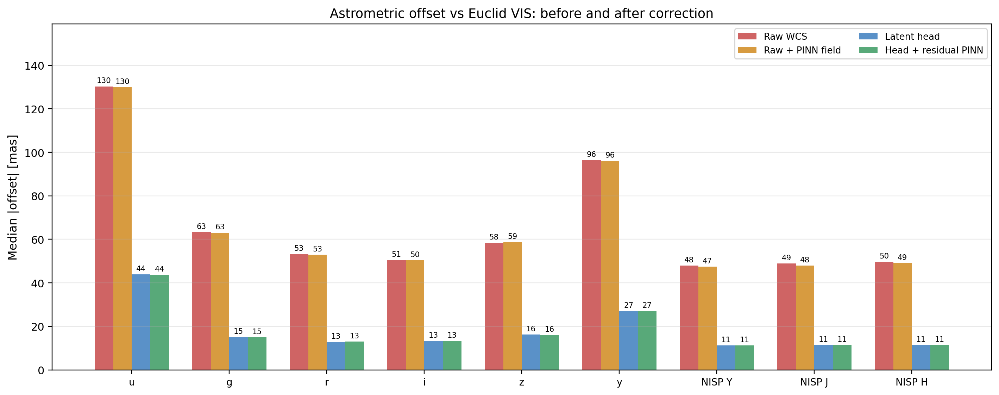
*Notebook 07 Part 1 -- CenterNet anchor cache, 491,748 source-band measurements. Raw / Raw+PINN / Head / Head+PINN medians per band. After the head, the residual PINN field changes medians by ≤0.2 mas on every band.*

##### Test 2 -- Detector vs head credit separation (Parts 1b, 4a)

**Question**: how much of the gain comes from CenterNet vs from the head?

The two contributions are separable. Combined-pool field RMS goes from **5.72 mas (classical, raw)** to **1.00 mas (CenterNet, head_resid)** -- CenterNet alone knocks ~0.9 mas off the raw field, the head knocks another ~3–4 mas off. Combined-gain numbers: **80.8 % (all SNR)** and **35.4 % (SNR ≥ 30)**.

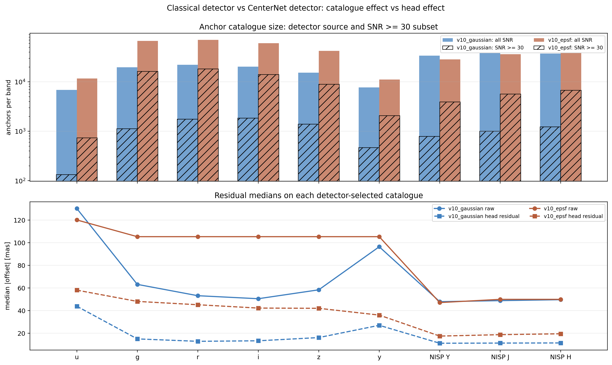
*Part 1b -- classical vs CenterNet anchor pools, raw and head columns separated.*

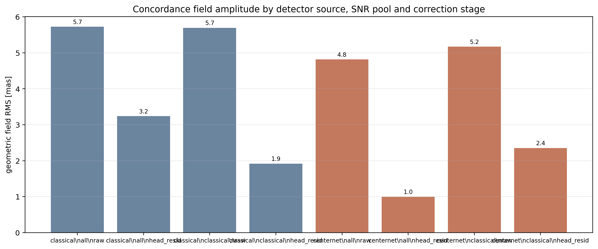
*Part 4a -- field-RMS panel for the 2×2 of `(classical / CenterNet) × (raw / head_resid)`. The detector and head contributions are additive and must be reported separately.*

##### Test 3 -- SNR-stratified PINN refits (Part 4)

**Question**: does the smooth field amplitude depend on which anchors we feed in?

Stratify the 9-band CenterNet anchor pool by per-band SNR terciles, refit PINN jointly across bands per slice, on raw and on head-residual offsets:

| Slice | kind | N | raw med | resid med | field RMS | field p95 |
|---|---|---:|---:|---:|---:|---:|
| all | raw | 491,748 | 39.8 | 39.3 | 1.6 | 2.3 |
| classical SNR≥30 | raw | 34,510 | 11.6 | 11.0 | **3.8** | 7.2 |
| top tercile | raw | 163,903 | 22.4 | 21.3 | 8.4 | 14.7 |
| middle tercile | raw | 163,943 | 42.2 | 41.8 | 2.8 | 3.8 |
| bottom tercile | raw | 163,902 | 59.8 | 59.5 | 10.4 | 11.9 |
| all | head_resid | 491,748 | 8.5 | 8.7 | **2.0** | 2.1 |
| classical SNR≥30 | head_resid | 34,510 | 7.7 | 8.2 | 1.9 | 2.2 |
| top tercile | head_resid | 163,903 | 7.6 | 7.9 | 1.2 | 1.6 |
| middle tercile | head_resid | 163,943 | 8.8 | 9.2 | 3.4 | 3.8 |
| bottom tercile | head_resid | 163,902 | 9.3 | 9.6 | 2.8 | 3.8 |

**Bright-only raw recovers the ~5 mas reference** (classical SNR ≥ 30: 3.8 mas, brightest tercile: 8.4 mas -- the tercile is dominated by *brighter* faint stars and overshoots). **All head_resid slices sit near 1–2 mas**, regardless of where on the SNR ladder we sample -- the head has removed the coherent signal and the PINN has nothing left to fit.

##### Test 4 -- Bootstrap and shuffled-null significance (Part 4b)

**Question**: are the recovered field amplitudes statistically real?

Bootstrap each slice five times for a 1σ_boot bar; permute anchor positions while keeping offsets to measure the noise floor (the "shuffled-null"). Real RMS / null RMS is the cleanest single-number significance.

| Slice | raw signal/null | head_resid signal/null |
|---|---:|---:|
| all | 0.7× | 0.8× |
| classical SNR ≥ 30 | 0.5× | 1.4× |
| top tercile | 1.4× | 1.8× |
| middle tercile | 1.4× | 1.7× |
| bottom tercile | 0.6× | 1.2× |

The all-anchor and bottom-tercile slices are noise-dominated. **The classical SNR ≥ 30 raw signal/null of 0.5× is the surprising result**: bright-only raw RMS is *not* statistically distinguishable from the shuffled-null on this anchor pool. Smooth-field detection on this geometry rests on the *structured* / physics-prior solvers (PINN, NN, super-tight HGP), not on raw bright-only RMS.


*Part 4b -- bootstrap field RMS with 1σ_boot bars (filled) vs shuffled-null floor (×) per SNR slice. Squares = head_resid, circles = raw. A real measurement sits well above its null cross with a small fractional bootstrap σ.*

##### Test 5 -- Single-kernel GP cross-check (Part 4c) -- *negative result*

**Question**: does an independent Gaussian Process with a calibrated kernel agree with PINN?

On the i band, classical SNR ≥ 30, 1,200 anchors, with an RBF + white-noise kernel:

- The kernel hits its **15 arcsec lower length-scale bound** (three sklearn `ConvergenceWarning`s on length scale, constant amplitude, and noise level -- the optimiser cannot find a data-preferred scale).
- GP field RMS: **15.53 mas** vs PINN's **10.29 mas**.
- Vector-difference RMS: **15.57 mas** (dRA 10.43, dDec 11.56) -- the methods disagree at the same scale as the GP signal itself.
- Hold-out z-score std: **1.39** (target 1.0) -- the GP is under-calibrated.

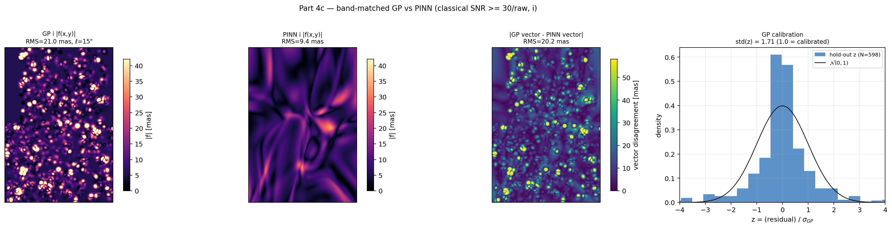
*Part 4c -- GP field, PINN field, GP–PINN difference, hold-out z-score histogram. The GP fails its own calibration and disagrees with PINN at ~5 mas. Read this as a model-mismatch warning, not as confirmation.*

This is **why notebook 12 brings in HGP**. A single-kernel GP at one length scale cannot represent the actual field structure on this geometry; a hierarchical multi-scale Bayesian model can.

##### Test 6 -- Anchor leverage and per-source precision (Part 3b)

**Question**: how does the head change the anchor density available for a smooth-field fit, and how good is each anchor?

Bin anchors on a 1 arcmin × 1 arcmin grid (the natural correlation-length scale for a smooth WCS distortion). Per-band median density and per-source MADxy improvement:

| Band | bright (SNR≥30) per arcmin² | head-enabled (all SNR) | density gain | MADxy gain (raw → head) |
|---|---:|---:|---:|---:|
| rubin_u | 0 | 16 | ∞ | 5.3× |
| rubin_g | 5 | 80 | 16× | 5.0× |
| rubin_r | 8 | 95 | 11.9× | 4.5× |
| rubin_i | 10 | 82 | 8.2× | 4.0× |
| rubin_z | 7.5 | 57 | 7.6× | 3.8× |
| rubin_y | 2 | 23 | 11.5× | 4.0× |
| nisp_Y | 4 | 148 | 37× | 4.7× |
| nisp_J | 4 | 164 | 41× | 4.6× |
| nisp_H | 5 | 158 | 31.6× | 4.6× |

For i band: faint:bright = 3.7× (faint <10 SNR: 23,964; mid: 18,502; bright ≥30: 6,526). The head turns **8–41× more anchors per arcmin²** into useful field constraints.


*Part 3b -- per-band anchor density at SNR ≥ 30 vs all-SNR (left); cell-coverage curve for i band (right). The classical curve falls off rapidly; the head-enabled curve maintains tens of anchors per cell across 95 % of the field.*

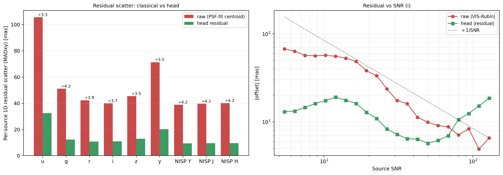
*Per-source precision floor (Part 3b). Left: median MADxy per band, raw vs head -- improvement factors 3.8–5.3×. Right: median MADxy vs SNR for raw anchors, with the King 1983 floor `FWHM/(2.35·SNR)` overlaid. The head reaches a flat ~8 mas regime well below the SNR-dependent classical floor for all but the brightest anchors.*

##### Test 7 -- Sparse-field recovery, source-disjointly (Part 5)

**Question**: in a sparse field with too few bright anchors for a classical concordance fit, can the head's predictions on faint sources stand in?

Fit the head-implied non-classical field -- `raw − head_resid` smoothed via PINN, only on `SNR < 30` anchors (457,238 sources) -- and compare it to the classical bright-only field (`SNR ≥ 30`) which uses *disjoint* anchors. Results:

- Head-implied non-classical field RMS: **2.4 mas**.
- Vector RMS vs classical bright-only: **4.79 mas**.
- Median vector disagreement: **4.20 mas**.

The two fields use disjoint anchor sets, so this is not the trivial "head_pred resembles raw because head_pred is defined from raw and head_resid". It is direct evidence that head predictions on faint sources reconstruct the same smooth concordance field that bright stars recover classically.

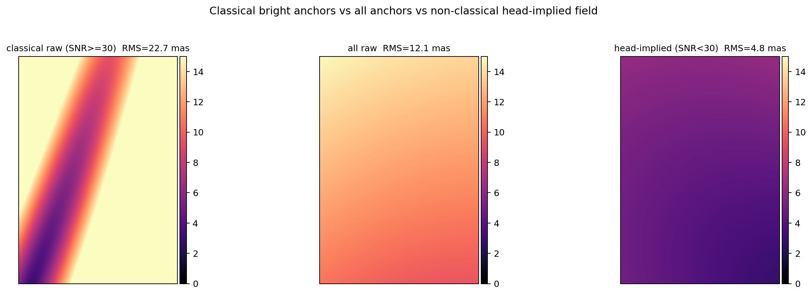
*Part 5 source-disjoint sparse-field test. The head-implied non-classical field reproduces the classical bright-only field within ~5 mas vector RMS, on completely disjoint anchor pools.*

The takeaway: in a sparse field where bright stars are too few to fit a smooth WCS distortion directly, the head can stand in. It converts faint sources into effective anchors, and its averaged predictions are a usable proxy for the classical concordance measurement. This generalises the head's role from *per-object correction for forced photometry* to *concordance-grade WCS measurement in fields without enough bright stars*.

---

#### Tests on the smooth field (notebook 12)

Notebook 12 (`io/12_astrometry_hgp_vs_pinn.ipynb`) brings in HGP as the proper Bayesian cross-validator that the single-kernel GP could not be. It compares HGP and PINN on the same CenterNet anchor cache (`anchors_centernet.npz`), on raw and head-residual offsets, in nine sections.

##### Test 1 -- Loose-prior holdout calibration (§1)

**Question**: is the published HGP product (`concordance_hgp_head_resid_richer.fits`, length scales 45/120/300/900 arcsec, priors 25/12/6 mas) self-consistent?

The sidecar JSON answers no:

| Metric | Value |
|---|---:|
| `train_resid_med` | 7.69 mas |
| `holdout_resid_med` | 10.85 mas |
| Hold-out z-score std `(dRA, dDec)` | (1.65, 1.68) |
| Calibration factor | 1.67 |

Train ≪ holdout (a 40 % gap) and z-score std at ~1.7 (target 1.0) means the loose-prior posteriors are not self-consistent on a held-out spatial fold. **The on-disk product cannot be used as published.** The super-tight refit closes this gap.

##### Test 2 -- HGP head-residual vs PINN head-residual maps (§2–§3)

**Question**: on head-residual anchors, how does HGP compare to PINN per band?

Same supported pixels (86–93 % of the grid mask, defined by nearest-anchor < 30 arcsec):

| Band | Support frac | HGP RMS (mas) | PINN head_resid RMS (mas) | `\|HGP − PINN\|` (mas) | PINN raw RMS (mas) |
|---|---:|---:|---:|---:|---:|
| u | 0.862 | 6.17 | 1.18 | 6.18 | 5.80 |
| g | 0.925 | 3.01 | 0.79 | 2.86 | 4.62 |
| r | 0.925 | 2.63 | 0.83 | 2.47 | 4.61 |
| i | 0.925 | 2.64 | 0.85 | 2.46 | 5.02 |
| z | 0.924 | 3.07 | 0.98 | 2.82 | 4.64 |
| y | 0.919 | 5.43 | 1.41 | 5.05 | 4.27 |
| NISP Y | 0.926 | 1.75 | 0.85 | 1.52 | 7.13 |
| NISP J | 0.926 | 1.70 | 0.89 | 1.46 | 7.40 |
| NISP H | 0.926 | 1.69 | 0.81 | 1.48 | 6.86 |

PINN head_resid is consistently **0.8–1.4 mas** (essentially zero residual smooth field). HGP head_resid shows several-mas amplitude in some bands -- this is residual prior ringing, not residual signal. `|HGP − PINN|` is comparable to the HGP RMS in non-NISP bands: when there is nothing to fit, the two methods can disagree at the few-mas level just from prior mismatch. NISP bands are the cleanest (smoother field, more anchors).

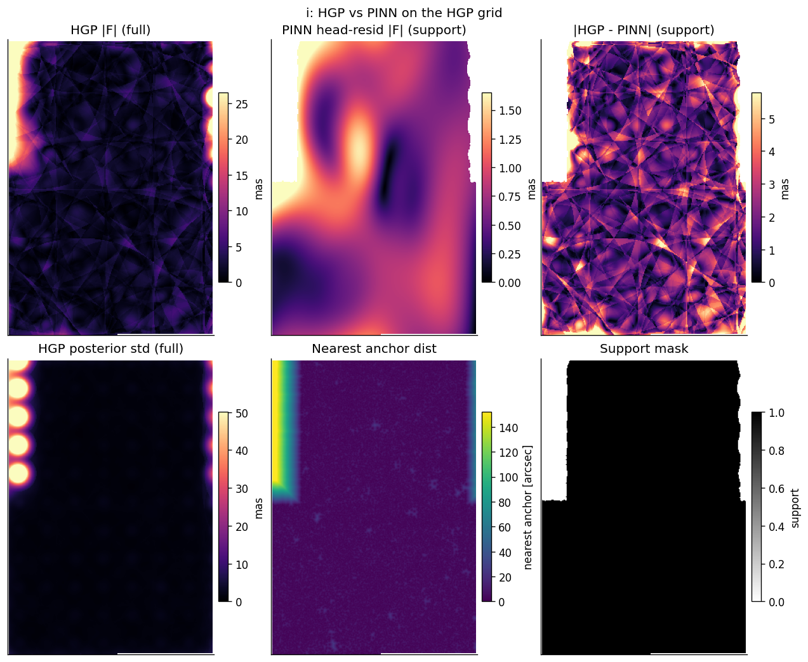
*§3 -- HGP, PINN, and `|HGP − PINN|` on head-residual anchors (i band). Bottom: HGP posterior radial std and supported-pixel mask. PINN sits at ~0.85 mas RMS on the supported pixels; HGP shows several-mas prior ringing.*

##### Test 3 -- HGP raw with default loose priors (§6)

**Question**: how does default-prior HGP compare to PINN on *raw* anchors, where there is a real ~5 mas field to fit?

| Solver | u | g | r | i | z | y | Y | J | H |
|---|---:|---:|---:|---:|---:|---:|---:|---:|---:|
| PINN raw RMS (mas) | 5.83 | 4.63 | 4.62 | 5.02 | 4.64 | 4.28 | 7.13 | 7.41 | 6.86 |
| HGP loose RMS (mas) | 12.4 | 7.11 | 6.59 | 7.05 | 6.84 | 8.10 | 8.78 | 9.21 | 8.82 |
| `\|HGP − PINN\|` (mas) | comparable to PINN itself in worst bands | | | | | | | | |

HGP overshoots PINN by 4–5 mas in the worst bands and produces visible per-tile criss-cross structure that PINN's curl-free + Laplacian + band-consistency physics priors correctly suppress.

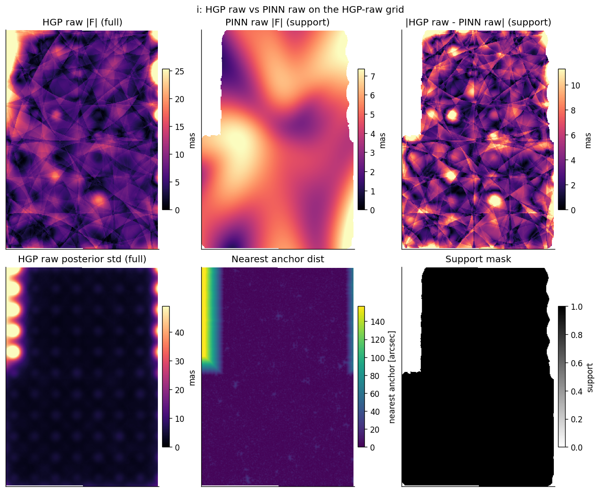
*§6 i band -- top row: HGP, PINN, `|HGP − PINN|`. Bottom row: HGP posterior radial std, supported-pixel mask. The criss-cross ridges are a basis-function artefact (see §7c); the PINN priors suppress them.*

##### Test 4 -- Prior-sensitivity ladder (§7, §7b)

**Question**: how much can HGP recover by tightening priors?

| Configuration | length scales (arcsec) | priors common/group/band (mas) | g-band HGP RMS | `\|HGP-PINN\|` g | weighted Δ (anchor) |
|---|---|---|---|---|---|
| Loose (default) | 45, 120, 300, 900 | 25 / 12 / 6 | 7.11 mas | 5.9 mas | 0.6935 mas |
| Tight | 120, 300, 900 | 8 / 6 / 4 | 5.41 mas | 3.9 mas | 0.6011 mas |
| Super-tight | 300, 900 | 4 / 2 / 1 | 4.07 mas | 2.1 mas | 0.5147 mas |
| PINN reference | (curl-free + Laplacian) | n/a | 4.63 mas | 0 mas | 0.4851 mas |

At super-tight priors, HGP raw RMS lands within **1.6–2.3 mas of PINN** for Rubin g/r/i/z and NISP Y/J/H. The criss-cross structure visible at loose priors disappears once the short basis scales (45 and 120 arcsec) are removed. **HGP can serve as a like-for-like cross-validator on the smooth field -- but only at degree-scale priors that match PINN's effective resolution.** u-band remains the hardest (low SNR + sparse anchors, |HGP−PINN| ~5 mas at all settings); y-band is borderline (~3.5 mas).

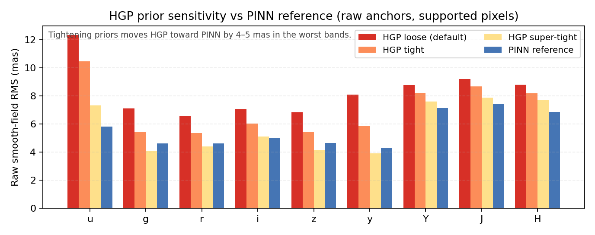
*HGP raw RMS per band at three prior settings versus the PINN reference. Loose priors overshoot by 4–5 mas in the worst bands; super-tight closes the gap to ≤2.3 mas for Rubin g/r/i/z and NISP Y/J/H.*

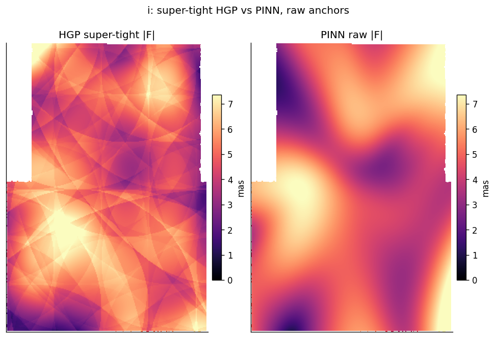
*§7b i band -- super-tight HGP raw fit (length scales 300/900 arcsec, priors 4/2/1 mas) next to the PINN raw fit on the same grid. The two large-scale fields agree to ~2 mas RMS.*

##### Test 5 -- Anchor density vs HGP basis lattice (§7c)

**Question**: is the residual super-tight HGP criss-cross driven by data clumping or by the basis function geometry?

Bin actual anchor positions on the same 5 arcsec mesh as the HGP grid and overlay the high-density contours on the HGP field. The bright HGP ridges sit *between* basis centres at the 300 arcsec spacing, *not* on the high-density anchor regions. The criss-cross is therefore a finite-rank basis-function lattice -- saddle ridges between RBF centres -- not a data-driven structure (multi-tile detections, anchor clumps).

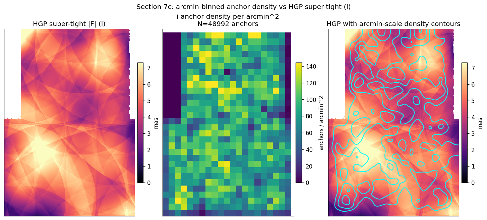
*§7c i band -- HGP super-tight `|F|` (left), arcmin-binned anchor density (centre), HGP map with density contours overlaid (right). The bright HGP ridges do not track the high-density regions.*

##### Test 6 -- Lattice-smoothing direct test (§8)

**Question**: how much of the super-tight HGP–PINN disagreement is the basis lattice, and how much is genuine prior difference?

Gaussian-smooth the super-tight HGP at 75 arcsec (≈ 1/4 the 300 arcsec basis spacing) and recompute the comparison:

| Band | super-tight HGP–PINN (mas) | smoothed HGP–PINN (mas) | Δ (mas) |
|---|---:|---:|---:|
| u | 5.07 | 4.98 | 0.09 |
| g | 2.12 | 1.94 | 0.18 |
| r | 1.83 | 1.65 | 0.18 |
| i | 2.09 | 1.89 | 0.20 |
| z | 2.28 | 2.09 | 0.19 |
| y | 3.54 | 3.44 | 0.10 |
| NISP Y | 1.67 | 1.51 | 0.16 |
| NISP J | 1.61 | 1.43 | 0.18 |
| NISP H | 2.07 | 1.79 | 0.28 |

**Lattice ringing accounts for ~0.1–0.3 mas; the remaining 1.4–3.4 mas is genuine prior difference** between HGP's hierarchical-Gaussian basis and PINN's curl-free + Laplacian + band-consistency physics. Per-component scatter shows ΔRA* tracking PINN well while ΔDec is squeezed into a narrower PINN range and a wider HGP range -- PINN's curl-free coupling forces a particular RA/Dec partition that HGP doesn't impose.

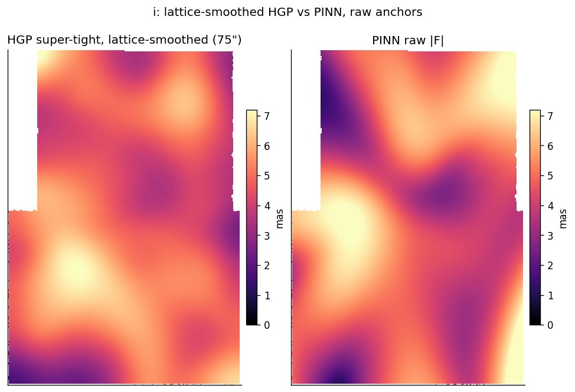
*§8 i band -- super-tight HGP after a 75 arcsec Gaussian smoothing (≈ 1/4 of the 300 arcsec basis spacing) next to PINN on the same raw grid. The smoothed map matches PINN visually, but `|HGP − PINN|` drops by only ~0.2 mas -- the bulk of the residual is genuine prior difference, not lattice ringing.*

##### Test 7 -- Anchor-level convergence ladder (§5–§6)

**Question**: at the actual anchor positions (not on the gridded field map), how much does each solver improve the median residual?

Source-weighted median improvement, raw anchors:

| Solver | weighted median Δ (mas) | gap vs PINN (mas) |
|---|---:|---:|
| HGP loose (published default) | 0.6935 | +0.208 |
| HGP tight | 0.6011 | +0.116 |
| HGP super-tight | 0.5147 | +0.030 |
| PINN reference | 0.4851 | 0 |

After the head, the same comparison gives **HGP 0.011 mas vs PINN 0.027 mas**: the head has consumed the smooth signal, and both solvers reduce to noise-floor improvements.

The **25–70× gap between raw and head-residual anchor-level improvements** is the cleanest single-number evidence that the head absorbed a real ~5 mas coherent component -- the smooth-field correction is large where it should be (raw) and vanishingly small where the head has done the work.

##### Test 8 -- Hierarchical decomposition (§4)

**Question**: how does the smooth field break down into instrument-shared, instrument-group, and per-band components?

The on-disk loose-prior product gives:

| Component | Loose-prior RMS (mas) |
|---|---:|
| COMMON (all bands) | 5.43 |
| GROUP_RUBIN | 2.28 |
| GROUP_NISP | 1.72 |
| BAND_u | 5.59 |
| BAND_g/r/i/z | 1.64–1.86 |
| BAND_y | 3.59 |
| BAND_NISP_Y/J/H | 0.64–0.74 |

COMMON carries most of the WCS/concordance signal (5.4 mas, matches the smooth-field amplitude in test 3). At super-tight priors the inflated tiers (BAND_u, BAND_y) compress to ≤2 mas while COMMON stays similar. Note that BAND_u and BAND_y inflation under loose priors is partly real (low SNR / sparse anchors) and partly noise absorbed via the 45 arcsec basis -- the super-tight fit separates these.

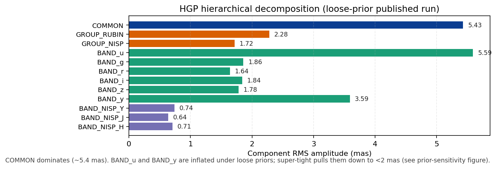
*§4 -- HGP hierarchical decomposition under loose priors. COMMON (5.4 mas) carries the WCS/concordance signal; GROUP_RUBIN (2.3 mas) and GROUP_NISP (1.7 mas) capture the instrument-level differential; BAND_u (5.6 mas) and BAND_y (3.6 mas) are inflated under loose priors. Super-tight priors compress the inflated tiers to ≤2 mas.*

##### Test 9 -- Three-way concordance on the tile grid (notebook 06/07 hand-off)

The original 9-band × 4-column concordance comparison shows the role each solver plays per band: per-source raw anchors → PINN-fit-to-raw → per-source head-residual anchors → PINN-fit-to-head-residual.


*Per-band four-panel breakdown across the tile grid. Columns: raw per-source anchors → PINN fit to raw → head-residual anchors → PINN fit to head residuals. The PINN-raw column shows a coherent ~5 mas structured field; after the head runs, the residual anchors look like scatter and the PINN fit to them is ~1 mas.*

---

#### Conclusions

**The headline numbers.** The v8 latent position head reduces the median radial Rubin–VIS source offset by **74–79 %** across all bands. Rubin g/r/i/z and NISP Y/J/H reach **9–11 mas median** on the classical anchor cache; **8–9 mas** on the CenterNet cache. Rubin y is **14.7 mas / 12.5 mas** (classical / CenterNet), Rubin u is **30.5 mas / 23.4 mas**.

**The head is the correction, the smooth field is QA.** After the head, the residual smooth field is **~1 mas** (PINN head_resid), the anchor-level improvement is **0.011–0.027 mas**, and applying the smooth field changes per-source medians by ≤0.2 mas on every band. The smooth field is a diagnostic and a fallback for sparse fields, not a production correction layer.

**The raw smooth field is real at ~5σ per pixel and detected by three converging structured methods.** PINN, NN, and super-tight HGP agree on the raw smooth field amplitude within ~1.5 mas RMS and on the anchor-level improvement within 0.03 mas. Super-tight HGP gives a calibrated posterior std of **1.0–1.1 mas** median over a **~5 mas** field -- a ~5σ per-pixel detection. The single-kernel GP from notebook 07 is *not* in this convergence list: it failed its own calibration (std(z) = 1.39, kernel hits 15 arcsec bound, RMS disagrees with PINN by ~5 mas). The bright-only raw signal/null of 0.5× shows that smooth-field detection rests on the structured priors, not on bright-only RMS.

**HGP is a QA / model-selection layer, not a correction product.** HGP delivers per-pixel posterior uncertainty, spatial-holdout calibration, instrument/band attribution, and an overfitting check -- none of which PINN provides. But HGP is prior-sensitive: the published loose-prior product (`concordance_hgp_head_resid_richer.fits`) fails its own holdout calibration (calibration factor 1.67, train ≪ holdout) and overshoots PINN by 4–5 mas in the worst bands. **Cross-validation requires super-tight priors** (length scales 300/900 arcsec, hierarchy 4/2/1 mas). Even at super-tight, ~1.5 mas of residual HGP–PINN disagreement is genuine prior difference (only ~0.3 mas is the basis-function lattice), so HGP and PINN should be reported as two complementary models, not a single agreed-upon field. HGP graduates to a correction product only if it beats the zero-field baseline on held-out post-head anchors -- currently it does not.

**The head also enables sparse-field WCS measurement.** The head-implied non-classical field (smoothed `raw − head_resid` on `SNR < 30` anchors only) reproduces the classical bright-only field within **~5 mas vector RMS** on disjoint anchor pools. In a field with too few bright stars to fit a classical concordance, the head's predictions on faint sources stand in. Density gain at 1 arcmin²: **8–41× more anchors** in the head-enabled pool than in the bright-only pool.

**Detector and head credit must be reported separately.** The CenterNet anchor pool (491,748 source-band measurements) is a different, better-selected source pool than the classical pool (630,120 source-band measurements) -- not a superset. CenterNet alone reduces the field RMS by ~0.9 mas; the head reduces it by another ~3–4 mas. Combined-pool field RMS goes from **5.72 mas (classical, raw)** to **1.00 mas (CenterNet, head_resid)**. Headline phrasing should always specify which anchor cache is used.

**Operational rules-of-thumb.**
- Train and evaluate the head with **Gaussian-fit photon centroids**, never PSFField-refined centroids (the latter creates a 16 mas target/feature mismatch and a 29 mas plateau).
- Use **`bottleneck_window=5`** even on v8 -- the auto-scaling 11×11 default dilutes the signal.
- Use **PINN/NN/control-grid** for the smooth-field diagnostic and **super-tight HGP** for the calibrated cross-check; do not use loose-prior HGP for cross-validation.
- The **`SNR ≥ 30`** classical-anchor cut is calibrated to the King 1983 floor at 0.7 arcsec FWHM (~10 mas centroid precision). If a result depends strongly on it, rerun with `SNR ≥ 50` and `SNR ≥ 100`.

---

#### Implementation reference

##### Files

| File | Description |
|------|-------------|
| `matcher_v7.py` | V7-based patch matcher (frozen V7 BandStems + optional stream stages + trainable adapters, per-pixel RMS support) -- historical concordance experiments. |
| `dataset.py` | Patch + RMS extraction, WCS matching, CenterNet detector integration, rotation/flip augmentation. |
| `source_matching.py` | Classical peak-finding, WCS-based source matching, PSF-fit centroiding, SNR estimation. |
| `field_solver.py` | Control-grid least-squares field solver. |
| `nn_field_solver.py` | MLP-based field solver. |
| `pinn_field_solver.py` | Physics-Informed NN field solver (curl-free, Laplacian, band consistency). |
| `fit_direct_pinn.py` | Direct concordance from raw or head-residual anchors. Dispatches to PINN (`--solver pinn`, default) or NN (`--solver nn`). |
| `fit_hierarchical_gp_concordance.py` | Hierarchical GP concordance with posterior uncertainty maps and spatial-holdout calibration. QA / model-selection only. |
| `train_astro_v7.py` | Training script (V7 backbone, CenterNet or classical sources). |
| `infer_concordance.py` | Per-tile inference → FITS export. |
| `infer_global_concordance.py` | Global multi-tile concordance fitting. |
| `apply_concordance.py` | Apply fitted concordance fields to data. |
| `sky_cube.py` | 10-band sky cube extraction; can apply a smooth concordance field when requested. |
| `latent_position_head.py` | Latent-space canonical position head for per-object multi-band alignment. |
| `train_latent_position.py` | Training script for the latent position head. |
| `eval_latent_position.py` | Cross-instrument eval: align all 9 bands to VIS, per-band metrics, anchor export. |
| `viz.py` | Diagnostic visualisations. |

##### End-to-end v8 pipeline (commands)

```bash
# 1. Train the latent position head on the v8 foundation.
CUDA_VISIBLE_DEVICES=0,1 PYTHONPATH=models python models/astrometry2/train_latent_position.py \
    --rubin-dir        data/rubin_tiles_all \
    --euclid-dir       data/euclid_tiles_all \
    --foundation-checkpoint models/checkpoints/jaisp_v8_fine/checkpoint_best.pt \
    --output-dir       models/checkpoints/latent_position_v8_no_psf \
    --epochs 30 --bottleneck-window 5 --dual-gpu \
    --wandb-project JAISP-LatentPosition

# 2a. Classical-detector cross-instrument evaluation + export anchors.
PYTHONPATH=models python models/astrometry2/eval_latent_position.py \
    --rubin-dir        data/rubin_tiles_all \
    --euclid-dir       data/euclid_tiles_all \
    --foundation-checkpoint models/checkpoints/jaisp_v8_fine/checkpoint_best.pt \
    --head-checkpoint  models/checkpoints/latent_position_v8_no_psf/best.pt \
    --save-anchors     models/checkpoints/latent_position_v8_no_psf/anchors.npz \
    --output-dir       models/checkpoints/latent_position_v8_no_psf/eval

# 2b. CenterNet-detector evaluation + export anchors for the high-density downstream pipeline.
PYTHONPATH=models python models/astrometry2/eval_latent_position.py \
    --rubin-dir        data/rubin_tiles_all \
    --euclid-dir       data/euclid_tiles_all \
    --foundation-checkpoint models/checkpoints/jaisp_v8_fine/checkpoint_best.pt \
    --head-checkpoint  models/checkpoints/latent_position_v8_no_psf/best.pt \
    --detector-checkpoint checkpoints/centernet_v8_fine/centernet_best.pt \
    --save-anchors     models/checkpoints/latent_position_v8_no_psf/anchors_centernet.npz \
    --output-dir       models/checkpoints/latent_position_v8_no_psf/eval_centernet

# 3a. Fit PINN-smoothed raw-anchor concordance field (QA / fallback).
PYTHONPATH=models python models/astrometry2/fit_direct_pinn.py \
    --cache   models/checkpoints/latent_position_v8_no_psf/anchors.npz \
    --output  models/checkpoints/latent_position_v8_no_psf/concordance_pinn_raw_fixed.fits \
    --bands r i g z --include-nisp

# 3b. Fit the head-residual field (should be ~1 mas if the head removed the coherent term).
PYTHONPATH=models python models/astrometry2/fit_direct_pinn.py \
    --cache   models/checkpoints/latent_position_v8_no_psf/anchors.npz \
    --use-head-resid \
    --output  models/checkpoints/latent_position_v8_no_psf/concordance_pinn_head_resid_fixed.fits \
    --bands r i g z --include-nisp

# 3c. CenterNet PINN fields used by notebook 12.
PYTHONPATH=models python models/astrometry2/fit_direct_pinn.py \
    --cache   models/checkpoints/latent_position_v8_no_psf/anchors_centernet.npz \
    --use-head-resid \
    --output  models/checkpoints/latent_position_v8_no_psf/concordance_pinn_centernet_head_resid.fits \
    --n-steps 4000 --n-collocation 8000 --dstep-arcsec 5 --device cuda

PYTHONPATH=models python models/astrometry2/fit_direct_pinn.py \
    --cache   models/checkpoints/latent_position_v8_no_psf/anchors_centernet.npz \
    --output  models/checkpoints/latent_position_v8_no_psf/concordance_pinn_centernet_raw.fits \
    --n-steps 4000 --n-collocation 8000 --dstep-arcsec 5 --device cuda

# 4. Experimental HGP concordance with posterior uncertainty (super-tight cross-validator settings).
PYTHONPATH=models python models/astrometry2/fit_hierarchical_gp_concordance.py \
    --anchors models/checkpoints/latent_position_v8_no_psf/anchors_centernet.npz \
    --output  models/checkpoints/latent_position_v8_no_psf/concordance_hgp_head_resid.fits \
    --offset-kind head_resid \
    --pool all \
    --length-scales 300,900 \
    --prior-common-mas 4 --prior-group-mas 2 --prior-band-mas 1 \
    --max-centers-per-scale 80 \
    --dstep-arcsec 5 \
    --holdout-frac 0.10 \
    --holdout-mode spatial \
    --holdout-block-arcsec 300 \
    --robust-iters 3 \
    --save-components \
    --write-coverage
```

##### Optional diagnostics not embedded above

The chromatic and morphology diagnostics are kept in `docs/figures/` but not embedded in this section: `astrometry_chromatic_diagnostic.png` (per-band colour-dependent centroid trends), `astrometry_snr_diagnostic.png` (SNR-tail), `astrometry_morphology_diagnostic.png` (galaxy-vs-star centroid scatter). The centring and v8 cross-instrument figures already carry the main story.
### 3. PSF Modelling and Photometry

**Directory**: `models/psf/`

PSF modelling and photometry form the bridge between representation learning and physically interpretable survey products. Detection and astrometry can be evaluated mostly through positions and residuals; photometry must additionally explain the observed pixel intensities under blending, noise, morphology, and PSF convolution. The current implementation therefore keeps several paths alive: a compact-source PSFField matched-filter baseline, a learned v8 photometry head, a scarlet-like residual-scene optimizer, and an experimental rendered-stamp head. These are not redundant implementations; they encode different assumptions about how much physics should remain explicit.

The PSF is a fundamental survey property consumed by three downstream tasks (astrometry centroiding, forced photometry, eventually shape measurement). It lives in its own module rather than under `photometry/` because it is not a sub-concept of any one task.

#### Why PSFs matter for this project

Astrometry2 initially plateaued at 40-50 mas MAE, and notebook 06 traces that raw-anchor residual to **centering / centroid-definition scatter** rather than a missing smooth concordance field. PSF modelling is still important, but the v8 astrometry migration showed that PSFField-refined centroids are not automatically better latent-head labels: used directly as targets they create a ~29-30 mas plateau. The current role of PSFField is PSF diagnostics and future forced photometry, with astrometric label use deferred until the centroid convention is made explicit in a joint PSF+head training loop.

#### PSFField architecture

Continuous, chromatic, spatially-varying PSF field for all 10 bands in one model:

```
f(xy_sub, x_tile, y_tile, band, sed) → intensity
```

- **Continuous** (SIREN-based, Sitzmann et al. 2020). The PSF is represented as an implicit function in arcsec coordinates, not a discretised stamp. Querying at sub-pixel offsets is exact rather than interpolated. This is what makes the next two items clean.
- **Pixel integration**: when comparing to data, each data pixel is integrated by evaluating the PSF on a K×K sub-grid (K=4) inside the pixel footprint. Rubin pixels integrate 0.2"×0.2" boxes, Euclid 0.1"×0.1". Same PSFField handles both with physically correct sampling.
- **Chromatic**: a per-source SED embedding (from the 10-band flux vector) conditions the SIREN. The PSF shape inside each band depends on the source's SED -- a hot blue star has a slightly sharper r-band PSF than a cool red star in the *same* r filter, because the filter isn't monochromatic.
- **DCR term**: a small learnable 6×2 parameter block applies a colour-dependent centroid shift in Rubin bands only (space-based Euclid is immune). Captures residual differential chromatic refraction in stacked mosaics as a linear function of g−i colour.

`render_stamps(...)` produces pixel-integrated PSF stamps in batch for N stars in one band.

#### Training: jointly learn PSF *and* sub-pixel centroids

The centroid-smearing bug in naive PSF fitting is: stars are extracted at integer-pixel detection peaks, so each stamp has a random ~0.5-pixel sub-pixel offset. Averaging chi² over many stars trains the model to reproduce a PSF *convolved with the centroid-error distribution* -- broader than the real PSF.

The fix is structural, not procedural: each star carries a **learnable sub-pixel centroid** as an `nn.Parameter`, optimised jointly with the SIREN via SGD. The converged centroids are by construction the sub-pixel refinement PSF-fitting gives you -- astrometric labels fall out of PSF training for free.

Star selection (`models/psf/star_selection.py`):

1. **VIS-based detection** (sharpest PSF, no seeing variation, cleanest stellar locus). Candidates come from either CenterNet v8 pseudo-labels or classical `_pseudo_labels_vis` -- both include bright-core detection and diffraction-spike masking.
2. **2D moment fit** on each candidate for FWHM and sub-pixel centroid.
3. **Stellar locus cut**: keep `|FWHM − median| < 8% × median` -- the locus is a pencil-thin stripe in VIS because the VIS PSF is so sharp.
4. **Isolation cut**: no neighbour within 3".
5. **Per-band saturation cut**: reject stars whose peak pixel in any band falls in the top 5% for the tile.
6. **Cross-match VIS → Rubin via WCS** and extract 10-band stamps at sub-pixel positions (`F.grid_sample`).

Robust training (`models/psf/train_psf_field.py`):

- **Heteroscedastic χ² with variance floor**: `σ² ≥ (0.02 × peak)²` caps per-pixel SNR at 50. Without this, bright bands have so little Poisson noise that any 2% PSF imperfection explodes χ².
- **Huber loss**: per-pixel contributions switch from quadratic to linear at 3σ. Outlier pixels (cosmic rays, saturated spikes, binary companions) still contribute but stop dominating the gradient.
- **Percentile outlier rejection**: after epoch 12, reject the worst 10% of stars (ranked by median across-band χ²). Drops the irreducible bad detections (blends, binaries that survived isolation).
- **SED refresh every 5 epochs**: re-estimate each star's 10-band SED from analytic optimal fluxes. Chromatic PSF conditioning improves as the PSF improves.
- **Gradient sanitisation**: `nan_to_num_` per-parameter before gradient clipping. Without this, any single Inf in a gradient turns the global `clip_grad_norm_` into a divide-by-Inf that zeros every other param -- poisoning the step with NaN.

#### Results (v3 checkpoint)

The current checkpoint is `models/checkpoints/psf_field_v3.pt` (epoch 59, SIREN 192-wide × 6-deep, stamp 25 px). The v3 diagnostics in `models/checkpoints/psf_field_v3_diag/` evaluate 451 validation stars across 60 tiles:

| Metric | v2 | v3 current |
|---|---:|---:|
| χ²/ndof median, rubin_r | 2.23 | 2.89 |
| χ²/ndof median, rubin_i | 1.87 | 2.20 |
| χ²/ndof median, euclid_VIS | 3.27 | 3.69 |
| χ²/ndof median, euclid_Y / J / H | 2.20 / 3.59 / 0.56 | **0.28 / 0.45 / 0.61** |
| Centroid drift median | 16.0 mas | **14.6 mas** |
| VIS model FWHM | 0.338" | **0.319"** |

V3 tightens the centroid drift and NISP residuals but leaves VIS and some Rubin bands above χ²/ndof ≈ 1, so PSFField remains a strong photometry/diagnostic product rather than the current astrometry target convention.

#### Diagnostics

`models/psf/validate_psf_field.py` produces:

- χ²/ndof histograms per band
- Centroid-drift distribution
- Radial profile model-vs-data per band
- Random stamp gallery with data / model / residual panels
- DCR coefficients table

#### Notebook

`io/08_psf_visualization.ipynb` renders the per-band median PSF and its spatial variation across the tile (3×3 grid of tile positions).

#### Photometry heads

Photometry now has two complementary paths:

- **PSFField matched-filter photometry**: `models.photometry.PSFFieldPhotometryPipeline` renders PSFField templates and applies the vectorized matched-filter estimator in `models/photometry/forced_photometry.py`. This is the compact-source baseline and the fastest way to validate positions, noise maps, PSF sampling, and per-band flux extraction.
- **V8 foundation photometry head**: `models/photometry/foundation_head.py` is the learned downstream head. It consumes CenterNet detections after latent-head astrometry correction, extracts frozen V8 bottleneck + VIS-stem features, predicts morphology refinements, solves per-band fluxes through the renderer, and trains by local scene residual chi-square.
- **Scarlet-like residual optimizer**: `models/photometry/scarlet_like.py` fits local blend scenes with non-negative VIS morphology templates, PSF-convolved per-band rendered templates, non-negative per-band fluxes, and an explicit noise-weighted residual loss. This is a baseline/refinement reference for galaxies and blends where a pure PSF template should leave structured residuals.
- **RenderedStampHead experiment**: `models/photometry/rendered_stamp_head.py` predicts per-source, per-band positive unit-sum rendered stamps directly from frozen V8 features, with no explicit PSF, morphology template, or convolution step. The latest local checkpoint is `models/checkpoints/rendered_stamp_v2_bigstamp/checkpoint_best.pt` (stamp size 71, 200-tile run). Treat this as an experimental end-to-end photometry path, not the default production baseline.

The current learned head is Euclid-native VIS/Y/J/H first, where VIS morphology
and NISP images share the same 0.1"/px grid. Rubin support should either
resample the VIS morphology to Rubin's 0.2"/px native grid or reproject Rubin to
the VIS grid before sharing templates.

`io/09_psf_field_photometry_validation.ipynb` validates the compact-source PSF baseline using a CenterNet VIS master catalog. `io/10_scarlet_like_photometry.ipynb` visualizes the per-scene optimizer. `io/11_foundation_photometry_head.ipynb` loads a trained V8 photometry-head checkpoint and compares learned-head residuals against PSF-only residuals on the same CenterNet + astrometry-corrected catalog.

---

## Project Structure

```
JAISP/
|
+-- README.md                          Short project overview
+-- DOCUMENTATION.md                   This file (full documentation)
+-- requirements.txt                   Python dependencies
|
+-- data/
|   +-- rubin_tiles_all/               Full flat Rubin training tiles (790 tiles, *.npz)
|   +-- euclid_tiles_all/              Full flat Euclid training tiles (790 tiles, *.npz)
|   +-- rubin_tiles_200/               200-tile subset (symlinks, used for downstream training)
|   +-- euclid_tiles_200/              200-tile subset (symlinks, used for downstream training)
|   +-- rubin_tiles_tract5063/         Patch-organized tract5063 tiles (patches 14/15/24)
|   +-- euclid_tiles_tract5063/        Patch-organized tract5063 Euclid tiles
|   +-- cached_features_v8_fine/       Precomputed V8 encoder features for current CenterNet
|   +-- detection_labels/              CenterNet v8 labels for all 790 matched tiles
|   +-- download_tiles_product.sh      Helper for fetching/regenerating the tile product
|
+-- checkpoints/
|   +-- centernet_v8_fine/             Current CenterNet (on jaisp_v8_fine)
|   +-- centernet_v7_rms_aware/        V7 CenterNet baseline
|   +-- stem_centernet_v7_rms_aware_200/ V7 StemCenterNet baseline
|
+-- models/
|   +-- jaisp_foundation_v8.py         V8 fine-scale MAE (current production, 0.4"/px)
|   +-- jaisp_foundation_v7.py         V7 mixed-resolution MAE (prior production baseline)
|   +-- jaisp_foundation_v6.py         V6 single-grid MAE (library, used by V7/V8)
|   +-- jaisp_dataset_v7.py            V7 mixed-resolution split helpers
|   +-- jaisp_dataset_v8.py            V8 random crop + split helpers
|   +-- jaisp_dataset_v6.py            V6 data loader (library, used by downstream)
|   +-- train_jaisp_foundation_v7.py   V7 training entrypoint
|   +-- train_jaisp_foundation_v8.py   V8 training entrypoint (fine-scale + random crop)
|   +-- eval_foundation_v7.py          V7 evaluation/diagnostics
|   |
|   +-- detection/                     Source detection head
|   |   +-- centernet_detector.py      CenterNet model: 8x decoder + heads
|   |   +-- stem_centernet_detector.py Native-resolution stem-based CenterNet
|   |   +-- centernet_loss.py          Focal loss + bounded heatmap targets
|   |   +-- train_centernet.py         CenterNet training (live or cached features)
|   |   +-- train_stem_centernet.py    StemCenterNet training
|   |   +-- precompute_features.py     One-time foundation encoder feature caching (v7 or v8)
|   |   +-- cached_dataset.py          Dataset for cached features + labels
|   |   +-- self_train.py              Self-training: train -> refine -> retrain
|   |   +-- self_train_stem.py         Stem self-training: train -> refine -> retrain
|   |   +-- dataset.py                 Pseudo-labels (VIS + saturation mask)
|   |   +-- detect.png                 Example detection comparison figure
|   |
|   +-- astrometry2/                   Per-object astrometry head + concordance QA fields
|   |   +-- matcher_v7.py              V7 patch matcher (stem + optional stream stages)
|   |   +-- latent_position_head.py    Latent-space canonical position head (per-object alignment)
|   |   +-- dataset.py                 Patch dataset + per-pixel RMS + detector integration
|   |   +-- source_matching.py         Classical detection utilities
|   |   +-- field_solver.py            Control-grid least-squares field solver
|   |   +-- nn_field_solver.py         MLP field solver
|   |   +-- pinn_field_solver.py      PINN field solver (physics-informed)
|   |   +-- fit_direct_pinn.py        Direct PINN from raw centroids
|   |   +-- fit_hierarchical_gp_concordance.py Global HGP-style concordance + uncertainty
|   |   +-- train_astro_v7.py          V7 training script (CenterNet or classical sources)
|   |   +-- train_local_matcher.py     Local matcher training script
|   |   +-- train_latent_position.py   Latent position head training script
|   |   +-- eval_latent_position.py    9-band → VIS cross-instrument alignment eval
|   |   +-- infer_concordance.py       Per-tile inference -> FITS export
|   |   +-- infer_global_concordance.py  Global multi-tile concordance fitting
|   |   +-- apply_concordance.py       Apply fitted concordance fields to data
|   |   +-- sky_cube.py                Aligned 10-band sky cube extraction
|   |   +-- viz.py                     Diagnostic visualizations
|   |
|   +-- psf/                           PSF modelling (consumed by astrometry/photometry)
|   |   +-- psf_field.py               PSFField: SIREN + SED encoder + DCR + pixel integration
|   |   +-- star_selection.py          VIS stellar-locus selection, 10-band stamp extraction
|   |   +-- train_psf_field.py         Joint SIREN + per-star centroid optimisation
|   |   +-- validate_psf_field.py      χ², centroid drift, radial profile, stamp gallery
|   |   +-- run_centernet_detections.py CenterNet inference → VIS-normalised per-tile dets
|   |
|   +-- photometry/                    Forced photometry (uses models/psf)
|   |   +-- psf_field_pipeline.py      PSFField-backed forced photometry
|   |   +-- scarlet_like.py            Positive morphology residual scene optimizer
|   |   +-- foundation_head.py         V8-feature morphology head trained by residual chi-square
|   |   +-- train_foundation_photometry_head.py CenterNet + astrometry-corrected training loop
|   |   +-- rendered_stamp_head.py     End-to-end per-source rendered-stamp photometry experiment
|   |   +-- train_rendered_stamp_head.py RenderedStampHead training loop
|   |   +-- forced_photometry.py       Matched-filter flux estimator
|   |   +-- stamp_extractor.py         Batched postage stamp extraction + local sky estimation
|   |   +-- pipeline.py               End-to-end photometry pipeline
|   |
|   +-- checkpoints/                   Saved model weights
|   |   +-- jaisp_v8_fine/             Current v8 foundation
|   |   +-- latent_position_v8_no_psf/ Current v8 latent astrometry head + anchors
|   |   +-- psf_field_v3.pt            Current PSFField checkpoint
|   |   +-- photometry_foundation_200_fast/ Current learned photometry-head run
|   |   +-- photometry_foundation_200_emppsf/ Empirical-PSF photometry ablation
|   |   +-- rendered_stamp_v2_bigstamp/ Experimental end-to-end rendered-stamp head
|   |   +-- jaisp_v7_concat/           Prior production foundation baseline
|   |   +-- astro_v7_psffit/           Historical V7 astrometry matcher
|
+-- io/                                Data I/O notebooks and scripts
+-- wandb/                             Experiment tracking logs
```

### Notebooks (`io/`)

The notebooks are numbered to reflect a rough pipeline order: data ingestion -> matching -> coverage -> detection -> astrometry -> PSF -> photometry.

| # | Notebook | Purpose |
|---|----------|---------|
| 00 | `00_joint_visual_check.ipynb` | First-principles Euclid+Rubin visual check on one ECDFS region. Motivates the offset scale that the rest of the pipeline removes. |
| 01 | `01_getdata_patch.ipynb` | Per-patch Rubin coadd ingestion with overlapping 512x512 tiles plus matched Euclid VIS+NISP cutouts. Canonical NPZ schema producer. |
| 02 | `02_getdata_tract.ipynb` | Tract-wide variant of 01: loops over every patch in a tract. Used for bulk tile production. |
| 03 | `03_euclid_matching_MER.ipynb` | Euclid MER mosaic alignment to Rubin tiles via `EuclidAligner`; writes per-tile Euclid NPZs. |
| 04 | `04_coverage_map.ipynb` | Coverage stats and tract/patch breakdown for the flat tile set. |
| 05 | `05_detection_comparison.ipynb` | Three detection views overlaid on one VIS tile: classical, V8 + CenterNet (current), V7 + StemCenterNet (legacy comparison). |
| 06 | `06_astrometry_diagnostics.ipynb` | Centering / centroid-noise / SNR / morphology diagnostic study on ~20 sample tiles. Source of the ~50 mas centering finding. |
| 07 | `07_astrometry_before_after.ipynb` | Headline before/after across 790 tiles, 9 non-VIS bands. Bar chart, histograms, 9x4 spatial field grid, classical-vs-CenterNet anchor comparison, SNR-stratified PINN refits, GP cross-check, sparse-field recovery analysis. |
| 08 | `08_psf_visualization.ipynb` | PSFField v3 viz: per-band median PSFs, radial profiles, spatial variation, chromatic blue/red SED comparison. |
| 09 | `09_psf_field_photometry_validation.ipynb` | PSFField forced photometry validation against CenterNet VIS master catalog. |
| 10 | `10_scarlet_like_photometry.ipynb` | Per-scene scarlet-like residual photometry optimizer for galaxies and blends. |
| 11 | `11_foundation_photometry_head.ipynb` | V8 foundation photometry head visualization on Euclid-native scenes; compares learned vs PSF-only residuals. |
| 12 | `12_astrometry_hgp_vs_pinn.ipynb` | Hierarchical GP vs PINN comparison on CenterNet anchors. Headline post-head smooth-field non-detection; HGP prior-sensitivity ladder; lattice-smoothing experiment. |
| 13 | `13_cross_instrument_attribution.ipynb` | Foundation-model diagnostic: input gradient attribution (10×10 matrix) + linear/MLP probes on the bottleneck. Shows v8 routes ~100% of attribution through Euclid VIS as a universal spatial scaffold. Used to motivate v9 architectural changes and to compare v8 vs v9 bottleneck content. |

---

## Quick Start

### 1. Foundation Model Training

```bash
# V8 fine-scale MAE (current production foundation)
# Multi-GPU with bfloat16 AMP (adjust --nproc_per_node to number of GPUs)
cd models && torchrun --nproc_per_node=2 train_jaisp_foundation_v8.py \
    --rubin_dir  ../data/rubin_tiles_all \
    --euclid_dir ../data/euclid_tiles_all \
    --output_dir ./checkpoints/jaisp_v8_fine \
    --fused_pixel_scale_arcsec 0.4 --crop_size_rubin 256 \
    --hidden_ch 256 \
    --epochs 100 --lr 3e-4 --accum_steps 2 \
    --persistent_workers --num_workers 4 \
    --wandb_name v8_fused04_crop256

# Single-GPU fallback (plain python, no torchrun needed)
cd models && python train_jaisp_foundation_v8.py \
    --rubin_dir  ../data/rubin_tiles_all \
    --euclid_dir ../data/euclid_tiles_all \
    --output_dir ./checkpoints/jaisp_v8_fine \
    --fused_pixel_scale_arcsec 0.4 --crop_size_rubin 256 \
    --hidden_ch 256 \
    --epochs 100 --lr 3e-4 --accum_steps 4 \
    --persistent_workers --num_workers 4 \
    --wandb_name v8_fused04_crop256

# V9 — symmetric concat fusion + adversarial cross-instrument masking.
# Same architecture as v8 except Rubin StreamFuser uses concat (rubin_concat=True);
# adversarial drop hides 1-2 wavelength-adjacent same-instrument bands with prob 0.25.
cd models && torchrun --nproc_per_node=2 train_jaisp_foundation_v9.py \
    --rubin_dir  ../data/rubin_tiles_all \
    --euclid_dir ../data/euclid_tiles_all \
    --output_dir ./checkpoints/jaisp_v9 \
    --fused_pixel_scale_arcsec 0.4 --crop_size_rubin 256 \
    --p_adversarial 0.25 --n_extra_max 2 \
    --epochs 100 --lr 3e-4 --accum_steps 2 \
    --wandb_project JAISP-Foundation-v9 \
    --wandb_name v9_concat_adv25

# V10 — v9 + Charbonnier base loss + core-L2 weighting (PSF-aware loss).
# Two flavours: (a) from-scratch for clean comparison; (b) warm-start from v9 best.pt
# with lower LR + half the epochs to polish on top of v9 weights.
# (a) From scratch:
cd models && torchrun --nproc_per_node=2 train_jaisp_foundation_v10.py \
    --rubin_dir  ../data/rubin_tiles_all \
    --euclid_dir ../data/euclid_tiles_all \
    --output_dir ./checkpoints/jaisp_v10 \
    --fused_pixel_scale_arcsec 0.4 --crop_size_rubin 256 \
    --p_adversarial 0.25 \
    --loss_type charbonnier --charbonnier_eps 1e-3 \
    --core_l2_weight 0.2 --core_info_threshold 0.5 \
    --epochs 100 --lr 3e-4 --accum_steps 2 \
    --wandb_project JAISP-Foundation-v10 \
    --wandb_name v10_charb_corel2_02

# (b) Warm-start from v9 (faster, polish only):
cd models && torchrun --nproc_per_node=2 train_jaisp_foundation_v10.py \
    --rubin_dir  ../data/rubin_tiles_all \
    --euclid_dir ../data/euclid_tiles_all \
    --output_dir ./checkpoints/jaisp_v10_warmstart \
    --resume ./checkpoints/jaisp_v9/checkpoint_best.pt --resume_weights_only \
    --p_adversarial 0.25 \
    --loss_type charbonnier --core_l2_weight 0.2 \
    --epochs 50 --lr 1e-4 --accum_steps 2 \
    --wandb_project JAISP-Foundation-v10 \
    --wandb_name v10_warm_charb_corel2_02
```

### 2. Detection Head

```bash
# Classical VIS baseline
# No training step required; the classical detector is built into
# models/detection/dataset.py and astrometry2/source_matching.py.

# Option A: fused-bottleneck CenterNet
# 200-tile subset is sufficient for detection; full 790 tiles add training
# time without significant accuracy gain.
# Step 1: Precompute encoder features (one-time)
python models/detection/precompute_features.py \
    --rubin_dir    data/rubin_tiles_200 \
    --euclid_dir   data/euclid_tiles_200 \
    --encoder_ckpt models/checkpoints/jaisp_v8_fine/checkpoint_best.pt \
    --out_dir      data/cached_features_v8_fine \
    --n_augments   4

# Step 2: Self-training (runs round 1 + label refinement + round 2)
python models/detection/self_train.py \
    --feature_dir  data/cached_features_v8_fine \
    --rubin_dir    data/rubin_tiles_200 \
    --euclid_dir   data/euclid_tiles_200 \
    --out_dir      checkpoints/centernet_v8_fine \
    --rounds 2 --epochs 100 --batch_size 4 \
    --wandb_project jaisp-detection

# Option B: native-resolution StemCenterNet (v7 baseline; current `stem_centernet_v7_rms_aware_200`)
python models/detection/self_train_stem.py \
    --encoder_ckpt models/checkpoints/jaisp_v7_concat/checkpoint_best.pt \
    --rubin_dir    data/rubin_tiles_200 \
    --euclid_dir   data/euclid_tiles_200 \
    --out_dir      checkpoints/stem_centernet_v7_rms_aware_200 \
    --rounds 2 --epochs 60 --batch_size 1 \
    --stream_ch 16 --base_ch 32 \
    --promotion_spike_radius 20 \
    --wandb_project jaisp-detection

# Option B (v8 retrain): same call, swap encoder + output dir. `self_train_stem.py`
# loads the foundation through `load_foundation()`, which auto-dispatches V7/V8.
python models/detection/self_train_stem.py \
    --encoder_ckpt models/checkpoints/jaisp_v8_fine/checkpoint_best.pt \
    --rubin_dir    data/rubin_tiles_200 \
    --euclid_dir   data/euclid_tiles_200 \
    --out_dir      checkpoints/stem_centernet_v8_fine \
    --rounds 2 --epochs 60 --batch_size 1 \
    --stream_ch 16 --base_ch 32 \
    --promotion_spike_radius 20 \
    --wandb_project jaisp-detection
```

### 3. Astrometry

The current astrometry correction is the latent position head: it predicts a per-object offset from frozen foundation features and reduces the dominant centering scatter. The older patch matcher and concordance field solvers are still available, but they are now best treated as smooth-field QA/fallback tools because ECDFS has only a few mas of coherent WCS residual.

Key features:
- **Latent head correction**: current v8 no-PSF checkpoint reduces raw 41-62 mas optical/NISP medians to ~9-15 mas, with Rubin u at ~30 mas.
- **Centering diagnosis**: notebook 06 shows the large raw offsets are source-level centering scatter; the smooth field is only ~5 mas.
- **Anchor-source comparison**: notebook 07 now compares classical and CenterNet anchor caches so detector/catalog gain is not confused with latent-head gain.
- **Residual field QA**: PINN/NN fields fitted to head residuals have ~1 mas amplitude and do not materially change the median residuals.
- **HGP concordance QA**: the hierarchical GP-style solver writes mean/std FITS maps and holdout calibration, but the current CenterNet post-head HGP does not agree with PINN or improve anchors relative to zero. Treat it as a model-selection diagnostic, not a correction product.
- **Historical matcher path**: `train_astro_v7.py` remains available for per-patch matcher experiments and concordance exports.

```bash
cd models

# Train the current v8 latent position head
CUDA_VISIBLE_DEVICES=0,1 PYTHONPATH=. python astrometry2/train_latent_position.py \
    --rubin-dir        ../data/rubin_tiles_all \
    --euclid-dir       ../data/euclid_tiles_all \
    --foundation-checkpoint checkpoints/jaisp_v8_fine/checkpoint_best.pt \
    --output-dir       checkpoints/latent_position_v8_no_psf \
    --epochs 30 --bottleneck-window 5 --dual-gpu \
    --wandb-project JAISP-LatentPosition

# Evaluate and export classical anchors for concordance QA
PYTHONPATH=. python astrometry2/eval_latent_position.py \
    --rubin-dir        ../data/rubin_tiles_all \
    --euclid-dir       ../data/euclid_tiles_all \
    --foundation-checkpoint checkpoints/jaisp_v8_fine/checkpoint_best.pt \
    --head-checkpoint  checkpoints/latent_position_v8_no_psf/best.pt \
    --save-anchors     checkpoints/latent_position_v8_no_psf/anchors.npz \
    --output-dir       checkpoints/latent_position_v8_no_psf/eval

# Evaluate and export CenterNet anchors for the current high-density pipeline
PYTHONPATH=. python astrometry2/eval_latent_position.py \
    --rubin-dir        ../data/rubin_tiles_all \
    --euclid-dir       ../data/euclid_tiles_all \
    --foundation-checkpoint checkpoints/jaisp_v8_fine/checkpoint_best.pt \
    --head-checkpoint  checkpoints/latent_position_v8_no_psf/best.pt \
    --detector-checkpoint ../checkpoints/centernet_v8_fine/centernet_best.pt \
    --save-anchors     checkpoints/latent_position_v8_no_psf/anchors_centernet.npz \
    --output-dir       checkpoints/latent_position_v8_no_psf/eval_centernet
```

### 4. Concordance Inference

```bash
cd models

# Fit raw-anchor smooth field for QA/fallback
PYTHONPATH=. python astrometry2/fit_direct_pinn.py \
    --cache  checkpoints/latent_position_v8_no_psf/anchors.npz \
    --output checkpoints/latent_position_v8_no_psf/concordance_pinn_raw_fixed.fits \
    --bands r i g z --include-nisp

# Fit head-residual smooth field; expected amplitude is ~1 mas
PYTHONPATH=. python astrometry2/fit_direct_pinn.py \
    --cache checkpoints/latent_position_v8_no_psf/anchors.npz \
    --use-head-resid \
    --output checkpoints/latent_position_v8_no_psf/concordance_pinn_head_resid_fixed.fits \
    --bands r i g z --include-nisp

# Fit the CenterNet head-residual PINN used for apples-to-apples HGP comparison
PYTHONPATH=. python astrometry2/fit_direct_pinn.py \
    --cache checkpoints/latent_position_v8_no_psf/anchors_centernet.npz \
    --use-head-resid \
    --output checkpoints/latent_position_v8_no_psf/concordance_pinn_centernet_head_resid.fits \
    --n-steps 4000 --n-collocation 8000 --dstep-arcsec 5 --device cuda

PYTHONPATH=. python astrometry2/fit_direct_pinn.py \
    --cache checkpoints/latent_position_v8_no_psf/anchors_centernet.npz \
    --output checkpoints/latent_position_v8_no_psf/concordance_pinn_centernet_raw.fits \
    --n-steps 4000 --n-collocation 8000 --dstep-arcsec 5 --device cuda

# Fit experimental CenterNet + head-residual HGP with uncertainty maps.
# QA only unless the field beats zero on held-out anchors.
PYTHONPATH=. python astrometry2/fit_hierarchical_gp_concordance.py \
    --anchors checkpoints/latent_position_v8_no_psf/anchors_centernet.npz \
    --output  checkpoints/latent_position_v8_no_psf/concordance_hgp_head_resid.fits \
    --offset-kind head_resid \
    --pool all \
    --length-scales 60,180,600 \
    --max-centers-per-scale 80 \
    --dstep-arcsec 5 \
    --holdout-frac 0.10 \
    --holdout-mode spatial \
    --holdout-block-arcsec 300 \
    --robust-iters 3 \
    --save-components \
    --write-coverage
```

### 5. Latent Position Head (Per-Object Alignment)

```bash
# See the astrometry command above. The current checkpoint is:
# models/checkpoints/latent_position_v8_no_psf/best.pt
```

### 6. PSFField Training

```bash
python models/psf/train_psf_field.py \
    --rubin_dir  data/rubin_tiles_all \
    --euclid_dir data/euclid_tiles_all \
    --out models/checkpoints/psf_field_v3.pt \
    --centernet_labels data/detection_labels/centernet_v8_r2_790.pt \
    --epochs 60 \
    --siren_hidden 192 --siren_depth 6 --w0_first 15 \
    --stamp_size 25 \
    --wandb_project JAISP-PSF
```

### 7. V8 Foundation Photometry Head

```bash
python models/photometry/train_foundation_photometry_head.py \
    --rubin-dir data/rubin_tiles_all \
    --euclid-dir data/euclid_tiles_all \
    --foundation-checkpoint models/checkpoints/jaisp_v8_fine/checkpoint_best.pt \
    --detector-checkpoint checkpoints/centernet_v8_fine/centernet_best.pt \
    --astrometry-checkpoint models/checkpoints/latent_position_v8_no_psf/best.pt \
    --psf-checkpoint models/checkpoints/psf_field_v3.pt \
    --features-cache-dir data/cached_features_v8_fine \
    --output-dir models/checkpoints/photometry_foundation_200_fast \
    --epochs 30 --max-tiles 200 \
    --max-sources 48 --max-sources-per-step 24 \
    --sub-grid 2 \
    --wandb-project jaisp-photometry \
    --wandb-name photometry_foundation_200_fast \
    --wandb-log-images
```

### 8. RenderedStampHead Experiment

```bash
python models/photometry/train_rendered_stamp_head.py \
    --rubin-dir data/rubin_tiles_all \
    --euclid-dir data/euclid_tiles_all \
    --foundation-checkpoint models/checkpoints/jaisp_v8_fine/checkpoint_best.pt \
    --detector-checkpoint checkpoints/centernet_v8_fine/centernet_best.pt \
    --astrometry-checkpoint models/checkpoints/latent_position_v8_no_psf/best.pt \
    --features-cache-dir data/cached_features_v8_fine \
    --output-dir models/checkpoints/rendered_stamp_v2_bigstamp \
    --epochs 10 --max-tiles 200 \
    --stamp-size 71 \
    --max-sources 48 --max-sources-per-step 24 \
    --wandb-project jaisp-photometry \
    --wandb-name rendered_stamp_v2_bigstamp \
    --wandb-log-images
```

---

## Checkpoints

### Current (use these)

| Checkpoint | Location | Description |
|------------|----------|-------------|
| **V8 foundation (fine-scale)** | `models/checkpoints/jaisp_v8_fine/checkpoint_best.pt` | **Current production foundation.** Fine-scale 0.4"/px fused, 256×256 random-crop training. All current downstream heads are trained on this checkpoint. |
| **V7 foundation (RMS-aware)** | `models/checkpoints/jaisp_v7_concat/checkpoint_best.pt` | Prior production (epoch 92). Trained on 790 tile pairs with correct NISP pixel scales and RMS-aware loss. Retained as a comparison baseline. |
| **CenterNet v8 (current)** | `checkpoints/centernet_v8_fine/centernet_round2.pt` | Fused-bottleneck CenterNet, 2-round self-training on top of `jaisp_v8_fine`. Inference across all 790 tiles is cached at `data/detection_labels/centernet_v8_r2_790.pt` (~188 dets/tile) and feeds PSFField v3 and the foundation photometry head. |
| **CenterNet v7 (baseline)** | `checkpoints/centernet_v7_rms_aware/centernet_best.pt` | Fused-bottleneck CenterNet on top of `jaisp_v7_concat`. Kept as a v7-vs-v8 comparison. |
| **StemCenterNet detector** | `checkpoints/stem_centernet_v7_rms_aware_200/stem_centernet_best.pt` | Native-resolution stem detector on top of `jaisp_v7_concat`. No v8 retrain yet. |
| **PSFField v3** | `models/checkpoints/psf_field_v3.pt` | Continuous SIREN-based PSF for all 10 bands. Trained on CenterNet v8 stellar selections; centroid drift median 14.6 mas, best loss 779. |
| **Latent position head (current)** | `models/checkpoints/latent_position_v8_no_psf/best.pt` | Current per-object astrometry correction. Uses v8 foundation, Gaussian centroid targets, no PSFField labels. |
| **Foundation photometry head** | `models/checkpoints/photometry_foundation_200_fast/checkpoint_best.pt` | Current main learned photometry-head run on frozen v8 features; Euclid-native VIS/Y/J/H first, with PSFField-rendered templates and residual chi-square training. |
| **RenderedStampHead experiment** | `models/checkpoints/rendered_stamp_v2_bigstamp/checkpoint_best.pt` | End-to-end photometry experiment that predicts rendered per-band stamps directly from v8 features; useful for ablation against explicit PSF/template paths. |
| **Astrometry V7 matcher** | `models/checkpoints/astro_v7_psffit/checkpoint_best.pt` | Historical V7 multiband matcher with PSF-fit centroids, trained on 200 tiles. Use for matcher experiments, not the current headline correction. |
| **Latent position head (v7 baseline)** | `models/checkpoints/latent_position_head/best.pt` | Earlier v7 per-object alignment head. |

### Archived (historical reference only)

These checkpoint names are historical references from earlier runs; most are not present in this checkout. They are outdated -- trained on wrong NISP pixel scales (0.3"/px assumed instead of 0.1"/px) or on older, weaker foundation models. Do not use for new downstream work.

| Checkpoint | Location | Issue |
|------------|----------|-------|
| `jaisp_v7_baseline` | `checkpoints/jaisp_v7_baseline/` | Pre-RMS-aware, wrong NISP pixel scale |
| `jaisp_v7_run1` | `models/checkpoints/jaisp_v7_run1/` | hidden_ch=128, weaker model |
| `jaisp_v7_smoke` | `models/checkpoints/jaisp_v7_smoke/` | Smoke test only |
| `jaisp_v6_phaseB2` | `models/checkpoints/jaisp_v6_phaseB2/` | V6 architecture, archived |
| `centernet_v7_selftrain` | `models/checkpoints/centernet_v7_selftrain/` | Trained on `jaisp_v7_baseline` (wrong NISP), old neck architecture |
| `centernet_v7_patch25_*` | `checkpoints/centernet_v7_patch25_*/` | Trained on pre-RMS-aware foundation |
| `stem_centernet_v7_patch25_*` | `checkpoints/stem_centernet_v7_patch25_*/` | Trained on pre-RMS-aware foundation |
| `astrometry_v6_phaseB2` | `models/checkpoints/astrometry_v6_phaseB2/` | V6 astrometry, outdated |
| `detector_v1.pt`, `detector_v7.pt`, `centernet_v7.pt` | `models/checkpoints/` | Old standalone detector checkpoints |

---

## Current Status

This section is intentionally redundant with earlier parts of the report. It is the quick operational summary: which checkpoints to use, which results are current, which components are diagnostic only, and which experiments are still open. When the project changes, this section should be updated first, and the longer method sections should then be revised to preserve the reasoning behind the change.

**Foundation models**
- **V8 (current production)**: `models/checkpoints/jaisp_v8_fine/checkpoint_best.pt` -- fine-scale 0.4"/px fused, 256×256 random-crop training. All current downstream heads (CenterNet, latent position, PSFField, photometry) are trained against this checkpoint.
- **V7 (prior production)**: `models/checkpoints/jaisp_v7_concat/checkpoint_best.pt` (epoch 92), RMS-aware loss, 790 tiles, correct NISP MER pixel scales. Retained as a comparison baseline; the v7 CenterNet and v7 latent-position checkpoints are still valid for ablations but are no longer the recommended starting point.

**Detection**
- **CenterNet v7**: `checkpoints/centernet_v7_rms_aware/` -- 2-round self-training on v7 foundation, 200 tiles.
- **CenterNet v8**: `checkpoints/centernet_v8_fine/centernet_round2.pt` -- on v8 features, 200 tiles. Best checkpoint used for inference on all 790 tiles → `data/detection_labels/centernet_v8_r2_790.pt` (~188 detections/tile at conf=0.3).
- Classical VIS detection remains a fast baseline.

**PSF modelling**
- **PSFField v3**: `models/checkpoints/psf_field_v3.pt` -- continuous SIREN-based PSF for all 10 bands.
  - Architecture: SIREN 192×6, w0=15, per-band radial envelope (Rubin 1.7"/Euclid 0.85"), SED-conditioned chromatic PSF, DCR term for Rubin bands.
  - Training: 3312 stars across 429 tiles (of 790), joint PSF + sub-pixel centroid optimisation, robust chi² (Huber + variance floor), percentile outlier rejection, SED refresh.
  - Results: best loss=779, centroid drift median=14.6 mas, Euclid NIR chi²/ndof 0.28–0.61 (excellent), chromatic FWHM difference 6% in VIS (blue vs red, physically correct).
  - Known issue: u-band is noise-limited (chi²=0.54 which is within noise; radial profile shows cosmetic artefact at edge, not practical concern).
  - Diagnostics: `models/psf/validate_psf_field.py`, W&B panels (gallery, radial profiles, example stamps, centroid drift).
  - Notebook: `io/08_psf_visualization.ipynb`.

**Astrometry -- current v8 result (2026-04-17)**
- Latent position head migrated to v8 foundation via `load_foundation()` auto-detection. Dual-GPU prefetch wired (`--dual-gpu`: encoder on GPU 0, head on GPU 1).
- Current checkpoint: `models/checkpoints/latent_position_v8_no_psf/best.pt`.
- Cross-instrument evaluation on 790 ECDFS tiles: raw medians of 41-62 mas for Rubin g/r/i/z/y and NISP Y/J/H are reduced to **9-15 mas** after the head; Rubin u is reduced from **119 mas** to **30.5 mas**. Improvement is **~74-79%** in the median radial residual.
- CenterNet-anchor evaluation is now tracked separately from the classical-anchor result. `anchors_centernet.npz` contains **491,748** source-band anchors, with **34,510** at `SNR >= 30`; median raw/head residuals are **39.8 mas -> 8.5 mas**. `anchors.npz` contains **630,120** source-band anchors, with **36,574** at `SNR >= 30`; median raw/head residuals are **44.2 mas -> 10.2 mas**. The CenterNet cache is a different detector-selected catalogue, not just a denser version of the classical cache.
- Notebook 06 diagnosis: the large raw residual is **centering / centroid-definition scatter**. Smooth per-tile bulk field is **5.4 mas**, post-bulk source residual is **47.5 mas**, and the measured offset changes by **54.0 mas** when recentered from detection to PSF-fit centroids.
- Notebook 07 now tests before/after residuals, anchor-source effects, SNR-stratified refits, bootstrap/shuffled-null significance, a band-matched GP cross-check and sparse-field recovery. The `classical` slice means `SNR >= 30`; when the active cache is CenterNet, this is an SNR cut inside the CenterNet catalogue, not a classical-detector baseline.
- Residual PINN/concordance after the head is a QA/fallback product. Its field amplitude is ~1 mas and changes the head residual medians by only ~0.0-0.2 mas. `Head`, `Head+PINN` and `|Fhead|` should be read separately: per-object residual, residual after subtracting the fitted smooth field, and fitted smooth-field amplitude.
- Notebook 12 (`io/12_astrometry_hgp_vs_pinn.ipynb`) compares CenterNet post-head HGP against CenterNet post-head PINN. HGP edge structure tracks high posterior std and large nearest-anchor distance; after support masking it remains larger than PINN and does not improve actual anchor residuals relative to zero. The current conclusion is **no robust post-head smooth field detection**.
- `models/astrometry2/fit_hierarchical_gp_concordance.py` is currently an experimental QA/model-selection solver. It fits CenterNet + head-residual anchors with a hierarchical common/group/band decomposition and writes `{BAND}.DRA`, `{BAND}.DDE`, `{BAND}.DRA_STD`, `{BAND}.DDE_STD`, optional `COVERAGE`, optional `COMP_*` diagnostics and a JSON holdout-calibration summary. Do not use it as a correction product until it beats the zero-field baseline on held-out anchors and agrees with PINN/GP on supported regions.
- **Key lesson**: PSFField-refined centroids introduce a ~16 mas target mismatch when used as training labels; v7/v8 PSFField-label runs plateau at **29-30 mas**. Use Gaussian-fit photon centroids for the current head target convention.
- Field solvers (PINN / NN / control-grid / HGP) are foundation-agnostic. `eval_latent_position.py` exports per-source anchors via `--save-anchors` directly consumable by `fit_direct_pinn.py --cache` and `fit_hierarchical_gp_concordance.py --anchors`; use `--use-head-resid` or `--offset-kind head_resid` to fit the post-head residual field.

**Photometry**
- `models/photometry/PSFFieldPhotometryPipeline` renders PSFField templates and runs the existing matched-filter flux estimator. It accepts either shared source positions or per-band astrometry-head-corrected positions. This remains the compact-source baseline.
- `models/photometry/foundation_head.py` is the learned V8 photometry head; the current main checkpoint is `models/checkpoints/photometry_foundation_200_fast/checkpoint_best.pt`. CenterNet detections are corrected by the latent astrometry head, frozen V8 features predict morphology refinements, PSFField supplies per-band PSFs, and the training objective is local scene residual chi-square. `models/checkpoints/photometry_foundation_200_emppsf/` is a newer empirical-PSF ablation, not the default path.
- `models/photometry/rendered_stamp_head.py` is the newest end-to-end photometry experiment: it predicts per-source rendered stamps directly from frozen V8 features, avoiding explicit PSF/template decomposition. Current checkpoint: `models/checkpoints/rendered_stamp_v2_bigstamp/checkpoint_best.pt`.
- `models/photometry/scarlet_like.py` adds a scarlet-like residual scene optimizer for galaxies and blends: VIS-derived positive morphologies are convolved with PSFField per band, then non-negative fluxes are fitted by reducing pixel residuals over the whole local scene. This is now the optimizer baseline/refinement reference rather than the checkpointed neural head. PSFField is still not part of the current best astrometric target convention.

**Open milestones**
- **Out-of-distribution evaluation** (see Motivation § "Why a Foundation Model"). All current metrics are on ECDFS tract5063. We have not yet evaluated on a non-ECDFS field. Until we do, we cannot measure the foundation's actual value proposition -- transfer without retraining. Highest-leverage next experiment after astrometry settles: download ~50 tiles from EDF-North, run the latent-head eval + residual-field QA without any retraining, compare the MAE to the ECDFS numbers.
- **Foundation ablation on astrometry**: train the same latent position head with BandStem features disabled (VIS stem only, no bottleneck context). Measures how much the multi-band bottleneck is actually contributing vs. the single-band VIS features. Informs whether to invest in better foundations or better single-band heads.
- **Downstream tasks beyond astrometry**: weak-lensing shape measurement, photo-z inputs, transient classification. Each new task that consumes frozen foundation features reduces the foundation's amortised cost and tests a different aspect of the learned representation.

This is an active research codebase. Architecture and training defaults evolve with experiments.
