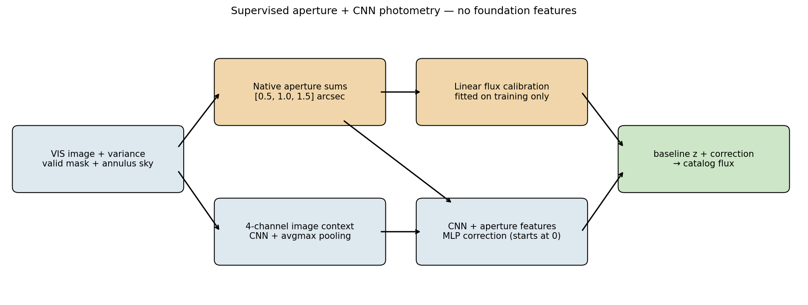

# simple_regressor — supervised VIS flux without foundation features

A self-contained supervised baseline for the JAISP photometry head. It answers the
question **"is the VIS flux information in a single Euclid VIS stamp recoverable by a
flexible CNN?"** It deliberately does **not** use the JAISP foundation model. It is not a
photometry pipeline either: there is no explicit PSF fitting or joint neighbor model. Version 2 is evaluated on held-out sky regions.

- **Input:** one 128×128 VIS stamp (0.1″/px) centred on a MER catalogue source.
- **Label:** a MER VIS flux column. This is either Kron (`flux_detection_total`) or a
  fixed aperture (`flux_vis_{1-4}fwhm_aper`).
- **Output:** the predicted flux in µJy.



## Current implementation: version 2

The default model now starts from a robust linear combination of native-pixel,
background-subtracted aperture sums, fitted on **training data only**. A CNN learns
an additive correction in transformed flux space (log flux for the default
magnitude loss). Its last layer starts at zero, so epoch -1 reproduces the calibrated
aperture estimate. Validation may retain that initialization if training does not
improve it. This is an aperture-plus-CNN supervised baseline, not the original pure CNN.

- Four CNN channels: asinh(background-subtracted image), asinh(SNR), center prior,
  and valid-pixel coverage. GroupNorm acts only on image context; native aperture
  amplitudes bypass it and are supplied directly to the regression head.
- Native aperture sums are independent of CNN binning. Invalid image pixels and
  nonfinite/nonpositive variances are jointly excluded. No missing-variance fallback.
- Rebuild old caches: v2 stores float32 pixels and checks cache version/target geometry.
- Seeds control initialization, sampling and augmentation. Gradient clipping and
  nonfinite-loss checks fail explicitly. CPU thread count is configurable.
- Evaluation includes the calibrated aperture baseline overall and per magnitude
  bin, on the same split, plus its signed flux in the prediction CSV. Catalog-error
  residuals `q` are agreement diagnostics, **not model uncertainty estimates**.
- `model_version=1` retains the original architecture; old checkpoints without a
  version field load as v1. Fixed-size sum and average pooling differ only by scale.

Repository pilot (from this directory):

```bash
python -m simple_regressor.fetch_mer \
  --footprint-catalog ../../../data/edf_s_ood/catalogs_compact/mer_FINAL_q1_ECDFS_footprint.fits \
  --output ../../../data/edf_s_ood/catalogs_compact/mer_FINAL_q1_ECDFS_photometry.fits
python -m simple_regressor.check_inputs --config configs/q1_cpu_pilot.json
python -m simple_regressor.prepare --config configs/q1_cpu_pilot.json
python -m simple_regressor.train --config configs/q1_cpu_pilot.json
python -m simple_regressor.evaluate --output-dir runs/q1_v2_pilot --split test
python -m unittest discover -s tests -v
```

The fetcher uses the public [IRSA TAP service](https://irsa.ipac.caltech.edu/docs/program_interface/TAP.html)
and `euclid_q1_mer_catalogue`, downloads aperture flux/error columns, rejects
truncated TAP results, and records each query. It derives `mag_detection_total`
from the catalog's microJy detection flux. Existing downloads are never overwritten.
The pilot uses local **Q1** pixels and an RA split with a 30-arcsec guard band;
it does not require patch folders. Use unique output directories for experiments.

Tests cover masks, background subtraction, binning, amplitude scaling, both target
transforms, rotated WCS, catalog preparation, repeatable training and checkpoint reload.
Synthetic recovery verifies implementation, not real-sky accuracy. Improvement over
the old CNN must be measured with the same cache, targets and held-out sky regions.

## Q1 pilot results

A completed CPU pilot uses 32 Q1 tiles and MER `flux_vis_3fwhm_aper` labels:
1,849 training, 247 validation and 333 test sources, with 336 objects dropped in
30-arcsec RA guard bands. Both models use the same source IDs, loss, augmentation,
seed (12) and maximum 30-epoch budget; each checkpoint is selected by validation
loss. V2 stopped after 22 epochs and selected epoch 13; V1 selected epoch 29.

| Method | Test fractional NMAD | Median fractional bias | Test flux RMSE (µJy) | Fraction with >20% flux error |
|---|---:|---:|---:|---:|
| Training-calibrated apertures | 22.8% | -2.9% | 3.68 | 36.9% |
| Original CNN architecture, current training recipe | 15.0% | +6.9% | 2.50 | 24.6% |
| V2 aperture + CNN | 12.2% | +3.3% | 3.03 | 23.4% |

V2 improves held-out robust scatter and bias, but **does not win every metric**:
V1 has lower validation loss (0.0115 versus 0.0151) and lower test flux RMSE.
These small, single-seed results do not settle architecture selection or establish
crowded-field performance. They also are not directly comparable to the historical
240-tile experiments below. No hyperparameters were changed based on these test scores.

Artifacts: `runs/q1_comparison.json`, `runs/q1_v2_pilot/` and
`runs/q1_v1_control/` contain metrics, predictions and checkpoints. Large artifacts
are ignored by git. The configurations are `configs/q1_cpu_pilot.json` (V2) and
`configs/q1_cpu_control.json` (V1); run prepare/train/evaluate with the respective
configuration and output directory to reproduce the comparison. The control cache
can be regenerated independently or copied from the V2 run because selection is identical.

For the before/after residual plots, open [nb_photometry_before_after.ipynb](nb_photometry_before_after.ipynb). It overlays both models with running medians and central 68% bands, excludes magnitudes brighter than 20, and exports magnitude and fractional-flux views to PNG/PDF. The expanded evaluation contains 2,712 sources from all available tiles within the original guarded test region; neither model was retrained. Regenerate it with `python -m simple_regressor.expand_holdout --before-dir runs/q1_v1_control --after-dir runs/q1_v2_pilot --output runs/q1_expanded_holdout`.

## What's in the pack

| path | what |
|---|---|
| `nb_simple_regressor.ipynb` | Runs the whole thing: setup knobs → prepare stamps → train → evaluate → aperture baseline (3b) → optional pooling comparison. Outputs are cleared. |
| `simple_regressor/` | The model code (see the file map below). |
| `configs/local.json` | **Template**: set your paths, and edit the format keys if your data differ. |
| `PORTING.md` | **How to point it at your own tiles/catalogue**: what is assumed, what to change, and the pitfalls. |
| `requirements.txt` | numpy, astropy, torch, matplotlib |

## Quick start

```bash
python -m pip install -r requirements.txt
# 1. edit configs/local.json: tiles_root, catalog (and val/test patches, see PORTING.md)
# 2. pre-flight check (reads only; ~1 min)
python -m simple_regressor.check_inputs --config configs/local.json
# 3. open nb_simple_regressor.ipynb, adjust the setup cell, run all
```

Command-line equivalents of the notebook steps:

```bash
python -m simple_regressor.prepare  --config configs/local.json
python -m simple_regressor.train    --config configs/local.json
python -m simple_regressor.evaluate --output-dir runs/nb --split test
```

The notebook loads `configs/q1_cpu_pilot.json` by default. Its setup cell shows the
resolved configuration; change CONFIG to use your own file.

## Code map

```
simple_regressor/
  config.py        every knob, with defaults (dataclass); JSON overrides any field
  check_inputs.py  pre-flight check of tiles + catalogue + overlap + split (no torch)
  catalog.py       catalogue read, quality/mag/SNR selection, label flux/err -> Sources
  geometry.py      WCS parsing from the npz header string, integer-centred cutouts
  prepare.py       select -> cut stamps from tiles -> dedup -> patch split -> empty-centre cut
                   -> runs/<name>/stamps_cache.npz + metadata.json
  data.py          input channels [asinh(img/scale), asinh(SNR), centre prior], binning,
                   dihedral augmentation, magnitude-balanced sampler
  model.py         V1 CNN; V2 native aperture bypass + CNN correction -> 1 value
  baseline.py      robust aperture calibration, fitted on training objects only
  fetch_mer.py     public IRSA Q1 flux/error retrieval and query provenance
  losses.py        mag-space loss (Huber or |dmag|^p, optionally /MER sigma) or the older
                   flux-space uncertainty Huber; target scalers
  train.py         Adam + ReduceLROnPlateau, early stop on val -> best.pt, last.pt, history.json
  evaluate.py      metrics (NMAD frac flux, NMAD dmag, q = (pred-MER)/err), CSV predictions,
                   diagnostic plots
  archfig.py       draws the architecture figure from the current config
```

## Historical version-1 results (not rerun version-2 measurements)

These results are from ECDFS, tract 5063, 240 tiles, with the MER Q1 catalogue. Treat them as preliminary.

- **Scatter is flat in magnitude.** The CNN reaches NMAD(Δmag) ≈ 0.16–0.21 at all
  magnitudes, for both the Kron and the 2fwhm-aperture labels. At mag < 24 this is far above
  MER's quoted errors; quoted random errors alone do not explain the discrepancy.
- **The CNN is underfitting.** Train ≈ val ≈ test, so the model is not fitting even the
  training set.
- **A trivial baseline beats it at the bright end.** The notebook's §3b fits 3 aperture sums
  linearly. It scores 0.09–0.12 at mag < 24 on the 2fwhm label, vs ~0.2 for the CNN. So the
  information is in the pixels, and the current CNN/training setup is the bottleneck. At
  mag > 25 the CNN does better than the baseline.
- **Some MER aperture errors are broken.** About 6–13% of `fluxerr_vis_*fwhm_aper` values
  (more for larger apertures) are ~10²–10⁴ µJy on ~1 µJy fluxes. Kron has none. These rows
  are now removed, because `snr_min` applies to the label too. See PORTING.md §4.
- **Open review questions:**
  - the loss weighting (`mag_weighted`);
  - the input normalisation (one global asinh scale);
  - whether the centre prior and integer centring are enough;
  - capacity vs optimisation.

The plotting notebook also overlays a single 1.5-arcsec aperture (one training-fitted scalar calibration) and the three-aperture initialization, both without CNN inference. It plots the CNN contribution separately. Flux plots retain negative aperture estimates; magnitude plots use the shared positive subset and report exclusions.
